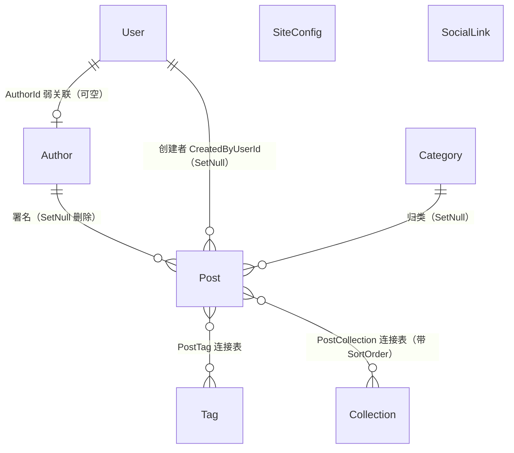
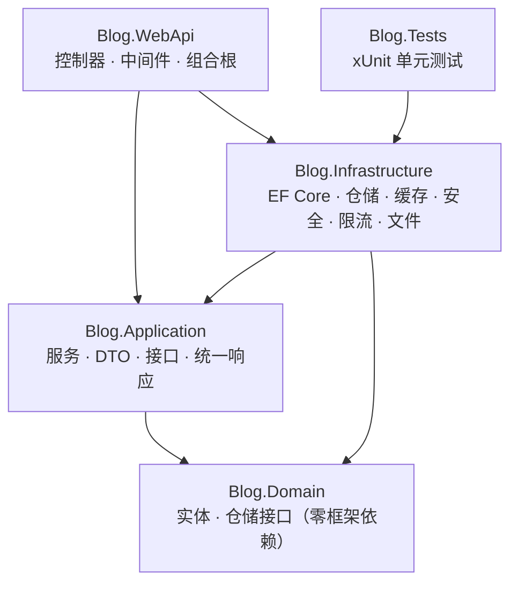
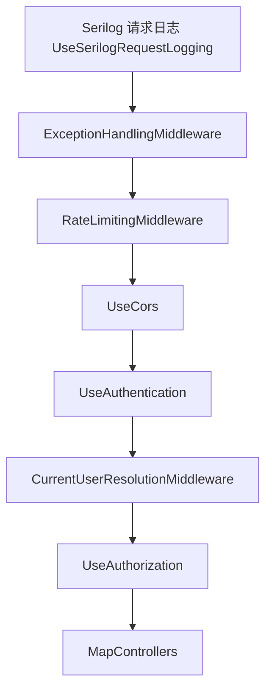

# 02 · 项目总览

> **用途**：一篇读懂"这是什么项目、给谁用、有哪些功能、代码怎么分层、做到哪一步了"。
> **读者**：第一次接触本项目的人；需要快速回忆整体结构时。
> **最后核对**：2026-09-14 ｜ **代码依据**：仓库 HEAD
>
> 本篇只讲**全貌**，不深入到代码级实现。细节分别见：
> [后端设计](./03-后端设计.md) ｜ [前端设计](./04-前端设计.md) ｜ [API 清单](./05-API接口清单.md) ｜ [数据库设计](./06-数据库设计.md)

---

## 1. 项目定位

**多作者技术博客平台**，前后端分离（SPA + REST API）。

| 维度 | 内容 |
|---|---|
| 形态 | Vue3 SPA + ASP.NET Core REST API |
| 内容载体 | Markdown 文章，前端渲染 + DOMPurify 消毒 |
| 作者规模 | **多作者**，每篇文章归属一个署名作者 |
| 内容组织 | 分类（单值）+ 标签（多值）+ **专栏（多对多系列）** |
| 账号体系 | `User`（登录账号）与 `Author`（内容署名）**分离** |
| 评论 | 外挂 giscus（GitHub Discussions），本站**不存评论数据** |
| 视觉风格 | Aurora 深色优先，支持明暗切换 |
| 面向角色 | 匿名访客 / 作者 / 管理员 |

### 1.1 两个塑造了整个设计的定位变化

**变化一：从「单作者博客」改为「多作者博客」。**
这一个改动带来了一连串连锁需求：文章归属需要越权校验、草稿需要权限保护、
作者需要可增删改、内容需要专栏来组织。早期的"单人博客"隐含前提已全部作废。

**变化二：`User` 与 `Author` 分离。**
直觉上"作者"就该是登录账号，但本项目把两者拆开：

- **`User` 是账号**：承载登录凭据（密码哈希）、角色、启用状态
- **`Author` 是内容属性**：只承载署名信息（姓名、头像、简介），与 Post/Tag/Category 同层

带来的直接好处：**可以存在没有账号的作者**（例如只挂名的合作者），
也可以一个账号更换署名身份。两者通过 `User.AuthorId` 弱关联（可空）。

> ⚠️ 这个分离导致了一个**必须记住的规则**：判断"谁能改这篇文章"时，
> **只认 `Post.CreatedByUserId`（账号维度），绝不能认 `AuthorId`**。
> 因为多个账号可以关联同一个 Author，用 AuthorId 判断会造成互相越权。
> 这条规则已实测踩坑并修复，详见 [03-后端设计.md](./03-后端设计.md) §6。

---

## 2. 用户角色与权限边界

只有两档角色，**刻意不引入细粒度 RBAC**（角色多一分，测试成本就多一倍，而本项目只有两类真实用户）。

| 角色 | 能做什么 | 不能做什么 |
|---|---|---|
| **匿名访客** | 浏览首页/文章/标签/分类/归档/专栏、搜索、评论（经 giscus） | 看到草稿、进入任何管理界面 |
| **Author（作者）** | 撰写并管理**自己的**文章（草稿/发布/下架/删除）、维护**自己的**署名资料 | 改他人文章、动分类/标签/专栏/账号/站点配置 |
| **Admin（管理员）** | 全部内容的增删改、账号管理、作者管理、专栏管理、站点配置 | — |

后端用两个授权策略表达（`Program.cs`）：

| 策略 | 要求 | 用在 |
|---|---|---|
| `AdminOnly` | 角色 = `Admin` | 账号管理、作者增删、分类/标签/专栏写接口、站点配置写接口 |
| `ContentWriter` | 角色 ∈ {`Admin`, `Author`} | 文章增删改、发布、只读详情、作者资料更新、`/api/authors/me` |

> **登录入口合并**：管理员与作者**共用同一个登录接口** `POST /api/auth/login` 与同一个登录页 `/login`。
> 登录入口不承担权限边界——它只负责发 token，权限由具体接口上的策略强制。
> 旧路径 `/admin/login` 保留为重定向，避免旧链接失效。

---

## 3. 业务模型

### 3.1 实体关系



### 3.2 核心概念辨析

| 概念 | 维度 | 与文章的关系 | 说明 |
|---|---|---|---|
| **分类 Category** | 广度、单值 | 一篇文章最多 1 个分类 | 像书架的层 |
| **标签 Tag** | 广度、多值 | 一篇文章可打多个标签 | 像关键词 |
| **专栏 Collection** | 深度、系列 | 一篇文章可属于多个专栏，且有**专栏内排序** | 像连载目录 |
| **作者 Author** | 署名 | 一篇文章最多 1 个署名 | 内容属性，非账号 |

**分类 vs 专栏是最容易混淆的一对**：分类是"这篇文章属于哪个领域"，专栏是
"这篇文章在一个阅读序列里排第几"——后者带 `SortOrder`，顺序是人为编排的，不是按发布时间。

### 3.3 文章生命周期

```
        创建（可指定 publish=true/false）
              │
      ┌───────┴────────┐
      ▼                ▼
   草稿(PublishedAt=null)  已发布(PublishedAt=时间)
      │                │
      │  发布           │  下架
      └───────────────►│◄──────────┐
                       │           │
                       └───────────┘
              │
              ▼
        软删除(IsDeleted=true)   ← 列表与详情均不可见，数据保留
```

关键规则：

- **是否发布**由 `PublishedAt` 是否为空决定（`IsPublished` 是计算属性）
- **发布是幂等的**：重复发布不会覆盖首次发布时间（否则归档排序会被打乱）
- **草稿保护**：`includeUnpublished=true` 需登录；**Author 角色只能看到自己创建的**（数据级过滤）
- **删除是软删除**：置 `IsDeleted` + `DeletedAt`，由全局查询过滤器自动排除

### 3.4 乐观锁（全表通用）

**所有可写实体都带 `int Version`**，从 1 开始。任何更新请求都必须回传当前版本号，
后端生成 `UPDATE ... WHERE Id = @id AND Version = @expected`，受影响行数为 0 则返回 **409 / code 4090**。

这是本项目贯穿全栈的一条约定：前端拿到详情时必须保存 `version`，保存时原样回传。

**唯一例外**：文章浏览量的累加用 `ExecuteUpdate` 绕过乐观锁——
否则"两个人同时看同一篇文章"就会有一方失败，而浏览量本来就不需要这种一致性。

---

## 4. 功能清单

### 4.1 公开站点

| 功能 | 路由 | 状态 |
|---|---|---|
| 首页：Hero 打字机 + 社交图标 + 文章卡片列表 + 分页 | `/` | 已实现 |
| 文章详情：Markdown 渲染、目录、阅读进度、专栏/分类/标签徽章、giscus 评论 | `/post/:id` | 已实现 |
| 标签墙 | `/tags` | 已实现 |
| 分类墙 | `/categories` | 已实现 |
| 归档时间轴（按年月分组） | `/archive` | 已实现 |
| 通用文章列表（支持 tag/category/author 组合筛选） | `/posts` | 已实现 |
| 专栏列表 / 专栏详情（按专栏内排序） | `/collections`、`/collections/:slug` | 已实现 |
| 搜索弹窗（`Ctrl/Cmd + K`，防抖后请求全文检索） | 全局组件 | 已实现 |
| 明暗主题切换 | 全局 | 已实现 |
| 404 页面 | 任意未匹配路径 | 已实现 |

### 4.2 作者工作区 `/me/**`

| 功能 | 路由 | 状态 |
|---|---|---|
| 我的文章列表（只含自己创建的，含草稿） | `/me` | 已实现 |
| 新建文章 | `/me/posts/new` | 已实现 |
| 编辑我的文章 | `/me/posts/:id/edit` | 已实现 |
| 我的署名资料（姓名/头像/简介） | `/me/profile` | 已实现 |

### 4.3 管理后台 `/admin/**`

| 功能 | 路由 | 状态 |
|---|---|---|
| 文章管理（含草稿、分页、发布/下架/软删除） | `/admin` | 已实现 |
| 新建 / 编辑文章 | `/admin/posts/new`、`/admin/posts/:id/edit` | 已实现 |
| 分类管理 | `/admin/categories` | 已实现 |
| 标签管理 | `/admin/tags` | 已实现 |
| **账号管理**（邮箱/密码/角色/关联作者/启停/重置密码） | `/admin/users` | 已实现 |
| **作者管理**（署名对象增删改） | `/admin/authors` | 已实现 |
| **专栏管理**（含文章编排面板：勾选 + 上下移） | `/admin/collections` | 已实现 |
| 网站配置（站点名/副标题/背景图/建站日期 + 社交链接增删改） | `/admin/site` | 已实现 |
| 旧的"博主资料"页 | `/admin/profile` → 重定向到作者管理 | 已废弃 |

### 4.4 后端能力（横切）

| 能力 | 状态 | 说明 |
|---|---|---|
| 统一响应体 `{code, message, data}` | 已实现 | 见 [05-API接口清单.md](./05-API接口清单.md) §2 |
| 全局异常处理 | 已实现 | 业务异常 → 统一响应；乐观锁冲突 → 409 |
| 乐观锁 | 已实现 | `int Version` + SQL 条件 |
| 缓存三防（穿透/击穿/雪崩） | 已实现 | Memory / Redis 可切换，Redis 故障自动降级 |
| 令牌桶限流 | 已实现 | Redis Lua + 内存降级，规则配置化 |
| JWT 认证与角色授权 | 已实现 | 仅 Access Token，`TokenVersion` 主动失效 |
| 中文全文检索 | 已实现 | zhparser + tsvector 生成列 + GIN 索引 |
| 文件上传 + 图片转 WebP | 已实现 | 独立 `/api/files/**` 接口 |
| 结构化日志 + 慢查询拦截 | 已实现 | Serilog，慢查询阈值 500ms |
| 部署拓扑校验 | 已实现 | 多实例 + 非 Redis → 启动即失败 |
| 健康检查 | 已实现 | `GET /health`（对外只回状态，详情进日志） |

---

## 5. 技术栈

### 5.1 后端

| 项 | 版本 / 选型 |
|---|---|
| 目标框架 | `net10.0`（C#，`Nullable=enable`、`ImplicitUsings=enable`） |
| Web | ASP.NET Core |
| ORM | EF Core 10.0.11 + Npgsql 10.0.3 |
| 数据库 | PostgreSQL 18.6（+ zhparser 中文分词） |
| 缓存 / 限流 | Redis（StackExchange.Redis 2.10.1），可降级内存 |
| 认证 | JWT Bearer（HS256）+ PBKDF2 密码哈希 |
| 日志 | Serilog（控制台 + 按天滚动文件） |
| 图片处理 | SixLabors.ImageSharp **3.1.12**（刻意固定在 3.x，见下） |
| 对象映射 | **不使用 AutoMapper**，DTO 全部手写映射 |

> **ImageSharp 为什么锁在 3.x**：v4 起要求构建期许可密钥 `sixlabors.lic`，
> 社区许可虽免费但需先申请，否则**构建直接报错**。v3 为纯托管实现（无原生依赖），部署最简。

### 5.2 前端

| 项 | 版本 / 选型 |
|---|---|
| 框架 | Vue 3.5（`<script setup>` SFC） |
| 语言 | TypeScript ~6.0 |
| 构建 | Vite 8 |
| 路由 | Vue Router 4（`createWebHistory`） |
| 状态 | Pinia 4 |
| Markdown | marked 18 + DOMPurify 3（XSS 防护） |
| 样式 | **自研 CSS 组件体系**（`tokens.css` + `global.css` + scoped style） |
| UI 组件库 | **不使用**（含 Naive UI 在内的整体组件库均已排除） |

> **为什么不用组件库**：项目视觉是定制的 Aurora 深色体系，
> 整体引入组件库会与之大面积冲突，改造成本高于收益。
> 保留"按需引入单个成熟组件"的可能，但不整体引入。

### 5.3 四层架构与依赖方向



| 层 | 职责 | 硬性约束 |
|---|---|---|
| **Blog.Domain** | 实体、值对象、仓储接口 | **零外部依赖**（连 Npgsql 类型都不允许出现） |
| **Blog.Application** | 用例编排（Service）、DTO、横切接口定义、统一响应 | 不依赖 Infrastructure；不直接依赖 EF Core |
| **Blog.Infrastructure** | EF Core 映射与仓储、缓存/限流/文件/安全的实现 | 实现 Application 定义的接口 |
| **Blog.WebApi** | HTTP 入口、控制器、中间件、DI 组合根 | 只做参数绑定与调用，业务逻辑放 Application |

`Blog.Domain` 的"零框架依赖"是本架构里最容易被破坏、也最值得守住的一条约束。
一个具体体现：Post 的全文检索列 `SearchVector` 是 `NpgsqlTsVector` 类型，
它**不能出现在 Domain 实体上**，因此在 Infrastructure 里声明为**影子属性**
（`entity.Property<NpgsqlTsVector>("SearchVector")`），查询时用 `EF.Property` 访问。

---

## 6. 后端请求管道

中间件的**注册顺序即执行顺序**，本项目有两个顺序敏感点：



**顺序敏感点一：请求日志必须在异常处理中间件的"外层"（即先注册）。**
否则 `BusinessException` 会先冒泡穿过日志中间件，日志里记录的是"异常发生时的 500 + 完整堆栈"，
而客户端实际收到的是映射后的 404/403/409——**日志与事实不符**，
且"文章不存在""邮箱重复"这类正常业务失败会刷满 ERR，淹没真正的故障。

**顺序敏感点二：`CurrentUserResolutionMiddleware` 必须在 `UseAuthentication` 之后。**
它需要先有 `ClaimsPrincipal` 才能解析出用户，并做 `TokenVersion` 等数据库侧校验。

日志分级规则：5xx = ERR（真故障），4xx = WRN（业务/权限类可预期失败），其余 = INF。

---

## 7. 当前进度

### 7.1 已完成

| 模块 | 状态 |
|---|---|
| 后端全部功能（9 个控制器、47 个端点、认证授权、全文检索、缓存、限流、文件、日志） | 完成 |
| 前端公开站点 8 个页面 + 作者工作区 4 个页面 + 管理后台 9 个页面 + 登录 / 404 | 完成 |
| 数据库迁移（**4 个迁移**，10 张业务表） | 完成 |
| 前端认证闭环（登录页、路由守卫、401 自动清理、按角色落地） | 完成 |
| 骨架屏组件化（6 个组件） | 完成 |
| 图片上传自动转 WebP | 完成 |
| 测试体系：集成（权限矩阵/草稿保护/乐观锁/**媒体地址校验**）+ 单元（Service/图片边界/**MediaPath**），**195 项** | 完成 |
| **容器化部署产物**（两个 Dockerfile + `docker-compose.yml` + Nginx 配置 + `appsettings.Production.json`），**本地整栈已实测跑通** | 完成（2026-09-12） |
| **CI 流水线**（GitHub Actions，**四个**并行作业：行尾检查 / 依赖安全扫描 / 前端 / 后端测试+覆盖率），含「防假绿」测试计数断言 | 完成（2026-09-13 首次全绿；2026-09-14 增加依赖扫描） |
| **分支保护（Required Status Checks）**：三个作业（行尾/前端/后端）为 Required，依赖扫描刻意不 Required；PR 合并与直推 `main` **双向拦截**，已做正反验证 | 完成（2026-09-13） |
| **媒体地址服务端白名单**（头像/封面/Logo/首屏背景图统一只接受 `/api/files/...`），前端对应 4 处改为「只能上传」 | 完成（2026-09-13） |
| **站点配置扩展**：`LogoName` + `SiteLogo`（全站统一 Logo，5 处收敛为 1 个组件）、首屏背景图改为多张随机 | 完成（2026-09-13） |
| **正文渲染清洗**：剥离内联样式 + `<font>` unwrap，修复暗色主题下的黑字 | 完成（2026-09-13） |
| **上传格式白名单收紧**：不再接受 `.svg`（存储型 XSS 风险，**G11 关闭**） | 完成（2026-09-13） |
| **字段长度校验成体系**：新增 `FieldLimits`（长度上限单一来源）+ 7 处校验补齐 + 全局 22001 兜底；`Posts.Summary` 扩到 200 | 完成（2026-09-13） |
| **上传接口错误状态码修正**：空文件/扩展名非法 → `400`，超限 → `413`（此前一律 `HTTP 200 + 错误码`） | 完成（2026-09-13） |
| **迁移链可从零建库（G12 关闭）**：把建扩展与 `chinese` 配置的 SQL 移到生成列之前，并删掉测试夹具里的绕过 | 完成（2026-09-13） |
| **依赖安全扫描（G5 关闭）**：Dependabot（nuget/npm/actions 三生态）+ CI 独立作业（**只报告不阻断**，结果写进作业摘要）；实测 0 漏洞，并做阳性对照确认扫描器真会报 | 完成（2026-09-14） |
| **前端 CDP 自动化检查进仓库（G2 关闭）**：29 个散落在仓库外的脚本中取有断言的 **11 个**改写进 `tools/e2e/`（**10 个检查 / 94 条断言**，连跑两次全绿），并抽出公共层 `lib/cdp.mjs`；顺带找出并修掉 3 处真实缺陷 | 完成（2026-09-14） |
| **覆盖率度量（G7 关闭）**：`coverage.runsettings` 排除 EF 迁移与生成代码，真实基线 **行 70.2% / 分支 49.8%**，写进 CI 作业摘要，**刻意不设阈值** | 完成（2026-09-14） |

### 7.2 未完成 / 待处理

**应用本身的未决项**：

| 项 | 性质 | 详见 |
|---|---|---|
| 前端表单"点击保存"链路未做浏览器自动化验证 | 验证缺口（后端 195 项测试已覆盖语义；**本轮已用无头 Chrome 补验了正文渲染与首屏/Logo 渲染**） | [09](./09-已知限制与技术债.md) §1 |
| `FileStorage:Root` 依赖当前工作目录（T19） | 部署健壮性 | [07](./07-开发与运维手册.md) §8.2 |
| SEO（站点地图、结构化数据） | 明确决定**不做** | — |
| 评论数据自建 | 明确决定**不做**（外挂 giscus） | — |

**工程化与交付能力缺口**（2026-09 识别，编号 G1~G12，详见 [09](./09-已知限制与技术债.md) §6）：

| 项 | 性质 | 状态 |
|---|---|---|
| ~~流水线已建成，但未开启分支保护~~ | 交付能力缺口 | ✅ **已解决**（2026-09-13） |
| ~~前端自动化脚本放在仓库外的 `/mnt/d/tmpbuild/`~~ | 资产丢失风险 | ✅ **已解决**（2026-09-14）：`tools/e2e/`，10 个检查 / 94 条断言 |
| ~~没有应用自身的 Dockerfile~~ | 交付能力缺口 | ✅ **已解决**（2026-09-12） |
| 没有发布流程、版本号与回滚方案 | 交付能力缺口 | ❌ 未处理 |
| ~~没有依赖安全扫描~~；ImageSharp 锁在 3.x（**3.1.12 已是 3.x 最新版**，风险是未来 3.x 停止修复） | 供应链风险 | ✅ **已解决**（2026-09-14）；ImageSharp 需定期复查 |
| 没有 lint / 格式门禁（无 `.editorconfig`、前端无 ESLint） | 质量门禁缺口 | ❌ 未处理 |
| ~~没有覆盖率度量~~ | 度量缺口 | ✅ **已解决**（2026-09-14）：排除生成代码后基线 行 70.2% / 分支 49.8%，**刻意不设阈值** |
| 没有性能基线、没有 SLO | 容量未知 | ❌ 未处理 |
| 没有 metrics / tracing（只有文本日志） | 可观测性缺口 | ❌ 未处理 |
| 应用未使用 `ForwardedHeadersMiddleware` | 安全加固 | ❌ 未处理（当前拓扑下 nginx 已覆盖） |
| ~~上传的 SVG 以 `image/svg+xml` 内联下发，可构成存储型 XSS~~ | 安全缺口 | ✅ **已解决**（2026-09-13，直接不支持上传 SVG） |
| ~~从零建库依赖 PG 镜像 init 脚本~~ | 部署脆弱性 | ✅ **已解决**（2026-09-13，并让集成测试成为回归防护） |

> ⚠️ **这些不是"故障隐患"，而是"能力缺口"**——
> 它们不会让线上出错，但会让**错误发生的概率上升、发现得更晚**。
> 其中「CI/CD」与「应用 Dockerfile」两项的建议时机是 **上线前**，
> 因为它们恰好会掩盖上线时最容易出的那类问题（开发环境与部署环境的差异）。
> **这两项现已全部解决**（Dockerfile 2026-09-12，CI 流水线 + 分支保护 2026-09-13）——
> 也就是说 CI 现在既提供「信息」也提供「约束」。
>
> **处理顺序有依赖关系**，见 [09](./09-已知限制与技术债.md) §6.3。
>
> **性能测试目前仍做不了**：SLO 未定，且开发库只有 13 篇文章
> （索引完全不生效）。部署形态已由容器化确定，这是三个前提里刚补上的一个。
> 原因与正确顺序见 [12](./12-性能测试与容量分析.md) §2。

> **原本的两项高风险问题已修复**：
> 写接口缺鉴权、PG 容器未含 zhparser（现运行自定义镜像）。
> 记录见 [09-已知限制与技术债.md](./09-已知限制与技术债.md) §5。

### 7.3 已废弃的方案（记录以免重提）

| 方案 | 为什么废弃 |
|---|---|
| 乐观锁用 `byte[] RowVersion` + `[Timestamp]` | 改为 `int Version` + SQL 条件手动控制，后者跨数据库通用 |
| 双登录入口（`/login` + `/admin/login`、两个登录端点） | 合并为单一入口，权限边界交给授权策略 |
| 静态文件中间件暴露 `/media/**` | 改为独立文件接口 `/api/files/**`（可做路径穿越防护与长缓存控制） |
| 用 `pg_trgm` 模糊匹配做搜索 | 改为真全文检索（zhparser），模糊匹配无法满足中文检索需求 |

---

## 8. 与代码的对应关系

| 内容 | 位置 |
|---|---|
| 后端解决方案 | `Blog.Backend/Blog.Backend.slnx` |
| 应用入口与管道 | `Blog.Backend/Blog.WebApi/Program.cs` |
| 领域实体 | `Blog.Backend/Blog.Domain/Entities/` |
| 应用服务 | `Blog.Backend/Blog.Application/Services/` |
| 基础设施实现 | `Blog.Backend/Blog.Infrastructure/` |
| 前端入口 | `Blog.FrontEnd/src/main.ts` |
| 前端路由表 | `Blog.FrontEnd/src/router/index.ts` |
| 后端接口清单 | [05-API接口清单.md](./05-API接口清单.md) |
| 数据库结构 | [06-数据库设计.md](./06-数据库设计.md) |
| 交付流水线设计 `[计划中]` | [11-CI-CD与自动化交付.md](./11-CI-CD与自动化交付.md) |
| 性能目标与压测方法 `[计划中]` | [12-性能测试与容量分析.md](./12-性能测试与容量分析.md) |
