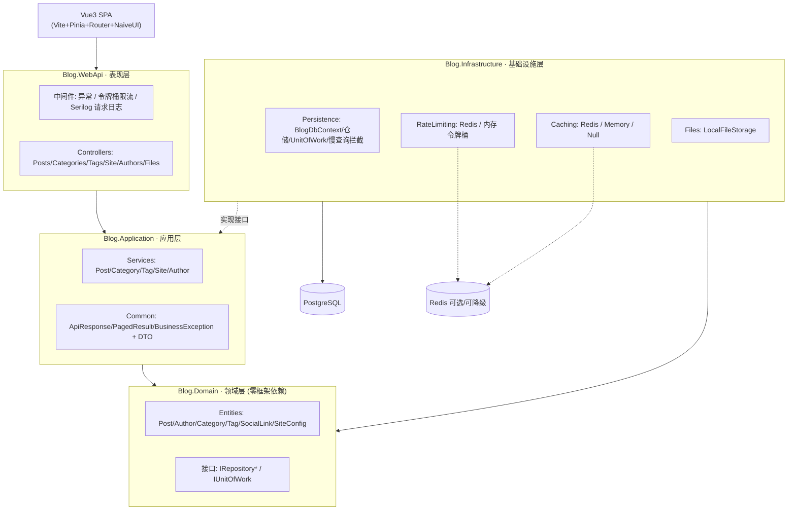

# 05-系统架构与设计文档

> 文档版本：v1.0 | 日期：2026-09-06
> 配套文档：01-需求分析与实现方案 / 02-API 接口清单 / 03-后端任务拆分与开发顺序 / 04-前端页面路由规划
> 本文档基于对 **当前已落地代码** 的分析（非仅规划），重点说明核心模块与数据流。

---

## 1. 系统总览

个人博客系统，前后端分离。后端采用 **整洁架构（Clean Architecture）** 四层划分，统一返回 `{ code, data, message }`，并内置日志、缓存（三防）、令牌桶限流、乐观锁并发控制、文件存储等横切能力。

| 维度 | 选型 |
|---|---|
| 语言/框架 | C# / .NET 10 + ASP.NET Core |
| ORM | EF Core 10.0.11（手写 DTO 映射，未用 AutoMapper） |
| 数据库 | PostgreSQL（Npgsql 10.0.3） |
| 缓存 | StackExchange.Redis 2.10.1（可降级为内存/直查） |
| 日志 | Serilog.AspNetCore 10.0.0 + Serilog.Sinks.File 7.0.0 |
| 前端 | Vue3 + TypeScript + Vite + Vue Router + Pinia + Naive UI + SCSS（见 04 文档） |
| 架构风格 | 整洁架构：Domain / Application / Infrastructure / WebApi |

---

## 2. 分层架构（整洁架构）

依赖方向严格单向：**外环依赖内环**。

```
Client(Vue3) ──▶ WebApi ──▶ Application ──▶ Domain
                     │            ▲              ▲
                     │            │              │
                     └── Infrastructure ─────────┘
                          (实现接口, 访问 PostgreSQL)
```

- **Domain（最内层，零框架依赖）**：仅含实体、仓储接口、工作单元接口，不引用任何外部库。
- **Application（应用层）**：用例编排（Service）、DTO、统一响应/异常等公共件；仅依赖 Domain 的接口与实体。
- **Infrastructure（基础设施层）**：实现 Application/Domain 定义的接口（EF 仓储、缓存、限流、文件存储），依赖 PostgreSQL / Redis。
- **WebApi（表现层）**：控制器、中间件、DI 装配、Program；依赖 Application 与 Infrastructure。

> 说明：Infrastructure 在编译期引用 Application/Domain 以"实现其接口"，运行期由 WebApi 在 `Program.cs` 通过 `AddInfrastructureServices` 完成 DI 装配，从而让内层不感知具体实现。

### 分层架构图

> 可视化见 [diagram/architecture-layers.svg](./diagram/architecture-layers.svg)



---

## 3. 核心模块说明

### 3.1 领域层 `Blog.Domain`

| 要素 | 内容 |
|---|---|
| 实体 | `BaseEntity`（Id/CreatedAt/IsDeleted/DeletedAt/Version + 软删除 `Delete()`）、`Post`、`Author`、`Category`、`Tag`、`SocialLink`、`SiteConfig` |
| 仓储接口 | `IBaseRepository<T>`、`IPostRepository`、`ICategoryRepository`、`ITagRepository`、`IAuthorRepository`、`ISiteConfigRepository`、`ISocialLinkRepository` |
| 查询仓储接口 | `IPostQueryRepository`、`ICategoryQueryRepository`、`ITagQueryRepository`、`ISiteQueryRepository`（读写分离：查询走投影 DTO，不暴露实体） |
| 工作单元 | `IUnitOfWork`（`SaveChangesAsync`） |
| 领域行为 | `Post.Publish/Unpublish/Update/IncrementViewCount`（部分在 Service 层用 `ExecuteUpdate` 原子实现） |

### 3.2 应用层 `Blog.Application`

- **Services**：`PostService`、`CategoryService`、`TagService`、`SiteService`、`AuthorService`，承载用例与业务规则（校验、标签增量同步、缓存编排、乐观锁版本校验）。
- **Common**：`ApiResponse<T>`、`PagedResult<T>`、`ErrorCodes`、`BusinessException`。
- **Interfaces（抽象）**：`ICacheService`、`IFileStorageService`、`ITokenBucketLimiter`、`IUnitOfWork` 及缓存相关 `CacheKeys`/`CacheOptions`/`RateLimitOptions`。
- **DI**：`AddApplication()` 注册所有 Service 为 Scoped。

### 3.3 基础设施层 `Blog.Infrastructure`

| 子模块 | 关键实现 |
|---|---|
| Persistence | `BlogDbContext`（Npgsql）、各仓储实现、`UnitOfWork`、`SlowQueryInterceptor`（>500ms 记 Warning） |
| Caching | `RedisCacheService`（三防）、`MemoryCacheService`（降级）、`NullCacheService`（关闭） |
| RateLimiting | `RedisTokenBucketLimiter`（Lua 原子令牌桶）、`InMemoryTokenBucketLimiter`（降级） |
| Files | `LocalFileStorageService`（落盘 `wwwroot/uploads`） |
| DI | `AddInfrastructureServices(configuration)` 统一装配并做缓存/限流 Provider 选择 |

### 3.4 表现层 `Blog.WebApi`

- **Controllers**：`PostsController`、`CategoriesController`、`TagsController`、`TagsController`、`SiteController`、`AuthorsController`、`FilesController`。
- **Middleware（管线顺序见 §5.1）**：`ExceptionHandlingMiddleware`（统一异常→ApiResponse）、`RateLimitingMiddleware`（令牌桶限流）、`UseSerilogRequestLogging`（请求日志）。
- **Program.cs**：Serilog 引导、CORS（`Cors:Origins`，默认 `localhost:5173`）、`AddApplication()` + `AddInfrastructureServices()`、启动 `Database.Migrate()`。

### 3.5 横切模块

#### ① 统一响应与异常处理
- 统一体：`{ code, data, message }`，成功 `code=0`；业务错误 `4xxx`；系统异常 `5000`。
- `ExceptionHandlingMiddleware`：`BusinessException`→对应码（404/400）、`DbUpdateConcurrencyException`→409/4090、`其他`→500/5000。

#### ② 缓存（Redis，三防 + 降级）
- 抽象 `ICacheService`：`Get/Set/Remove/RemoveByPrefix/GetOrCreateAsync`。
- **穿透**：空结果写哨兵 `∅`，短 TTL。
- **击穿**：`Redis LockTake` 分布式互斥锁，抢锁失败直接回源（双检）。
- **雪崩**：TTL 叠加随机抖动（`TtlJitterRatio`）。
- **降级**：`Cache:Enabled=false`→`NullCacheService`（直查）；Provider=Memory→`MemoryCacheService`；Redis 连接/超时异常→捕获并回源，不抛异常。
- **失效策略**：写操作 `RemoveByPrefix(posts:)` + `Remove(site:stats)`（Cache-Aside，删而非更新）。

#### ③ 令牌桶限流
- 中间件仅作用于 `/api`；按规则（`PathPrefix`+`Method`+`Granularity`=Ip/Global/Endpoint，`Capacity`/`TokensPerSecond`）匹配。
- 优先 Redis Lua 原子令牌桶；Redis 不可用时按 `FallbackToMemory` 降级内存桶或放行。
- 触发：HTTP `429` + `ApiResponse(code=4091)` + `Retry-After` 头 + `X-RateLimit-Remaining`。

#### ④ 乐观锁并发控制
- 采用 **整数 `Version` 并发令牌**（跨数据库，非 `[Timestamp]` 字节列）。
- 更新时 `BaseRepository.ApplyOptimisticVersion` 写入 `OriginalValue=expected`、`CurrentValue=expected+1`，EF 生成 `UPDATE ... WHERE "Version"=@expected`；0 行→`DbUpdateConcurrencyException`→409/4090。
- **浏览量特例**：详情页浏览量自增走 `ExecuteUpdateAsync(... ViewCount+1)`，绕过变更追踪与乐观锁，避免高频访问频繁 409。

#### ⑤ 日志（Serilog）
- 控制台 + 滚动文件 `logs/blog-.log`（按天滚动，保留 30 天）。
- 记录：请求开始/结束与耗时（`UseSerilogRequestLogging`）、异常堆栈、慢查询（>500ms，`SlowQueryInterceptor`）、限流触发（Warning）。

#### ⑥ 文件存储（独立媒体接口）
- 路由前缀 `/api/files`（与业务 API 同源但独立 Controller）：`POST /api/files/upload` 上传、`GET /api/files/{**path}` 读取（带 `ResponseCache 86400` + 范围请求）。
- `LocalFileStorageService` 落盘 `wwwroot/uploads/`；白名单扩展名 + 大小上限（`FileStorageOptions.MaxFileSize`，代码层另设 50MB 请求上限）。

---

## 4. 数据流

### 4.1 请求处理管线（每次请求）

```
HTTP 请求
  └─▶ RateLimitingMiddleware   (仅 /api；令牌桶，超限→429)
        └─▶ ExceptionHandlingMiddleware (包裹后续，统一异常)
              └─▶ UseSerilogRequestLogging (记录方法/路径/状态码/耗时)
                    └─▶ CORS → Authorization → MapControllers
                          └─▶ Controller → Service → (Cache / Repository) → PostgreSQL
```

### 4.2 读路径（以 GET /api/posts 为例，带缓存）

```
Client → PostsController.GetPaged
  → IPostService.GetPagedAsync
    → ICacheService.GetOrCreateAsync(key)
        ├─ 命中 → 直接返回 (ApiResponse)
        └─ 未命中 → IPostQueryRepository.GetPagedAsync
                      → EF Core → PostgreSQL
                    → SetAsync(缓存, TTL+抖动)
    → ApiResponse<PagedResult<PostCardDto>>
```

### 4.3 写路径（以 PUT /api/posts/{id} 为例，乐观锁 + 缓存失效）

```
Client → PostsController.Update(id, req[含 version])
  → IPostService.UpdateAsync
    → IPostRepository.GetByIdAsync(tracked, 含 Tags)
    → ApplyOptimisticVersion(post, expected)   // 写入 OriginalValue=expected
    → post.Update(...) + ApplyTagsAsync(增量同步多对多)
    → IUnitOfWork.SaveChangesAsync
        ├─ UPDATE ... WHERE "Version"=expected 成功 → Version+1
        └─ 0 行 → DbUpdateConcurrencyException → 409/4090
    → InvalidatePostCachesAsync (RemoveByPrefix posts: + Remove site:stats)
    → ApiResponse<PostDetailDto>
```

### 4.4 浏览量原子自增（详情访问）

```
GET /api/posts/{id}
  → 先 GetOrCreateAsync 取详情缓存
  → IPostRepository.IncrementViewCountAsync (ExecuteUpdate 原子 +1，绕过乐观锁)
  → 同步刷新详情缓存中的 ViewCount
```

> 完整时序图见 [diagram/data-flow.svg](./diagram/data-flow.svg)

---

## 5. 数据模型与关系

| 实体 | 关键字段 | 关系 |
|---|---|---|
| `Post` | Title, Content, Summary(前120), CoverImage, AuthorId, CategoryId?(可空), WordCount, ViewCount, PublishedAt, IsPublished, Version | 多对一 Author；多对一 Category(SetNull)；多对多 Tag |
| `Author` | Name, Email, Avatar, Bio | 一对多 Post |
| `Category` | Name(唯一过滤索引) | 一对多 Post；含 PostCount |
| `Tag` | Name(唯一过滤索引) | 多对多 Post；含 PostCount |
| `SocialLink` | Name, Icon, Url, SortOrder, IsVisible | 独立 |
| `SiteConfig` | Key(唯一过滤索引), Value, Description | 独立（键值为站点名/打字机文案/建站日期等） |

统一约束：全局查询过滤器 `HasQueryFilter(!IsDeleted)`（软删除）；Name/Key 唯一索引配合 `WHERE "IsDeleted"=false` 过滤索引，避免软删后无法重建同名数据；`Version` 为并发令牌。

```mermaid
erDiagram
  POST ||--o| AUTHOR : "belongs to"
  POST }o--o| CATEGORY : "categorized by"
  POST }o--o{ TAG : "tagged with"
  POSTTAG {
    guid PostId
    guid TagId
  }
  POST ||--o{ POSTTAG : ""
  TAG ||--o{ POSTTAG : ""
  SOCIALLINK { guid Id name icon url sortOrder isVisible }
  SITECONFIG { guid Id key value description }
```

---

## 6. 关键设计决策与取舍

1. **读写分离仓储**：读路径用 `IPostQueryRepository` 等投影为 DTO，避免向表现层泄漏领域实体，也减少不必要字段加载。
2. **整数 Version 乐观锁（非 bytea Timestamp）**：跨数据库可移植；由 `BaseRepository.ApplyOptimisticVersion` 手动构造 `UPDATE ... WHERE Version=expected`，与计划文档中的 `[Timestamp]` 方案不同（实现阶段的有意调整）。
3. **浏览量走 `ExecuteUpdate` 原子自增**：高频并发写若走乐观锁会频繁 409，故绕开变更追踪。
4. **缓存三防 + 多级降级**：业务零侵入切换（Enabled/Provider），Redis 任何故障都回源，保证可用性。
5. **标签多对多增量同步**：更新时只增删差异连接行，避免整体替换导致主键冲突。
6. **文件接口独立**：`/api/files` 与业务 API 解耦，便于后续替换为 OSS/CDN。

---

## 7. 配置项速查（appsettings）

| 配置节 | 作用 |
|---|---|
| `ConnectionStrings:DefaultConnection` | PostgreSQL 连接串 |
| `Cors:Origins` | 允许跨域来源（默认 `http://localhost:5173`） |
| `Cache:Enabled` / `Cache:Provider`(Redis|Memory) / `Cache:RedisConnection` / `Cache:TtlJitterRatio` / `Cache:NullTtl` | 缓存总开关与实现选择 |
| `RateLimit:Enabled` / `RateLimit:FallbackToMemory` / `RateLimit:Rules[]`(PathPrefix,Method,Granularity,Capacity,TokensPerSecond) | 令牌桶限流 |
| `FileStorage:MaxFileSize` / 上传白名单 | 文件存储上限与类型 |
| `Serilog:*` | 日志输出与级别 |

> 注：计划文档（01 §4.2/§4.3）中的 `Cache:Enabled` 细化开关与 `RateLimit:Redis:Enabled` 细节，落地后被统一为 `Cache:Provider` 与 `RateLimit:FallbackToMemory`，以实际代码配置为准。

---

## 8. 已知限制与后续扩展

- **无认证模块**：本期写操作未做用户体系（已知限制），预留 JWT 扩展点（`4010/4030` 错误码已保留）。
- **Redis 非必装**：无 Redis 时缓存/限流自动降级，功能完整可用。
- **迁移基线已建立**：`InitCreate` 迁移含全部表/索引/Version 列 + 种子数据（默认作者、站点配置、社交链接）。
- **可扩展点**：OSS 文件存储（替换 `IFileStorageService`）、认证中间件、读写分离/分库。
