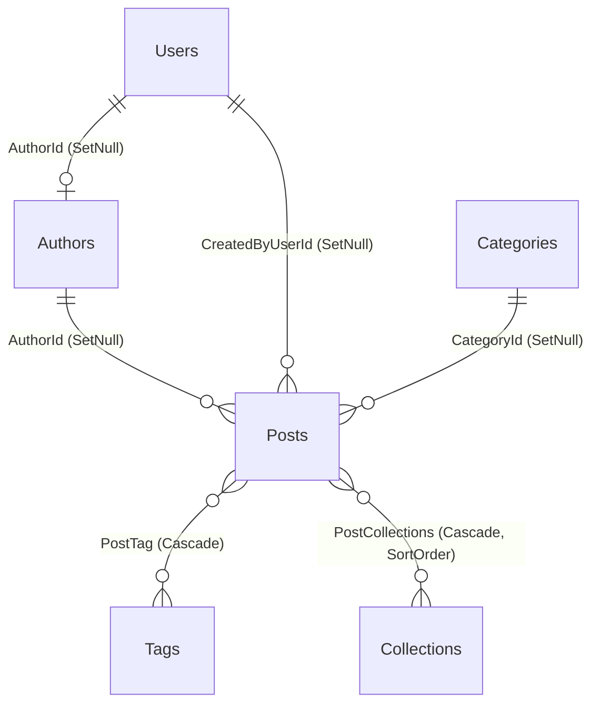

# 06 · 数据库设计

> **用途**：表结构、字段、索引、外键、迁移历史与全文检索的数据层落地。
> **读者**：需要改表、写查询、排查数据问题的人。
> **最后核对**：2026-09-11 ｜ **代码依据**：`BlogDbContext.cs` + `Persistence/Migrations/`
>
> 乐观锁的实现原理见 [03-后端设计.md](./03-后端设计.md) §4.3；实体行为方法见 §3。

---

## 1. 数据库总览

| 项 | 值 |
|---|---|
| 数据库 | PostgreSQL **18.6**，运行在自定义镜像 `blog-postgres-zhparser:18`（含 zhparser，见 §8） |
| 库名（开发） | `blog_stage2` |
| ORM | EF Core 10.0.11 + Npgsql 10.0.3 |
| 表数量 | **10** 张 |
| 主键类型 | `uuid`（`Guid`），种子数据用固定 GUID |
| 时间类型 | `timestamp with time zone`（`DateTimeOffset`） |
| 迁移数量 | 2 个 |
| 启动行为 | **应用启动时自动执行迁移**（`Database.Migrate()`） |

### 1.1 全部数据表

| 表名 | 分类 | 说明 |
|---|---|---|
| `Posts` | 内容 | 文章 |
| `Authors` | 内容 | 署名作者（**不是登录账号**） |
| `Categories` | 内容 | 分类（单值） |
| `Tags` | 内容 | 标签（多值） |
| `Collections` | 内容 | 专栏 |
| `PostTag` | 连接 | 文章 ↔ 标签（EF 隐式多对多） |
| `PostCollections` | 连接 | 文章 ↔ 专栏（**显式**连接实体，带排序） |
| `Users` | 账号 | 登录账号（凭据 + 角色） |
| `SiteConfigs` | 配置 | 站点配置（Key-Value） |
| `SocialLinks` | 配置 | 社交链接 |

---

## 2. ER 图



`||--o|` 表示"一到零或一"，`||--o{` 表示"一到零或多"，`}o--o{` 表示多对多。

---

## 3. 公共字段（所有业务实体）

除 `PostTag`（纯连接表）外，所有表都含以下字段（来自 `BaseEntity`）：

| 列名 | 类型 | 可空 | 说明 |
|---|---|---|---|
| `Id` | `uuid` | 否 | 主键。C# 侧为 `init` 只读 |
| `CreatedAt` | `timestamp with time zone` | 否 | 创建时间 |
| `IsDeleted` | `boolean` | 否 | 软删除标记 |
| `DeletedAt` | `timestamp with time zone` | 是 | 删除时间 |
| `Version` | `integer` | 否 | **乐观锁版本号**，从 1 开始 |

### 3.1 软删除与全局查询过滤器

**所有带 `BaseEntity` 的实体都配置了全局查询过滤器**：

```csharp
entity.HasQueryFilter(e => !e.IsDeleted);
```

这意味着**应用层不需要（也不应该）手写 `WHERE "IsDeleted" = false`**——
EF 会自动追加。仓储的 `Remove()` 只打标记：

```csharp
public void Remove(TEntity entity)
{
    entity.Delete();                     // IsDeleted = true; DeletedAt = now
    _context.Set<TEntity>().Update(entity);
}
```

> ⚠️ **`PostCollection` 是唯一没有软删除的实体**（纯连接行，随文章/专栏级联删除）。
> 因为 `Collection` 带查询过滤器而 `PostCollection` 是必需端，EF 会警告
> "必需端被过滤可能导致意外结果"。项目**从不单独查询 PostCollection**
> （始终经 Post/Collection 导航访问），因此在 `OnConfiguring` 里显式抑制了该警告。

### 3.2 乐观锁的数据库层配置

`OnModelCreating` 末尾统一把所有实体的 `Version` 标记为并发令牌：

```csharp
foreach (var entityType in modelBuilder.Model.GetEntityTypes())
{
    var versionProperty = entityType.FindProperty(nameof(BaseEntity.Version));
    if (versionProperty is not null)
        versionProperty.IsConcurrencyToken = true;
}
```

配合仓储层的 `ApplyOptimisticVersion`，生成：

```sql
UPDATE "Posts" SET ..., "Version" = @expected + 1
WHERE "Id" = @id AND "Version" = @expected;
```

---

## 4. 内容层表

### 4.1 `Posts` — 文章

| 列名 | 类型 | 长度 | 可空 | 说明 |
|---|---|---|---|---|
| `Id` | uuid | — | 否 | 主键 |
| `Title` | varchar | 200 | 否 | 标题 |
| `Content` | **text** | — | 否 | Markdown 原文 |
| `Summary` | varchar | 120 | 否 | 摘要；空则自动取正文前 50 字 |
| `CoverImage` | varchar | 500 | 否 | 封面图 URL |
| `AuthorId` | uuid | — | **是** | 署名作者（Author 删除时 SetNull） |
| `CreatedByUserId` | uuid | — | 是 | **创建者账号**，归属校验用 |
| `CategoryId` | uuid | — | 是 | 分类 |
| `PublishedAt` | timestamptz | — | 是 | **有值 = 已发布** |
| `UpdatedAt` | timestamptz | — | 是 | 更新时间 |
| `ViewCount` | integer | — | 否 | 浏览量 |
| `WordCount` | integer | — | 否 | 字数（`Content.Length`） |
| `SearchVector` | **tsvector** | — | 是 | **生成列**，全文检索，见 §7 |
| `CreatedAt` / `IsDeleted` / `DeletedAt` / `Version` | | | | 公共字段 |

**外键**：

| 外键 | 指向 | 删除行为 |
|---|---|---|
| `FK_Posts_Authors_AuthorId` | `Authors.Id` | `SetNull` |
| `FK_Posts_Categories_CategoryId` | `Categories.Id` | `SetNull` |
| `FK_Posts_Users_CreatedByUserId` | `Users.Id` | `SetNull` |

> **三个外键全是 `SetNull` 而不是 `Cascade`**：删除作者/分类/账号时，
> **文章必须保留**（内容比归类重要）。这是刻意的选择。
>
> `AuthorId` 的可空性是第二个迁移才改的（初始迁移里是 `NOT NULL`）。

**索引**：

| 索引名 | 列 | 类型 | 用途 |
|---|---|---|---|
| `IX_Posts_PublishedAt` | `PublishedAt` | 普通 | 列表按发布时间排序 |
| `IX_Posts_AuthorId` | `AuthorId` | 普通 | 按作者过滤 |
| `IX_Posts_CategoryId` | `CategoryId` | 普通 | 按分类过滤 |
| `IX_Posts_CreatedByUserId` | `CreatedByUserId` | 普通 | 归属过滤（作者工作区） |
| `IX_Posts_IsDeleted_PublishedAt` | `IsDeleted, PublishedAt` | 复合 | 软删除 + 排序的组合查询 |
| `ix_posts_search` | `SearchVector` | **GIN** | 全文检索（手写 SQL 创建） |

### 4.2 `Authors` — 署名作者

| 列名 | 类型 | 长度 | 可空 |
|---|---|---|---|
| `Name` | varchar | 100 | 否 |
| `Email` | varchar | 100 | 否 |
| `Avatar` | varchar | 200 | 否 |
| `Bio` | varchar | 500 | 否 |

> `Email` 是**展示用联系方式**，与 `Users.Email`（登录邮箱）**不是一回事**。

**索引**：除主键外无额外索引。

### 4.3 `Categories` — 分类

| 列名 | 类型 | 长度 | 可空 |
|---|---|---|---|
| `Name` | varchar | 100 | 否 |

**索引**：

| 索引名 | 列 | 唯一 | 过滤条件 |
|---|---|---|---|
| `IX_Categories_Name` | `Name` | ✅ | `"IsDeleted" = false` |

> **过滤唯一索引**（partial unique index）是关键：只在未删除的行之间保证唯一，
> 因此**软删除后可以重建同名分类**。这是软删除与唯一约束共存的正确做法。

### 4.4 `Tags` — 标签

| 列名 | 类型 | 长度 | 可空 |
|---|---|---|---|
| `Name` | varchar | **50** | 否 |

**索引**：`IX_Tags_Name`（唯一，过滤 `"IsDeleted" = false`）

### 4.5 `Collections` — 专栏

| 列名 | 类型 | 长度 | 可空 | 说明 |
|---|---|---|---|---|
| `Title` | varchar | 200 | 否 | 标题 |
| `Slug` | varchar | 200 | 否 | URL 友好标识 |
| `Description` | varchar | 500 | 否 | |
| `CoverImage` | varchar | 500 | 否 | |
| `SortOrder` | integer | — | 否 | 专栏之间排序 |
| `IsPublished` | boolean | — | 否 | 是否对外可见 |

**索引**：

| 索引名 | 列 | 唯一 | 过滤 |
|---|---|---|---|
| `IX_Collections_Slug` | `Slug` | ✅ | `"IsDeleted" = false` |
| `IX_Collections_SortOrder` | `SortOrder` | — | — |

---

## 5. 连接表

### 5.1 `PostTag` — 文章 ↔ 标签（隐式多对多）

EF Core 自动生成的连接表，**只有两个列，无公共字段**：

| 列名 | 类型 | 可空 |
|---|---|---|
| `PostsId` | uuid | 否 |
| `TagsId` | uuid | 否 |

**主键**：`(PostsId, TagsId)` 复合主键
**外键**：两个都是 **`Cascade`**（删文章/删标签时自动清理连接行）
**索引**：`IX_PostTag_TagsId`

> ⚠️ **更新标签时必须做"增量同步"，不能整体替换。**
> 若把 `post.Tags` 整体替换（先清空再加回），EF 会把仍存在的连接行也当成新增 INSERT，
> 报 `23505 duplicate key ... PK_PostTag`。
> 正确做法（`PostService.ApplyTagsAsync`）：只移除"取消关联的"、只添加"新增的"。

### 5.2 `PostCollections` — 文章 ↔ 专栏（显式连接实体）

**显式**建表（而不是 EF 隐式多对多），因为它要携带额外数据：

| 列名 | 类型 | 可空 | 说明 |
|---|---|---|---|
| `PostId` | uuid | 否 | |
| `CollectionId` | uuid | 否 | |
| `SortOrder` | integer | 否 | **该文章在此专栏内的排序** |

**主键**：`(PostId, CollectionId)` 复合主键（`PK_PostCollections`）
**外键**：两个都是 **`Cascade`**
**索引**：`IX_PostCollections_CollectionId`

> ⚠️ **同一个坑的另一种形态**：`BaseRepository.GetByIdAsync` **不加载导航集合**。
> 直接改 `collection.PostLinks` 会让 EF 把已存在的连接行当成新增 INSERT，
> 报 `23505 duplicate key ... PK_PostCollections`（表现为"保存必 500"）。
> **必须用 `ICollectionRepository.GetWithPostsAsync`**（内部 `Include(c => c.PostLinks)`）。

**为什么专栏内的顺序要单独存**：专栏是"人为编排的系列"，
阅读顺序由作者决定，不能按发布时间推导。这是它与分类/标签最本质的区别。

---

## 6. 账号层表

### 6.1 `Users` — 登录账号

| 列名 | 类型 | 长度 | 可空 | 说明 |
|---|---|---|---|---|
| `Email` | varchar | 100 | 否 | **登录邮箱**，唯一 |
| `PasswordHash` | varchar | 500 | 否 | PBKDF2 哈希（自描述格式） |
| `Role` | varchar | 20 | 否 | `Admin` / `Author`，**以字符串存库** |
| `IsActive` | boolean | — | 否 | 是否启用 |
| `AuthorId` | uuid | — | 是 | 关联的署名对象 |
| `LastLoginAt` | timestamptz | — | 是 | 最近登录时间 |
| `TokenVersion` | integer | — | 否 | Token 版本号，默认 1 |

**外键**：`FK_Users_Authors_AuthorId` → `Authors.Id`，`SetNull`
（作者被删时账号仍可登录，只是失去署名身份）

**索引**：

| 索引名 | 列 | 唯一 | 过滤 |
|---|---|---|---|
| `IX_Users_Email` | `Email` | ✅ | `"IsDeleted" = false` |
| `IX_Users_AuthorId` | `AuthorId` | — | — |

> **`Role` 为什么存字符串而不是整数**：可读性显著更好（直接查库就能看懂），
> 且将来加角色时**不需要改数据库类型**，只需新增枚举值。
> 代价是索引效率略低，但用户表的行数极少，不构成问题。
>
> **`PasswordHash` 存的是自描述格式**：
> `pbkdf2-sha512${iterations}${base64(salt)}${base64(hash)}`。
> 把迭代次数与盐存在哈希串里，使得**提高迭代次数不会让旧密码失效**（校验时按存储的迭代次数重算）。
>
> **`TokenVersion` 是 JWT 主动失效的关键**：签发 token 时把该值写入 claim，
> 每次请求与库中值比对。改密码/停用/注销只要 `+1`，该账号所有旧 token 立即失效。

---

## 7. 配置层表

### 7.1 `SiteConfigs` — 站点配置

| 列名 | 类型 | 长度 | 可空 | 说明 |
|---|---|---|---|---|
| `Key` | varchar | 100 | 否 | 配置键，唯一 |
| `Value` | **text** | — | 否 | 值（简单串或 JSON） |
| `Description` | varchar | 500 | 是 | 说明 |

**索引**：`IX_SiteConfigs_Key`（唯一，过滤 `"IsDeleted" = false`）

**约定的 Key**（`SiteConfigKeys`）：

| Key | Value 格式 | 说明 |
|---|---|---|
| `SiteName` | 字符串 | 站点名称 |
| `HeroSubtitles` | **JSON 数组字符串** | 首屏打字机文案 |
| `FoundingDate` | `yyyy-MM-dd` | 建站日期，用于计算建站天数 |
| `HeroBackground` | URL | Hero 背景图（可选，无种子数据） |

> **为什么用 Key-Value 而不是固定列**：站点配置会随需求增加（换主题要加配置项），
> 固定列每加一项就要写迁移。KV 结构**加配置项不需要改表**，
> 代价是失去数据库层的类型约束——类型由应用层按 Key 解释。

### 7.2 `SocialLinks` — 社交链接

| 列名 | 类型 | 长度 | 可空 | 说明 |
|---|---|---|---|---|
| `Name` | varchar | 50 | 否 | 显示名 |
| `Icon` | varchar | 50 | 否 | 图标 key（前端图标映射用），如 `github` |
| `Url` | varchar | 500 | 否 | 链接 |
| `SortOrder` | integer | — | 否 | 排序，越小越靠前 |
| `IsVisible` | boolean | — | 否 | 是否显示 |

**索引**：除主键外无额外索引（数量极少，全表扫描即可）。

---

## 8. 全文检索的数据层落地

### 8.1 生成列

`Posts.SearchVector` 是 PostgreSQL **生成列（GENERATED ALWAYS AS ... STORED）**，
由数据库在插入/更新时自动维护，应用层**永远不写这一列**：

```sql
setweight(to_tsvector('chinese', coalesce("Title",   '')), 'A') ||
setweight(to_tsvector('chinese', coalesce("Summary", '')), 'B') ||
setweight(to_tsvector('chinese', coalesce("Content", '')), 'C')
```

**权重含义**：标题 A（最高）> 摘要 B > 正文 C。
权重本身只影响相关度评分（`ts_rank`），**不影响是否匹配**。

### 8.2 EF Core 侧的映射（影子属性）

`NpgsqlTsVector` 来自 Npgsql，**不能出现在 `Blog.Domain`**（该层零框架依赖）。
因此在 Infrastructure 的 `OnModelCreating` 里声明为**影子属性**：

```csharp
entity.Property<NpgsqlTypes.NpgsqlTsVector>("SearchVector")
      .HasColumnName("SearchVector")
      .HasColumnType("tsvector")
      .HasComputedColumnSql("...", stored: true);
```

查询时用 `EF.Property` 或参数化原生 SQL 访问（见 [03-后端设计.md](./03-后端设计.md) §7）。

> ⚠️ **正是"影子属性"这个身份导致了两个必踩的坑**（可翻译性下降）：
> `EF.Functions.PlainToTsQuery` 与 `ts_rank` 在这种形态下都会被判客户端求值。
> 解法与完整说明见 [03-后端设计.md](./03-后端设计.md) §7.2 / §7.4。

### 8.3 扩展与检索配置的创建

| 来源 | 覆盖场景 | 内容 |
|---|---|---|
| **EF 迁移 `20260910205225`（权威来源）** | **全新库 + 已有库，两种都覆盖** | `CREATE EXTENSION IF NOT EXISTS zhparser` + 建 `chinese` 配置 + GIN 索引 |
| `deploy/postgres-init/01-zhparser.sql` | 仅全新数据库（entrypoint 只在数据目录为空时执行） | 同样的语句 + 一条自检输出 |

**权威来源必须是迁移**：`postgres` 官方镜像的 entrypoint **只在数据目录为空时**
执行 `/docker-entrypoint-initdb.d/` 下的脚本 —— 对已存在的库它不会重跑，
而迁移每次启动都会应用。init 脚本只是让全新环境开箱可用、少一步手工 SQL。

迁移中的 SQL：

```sql
CREATE EXTENSION IF NOT EXISTS zhparser;

DO $$
BEGIN
    IF NOT EXISTS (SELECT 1 FROM pg_ts_config WHERE cfgname = 'chinese') THEN
        CREATE TEXT SEARCH CONFIGURATION chinese (PARSER = zhparser);
        ALTER TEXT SEARCH CONFIGURATION chinese ADD MAPPING FOR n,v,a,i,e,l,j,q WITH simple;
    END IF;
END $$;

CREATE INDEX ix_posts_search ON "Posts" USING gin ("SearchVector");
```

#### ⚠️ 这两段 SQL 在迁移里的**位置是有约束的**（G12，2026-09-13 修复）

同一个迁移在下面会 `AddColumn<SearchVector>`，而它是**生成列**，
表达式引用了 `to_tsvector('chinese', …)` —— 也就是**依赖 `chinese` 配置已存在**。

因此这两段 SQL **必须排在那条 `AddColumn` 之前**。原先它们排在后面，后果是
**整条迁移链无法在一个干净的 PostgreSQL 上从零建库**：

```
42704: text search configuration "chinese" does not exist
```

而失败发生在应用启动时的 `Database.Migrate()` —— 表现为**应用起不来**。
它长期没暴露，是因为 entrypoint 脚本总会先把配置建好：
**靠部署巧合，而不是靠迁移自己能站得住**。

| 场景 | 修复前 | 修复后 |
|---|---|---|
| 自定义 PG 镜像 + 首次初始化（当前 Dev / CI 路径） | ✅（靠 init 脚本） | ✅ |
| 标准 `postgres:18` 镜像 | ❌ 应用起不来 | ✅ |
| 还原 schema-only dump 到新库 | ❌ | ✅ |
| 手工 `CREATE DATABASE` 后跑迁移 | ❌ | ✅ |
| **集成测试**（在干净库上跑迁移） | ❌ → 靠夹具**预建配置**绕过 | ✅ **不再需要绕过，测试本身成了回归防护** |

> 两段 SQL 都是幂等的，且 EF 按 ID 跳过已应用的迁移 ——
> 所以调整顺序对**已迁移的库没有任何影响**。
> 详见 [14-开发问题记录](./14-开发问题记录.md) 第 7 条。

**映射的 token 类型**：`n`(名词) `v`(动词) `a`(形容词) `i`(成语) `e`(叹词) `l`(习用语) `j`(简称) `q`(量词)。
用 `simple` 字典（只做小写归一化，不做词干还原与停用词过滤）——
中文不需要词干还原，且这样能让中英混合文本里的英文词原样保留。

---

## 9. 迁移历史

| # | 迁移 | 内容 |
|---|---|---|
| 1 | `20260906040849_InitCreate` | 建 6 张表（`Authors`/`Categories`/`SiteConfigs`/`SocialLinks`/`Tags`/`Posts`）+ `PostTag` 连接表；建索引；写入种子数据 |
| 2 | `20260910205225_AddAuthCollectionsAndFts` | 认证 + 专栏 + 全文检索：`Posts.AuthorId` 改为可空、加 `CreatedByUserId`、加 `SearchVector` 生成列；建 `Users`/`Collections`/`PostCollections`；补索引与外键；`CREATE EXTENSION zhparser` + `chinese` 配置 + GIN 索引；写入管理员等新种子数据 |

### 9.1 迁移的注意事项

> ⚠️ **`dotnet ef migrations add` 不要加 `--no-build`。**
> 否则会读到**旧的编译产物**，生成的迁移不完整（本项目踩过）。
>
> ⚠️ **`dotnet ef migrations remove` 不会回退模型快照，不要依赖它撤销未应用的迁移。**
> 正确做法：`git checkout -- BlogDbContextModelSnapshot.cs` + 手工删迁移文件，然后重新 add。
>
> **迁移与宿主解耦**：`BlogDbContextFactory`（实现 `IDesignTimeDbContextFactory`）
> 让 `dotnet ef` 命令不依赖 `Program.cs` 的启动配置。因此即使应用因为缺少
> `Jwt:SigningKey` 而无法启动，依然可以生成迁移。

具体命令见 [07-开发与运维手册.md](./07-开发与运维手册.md) §4。

---

## 10. 种子数据

种子数据的完整清单见 **[01-项目初始化与配置.md](./01-项目初始化与配置.md) §3**（含固定 GUID）。
此处只记录**主键规律**：

```
6f2a1b3c-0000-0000-0000-000000000001   默认作者
6f2a1b3c-0000-0000-0000-000000000010   SiteName
6f2a1b3c-0000-0000-0000-000000000011   HeroSubtitles
6f2a1b3c-0000-0000-0000-000000000012   FoundingDate
6f2a1b3c-0000-0000-0000-000000000020   GitHub 链接
6f2a1b3c-0000-0000-0000-000000000021   Bilibili 链接
6f2a1b3c-0000-0000-0000-000000000030   管理员账号
6f2a1b3c-0000-0000-0000-000000000040   示例专栏
```

`HasData` **要求固定主键**，因此不能随机生成。改动种子数据的内容是安全的
（内容变更会生成 `UpdateData` 迁移），但**改主键会让旧数据变成孤儿**。

---

## 11. 常见查询与索引的对应关系

| 查询场景 | 走哪个索引 |
|---|---|
| 首页/列表页按发布时间倒序 + 只取未删除 | `IX_Posts_IsDeleted_PublishedAt` |
| 归档按年月分组 | `IX_Posts_PublishedAt` |
| 按分类过滤文章 | `IX_Posts_CategoryId` |
| 按标签过滤文章 | `IX_PostTag_TagsId` |
| 作者工作区（我创建的） | `IX_Posts_CreatedByUserId` |
| 按作者署名过滤 | `IX_Posts_AuthorId` |
| 关键词检索 | `ix_posts_search`（GIN） |
| 按 slug 取专栏 | `IX_Collections_Slug` |
| 专栏列表排序 | `IX_Collections_SortOrder` |
| 专栏内文章 | `IX_PostCollections_CollectionId` |
| 登录查账号 | `IX_Users_Email` |
| 取站点配置 | `IX_SiteConfigs_Key` |
| 分类/标签墙 | `IX_Categories_Name` / `IX_Tags_Name`（唯一索引顺带支持等值查找） |

> **慢查询监控**：`SlowQueryInterceptor` 会在任意 SQL 超过 **500ms** 时记 WARN（含完整 SQL）。
> 排查性能问题先看日志里的慢查询，再对照本表检查是否缺索引。

---

## 12. 与代码的对应关系

| 内容 | 文件 |
|---|---|
| 实体映射、索引、关系、种子数据 | `Blog.Infrastructure/Persistence/BlogDbContext.cs` |
| 迁移 | `Blog.Infrastructure/Persistence/Migrations/` |
| 模型快照 | `Blog.Infrastructure/Persistence/Migrations/BlogDbContextModelSnapshot.cs` |
| 设计期工厂 | `Blog.Infrastructure/Persistence/BlogDbContextFactory.cs` |
| 实体定义（含行为方法） | `Blog.Domain/Entities/` |
| 软删除与版本号基类 | `Blog.Domain/Entities/Base/BaseEntity.cs` |
| PG 自定义镜像与初始化脚本 | `deploy/postgres-zhparser.Dockerfile`、`deploy/postgres-init/01-zhparser.sql` |
| 慢查询拦截器 | `Blog.Infrastructure/Persistence/Interceptors/SlowQueryInterceptor.cs` |
