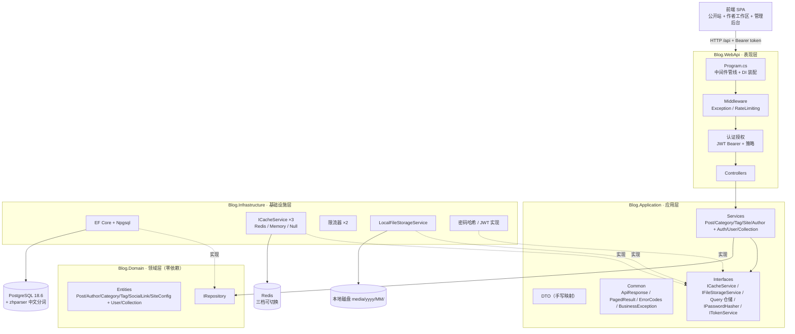
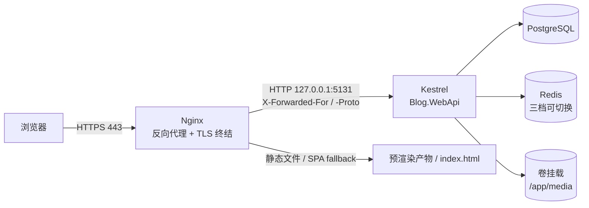
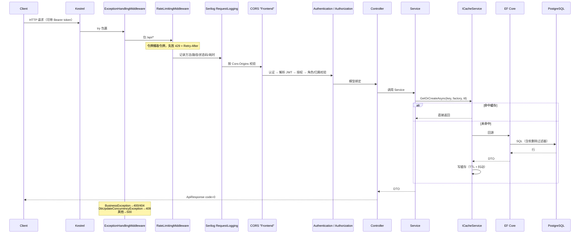
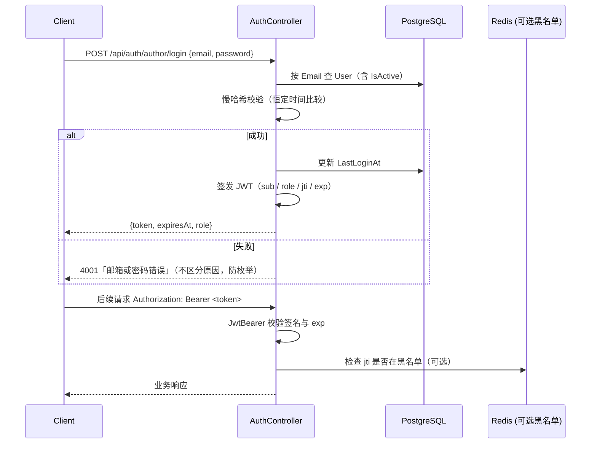
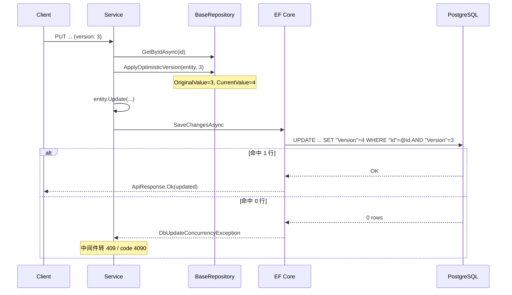

# 博客系统 后端技术文档

> 版本：v3.0 ｜ 编写日期：2026-09-10
> 依据：对 `Blog.Backend/` 实际代码的核查 + 已拍板决策（见 [tech.md](./tech.md)）
> 配套文档：[business.md](./business.md) ｜ [tech.md](./tech.md) ｜ [frontend.md](./frontend.md) ｜ [suggestion.md](./suggestion.md)
>
> **状态标记**：`[已实现]` 代码已落地 ｜ `[已决定]` 已拍板待实施 ｜ `[计划中]` 已规划未决策 ｜ `[已废弃]` 已弃用
> 本仓库**不使用** AutoMapper，DTO 全部手写映射。

---

## 1. 技术栈与版本

版本号取自各 `*.csproj` 与 `Blog.Backend/dotnet-tools.json`（**精确版本**，非范围）。

### 1.1 运行时与语言

| 项 | 版本 | 依据 |
|---|---|---|
| 目标框架 | `net10.0` | 全部 4 个 csproj 的 `<TargetFramework>` |
| C# 配置 | `Nullable=enable`、`ImplicitUsings=enable` | 同上 |
| .NET SDK（本机实测） | 10.0.401 | 构建输出 `C:\Program Files\dotnet\sdk\10.0.401` |
| EF Core CLI | `dotnet-ef` 10.0.11 | `Blog.Backend/dotnet-tools.json:4-11` |
| PostgreSQL（本机实测） | **18.6** (Debian 18.6-1.pgdg13+2) | `SELECT version()` |

### 1.2 NuGet 依赖

**Blog.Domain** — 无任何外部依赖（零框架依赖的内层）

**Blog.Application**

| 包 | 版本 |
|---|---|
| Microsoft.Extensions.DependencyInjection.Abstractions | 10.0.11 |

**Blog.Infrastructure**

| 包 | 版本 | 用途 |
|---|---|---|
| Microsoft.EntityFrameworkCore | 10.0.11 | ORM |
| Npgsql.EntityFrameworkCore.PostgreSQL | 10.0.3 | PostgreSQL 提供程序 |
| Microsoft.Extensions.Caching.Memory | 10.0.11 | 内存缓存 |
| Microsoft.Extensions.Configuration.Abstractions | 10.0.11 | 配置 |
| Microsoft.Extensions.Configuration.Binder | 10.0.11 | 选项绑定 |
| Microsoft.Extensions.Options.ConfigurationExtensions | 10.0.11 | `Configure<T>` |
| Microsoft.Extensions.Options | 10.0.11 | Options 模式 |
| Microsoft.Extensions.DependencyInjection.Abstractions | 10.0.11 | DI 抽象 |
| Microsoft.Extensions.Logging.Abstractions | 10.0.11 | 日志抽象 |
| StackExchange.Redis | 2.10.1 | Redis 客户端 |

**Blog.WebApi**

| 包 | 版本 | 用途 |
|---|---|---|
| Microsoft.AspNetCore.OpenApi | 10.0.11 | OpenAPI |
| Microsoft.EntityFrameworkCore.Design | 10.0.11 | 迁移设计期（`PrivateAssets=all`） |
| Serilog.AspNetCore | 10.0.0 | 日志与请求日志 |
| Serilog.Sinks.File | 7.0.0 | 滚动文件 |

### 1.3 待引入依赖（`[已决定]`）

| 用途 | 候选 | 说明 |
|---|---|---|
| JWT 签发与校验 | `Microsoft.AspNetCore.Authentication.JwtBearer` | 官方包 |
| 密码慢哈希 | **框架内置 `Rfc2898DeriveBytes`（PBKDF2）** | T3 已定：零新依赖 |
| JWT 黑名单（可选） | 复用现有 `StackExchange.Redis` | 无需新依赖 |

### 1.4 数据与中间件组件

| 组件 | 选型 | 状态 | 依据 |
|---|---|---|---|
| 关系数据库 | PostgreSQL 18.6 | `[已实现]` | `Infrastructure/DependencyInjection.cs:22` |
| 缓存 | Redis / Memory / Null（三档可切换） | `[已实现]` | `Infrastructure/DependencyInjection.cs:41-55` |
| **全文检索** | **`zhparser` + `tsvector` 生成列 + GIN**（真 FTS） | `[已决定]` | [tech.md](./tech.md) §5.3 |
| 消息队列 | 无 | `[计划中/暂不需要]` | 检索无 RabbitMQ/Kafka |
| 对象存储 | 本地磁盘（**只是过渡**） | `[已实现]` | `Infrastructure/Files/LocalFileStorageService.cs:8-9` |
| 任务调度 | 无 | `[计划中]` | 无 Hangfire/Quartz |
| 邮件服务 | 无 | `[计划中]` | 无 MailKit/SMTP |
| 监控 / APM | 无（仅日志文件） | `[计划中]` | 无 Prometheus/OpenTelemetry |
| 链路追踪 | 无 | `[计划中]` | 无 traceId 透传 |

> **PostgreSQL 扩展实测结果**（本机 PG 18.6）：
> 镜像自带：`pg_trgm 1.6` ✅ ｜ `btree_gin 1.3` ✅ ｜ `unaccent 1.1` ✅
> 镜像**不带**：`zhparser` ❌ ｜ `pg_jieba` ❌ ｜ `pgroonga` ❌
> `default_text_search_config = pg_catalog.english`
>
> **`zhparser` 已在本机容器内编译安装并验证可用**（含中文分词与中英混合），
> 但**必须固化为自定义镜像**，否则容器重建即失效 —— 见 §5.5 与 [suggestion.md](./suggestion.md) T11。
> 搜索方案因此按**真 FTS** 实施（§5）。

---

## 2. 系统架构

### 2.1 分层

整洁架构四层，依赖方向单向向内。解决方案仅含 4 个工程（`Blog.Backend/Blog.Backend.slnx`）。



装配入口：`WebApi/Program.cs:42-43`（`AddApplication()` + `AddInfrastructure(configuration)`）。

> **命名确认**：DI 扩展方法名是 **`AddInfrastructure`**（`Blog.Infrastructure/DependencyInjection.cs:17`）。
> 早期文档误写为 `AddInfrastructureServices`，已勘误。

### 2.2 读写仓储分离

| 类型 | 接口 | 实现 | 注册 |
|---|---|---|---|
| 写侧 | `IBaseRepository<T>` + 各实体扩展 | `BaseRepository<T>` 等 | `DependencyInjection.cs:28-33` |
| 读侧 | `IPostQueryRepository` | `PostQueryRepository` | `:36` |
| 读侧 | `ICategoryQueryRepository` / `ITagQueryRepository` | `TaxonomyQueryRepository`（同一类注册两次） | `:37-38` |
| 读侧 | `ISiteQueryRepository` | `SiteQueryRepository` | `:39` |

读侧专用仓储做投影查询（`AsNoTracking` + `Select` 到 DTO），避免实体被追踪。

### 2.3 部署架构（`[已决定]` Q1）



| 项 | 决定 | 理由 |
|---|---|---|
| 反向代理 | **Nginx** | 负责 TLS 终结、history fallback、`X-Forwarded-*` 注入 |
| Kestrel 绑定 | 仅监听 `127.0.0.1:5131`，不直接对外 | 避免绕过 Nginx，也避免 `X-Forwarded-For` 被伪造 |
| SPA fallback | `try_files $uri $uri/ /index.html` | 否则刷新 `/post/xxx` 会 404（见 [tech.md](./tech.md) §1.2） |
| 文件持久化 | **必须挂卷** | 否则容器重建即丢文件（见 [tech.md](./tech.md) §1.2 知识点 C） |
| 多实例 | `[计划中]` 单实例起步 | 多实例时必须 Redis，否则启动报错（§4.3） |

**Nginx 关键配置示意**：

```nginx
location /api/ {
    proxy_pass http://127.0.0.1:5131;
    proxy_set_header Host              $host;
    proxy_set_header X-Real-IP         $remote_addr;
    proxy_set_header X-Forwarded-For   $proxy_add_x_forwarded_for;  # 限流依赖此头
    proxy_set_header X-Forwarded-Proto $scheme;
}
location / {
    root /var/www/blog;
    try_files $uri $uri/ /index.html;   # SPA history fallback
}
```

> **安全约束**：只有确定在反代之后才可信任 `X-Forwarded-For`（该头客户端可伪造）。
> 若 Kestrel 直接暴露，必须改用 `RemoteIpAddress`，否则攻击者可通过伪造该头绕过限流。

### 2.4 请求流与数据流



中间件顺序（**顺序敏感**）：

| 序 | 中间件 | 当前行号 | 变更 |
|---|---|---|---|
| 1 | `ExceptionHandlingMiddleware` | `Program.cs:52` | 保持 |
| 2 | `RateLimitingMiddleware` | `:55` | 保持 |
| 3 | `UseSerilogRequestLogging` | `:58` | 保持 |
| 4 | `UseCors("Frontend")` | `:63` | 保持 |
| 5 | `UseAuthentication()` | — | **`[已决定]` 新增（必须在 UseAuthorization 之前）** |
| 6 | `UseAuthorization()` | `:65` | 当前是空操作（无认证方案、无 `[Authorize]`） |
| 7 | `MapControllers` | `:67` | 保持 |

> **当前缺陷**：`UseAuthorization()` 之前**没有** `UseAuthentication()`，且未注册认证方案
> → 该调用完全无效，控制器的 `[Authorize]` 即使加上也不会生效。这是 P0 修复项。

---

## 3. 数据库设计

### 3.1 现有表（`[已实现]`）

迁移：`Blog.Infrastructure/Persistence/Migrations/20260906040849_InitCreate.cs`（当前**唯一**迁移）。

| # | 表 | 说明 | 迁移行号（`name:` 所在行） |
|---|---|---|---|
| 1 | `Authors` | 博主/作者资料（内容属性） | `InitCreate.cs:17` |
| 2 | `Categories` | 分类 | `:36` |
| 3 | `SiteConfigs` | 站点配置 KV | `:52` |
| 4 | `SocialLinks` | 社交链接 | `:70` |
| 5 | `Tags` | 标签 | `:90` |
| 6 | `Posts` | 文章 | `:106` |
| 7 | `PostTag` | 文章↔标签 多对多 | `:143` |

### 3.2 待新增表（`[已决定]`）

| 表 | 用途 | 关键列 |
|---|---|---|
| `Users` | 登录账号 | `Email`(唯一)、`PasswordHash`、`Role`、`IsActive`、`AuthorId`(可空 FK)、`LastLoginAt` |
| `Collections` | 专栏 | `Title`、`Slug`(唯一)、`Description`、`CoverImage`、`SortOrder`、`IsPublished` |
| `PostCollection` | 文章↔专栏（若 T2 定为多对多） | `PostsId`、`CollectionsId`、`SortOrder` |

**`Posts` 列的调整**：

| 列 | 变更 | 理由 |
|---|---|---|
| `AuthorId` | `Guid` → **`Guid?`** | 与既有的 `SetNull` 删除行为对齐（当前语义矛盾，R10） |
| `CreatedByUserId` | **新增** `Guid?` + FK → `Users` | 记录创建者，用于归属校验与审计 |
| `IsSummaryAuto` | **新增** `bool` | 区分摘要是否自动生成（Q5 需要「非空则不再重算」） |
| `SearchVector` | **新增** `tsvector` **生成列**（`STORED`） | 中文全文检索的核心（T9）；见 §5.4 |

### 3.3 公共列（`BaseEntity`）

所有业务表共有，定义在 `Blog.Domain/Entities/Base/BaseEntity.cs:9-20`：

| 列 | 类型 | 说明 |
|---|---|---|
| `Id` | `Guid` (PK) | `init` 只读 |
| `CreatedAt` | `DateTimeOffset` | |
| `IsDeleted` | `bool` | 软删除标记 |
| `DeletedAt` | `DateTimeOffset?` | |
| `Version` | `int` | 乐观锁版本号，默认 1，作并发令牌 |

`Version` 被统一标记为并发令牌：`BlogDbContext.cs:109-114`（遍历所有实体类型查找该属性）。

### 3.4 关系与删除行为

| 关系 | 外键 | 删除行为 | 依据 |
|---|---|---|---|
| Post → Author | `Posts.AuthorId` | **改为 `SetNull`（列须可空）** | `BlogDbContext.cs:44-47` |
| Post → Category | `Posts.CategoryId` | `SetNull`（列已可空） | `:49-52` |
| Post ↔ Tag | `PostTag` | 默认（级联连接行） | `:54-55` |
| User → Author | `Users.AuthorId` | `[已决定]` `SetNull` | 新增 |
| Post → User | `Posts.CreatedByUserId` | `[已决定]` `SetNull` | 新增（用户删除不应删文章） |
| Post ↔ Collection | `PostCollection` | `[已决定]` 级联连接行 | 新增 |

### 3.5 索引

**现有**：

| 索引 | 表 | 列 | 用途 | 依据 |
|---|---|---|---|---|
| `IX_Posts_PublishedAt` | Posts | `PublishedAt` | 列表/归档排序 | `BlogDbContext.cs:40` |
| `IX_Posts_CategoryId` | Posts | `CategoryId` | 按分类过滤 | `:41` |
| `IX_Posts_IsDeleted_PublishedAt` | Posts | `IsDeleted, PublishedAt` | 公开列表复合过滤 | `:42` |
| `IX_Posts_AuthorId` | Posts | `AuthorId` | EF 自动生成 | — |
| `IX_Categories_Name` | Categories | `Name` 唯一+过滤 | 未删除时名称唯一 | `:83` |
| `IX_Tags_Name` | Tags | `Name` 唯一+过滤 | 同上 | `:75` |
| `IX_SiteConfigs_Key` | SiteConfigs | `Key` 唯一+过滤 | 配置 Key 唯一 | `:102` |
| `IX_PostTag_TagsId` | PostTag | `TagsId` | EF 自动生成 | — |

**过滤唯一索引**写法：`HasFilter("\"IsDeleted\" = false")` —— 解决「软删除后无法重建同名数据」。
PostgreSQL 部分索引语法，注意引号转义。

**待新增（`[已决定]`）**：

| 索引 | 表 | 定义 | 理由 |
|---|---|---|---|
| `ix_posts_search` | Posts | `USING gin ("SearchVector")` | **中文全文检索**（真 FTS） |
| `IX_Users_Email` | Users | 唯一+过滤 | 登录凭据唯一 |
| `IX_Collections_Slug` | Collections | 唯一+过滤 | 专栏 URL 友好标识 |
| `IX_Posts_CreatedByUserId` | Posts | `CreatedByUserId` | 按创建者过滤 |
| `ix_authors_name_trgm`（可选） | Authors | `USING gin ("Name" gin_trgm_ops)` | 作者名模糊匹配；**仅在需要时加** |

> **`SearchVector` 生成列与索引必须手写 SQL**：EF Core 不原生支持生成列表达式，
> 迁移中用 `migrationBuilder.Sql(...)` 建列与 GIN 索引更可控（详见 §5.4）。

### 3.6 软删除与全局查询过滤器

6 个实体全部配置 `HasQueryFilter(e => !e.IsDeleted)`：`BlogDbContext.cs:57, 67, 76, 84, 93, 103`。

- 删除走 `BaseEntity.Delete()`（`BaseEntity.cs:26-30`）打标记，由 `UnitOfWork` 统一提交
- `BaseRepository.Remove()` 实现为「标记 + Update」（`BaseRepository.cs:53-57`）
- `User` 建议沿用软删除，但**更推荐禁用**（`IsActive=false`）而非删除，以保留审计线索

### 3.7 种子数据

`HasData` 固定主键（`BlogDbContext.cs:119-144`），由 `Database.Migrate()` 在启动时应用（`Program.cs:70-75`）。

| 实体 | 主键 | 内容 | 待调整 |
|---|---|---|---|
| Author | `...000000000001` | kky / kky@example.com / 「coding slayer」 | 头像路径需修正（R6） |
| SiteConfig ×3 | `...000000000010/11/12` | SiteName、HeroSubtitles、FoundingDate | — |
| SocialLink ×2 | `...000000000020/21` | GitHub、Bilibili | — |
| **User（新增）** | 待定 | 初始管理员账号 | `[已决定]` 密码必须来自部署配置，**不可硬编码在迁移里** |

> **重要**：初始管理员密码**绝不能**写死在 `HasData` 中（会进入 git 历史）。
> 应通过环境变量 / 用户机密注入，首次启动时创建；或提供一次性初始化命令。

### 3.8 迁移策略

| 项 | 现状 / 决定 |
|---|---|
| 迁移数量 | 1（`20260906040849_InitCreate`） |
| 应用方式 | 启动时自动 `Database.Migrate()`（`Program.cs:74`） |
| 生成命令 | `dotnet ef migrations add <Name>` |
| 扩展与检索配置 | `[已决定]` 迁移中需 `CREATE EXTENSION IF NOT EXISTS zhparser`、`CREATE TEXT SEARCH CONFIGURATION chinese` 及其 token 映射（PG 需超级用户或有权限角色） |
| 回滚策略 | `[计划中]` 无自动化；建议每次迁移前备份 |
| 生产变更流程 | `[已决定]` 建议改为**独立发布步骤**，不在应用启动时自动迁移 |

> **风险**：启动时自动迁移在多实例下会并发争抢迁移锁。
> 单实例尚可，多实例时必须拆为独立的迁移步骤。

---

## 4. 缓存策略

### 4.1 三档实现（`[已实现]` + `[已决定]` 保留）

| 组合 | 实现类 | 行为 | 用途 |
|---|---|---|---|
| `Cache:Enabled=false` | `NullCacheService` | **完全旁路**，每次直查 DB | **性能测试基线**、排查缓存问题 |
| `Enabled=true, Provider=Memory` | `MemoryCacheService` | 进程内缓存 | 单实例部署 |
| `Enabled=true, Provider=Redis` | `RedisCacheService` | 分布式 + 三防 | 生产推荐；多实例必需 |

切换逻辑：`Infrastructure/DependencyInjection.cs:46-55`。

> **`NullCacheService` 的价值**：它是你要做的**三档性能测试的下限基线**（Q8）。
> 没有它就无法量化「缓存到底带来多少收益」。

### 4.2 Key 规范（`[已决定]` 迭代 E8）

**你的原提案**：`业务:环境:模块:实体:操作:版本:固定核心维度:可选hash`

**评估结论：方向正确（尤其「版本」这一段很有价值），但字段过多，建议精简。**

| 段 | 评价 | 处理 |
|---|---|---|
| `业务` | ✅ 有价值 | 保留，固定 `blog` |
| `环境` | ⚠️ 通常多余 | **去掉**。不同环境用不同 Redis 实例，key 再带环境名是重复隔离。**例外**：多环境共用同一 Redis 时才需要 |
| `模块` | ✅ 有价值 | 保留 |
| `实体` | ⚠️ 与「模块」高度重叠 | **合并进模块**。否则产生 `posts:post:` 这类冗余 |
| `操作` | ✅ 有价值 | 保留 |
| `版本` | ✅ **最有价值** | 保留。schema 不兼容变更时整体失效，避免反序列化错数据 |
| `固定核心维度` | ✅ 有价值 | 保留 |
| `可选hash` | ✅ 有价值 | 保留（长文本如关键词） |

**最终规范**：

```
blog:{模块}:{操作}:v{版本}:{固定维度}:{可选hash}

规则：
1. blog        固定前缀，便于前缀删除，也避免与其他应用共用 Redis 时冲突
2. 模块        posts | taxonomy | site | stats | auth
3. 操作        list | detail | archives | config | social | summary | blacklist
4. v{版本}     整数；缓存结构不兼容变更时 +1，实现零风险整体失效
5. 固定维度    顺序固定、值可枚举的参数，用短键名（如 p1s12c{guid}t{guid}）
6. 可选hash    不可枚举的长文本做 SHA256 取前 16 位
7. 全小写、: 分隔、不含空格与特殊字符
8. 缺省段用 - 占位，保持段数固定，便于解析与排查
```

**示例对照**：

| 场景 | Key |
|---|---|
| 文章列表（第 1 页 12 条，无筛选） | `blog:posts:list:v1:p1s12c-t-k-` |
| 文章列表（按分类） | `blog:posts:list:v1:p1s12c{categoryId}t-k-` |
| 文章详情 | `blog:posts:detail:v1:{postId}` |
| 归档 | `blog:posts:archives:v1:-` |
| 分类列表 | `blog:taxonomy:categories:v1:-` |
| 标签列表 | `blog:taxonomy:tags:v1:-` |
| 站点配置 | `blog:site:config:v1:-` |
| 社交链接（公开，仅可见） | `blog:site:social:v1:visible` |
| 社交链接（管理端，含隐藏） | `blog:site:social:v1:all` |
| 站点统计 | `blog:stats:summary:v1:-` |
| 搜索（关键词哈希） | `blog:posts:list:v1:p1s10---{hash}` |
| JWT 黑名单 | `blog:auth:blacklist:v1:{jti}` |

**为什么加 `v{版本}`（举实例）**：现在 `PostCardDto` 有 8 个字段，将来加一个字段并发布。
Redis 里仍存着**旧结构 JSON**。没有版本号时只能 `FLUSHDB`（影响全库）或等 TTL 过期（期间返回错数据）；
有版本号时把 `v1` 改 `v2` 即可 —— 旧 key 无人访问，靠 TTL 自然消失，**零风险**。

### 4.3 TTL 一览

| 数据 | TTL | 依据 |
|---|---|---|
| 文章列表 | 5 分钟 | `PostService.cs:13` |
| 文章详情 | 10 分钟 | `:14` |
| 归档 | 30 分钟 | `:15` |
| 分类 / 标签 | 30 分钟 | `CategoryService.cs:12` |
| 站点配置 / 社交链接 | 1 小时 | `SiteService.cs:12` |
| 站点统计 | 10 分钟 | `:13` |
| 空值哨兵 | 默认 2 分钟（`Cache:NullTtl`） | `CacheOptions.cs:18` |

TTL 抖动：`Cache:TtlJitterRatio` 默认 `0.2`（±20%），实现见 `RedisCacheService.ApplyJitter`（`:172-175`）。

### 4.4 三防与降级

| 问题 | 措施 | 配置项 | 实现 |
|---|---|---|---|
| 缓存穿透 | 空结果写 `null` 哨兵，用更短 TTL | `NullTtl` | `RedisCacheService.cs:69` |
| 缓存击穿 | key 级互斥重建，超时直接回源不阻塞 | `LockWaitTimeout`（默认 3s） | `GetOrCreateAsync`（`:115`） |
| 缓存雪崩 | TTL 随机抖动 ±20% | `TtlJitterRatio` | `:172-175` |
| Redis 故障 | 捕获连接/超时异常，冷却期内不重试，回源 DB | — | `RedisCacheService` / `RateLimitingMiddleware.cs:55-66` |

### 4.5 多实例 + 无 Redis 必须报错（`[已决定]` Q8）

**为什么**：当前 Redis 连不上会**静默降级**为回源 DB。单实例下这是对的（保可用性），
但**多实例下有两个严重后果**：

| 后果 | 说明 |
|---|---|
| DB 压力倍增 | 每台实例各自回源，压力 = 实例数倍 |
| **限流失效** | 每实例一个内存桶 → 实际阈值变成 `配置值 × 实例数`，限流形同虚设 |

**决定**：检测到「多实例 + 无 Redis」→ **直接报错**，不静默降级。

**实现建议**：**启动期显式配置校验**（推荐），而非运行期探测。

```csharp
// 伪代码示意：把「部署拓扑」当作运维必须声明的输入，而不是让代码去猜
var deployment = configuration.GetSection("Deployment").Get<DeploymentOptions>();
if (deployment.InstanceCount > 1 && cacheProvider != "Redis")
    throw new InvalidOperationException(
        "多实例部署必须启用 Redis 缓存与限流，否则限流阈值会被放大到实例数倍。已中止启动。");
```

| 方案 | 评价 |
|---|---|
| **启动期显式配置校验** | ✅ **推荐**：简单、可预测、错误信息清晰 |
| 运行期探测（Redis 心跳判实例数） | ❌ 复杂且引入新的单点依赖 |

> 原则：**静默降级比直接失败更难排查**。多实例是部署拓扑问题，应该由运维显式声明。

**新增配置节**：

```json
"Deployment": {
  "InstanceCount": 1,
  "RequireRedis": false
}
```

### 4.6 失效策略与 `SCAN` 的代价

当前依赖 `RemoveByPrefixAsync`（如 `PostService.cs:200` 清 `blog:posts:*`）。

**Redis 的坑**：`SCAN` 是**游标遍历，不是索引查询**，复杂度 O(N)（N = 库中 key 总数）。
数据量大时会阻塞并给 Redis 造成压力。

| 替代方案 | 说明 | 评价 |
|---|---|---|
| 维护「关联 key 集合」 | 写入时记录相关 key，失效时按集合删 | 需维护集合自身 TTL |
| **细粒度版本号** | 不删 key，把版本号存 Redis 并拼进 key；写操作只 `INCR` 版本号 → 旧 key 自然失效 | ✅ **推荐**，与 §4.2 的 `v{版本}` 可统一 |

> 建议把「结构版本」与「数据版本」合并为一个版本号，写操作只更新它，**避免任何 `SCAN`**。
> 数据量上来后再实施（待 T8）。

### 4.7 一致性策略

采用 **Cache-Aside + 删除失效**（非更新缓存）。

| 写操作 | 失效的 Key | 依据 |
|---|---|---|
| 文章 创建/更新/删除/发布 | `blog:posts:*`（前缀）+ `blog:stats:*` | `PostService.cs:200-201` |
| 分类 CRUD | `blog:taxonomy:categories` + `blog:stats:*` + `blog:posts:*` | `CategoryService.cs:105-109` |
| 标签 CRUD | 同上（`blog:taxonomy:tags`） | `TagService` |
| 站点配置更新 | `blog:site:config` | `SiteService.UpdateConfigAsync` |
| 社交链接保存/删除 | `blog:site:social:v1:visible` + `:all` | `SiteService` |
| 作者资料更新 | `blog:posts:*` + `blog:stats:*` | `AuthorService.UpdateAsync` |
| 用户/角色变更 | `[已决定]` `blog:auth:*` | 新增 |

> **详情页浏览量的一致性**：详情接口每次调用都会 `IncrementViewCount` 并**回写缓存**（`PostService.cs:54-68`），
> 因此浏览量在 TTL 内是「缓存值 + 后续自增」的近似值，最终一致。
> 另见 §9 P1-2：管理端不应触发计数。

---

## 5. 搜索方案（`[已决定]`）

### 5.1 现状问题

`PostQueryRepository.cs:107-116`：

```csharp
p.Title.ToLower().Contains(kw) || p.Content.ToLower().Contains(kw)
|| (p.Category != null && p.Category.Name.ToLower().Contains(kw))
|| p.Tags.Any(t => t.Name.ToLower().Contains(kw))
```

生成 `WHERE lower("Content") LIKE '%kw%'`：

| 问题 | 说明 |
|---|---|
| 无法用索引 | 前导通配符 `%kw%` 使 B-tree 完全失效 → **全表扫描** |
| 函数包裹列 | `toLower("Content")` 也让普通索引失效（需表达式索引） |
| 无相关度排序 | 只能按 `PublishedAt` 倒序 |
| 中文不分词 | 逐字子串匹配，词序不同即搜不到 |

### 5.2 方案选型对比（为什么最终选 zhparser）

| 方案 | 中文能力 | 相关度排序 | 词序容忍 | 环境成本 | 结论 |
|---|---|---|---|---|---|
| 现状 `ToLower().Contains()` | ❌ 逐字子串 | ❌ | ❌ | 无 | 全表扫描，必须换 |
| `pg_trgm` + GIN | ⚠️ 按字符滑窗，能匹配但无词概念 | ⚠️ `similarity()` 粗糙 | ❌ | ✅ 镜像自带 | 备选（见 §5.3） |
| **`zhparser` + `tsvector` + GIN** | ✅ **词级切分** | ✅ `ts_rank` + 权重 | ✅ | ⚠️ 需自行编译 | ✅ **采纳（T9）** |

**选择理由**：你要的是**真正的全文检索**，而不只是「让 `LIKE` 走索引」。
`pg_trgm` 无法理解「数据库」是一个词，也无法处理词序变化（搜「优化数据库」匹配不到「数据库优化」）。
`zhparser` 是正面解法。

**代价**：需要自行编译 SCWS + zhparser 并固化镜像（§5.5），这是唯一的额外成本。

### 5.3 备选保留：`pg_trgm`（作为兜底，非主方案）

`pg_trgm` 仍在镜像中可用，**建议保留作为特定场景的补充**：

| 场景 | 为什么 FTS 不够 |
|---|---|
| 极短词/前缀匹配（搜 `EF` 想命中 `EFCore`） | FTS 按词元匹配，`EF` 与 `EFCore` 是不同词元 |
| 拼写容错 | FTS 不处理错别字；trigram 相似度可以 |

若将来需要，可加：

```sql
CREATE EXTENSION IF NOT EXISTS pg_trgm;
CREATE INDEX ix_posts_title_trgm ON "Posts" USING gin ("Title" gin_trgm_ops);
```

> **当前不实施**，仅在 FTS 实测发现短词召回不足时再补。避免同时维护两套索引。

### 5.4 实施：`zhparser` + `tsvector` 生成列 + GIN（`[已决定]` T9）

#### 第 1 步：环境（已在本机验证，需固化镜像）

`zhparser` **不在官方镜像**，须编译 SCWS + zhparser。**我已在开发容器内完成并实测**，
完整步骤与踩坑记录见 [tech.md](./tech.md) §5.3.1 与 §9.1。

#### 第 2 步：检索配置（迁移中执行）

```sql
CREATE EXTENSION IF NOT EXISTS zhparser;

CREATE TEXT SEARCH CONFIGURATION chinese (PARSER = zhparser);
-- n名词 v动词 a形容词 i成语 e叹词 l习用语 j简称 q量词
ALTER TEXT SEARCH CONFIGURATION chinese ADD MAPPING FOR n,v,a,i,e,l,j,q WITH simple;
```

> 用 `simple` 字典：只做小写归一化，不做词干还原与停用词过滤。
> 中文不需要词干还原；且能让中英混合文本里的英文词原样保留（`EF`、`Core` 均可命中）。

**实测分词效果**（已在本机 `blog_stage2` 库验证）：

```sql
SELECT to_tsvector('chinese', '使用 EF Core 做数据库优化与全文检索');
-- 'core':3 'ef':2 '优化':6 '使用':1 '做':4 '全文检索':7 '数据库':5
```

#### 第 3 步：`tsvector` 生成列

```sql
ALTER TABLE "Posts" ADD COLUMN "SearchVector" tsvector
  GENERATED ALWAYS AS (
      setweight(to_tsvector('chinese', coalesce("Title",   '')), 'A') ||
      setweight(to_tsvector('chinese', coalesce("Summary", '')), 'B') ||
      setweight(to_tsvector('chinese', coalesce("Content", '')), 'C')
  ) STORED;
```

| 设计点 | 说明 |
|---|---|
| **生成列而非触发器** | 数据库自动维护，应用层无需关心，不存在「忘了同步索引列」的可能 |
| **`setweight`** | 标题 `A` > 摘要 `B` > 正文 `C`，让标题命中优先 → 解决「无相关度排序」 |
| **`STORED`** | PostgreSQL 生成列仅支持 `STORED`；占额外磁盘但可被索引 |
| **单列合并** | 把三个字段合成一个 `tsvector`，只需一个 GIN 索引 |

> **写入代价**：每次 INSERT/UPDATE 都要重算 `tsvector`；`Content` 很长时开销与存储都会增加。
> 这是 T9 明确选择的取舍（要检索能力）。

#### 第 4 步：GIN 索引

```sql
CREATE INDEX ix_posts_search ON "Posts" USING gin ("SearchVector");
```

#### 第 5 步：EF Core 落地要点

EF Core **不原生支持**生成列表达式，需在迁移中手写 SQL：

```csharp
// 迁移 Up()
migrationBuilder.Sql(@"
    ALTER TABLE ""Posts"" ADD COLUMN ""SearchVector"" tsvector
      GENERATED ALWAYS AS (...) STORED;");
migrationBuilder.Sql(@"CREATE INDEX ix_posts_search ON ""Posts"" USING gin (""SearchVector"");");
```

实体侧把 `SearchVector` 作为**只读影子属性**映射，避免 EF 尝试写入：

```csharp
entity.Property<string>("SearchVector")
      .HasColumnName("SearchVector")
      .HasColumnType("tsvector")
      .ValueGeneratedOnAddOrUpdate();   // 关键：告诉 EF 该列由数据库生成
```

> **实践建议**：迁移里的生成列与索引**全部用 `migrationBuilder.Sql`** 手写，
> 比试图让 EF 推导更可控、更易读，也便于将来调整权重。

#### 第 6 步：查询改写

```csharp
// plainto_tsquery：把自然语言输入转 tsquery（多词默认 AND），用户输入无需转义
var q = EF.Functions.PlainToTsQuery("chinese", kw);
source = source.Where(p => p.SearchVector.Matches(q));
source = source.OrderByDescending(p => p.SearchVector.Rank(q))   // 相关度（权重生效）
                 .ThenByDescending(p => p.PublishedAt);
```

| 函数 | 用途 |
|---|---|
| `plainto_tsquery` | 自然语言 → `tsquery`；**不需要手动转义用户输入**（对比 `to_tsquery` 会被特殊字符破坏语法） |
| `ts_rank` | 相关度打分，配合 `setweight` 让标题命中排前 |

> **必须收敛查询入口**：封装到 `IPostSearchService`。
> 这样将来调整权重、换分词器或补 trgm 兜底时，**Controller 与前端无需改动**。

### 5.5 中文检索的注意点

| 注意点 | 说明 |
|---|---|
| 无空格分隔 | `zhparser` 已正面解决（词级切分） |
| 停用词 | 用 `simple` 不过滤；如需过滤可换 `english` 或自建词典 |
| 同义词 | 可通过自定义同义词词典扩展（`[计划中]`），当前不做 |
| 词干还原 | 中文不需要；英文用 `simple` 不做还原（`running` 不命中 `run`） |
| 混合语言 | **已实测正常**（`使用 EF Core 做 ORM` 可被 `core` 命中） |
| 检索配置是库级对象 | `chinese` 配置与扩展必须在迁移**最先**执行，早于建列与索引 |
| 短词召回 | FTS 按词元匹配，`EF` 不命中 `EFCore`；需要时补 trgm（§5.3） |
| **镜像固化（T11）** | 手工编译的扩展**不在镜像里**，容器重建即失效 → 必须写 Dockerfile（见 [tech.md](./tech.md) §9.1） |

---

## 6. 认证与授权（`[已决定]` Q2 / Q3 / Q7）

### 6.1 现状：完全未实现

| 项 | 状态 | 证据 |
|---|---|---|
| 认证方案 | `[计划中]` | 检索 `Authorize\|Authentication\|Jwt\|Bearer` 在 `Blog.Backend/**/*.cs` 无业务命中 |
| `AddAuthentication` | 不存在 | `Program.cs:29-43` 无调用 |
| `UseAuthentication()` | 不存在 | `Program.cs:52-67` 仅 `UseAuthorization()`（空操作） |
| 控制器 `[Authorize]` | 全无 | 6 个控制器均无特性 |
| 密码字段 / 用户表 | 不存在 | `BlogDbContext.cs:14-19` 仅 6 个业务 DbSet |
| 前端 token 处理 | 无 | 检索 `token\|login\|logout` 在 `Blog.FrontEnd/src` 无业务命中 |
| 前端路由守卫 | 无 | `router/index.ts` 无 `beforeEach` |

**当前权限等价于：所有接口对所有人开放。** 这是唯一的上线阻塞项。

### 6.2 JWT 设计



**Token 内容（claims）**：

| claim | 含义 | 注意 |
|---|---|---|
| `sub` | User Id | |
| `role` | `Admin` / `Author` | 授权依据 |
| `authorId` | 关联的 `Author.Id`（可空） | 用于归属校验，避免每次查库 |
| `jti` | Token 唯一 id | 黑名单用 |
| `exp` | 过期时间 | |

> **绝不放**：密码、邮箱之外的个人信息、任何敏感数据（payload 只是 Base64，**不是加密**）。

**配置项（`[已决定]`）**：

```json
"Jwt": {
  "Issuer": "blog-api",
  "Audience": "blog-frontend",
  "SigningKey": "",          // 必须来自环境变量/密钥库，禁止入库
  "AccessTokenMinutes": 30
}
```

**`SigningKey` 管理**：与数据库连接串同等级别的敏感信息，必须外置（R7）。

### 6.3 授权策略

`[已决定]` 两档角色 + 资源归属校验：

| 策略名 | 规则 | 用法 |
|---|---|---|
| `Admin` | `role == Admin` | `[Authorize(Policy = "Admin")]` |
| `AuthorOrAdmin` | `role ∈ {Author, Admin}` | 发文、上传文件 |
| 资源归属 | Author 仅能操作 `AuthorId == 自己` 的 Post | 在 Service 内校验，**不用**策略（需要读资源） |

> **重要**：资源归属校验**必须在 Service 层做**（因为要先查到实体才知道归属），
> 不能仅靠 `[Authorize]`。这也是「越权访问他人草稿」的防线。

### 6.4 密码存储（`[已决定]` 需慢哈希）

**绝不能用 MD5/SHA1/SHA256**：这些算法**设计目标是快**，而快正是破解者所需。

| 算法 | 说明 | 依赖 |
|---|---|---|
| **PBKDF2** | NIST 认可，**.NET 内置**（`Rfc2898DeriveBytes`） | ✅ **本项目采纳（T3）** |
| Argon2id | 抗 GPU 更强 | 需 NuGet（未采纳，理由见 [tech.md](./tech.md) §2.6） |
| BCrypt | 老牌广泛使用 | 需 NuGet |

无论选哪个：每用户独立随机盐、工作因子可调、校验用**恒定时间比较**（算法库通常内建）。待 T3 确认。

### 6.5 Token 失效

JWT 无状态 → **签发后在过期前一直有效**，服务端无法主动失效。

| 措施 | 说明 |
|---|---|
| 短有效期 | Access Token 建议 15–30 分钟 |
| Redis 黑名单 | 存 `blog:auth:blacklist:v1:{jti}`，TTL = 剩余有效期；Redis 不可用时降级 Memory（单实例 OK） |
| **`User.TokenVersion`** | User 上存整数；签发时写入 claim，校验时与库中比对。改密码/踢下线只需 `INCR`。**不依赖 Redis**，多实例下也有效 —— **推荐方案** |

> **`[已决定]` 不做 Refresh Token（T7）**：只发 Access Token，有效期 30 分钟。
> 因此**没有 `/api/auth/refresh` 端点**。理由：管理后台是低频操作，30 分钟足够完成一次编辑；
> 双 token 会显著增加前后端复杂度与安全面。

---

## 7. API 设计

### 7.1 风格与约定

- 风格：**REST**。控制器路由前缀 `/api`，文件接口 `/api/files/**`（`/media` 已废弃）
- 版本化：`[计划中]` 无版本号。引入认证时可一并加 `/api/v1` 前缀（待定）
- 统一响应体：`{ code, message, data }`（`Common/ApiResponse.cs:6-25`）；成功 `code=0`、`message="ok"`
- 分页：请求 `page`（从 1）/ `pageSize`；响应 `PagedResult<T>` = `{ items, page, pageSize, total, totalPages }`
  - **字段名是 `total` 而非 `totalCount`**；`totalPages` 是只读计算属性（`Common/PagedResult.cs:6-16`）
- 时间格式：`DateTimeOffset` → ISO 8601
- JSON 命名：camelCase（`JsonSerializerDefaults.Web`）
- 写操作并发控制：请求体带 `version`（int）
- **认证**：受保护端点要求 `Authorization: Bearer <token>`

### 7.2 现有端点 `[已实现]`（27 个）

| 控制器 | 行数 | 端点数 | 认证要求（`[已决定]`） |
|---|---|---|---|
| `PostsController` | 106 | 8 | 读公开；写 `AuthorOrAdmin` |
| `SiteController` | 68 | 6 | 读公开（social-links 管理端需 Admin）；写 `Admin` |
| `CategoriesController` | 48 | 4 | 读公开；写 `Admin` |
| `TagsController` | 48 | 4 | 读公开；写 `Admin` |
| `AuthorsController` | 44 | 3 | 读公开；写本人或 `Admin` |
| `FilesController` | 62 | 2 | 上传 `AuthorOrAdmin`；读取公开 |
| **合计** | **376** | **27** | |

**Posts**（`Controllers/PostsController.cs`）：

| 方法 | 路由 | 特性行 | 说明 |
|---|---|---|---|
| GET | `/api/posts` | 20 | 分页；`includeUnpublished` **需鉴权**（§6.3） |
| GET | `/api/posts/{id:guid}` | 44 | 详情；**每次调用浏览量 +1**（见 P1-2） |
| GET | `/api/posts/archives` | 53 | 按年月分组 |
| GET | `/api/posts/search` | 61 | 关键词搜索（**优化中**） |
| POST | `/api/posts` | 73 | 创建 |
| PUT | `/api/posts/{id:guid}` | 80 | 更新（带 `version`） |
| POST | `/api/posts/{id:guid}/publish` | 88 | query `version,publish` |
| DELETE | `/api/posts/{id:guid}` | 99 | query `version`，软删除 |

**Site**（`Controllers/SiteController.cs`）：

| 方法 | 路由 | 特性行 | 说明 |
|---|---|---|---|
| GET | `/api/site/config` | 20 | 聚合 4 项 + `versions` |
| PUT | `/api/site/config` | 27 | 单 key 写入 |
| GET | `/api/site/social-links?includeHidden=` | 36 | `includeHidden=true` 仅 Admin |
| PUT | `/api/site/social-links` | 45 | 批量 upsert |
| DELETE | `/api/site/social-links/{id:guid}` | 53 | 软删除 |
| GET | `/api/site/stats` | 61 | 站点统计 |

**Categories / Tags**（同构）：

| 控制器 | GET | POST | PUT | DELETE |
|---|---|---|---|---|
| `CategoriesController` | 21 | 28 | 35 | 42 |
| `TagsController` | 20 | 27 | 34 | 41 |

**Authors**（`Controllers/AuthorsController.cs`）：

| 方法 | 路由 | 特性行 | 实现行 |
|---|---|---|---|
| GET | `/api/authors` | 20 | 21-26 |
| GET | `/api/authors/{id:guid}` | 28 | 29-36 |
| PUT | `/api/authors/{id:guid}` | 39 | 40-44 |

**Files**（`Controllers/FilesController.cs`）：

| 方法 | 路由 | 特性行 | 实现行 | 备注 |
|---|---|---|---|---|
| POST | `/api/files/upload` | 26-27 | 28-48 | multipart；`[RequestSizeLimit(50MB)]` |
| GET | `/api/files/{**path}` | 50-51 | 52-61 | `[ResponseCache(86400)]`，支持 Range |

### 7.3 待新增端点 `[已决定]`

| 方法 | 路由 | 权限 | 说明 |
|---|---|---|---|
| POST | `/api/auth/author/login` | 匿名 | 作者登录 |
| POST | `/api/auth/admin/login` | 匿名 | 管理员登录 |
| POST | `/api/auth/logout` | 已认证 | 提升 `User.TokenVersion`，使该用户所有旧 token 立即失效 |
| GET | `/api/auth/me` | 已认证 | 当前用户信息 |
| GET | `/api/users` | Admin | 账号列表 |
| POST | `/api/users` | Admin | 创建账号 |
| PUT | `/api/users/{id}` | Admin | 更新（角色 / 启用停用） |
| DELETE | `/api/users/{id}` | Admin | 禁用（建议不物理删除） |
| GET/POST/PUT/DELETE | `/api/collections/**` | 读公开 / 写 Admin | 专栏 CRUD |
| GET | `/api/collections/{slug}` | 匿名 | 专栏详情 + 文章列表 |
| GET | `/api/posts/{id}/readonly` | AuthorOrAdmin | **不计数**的详情（修 P1-2） |

### 7.4 乐观锁机制（核心约定）

**不走 `[Timestamp]`/`rowversion`**，而是「int 版本号 + 手工 SQL 条件」，理由是可跨数据库。



实现：`BaseRepository.ApplyOptimisticVersion`（`BaseRepository.cs:66-74`），校验 `expectedVersion >= 1`。

**各服务的一致性写法**：

| 服务 | version 非法时 |
|---|---|
| `CategoryService` / `TagService` | `ValidateVersion` → `BusinessException(4001)` |
| `SiteService.SaveSocialLinksAsync` / `DeleteSocialLinkAsync` | 显式校验 → 4001 |
| `SiteService.UpdateConfigAsync` | **先查 Key 是否存在**：不存在→新增（忽略 version）；存在→校验 version≥1 |
| `PostService` | `ValidateVersion`（`PostService.cs:155`） |

> **浏览量是唯一例外**：`IPostRepository.IncrementViewCountAsync` 用 `ExecuteUpdateAsync` 原子自增，
> 绕过变更追踪与乐观锁，避免高频并发下频繁 409。

### 7.5 限流规则

开发环境配置（`appsettings.Development.json:23-52`）。**按声明顺序匹配，命中即停**。

| 序 | 规则名 | 路径前缀 | 方法 | 粒度 | 容量 | 速率 |
|---|---|---|---|---|---|---|
| 1 | `search` | `/api/posts/search` | GET | Ip | 20 | 2/s |
| 2 | `write` | `/api` | POST | Ip | 30 | 2/s |
| 3 | `default` | `/api` | （空=全部） | Ip | 120 | 20/s |

| 项 | 说明 |
|---|---|
| 总开关 | `RateLimit.Enabled=true` |
| 降级 | `FallbackToMemory=true`（**多实例下需改为报错**，§4.5） |
| 触发 | HTTP 429 + `code=4091` + `Retry-After` 头（`RateLimitingMiddleware.cs:68-78`） |
| 范围 | 仅 `/api` 前缀（`:35`） |
| 客户端 IP | 读 `X-Forwarded-For` 首段（依赖反代正确配置，§2.3） |

> **缺陷（R13）**：`write` 规则只匹配 `POST`，因此 **`PUT`/`DELETE` 写操作仅受 default 规则约束**（120/20s）。
> 建议补一条匹配 PUT/DELETE/PATCH 的规则（P1）。

### 7.6 错误码总表（`[已决定]` 补全 E5/E6）

现有定义见 `Blog.Application/Common/ErrorCodes.cs:30-52`。

| code | HTTP | 常量 | 触发场景 | 状态 |
|---|---|---|---|---|
| 0 | 200 | `Ok` | 成功 | `[已实现]` |
| 4001 | 400 | `InvalidArgument` | 参数校验失败、登录凭据错误 | `[已实现]` |
| 4002 | 400 | `BusinessRule` | 业务规则不满足（分类/标签重名） | `[已实现]` |
| **4003** | 400 | `DuplicateResource` | 资源重复（如邮箱已注册） | `[已决定]` 新增 |
| 4010 | 401 | `Unauthorized` | **未认证 / token 无效或过期** | `[已决定]` 新增 |
| 4030 | 403 | `Forbidden` | **已认证但无权限 / 越权访问他人资源** | `[已决定]` 新增 |
| 4040 | 404 | `NotFound` | 资源不存在 | `[已实现]` |
| 4090 | 409 | `ConcurrencyConflict` | 乐观锁冲突 | `[已实现]` |
| 4091 | 429 | `RateLimited` | 触发限流 | `[已实现]` |
| **4130** | 413 | `PayloadTooLarge` | 上传文件超过体积限制 | `[已决定]` 新增 |
| 5000 | 500 | `InternalError` | 未处理异常 | `[已实现]` |

> **E5/E6 勘误确认**：早期的错误码表**漏记 4002**（该码实际在用，见 `CategoryService` 的重名校验），
> 且 4010/4030 当时只是「预留」并未在 `ErrorCodes` 中定义。上表为补全后的完整清单。

---

## 8. 中间件与横切

| 组件 | 实现位置 | 说明 |
|---|---|---|
| 异常处理 | `WebApi/Middleware/ExceptionHandlingMiddleware.cs` | 见 §8.3 |
| 限流 | `WebApi/Middleware/RateLimitingMiddleware.cs` | §7.5 |
| 请求日志 | `Program.cs:58-61` | 方法/路径/状态码/耗时 |
| 文件日志 | `Program.cs:23-27` | `logs/blog-.log`，按天滚动，保留 30 天 |
| 慢查询 | `Persistence/Interceptors/SlowQueryInterceptor.cs` | 阈值 500ms（`:12`），超阈值 `LogWarning` 并输出 SQL |
| 文件存储 | `Files/LocalFileStorageService.cs` | §8.2 |
| CORS | `Program.cs:33-40` | 策略 `Frontend`，源来自 `Cors:Origins` |
| 缓存 | `Caching/*` | §4 |
| **认证** | `[已决定]` JwtBearer | §6 |
| 消息队列 | — | `[计划中]` 不存在 |
| 链路追踪 | — | `[计划中]` 无 traceId |
| 健康检查 | `Program.cs:68` | 仅 `GET /`，不含依赖探测（P1 待完善） |

### 8.1 异常映射

`ExceptionHandlingMiddleware.cs:31-48`：

| 异常 | HTTP | code |
|---|---|---|
| `BusinessException(NotFound)` | 404 | 4040 |
| `BusinessException(其他)` | 400 | 异常携带的 code |
| `DbUpdateConcurrencyException` | 409 | 4090 |
| 其他 `Exception` | 500 | 5000 |

> **注意**：`BusinessException` 一律映射到 400（除 404）。新增的 4010/4030 由**认证/授权中间件**返回，
> 不走 `BusinessException` 路径（`JwtBearer` 的 `OnChallenge` / `OnForbidden` 事件里写统一响应体）。

### 8.2 文件存储

| 项 | 值 | 依据 |
|---|---|---|
| 存储根 | `FileStorage:Root` = `media`（**相对进程工作目录**） | `appsettings.Development.json` |
| 目录结构 | `{Root}/yyyy/MM/{guid:N}{ext}` | `LocalFileStorageService.cs:49-52` |
| 扩展名白名单（11 种） | `.png .jpg .jpeg .gif .webp .svg .ico .mp4 .webm .pdf .zip` | `:13-17` |
| 体积上限 | 应用层 10MB；请求体 50MB | `FilesController.cs:27` |
| 读取 | `GET /api/files/{**path}`，缓存 86400s，支持 Range | `:50-61` |
| 目录穿越防护 | `TryResolveSafePath` | `LocalFileStorageService.cs:54` |
| 静态文件中间件 | **未启用**（有意为之） | `FilesController.cs:10` 注释 |

**`[已决定]` 云存储扩展点（关键，配合 Q4/Q9）**：

> **数据库只存 storage key（如 `2026/09/xxx.png`），绝不存完整 URL。**
> 展示时由 `IFileStorageService.GetPublicUrl(key)` 拼出 URL：
> 本地实现返回 `/api/files/{key}`；将来 OSS 实现返回 `https://cdn.example.com/{key}`。
>
> **为什么这是最重要的可扩展性决策**：若数据库存完整 URL，迁 OSS 需要**全表数据迁移**；
> 只存 key 则**只改代码，不动数据**。当前实现返回的是相对 URL 字符串，
> 迁移前需要先把「URL 构造」从存储实现中剥离出来（R14）。

### 8.3 工作目录与相对路径（部署注意）

`FileStorage:Root` 是相对路径，**相对于进程的当前工作目录**（见 [tech.md](./tech.md) §1.2 知识点 C）。

- `dotnet run` → 文件落在项目目录下的 `media/`
- 直接跑 `bin/Debug/net10.0/Blog.WebApi.exe` → 落在该 bin 目录下
- 被 systemd / 容器拉起 → 由 `WorkingDirectory` / 卷挂载决定

**必须**在生产显式固定工作目录或使用绝对路径，并**挂载持久化卷**，否则重建即丢文件。

---

## 9. 已实现功能与迭代项

### 9.1 已实现 `[已实现]`

| 层 | 能力 |
|---|---|
| Domain | 6 实体 + `BaseEntity`（软删除、版本号）+ 6 仓储接口 |
| Domain | 领域行为：`Publish/Unpublish`（幂等）、`Update`、`Delete`、`RefreshDerivedFields` |
| Application | 5 个 Service + 手写 DTO 映射 |
| Application | 统一响应 / 分页 / 错误码 / 业务异常 |
| Infrastructure | EF Core + Npgsql + 全局查询过滤器 + 软删除 |
| Infrastructure | 读写仓储分离（写侧实体 + 读侧投影） |
| Infrastructure | 三防缓存（Redis/Memory/Null 可切换） |
| Infrastructure | 令牌桶限流（Redis Lua + 内存降级） |
| Infrastructure | 本地文件存储（白名单 + 体积限制 + 防穿越） |
| Infrastructure | 慢查询拦截（>500ms） |
| Infrastructure | 迁移 + `HasData` 种子 |
| WebApi | 6 控制器 / 27 端点 |
| WebApi | 全局异常 → HTTP 状态码映射 |
| WebApi | Serilog 请求日志 + 滚动文件 |
| WebApi | CORS 策略 |
| WebApi | OpenAPI（仅 Development，`Program.cs:47-50`） |

### 9.2 本次迭代待实施

| # | 项 | 优先级 | 依据 |
|---|---|---|---|
| 1 | JWT 认证（`AddAuthentication` + `UseAuthentication` + `[Authorize]`） | **P0** | Q2 |
| 2 | `User` 实体 + 迁移 + 账号 CRUD | **P0** | Q3 |
| 3 | 两套登录端点（author / admin） | **P0** | Q3 |
| 4 | 草稿权限保护（`includeUnpublished` + 归属过滤） | **P0** | Q7 |
| 5 | 密码慢哈希实现 | **P0** | §6.4 |
| 6 | 错误码补全 4003/4010/4030/4130 | P1 | E5/E6 |
| 7 | 搜索改 **真 FTS**（zhparser + 生成列 + GIN + 相关度排序） | P1 | T9 / §5.4 |
| 8 | 专栏实体与 CRUD | P1 | business §4.8 |
| 9 | **不计数只读详情端点**（修浏览量污染） | P1 | Q12 |
| 10 | `Summary` 自动/覆盖逻辑（含 `IsSummaryAuto`） | P1 | Q5 |
| 11 | 缓存 key 规范 + `v{版本}` 落地 | P1 | E8 / §4.2 |
| 12 | 多实例无 Redis 启动期校验 | P1 | Q8 / §4.5 |
| 13 | `Posts.AuthorId` 改可空（与 `SetNull` 对齐） | P1 | R10 |
| 14 | 限流补 PUT/DELETE 规则 | P1 | R13 |
| 15 | 文件存储剥离 URL 构造（只存 key） | P1 | Q9 / §8.2 |
| 16 | 数据库连接串与 JWT 密钥外置 | **P0** | R7 |
| 17 | 建立测试工程 | **P0** | R8 |
| 18 | 初始管理员账号的种子方式（不硬编码密码） | **P0** | §3.7 |

---

## 10. 测试、安全、性能、CI/CD、可观测性

### 10.1 测试

| 项 | 状态 | 证据 |
|---|---|---|
| 单元测试项目 | `[计划中]` **不存在** | `Blog.Backend.slnx` 仅 4 工程 |
| 集成测试 | `[计划中]` 不存在 | — |
| 测试框架 | `[计划中]` 未引入 | csproj 无测试包 |
| 接口冒烟 | 手工 curl | 无脚本化产物 |
| 前端测试 | `[计划中]` 不存在 | `package.json` 无测试依赖 |

**`[已决定]` 测试优先级**（P0-3）：

| 优先覆盖 | 理由 |
|---|---|
| 乐观锁冲突路径 | 所有写操作的正确性基础，且已出过一次「非法 version 变 5000」的缺陷 |
| 缓存失效正确性 | 写后读一致性，出错时表现为「改了但页面没变」，难排查 |
| 软删除 + 全局过滤器 | 影响所有查询 |
| 认证与越权 | 安全底线 |
| 密码哈希与 token 校验 | 安全底线 |

### 10.2 安全

见 [business.md](./business.md) §8.2。后端侧补充：

| 项 | 状态 | 说明 |
|---|---|---|
| 传输加密 | `[计划中]` | 生产由 Nginx 终结 TLS（§2.3） |
| 认证 / 授权 | `[已决定]` | §6，当前完全缺失 |
| 登录防爆破 | `[已决定]` | 限流规则需覆盖登录端点（当前 `write` 规则只匹配 POST，登录是 POST，可覆盖） |
| 账号枚举防护 | `[已决定]` | 登录失败统一提示 |
| 输入校验 | `[部分实现]` | Service 层手工校验 + EF 长度约束 |
| 依赖漏洞扫描 | `[计划中]` | 无 CI，无例行 `dotnet list package --vulnerable` |
| 审计日志 | `[计划中]` | 依赖认证完成后才有「操作人」 |
| 越权测试 | `[计划中]` | 认证完成后必须补 |

### 10.3 性能

| 项 | 状态 | 说明 |
|---|---|---|
| 索引 | `[已实现]` + `[已决定]` 补 `SearchVector` GIN | §3.5 |
| 投影查询 | `[已实现]` | 读侧仓储 `Select` 到 DTO |
| 分页 | `[已实现]` | `Skip/Take`，`pageSize` 有上限归一化 |
| 缓存三档 | `[已实现]` | §4 |
| 搜索性能 | **待优化** | §5，`ToLower().Contains` 全表扫描 |
| 统计查询 | **待优化** | `SiteQueryRepository.GetStatsAsync` 多次独立 `CountAsync`/`SumAsync`，可合并为单次聚合 |
| 三档缓存压测 | `[已决定]` Q8 | 需产出 Redis / Memory / Null 的对比基线 |
| N+1 | `[部分实现]` | 列表用 `Select` 内联 `Tags`；未做查询计划验证 |

### 10.4 CI/CD

| 项 | 状态 |
|---|---|
| CI 流水线 | `[计划中]` 不存在 |
| 构建脚本 | 无（`Blog.WebApi.csproj` 内有构建前 `taskkill` 的本地便利 hack） |
| 容器化 | `[计划中]` 无 Dockerfile（部署方案已定为容器化，§2.3） |
| 自动部署 | `[计划中]` 无 |
| 迁移执行 | `[已决定]` 建议拆为独立发布步骤，不在应用启动时自动迁移 |

> **技术债**：`Blog.WebApi.csproj` 的 `KillRunningBlogWebApi` Target 在构建前
> `taskkill /F /IM Blog.WebApi.exe`。这在共享/CI 机器上会误杀他人进程，应改为本地开发文档说明。

### 10.5 可观测性

| 能力 | 状态 | 说明 |
|---|---|---|
| 结构化日志 | `[部分实现]` | Serilog 文本模板，非 JSON 输出 |
| 日志落盘 | `[已实现]` | `logs/blog-.log`，按天滚动，保留 30 天 |
| 慢查询告警 | `[已实现]` | `LogWarning` 输出 SQL 与耗时 |
| 限流触发记录 | `[已实现]` | 含规则名/Key/路径 |
| **缓存命中率** | `[已废弃]` | **Q8/E7 明确决定不需要记录，不做周期性统计** |
| 健康检查 | `[部分实现]` | 仅 `GET /`，不含 DB/Redis 探测（P1） |
| 指标 / 追踪 / 告警 | `[计划中]` | 无 |

---

## 11. 未来拓展与改善（分优先级）

> 成本以「熟悉本仓库的 1 名开发者」为基准。

### P0 — 阻塞公开上线

| # | 项 | 理由 | 成本 | 风险 |
|---|---|---|---|---|
| P0-1 | **JWT 认证 + 双角色授权** | 写接口完全开放（§6.1），任何访客可删文改配置 | 中 | 中：新增 `User` 表与迁移；`Author` 语义调整；需同步改所有写端点 |
| P0-2 | **草稿权限保护** | `includeUnpublished` 匿名可读（§6.1） | 低 | 低（与 P0-1 合并做） |
| P0-3 | **建立测试工程** | 零测试，后续所有重构无安全网（§10.1） | 中 | 低（纯增量） |
| P0-4 | **敏感配置外置** | 连接串与 JWT 签名密钥不可入库（R7） | 低 | 低 |
| P0-5 | **初始管理员的安全初始化** | 种子密码不能硬编码进迁移（§3.7） | 低 | 低 |
| P0-6 | **自定义 PostgreSQL 镜像（含 zhparser）** | 手工编译的扩展不在镜像里，容器重建后全文检索直接失效（T11） | 低—中 | 中：需重跑迁移验证；镜像构建需联网 |

### P1 — 重要，不阻塞上线

| # | 项 | 理由 | 成本 | 风险 |
|---|---|---|---|---|
| P1-1 | 搜索改**真 FTS**（`zhparser`+`tsvector`+GIN） | 全表扫描 + 无相关度排序（§5） | 中 | 中：需迁移建生成列与索引；**依赖自定义 PG 镜像**（P0-6） |
| P1-2 | 不计数只读详情端点 | 后台取 version 会污染浏览量（Q12） | 低 | 低 |
| P1-3 | 专栏 CRUD | business §4.8 已决定 | 中 | 低：纯增量 |
| P1-4 | `Summary` 自动/覆盖 | 当前无条件重算，作者填写会被覆盖（Q5） | 低 | 低：需迁移加 `IsSummaryAuto` |
| P1-5 | 缓存 key 规范 + 版本号 | schema 变更无法安全失效（R11/E8） | 低 | 低 |
| P1-6 | 多实例无 Redis 启动校验 | 静默降级使限流失效（§4.5） | 低 | 低 |
| P1-7 | 限流补 PUT/DELETE | 写操作限流过松（R13） | 极低 | 低 |
| P1-8 | 文件存储剥离 URL 构造 | 为迁 OSS 做准备（Q9/R14） | 低 | 中：需同时改前端拼接逻辑 |
| P1-9 | `Posts.AuthorId` 改可空 | 与非空外键 + `SetNull` 的矛盾（R10） | 低 | 中：需迁移，影响 `Post` 构造签名 |
| P1-10 | 错误码补全 | 4010/4030 等未定义（E5/E6） | 极低 | 低 |
| P1-11 | 健康检查完善 | 需探测 DB/Redis | 低 | 低 |
| P1-12 | CI 流水线 | 构建/校验全靠手工 | 低 | 低 |
| P1-13 | 结构化日志（JSON） | 便于聚合检索 | 低 | 低 |
| P1-14 | 移除构建期 `taskkill` | 会误杀共享机器进程 | 低 | 低 |
| P1-15 | API 版本化 | 认证上线同期加 `/api/v1` 成本最低 | 低—中 | 中：需同步改前端全部调用 |

### P2 — 长期

| # | 项 | 理由 | 成本 | 风险 |
|---|---|---|---|---|
| P2-1 | FTS 增强（同义词词典、停用词表） | 进一步提升召回与精度 | 中 | 低：只改词典配置 |
| P2-2 | 统计查询合并 | 多次 `Count`/`Sum` 可合并为单次聚合 | 低 | 低 |
| P2-3 | 消息队列（事件驱动） | 当前无异步需求，过早引入增加运维负担 | 高 | 中 |
| P2-4 | OSS / CDN 迁移 | 本地磁盘无法扩展（Q9） | 中 | 中：需数据迁移与路径兼容 |
| P2-5 | 分布式追踪（OpenTelemetry） | 单体价值有限 | 中 | 低 |
| P2-6 | 读写分离 / 分库分表 | 数据量远未到此规模 | 极高 | 高 |
| P2-7 | 审计日志（含操作人） | 依赖认证完成 | 低 | 低 |
| P2-8 | 细粒度 RBAC | 当前两角色够用 | 中 | 中 |

### 11.1 技术债汇总

| # | 债务 | 位置 | 影响 |
|---|---|---|---|
| D1 | 无任何测试 | 全仓库 | 重构无安全网（P0-3） |
| D2 | `UseAuthorization` 无 `UseAuthentication` | `Program.cs:65` | 鉴权完全不生效（P0-1） |
| D3 | `Posts.AuthorId` 非空 + `SetNull` | `BlogDbContext.cs:44-47` | 硬删除会抛错（P1-9） |
| D4 | 构建期 `taskkill` | `Blog.WebApi.csproj` | 误杀进程（P1-14） |
| D5 | `ErrorCodes` 缺 4010/4030 | `ErrorCodes.cs` | 与需求不一致（P1-10） |
| D6 | 数据库存完整文件 URL | 文件存储实现 | 迁 OSS 需全表迁移（P1-8） |
| D7 | 缓存 key 无版本号 | `CacheKeys.cs` | schema 变更无法安全失效（P1-5） |
| D8 | 种子头像路径失效 | `BlogDbContext.cs:128` | `/media/...` 不由后端提供 |
| D9 | 详情接口计数副作用被管理端复用 | `PostService.cs:54-68` | 浏览量失真（P1-2） |
| D10 | 无 API 版本化 | `Controllers/*` | 破坏性变更无缓冲（P1-15） |
| D11 | 启动时自动迁移 | `Program.cs:74` | 多实例下争抢迁移锁 |
| D12 | 统计查询多次往返 | `SiteQueryRepository.GetStatsAsync` | 可合并优化（P2-2） |
