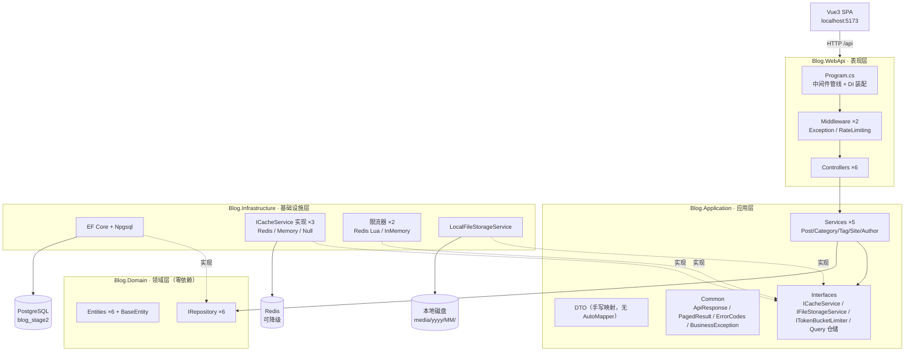
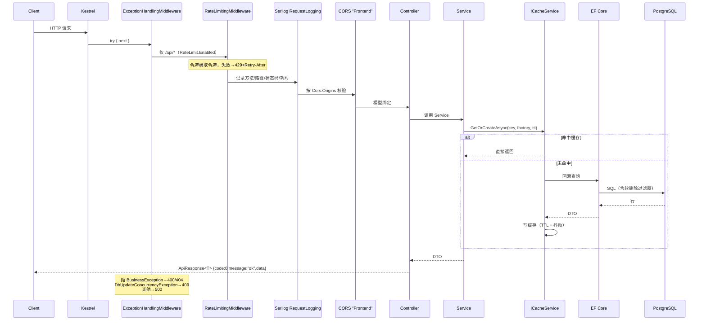
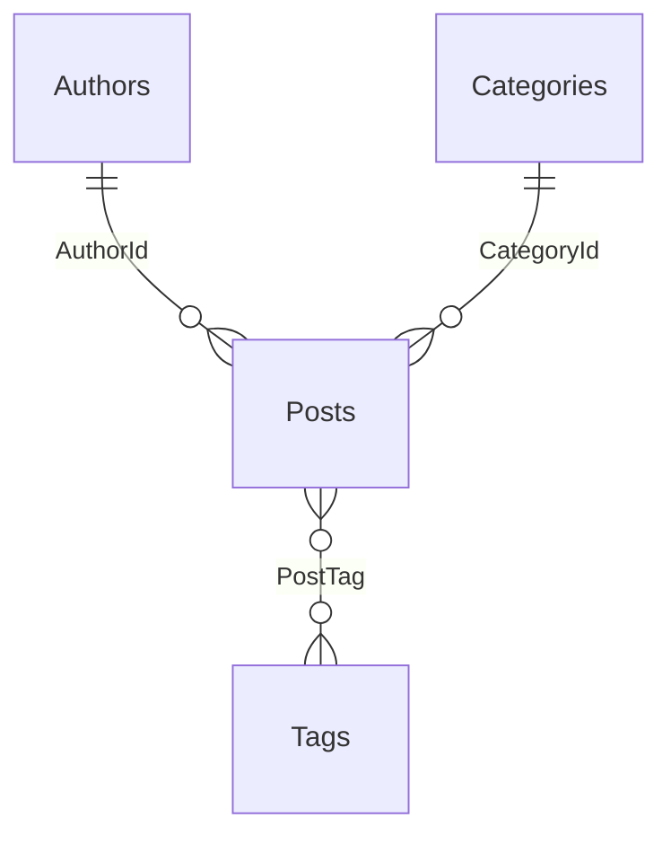
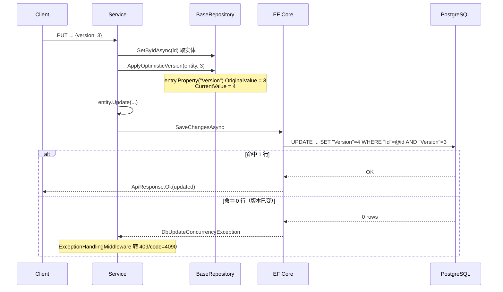
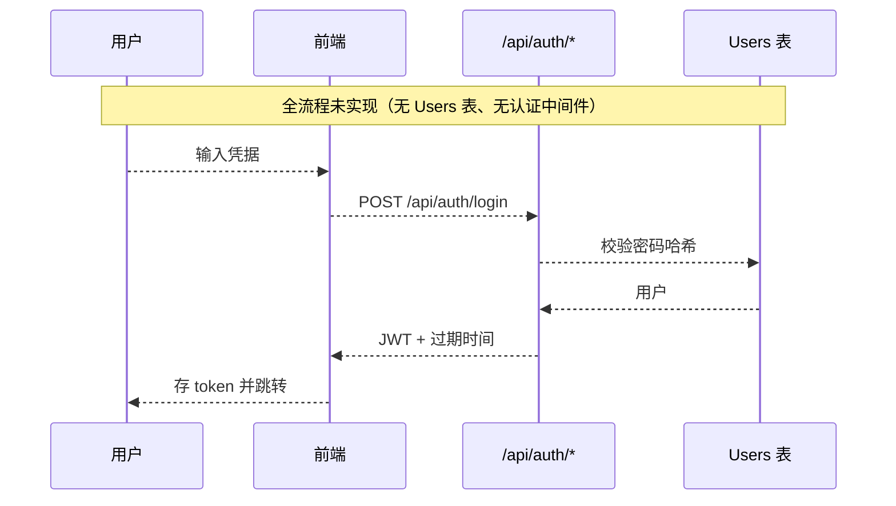

# 博客系统 后端技术文档

> 版本：v2.0 ｜ 编写日期：2026-09-10
> 依据：对 `Blog.Backend/` 实际代码的核查；历史设计见 `docs/03-后端任务拆分与开发顺序.md`、`docs/05-系统架构与设计文档.md`
> 配套文档：[business.md](./business.md) ｜ [frontend.md](./frontend.md) ｜ [suggestion.md](./suggestion.md)
>
> **状态标记**：`[已实现]` ｜ `[计划中]` ｜ `[已废弃]`
> 本仓库**不使用** AutoMapper（`docs/05-系统架构与设计文档.md:15`），DTO 全部手写映射。

---

## 1. 技术栈与版本

版本号取自各 `*.csproj` 与 `dotnet-tools.json`（**精确版本，非范围**）。

### 1.1 运行时与语言

| 项 | 版本 | 依据 |
|---|---|---|
| 目标框架 | `net10.0` | 全部 4 个 csproj 的 `<TargetFramework>` |
| C# 配置 | `Nullable=enable`、`ImplicitUsings=enable` | 同上 |
| .NET SDK（本机实测） | 10.0.401 | 构建输出 `C:\Program Files\dotnet\sdk\10.0.401` |
| EF Core CLI | `dotnet-ef` 10.0.11 | `Blog.Backend/dotnet-tools.json:4-11` |

### 1.2 NuGet 依赖

**Blog.Domain** — 无任何外部依赖（真正的零框架依赖内层）

| 包 | 版本 |
|---|---|
| （无） | — |

**Blog.Application**

| 包 | 版本 |
|---|---|
| Microsoft.Extensions.DependencyInjection.Abstractions | 10.0.11 |

**Blog.Infrastructure**

| 包 | 版本 | 用途 |
|---|---|---|
| Microsoft.EntityFrameworkCore | 10.0.11 | ORM |
| Npgsql.EntityFrameworkCore.PostgreSQL | 10.0.3 | PostgreSQL 提供程序 |
| Microsoft.Extensions.Caching.Memory | 10.0.11 | 内存缓存实现 |
| Microsoft.Extensions.Configuration.Abstractions | 10.0.11 | 配置 |
| Microsoft.Extensions.Configuration.Binder | 10.0.11 | 选项绑定 |
| Microsoft.Extensions.Options.ConfigurationExtensions | 10.0.11 | `Configure<T>` |
| Microsoft.Extensions.Options | 10.0.11 | Options 模式 |
| Microsoft.Extensions.DependencyInjection.Abstractions | 10.0.11 | DI 抽象 |
| Microsoft.Extensions.Logging.Abstractions | 10.0.11 | 日志抽象 |
| StackExchange.Redis | 2.10.1 | Redis 客户端 |

**Blog.WebApi**

| 包 | 版本 | 用途 |
|---|---|---|
| Microsoft.AspNetCore.OpenApi | 10.0.11 | OpenAPI 文档 |
| Microsoft.EntityFrameworkCore.Design | 10.0.11 | 迁移设计期（`PrivateAssets=all`） |
| Serilog.AspNetCore | 10.0.0 | 日志与请求日志 |
| Serilog.Sinks.File | 7.0.0 | 滚动文件 |

### 1.3 数据与中间件组件

| 组件 | 选型 | 状态 | 依据 |
|---|---|---|---|
| 关系数据库 | PostgreSQL | `[已实现]` | `Infrastructure/DependencyInjection.cs:22` `UseNpgsql` |
| 缓存 | Redis（StackExchange.Redis 2.10.1）/ Memory / Null | `[已实现]` | `Infrastructure/DependencyInjection.cs:41-55` |
| 消息队列 | 无 | `[计划中/不需要]` | 检索无 RabbitMQ/Kafka/MassTransit |
| 搜索引擎 | 无（用 SQL `LIKE` 代替） | `[计划中]` | `PostQueryRepository.cs:110-113` |
| 对象存储 | 本地磁盘（非 OSS/S3） | `[已实现]` | `Infrastructure/Files/LocalFileStorageService.cs:8-9` |
| 任务调度 | 无 | `[计划中]` | 检索无 Hangfire/Quartz/IHostedService |
| 邮件服务 | 无 | `[计划中]` | 检索无 MailKit/SMTP 配置 |
| 监控 / APM | 无（仅日志文件） | `[计划中]` | 检索无 Prometheus/OpenTelemetry/App Insights |
| 链路追踪 | 无 | `[计划中]` | 无 traceId 透传实现 |

> 数据库连接串（开发环境）：`Host=localhost;Port=5432;Database=blog_stage2;Username=kky`（`Blog.WebApi/appsettings.Development.json:8-10`）。
> 密码为明文，见 [business.md](./business.md) R6。

---

## 2. 系统架构

### 2.1 分层

整洁架构四层，依赖方向单向向内。解决方案仅含 4 个工程，无测试工程（`Blog.Backend/Blog.Backend.slnx`）。



- 依赖方向与分层职责：`docs/05-系统架构与设计文档.md:27-43`
- 装配入口：`WebApi/Program.cs:42-43`（`AddApplication()` + `AddInfrastructure(configuration)`）
- 服务注册：`Blog.Application/DependencyInjection.cs:12-21`
- 仓储/缓存/限流注册：`Blog.Infrastructure/DependencyInjection.cs:17-67`

> **文档勘误**：`docs/05-系统架构与设计文档.md:44` 写的是 `AddInfrastructureServices`，代码中实际方法名为
> **`AddInfrastructure`**（`Blog.Infrastructure/DependencyInjection.cs:17`）。

### 2.2 读写仓储分离

| 类型 | 接口 | 实现 | 注册 |
|---|---|---|---|
| 写侧 | `IBaseRepository<T>` + 各实体扩展 | `BaseRepository<T>` 等 | `DependencyInjection.cs:28-33` |
| 读侧 | `IPostQueryRepository` | `PostQueryRepository` | `DependencyInjection.cs:36` |
| 读侧 | `ICategoryQueryRepository` / `ITagQueryRepository` | `TaxonomyQueryRepository`（**同一个类注册两次**） | `DependencyInjection.cs:37-38` |
| 读侧 | `ISiteQueryRepository` | `SiteQueryRepository` | `DependencyInjection.cs:39` |

读侧专用仓储做投影查询（`AsNoTracking` + `Select` 到 DTO），避免写侧实体被追踪。

### 2.3 部署架构

| 项 | 当前状态 |
|---|---|
| 部署方式 | `[计划中]` 仓库内无 Dockerfile / compose / Nginx 配置 / CI 配置 |
| 运行进程 | 单进程 Kestrel（`Blog.WebApi.exe`） |
| 监听地址 | `http://localhost:5131`（`Properties/launchSettings.json:8`）；`https` profile 为 7277 |
| 前端托管 | 开发期 Vite dev server 5173 + 代理 `/api` → 5131；生产托管方案 TODO |
| 反向代理 | `[计划中]` 但限流已支持 `X-Forwarded-For`（见 §7.4） |
| 数据库/Redis | Docker 容器（本机 `pgsql`、`redis`），非仓库资产 |

### 2.4 请求流与数据流



中间件注册顺序（**顺序敏感**）：`WebApi/Program.cs:52-67`

| 序 | 中间件 | 行号 |
|---|---|---|
| 1 | `ExceptionHandlingMiddleware` | 52 |
| 2 | `RateLimitingMiddleware` | 55 |
| 3 | `UseSerilogRequestLogging` | 58 |
| 4 | `UseCors("Frontend")` | 63 |
| 5 | `UseAuthorization` | 65 |
| 6 | `MapControllers` | 67 |

> 注意：`UseAuthorization()`（65 行）**之前没有 `UseAuthentication()`**，也没有注册认证方案 → 该调用当前是空操作。
> 异常中间件位于最外层，因此限流抛出的异常也能被统一转为 `ApiResponse`。

---

## 3. 数据库设计

### 3.1 表清单

迁移：`Blog.Infrastructure/Persistence/Migrations/20260906040849_InitCreate.cs`（**唯一一个迁移**）。

| # | 表 | 说明 | 迁移行号（`name:` 所在行） |
|---|---|---|---|
| 1 | `Authors` | 博主资料 | `InitCreate.cs:17` |
| 2 | `Categories` | 分类 | `:36` |
| 3 | `SiteConfigs` | 站点配置 KV | `:52` |
| 4 | `SocialLinks` | 社交链接 | `:70` |
| 5 | `Tags` | 标签 | `:90` |
| 6 | `Posts` | 文章 | `:106` |
| 7 | `PostTag` | 文章↔标签 多对多连接表 | `:143` |

### 3.2 公共列（`BaseEntity`）

所有业务表共有，定义在 `Blog.Domain/Entities/Base/BaseEntity.cs:9-20`：

| 列 | 类型 | 说明 |
|---|---|---|
| `Id` | `Guid` (PK) | `init` 只读 |
| `CreatedAt` | `DateTimeOffset` | |
| `IsDeleted` | `bool` | 软删除标记 |
| `DeletedAt` | `DateTimeOffset?` | |
| `Version` | `int` | 乐观锁版本号，默认 1，作并发令牌 |

`Version` 被统一标记为并发令牌：`BlogDbContext.cs:109-114`（遍历所有实体类型查找 `Version` 属性）。

### 3.3 关系与删除行为



| 关系 | 外键 | 删除行为 | 依据 |
|---|---|---|---|
| Post → Author | `Posts.AuthorId` | `SetNull` | `BlogDbContext.cs:44-47` |
| Post → Category | `Posts.CategoryId` | `SetNull` | `BlogDbContext.cs:49-52` |
| Post ↔ Tag | `PostTag` | 默认（级联连接行） | `BlogDbContext.cs:54-55` |

> `Posts.CategoryId` 为 `Guid?`（可空），与 `SetNull` 语义一致（`Post.cs:25`）。
> `Posts.AuthorId` 是 **非空** `Guid`（`Post.cs:14`）却配置了 `SetNull` —— 因为软删除不会真正删行，
> 该不一致目前不会触发；但若将来做硬删除会抛错。**已登记为技术债**，见 §11。

### 3.4 索引

| 索引 | 表 | 列 | 用途 | 依据 |
|---|---|---|---|---|
| `IX_Posts_PublishedAt` | Posts | `PublishedAt` | 列表/归档按发布时间排序 | `BlogDbContext.cs:40` |
| `IX_Posts_CategoryId` | Posts | `CategoryId` | 按分类过滤 | `:41` |
| `IX_Posts_IsDeleted_PublishedAt` | Posts | `IsDeleted, PublishedAt` | 公开列表复合过滤 | `:42` |
| `IX_Posts_AuthorId` | Posts | `AuthorId` | EF 自动生成 | `InitCreate.cs`（`FK_Posts_Authors_AuthorId` 见 `:129`） |
| `IX_Categories_Name` | Categories | `Name` **唯一+过滤** | 未删除时名称唯一 | `BlogDbContext.cs:83` |
| `IX_Tags_Name` | Tags | `Name` **唯一+过滤** | 未删除时名称唯一 | `:75` |
| `IX_SiteConfigs_Key` | SiteConfigs | `Key` **唯一+过滤** | 配置 Key 唯一 | `:102` |
| `IX_PostTag_TagsId` | PostTag | `TagsId` | EF 自动生成 | `InitCreate.cs`（索引段落起于 `:190`） |

**过滤唯一索引**写法：`HasFilter("\"IsDeleted\" = false")` —— 解决「软删除后无法重建同名数据」问题
（`docs/01-需求分析与实现方案.md:171`）。PostgreSQL 的部分索引语法，注意引号转义。

### 3.5 软删除与全局查询过滤器

6 个实体全部配置 `HasQueryFilter(e => !e.IsDeleted)`：`BlogDbContext.cs:57, 67, 76, 84, 93, 103`。

- 删除走 `BaseEntity.Delete()`（`BaseEntity.cs:26-30`）打标记，由 `UnitOfWork` 统一提交
- `BaseRepository.Remove()` 实现为「标记 + Update」（`BaseRepository.cs:53-57`）
- **注意**：`QueryFilter` 是全局的，因此 `includeUnpublished` 等管理端查询**也看不到已软删除记录**（符合预期）

### 3.6 种子数据

`HasData` 固定主键（`BlogDbContext.cs:119-144`），由 `Database.Migrate()` 在启动时应用（`Program.cs:70-75`）。

| 实体 | 主键 | 内容 |
|---|---|---|
| Author | `6f2a1b3c-...-000000000001` | kky / kky@example.com / 「coding slayer」 |
| SiteConfig ×3 | `...000000000010/11/12` | SiteName、HeroSubtitles、FoundingDate |
| SocialLink ×2 | `...000000000020/21` | GitHub、Bilibili |

### 3.7 迁移策略

| 项 | 现状 |
|---|---|
| 迁移数量 | 1（`20260906040849_InitCreate`） |
| 应用方式 | 启动时自动 `dbContext.Database.Migrate()`（`Program.cs:74`） |
| 生成命令 | `dotnet ef migrations add <Name>`（`dotnet-ef` 10.0.11，见 `dotnet-tools.json`） |
| 回滚策略 | `[计划中]` 无自动回滚；`Down()` 由 EF 生成但未演练 |
| 生产变更流程 | `TODO`（无 CI/CD，见 §10） |
| 数据回填 | `[计划中]` 无独立回填脚本机制 |

> **风险**：启动时自动迁移在多实例部署下会并发争抢迁移锁（EF 有 advisory lock 保护，但生产建议改为独立发布步骤）。

---

## 4. 缓存策略

### 4.1 实现选型

`ICacheService` 三个实现通过配置切换（`Infrastructure/DependencyInjection.cs:46-55`）：

| 实现 | 何时启用 | 文件 |
|---|---|---|
| `RedisCacheService` | `Cache:Enabled=true` 且 `Cache:Provider=Redis` | `Caching/RedisCacheService.cs` |
| `MemoryCacheService` | `Cache:Enabled=true` 且 Provider 非 Redis | `Caching/MemoryCacheService.cs` |
| `NullCacheService` | `Cache:Enabled=false`（完全旁路） | `Caching/NullCacheService.cs` |

开发环境配置：`Provider=Redis`、`RedisConnection=localhost:6379`（`appsettings.Development.json:11-18`）。
**默认值**（`appsettings.json` 无 `Cache` 节 → 使用 `CacheOptions` 类默认）：`Enabled=true`、`Provider=Memory`（`CacheOptions.cs:9-15`）。

### 4.2 Key 设计

规范：`blog:{module}:{query}`（`Blog.Application/Interfaces/CacheKeys.cs:6`）。

| Key 常量 | 实际形态 | 文件行 |
|---|---|---|
| `PostsPrefix` | `blog:posts:`（前缀，用于批量失效） | `:11` |
| `PostList(query)` | `blog:posts:list:p{page}s{size}c{categoryId}t{tagId}k{keywordHash}u{0\|1}` | `:14-15` |
| `PostDetail(id)` | `blog:posts:detail:{id}` | `:17` |
| `PostArchives` | `blog:posts:archives` | `:19` |
| `Categories` | `blog:categories` | `:21` |
| `Tags` | `blog:tags` | `:22` |
| `SiteConfig` | `blog:site:config` | `:24` |
| `SiteSocialLinks` | `blog:site:social`（**仅可见项**） | `:25` |
| `SiteSocialLinksAll` | `blog:site:social:all`（**含隐藏项，管理端专用**） | `:27` |
| `SiteStats` | `blog:site:stats` | `:28` |

关键词做 SHA256 前 16 位摘要，避免超长/特殊字符污染 key（`CacheKeys.cs:31-37`）。

### 4.3 TTL 一览

| 数据 | TTL | 依据 |
|---|---|---|
| 文章列表 | 5 分钟 | `PostService.cs:13` |
| 文章详情 | 10 分钟 | `:14` |
| 归档 | 30 分钟 | `:15` |
| 分类 / 标签 | 30 分钟 | `CategoryService.cs:12`（同 TagService） |
| 站点配置 / 社交链接 | 1 小时 | `SiteService.cs:12` |
| 站点统计 | 10 分钟 | `:13` |
| 空值哨兵 | 默认 2 分钟（`Cache:NullTtl`） | `CacheOptions.cs:18` |

TTL 抖动：`Cache:TtlJitterRatio` 默认 `0.2`（±20%），实现见 `RedisCacheService.ApplyJitter`（`:172-175`）。

### 4.4 三防与降级

| 问题 | 措施 | 配置项 | 实现 |
|---|---|---|---|
| 缓存穿透 | 空结果写入 `null` 哨兵，用更短 TTL | `NullTtl` | `RedisCacheService.cs:69`（`value is null ? _options.NullTtl : ttl`） |
| 缓存击穿 | key 级互斥重建，超时直接回源不阻塞 | `LockWaitTimeout`（默认 3s） | `RedisCacheService.GetOrCreateAsync`（`:115`） |
| 缓存雪崩 | TTL 随机抖动 ±20% | `TtlJitterRatio` | `:172-175` |
| Redis 故障 | 捕获 `RedisConnectionException`/`RedisTimeoutException`，冷却期内不重试，回源 DB | — | `RateLimitingMiddleware.cs:55-66`（限流侧）；缓存侧同类降级 |

### 4.5 一致性策略

采用 **Cache-Aside + 删除失效**（非更新缓存）。

| 写操作 | 失效的 Key | 依据 |
|---|---|---|
| 文章 创建/更新/删除/发布 | `blog:posts:*`（前缀）+ `blog:site:stats` | `PostService.cs:200-201` |
| 分类 CRUD | `blog:categories` + `blog:site:stats` + `blog:posts:*` | `CategoryService.cs:105-109` |
| 标签 CRUD | 同上（`blog:tags`） | `TagService` |
| 站点配置更新 | `blog:site:config` | `SiteService.UpdateConfigAsync` |
| 社交链接保存 | `blog:site:social` + `blog:site:social:all` | `SiteService.SaveSocialLinksAsync` |
| 社交链接删除 | 同上 | `SiteService.DeleteSocialLinkAsync` |
| 作者资料更新 | `blog:posts:*` + `blog:site:stats` | `AuthorService.UpdateAsync` |

> **详情页浏览量的一致性**：详情接口每次调用都会 `IncrementViewCount` 并**回写缓存**（`PostService.cs:54-68`），
> 因此浏览量在缓存 TTL 内是「缓存值 + 后续自增」的近似值，最终一致。

---

## 5. 认证与授权

### 5.1 现状：完全未实现

| 项 | 状态 | 证据 |
|---|---|---|
| 认证方案（Session/JWT/OAuth2） | `[计划中]` | 检索 `Authorize|Authentication|Jwt|Bearer|Identity|AddAuthorization` 在 `Blog.Backend/**/*.cs` 无业务命中 |
| `AddAuthentication` 注册 | 不存在 | `Program.cs:29-43` 的 DI 段落无调用 |
| `UseAuthentication()` | 不存在 | `Program.cs:52-67` 仅 `UseAuthorization()`（65 行，空操作） |
| 控制器 `[Authorize]` | 全无 | 6 个控制器均无特性（`Controllers/*.cs`） |
| 密码存储 | 无字段 | `Author.cs:7-10` 只有展示字段 |
| 用户/角色表 | 不存在 | `BlogDbContext.cs:14-19` 仅 6 个业务 DbSet |
| 前端 token 处理 | 无 | 检索 `token|login|logout` 在 `Blog.FrontEnd/src` 无业务命中 |
| 前端路由守卫 | 无 | `router/index.ts` 无 `beforeEach` |

**当前权限等价于：所有接口对所有人开放。**

### 5.2 计划中的扩展点（需求已预留，未选型）

`docs/01-需求分析与实现方案.md:168` 原文：
> 「**无认证模块**：本期管理类接口（写操作）不做用户体系，作为已知限制记录；后续可加 JWT（文档已预留扩展点）」

`docs/02-API接口清单.md:79-80` 已预留错误码：

| code | HTTP | 含义 |
|---|---|---|
| 4010 | 401 | 未认证（预留） |
| 4030 | 403 | 无权限（预留） |

> 这两个码在 `Blog.Application/Common/ErrorCodes.cs` 中**尚未定义**（该文件只到 5000，见 §8.2）。

### 5.3 RBAC/ABAC

`[计划中]` 无角色、无权限、无策略。若未来引入，建议从「单角色（Admin）+ 一个 claim」起步（见 §11 P0）。

---

## 6. 中间件与横切

| 组件 | 类型 | 实现位置 | 说明 |
|---|---|---|---|
| 异常处理 | 自定义中间件 | `WebApi/Middleware/ExceptionHandlingMiddleware.cs` | 见 §8.3 |
| 限流 | 自定义中间件 | `WebApi/Middleware/RateLimitingMiddleware.cs` | 见 §7.4 |
| 请求日志 | Serilog | `Program.cs:58-61` | 模板含方法/路径/状态码/耗时 |
| 文件日志 | Serilog Sink | `Program.cs:23-27` | `logs/blog-.log`，按天滚动，保留 30 天 |
| 慢查询 | EF 拦截器 | `Infrastructure/Persistence/Interceptors/SlowQueryInterceptor.cs` | 阈值 `TimeSpan.FromMilliseconds(500)`（`:12`），超阈值 `LogWarning` 并输出 SQL |
| 文件存储 | 服务 | `Infrastructure/Files/LocalFileStorageService.cs` | 见 §6.2 |
| CORS | ASP.NET Core | `Program.cs:33-40` | 策略名 `Frontend`，源来自 `Cors:Origins`，默认 `http://localhost:5173` |
| 缓存 | 服务 | `Caching/*` | 见 §4 |
| **消息队列** | — | — | `[计划中]` 不存在 |
| **分布式追踪** | — | — | `[计划中]` 无 traceId 透传 |
| **健康检查** | 极简 | `Program.cs:68` | `GET /` 返回 `{name:"Blog API", status:"running"}` |

### 6.1 限流细节（§7.4 详述规则）

- 桶算法：Redis Lua 脚本原子「补币 + 取币」；Redis 不可用时降级 `InMemoryTokenBucketLimiter`
- `RateLimit.FallbackToMemory=false` 时故障**直接放行**（保可用性优先）
- 粒度由 `RateLimitRule.Granularity` 决定：`Ip` / `Global` / `Endpoint`（`RateLimitOptions.cs:55`）
   - **注意**：`RateLimitingMiddleware` 构造桶 key 时读取 `X-Forwarded-For` 首段实现 IP 粒度，具体实现见 `BuildBucketKey`
- 仅对 `/api` 前缀生效（`RateLimitingMiddleware.cs:35`）

### 6.2 文件存储策略

| 项 | 值 | 依据 |
|---|---|---|
| 存储根 | `FileStorage:Root` = `media`（相对工作目录） | `appsettings.Development.json`、`LocalFileStorageService.cs` |
| 目录结构 | `{Root}/yyyy/MM/{guid:N}{ext}` | `LocalFileStorageService.cs:49-52` |
| 扩展名白名单（11 种） | `.png .jpg .jpeg .gif .webp .svg .ico .mp4 .webm .pdf .zip` | `:13-17` |
| 体积上限 | 应用层 10MB（`MaxFileSize`）；请求体 50MB | `FilesController.cs:27` + `FileStorageOptions.MaxFileSize` |
| 读取 | `GET /api/files/{**path}`，`ResponseCache` 86400s，支持 Range | `FilesController.cs:50-60` |
| 目录穿越防护 | `TryResolveSafePath` | `LocalFileStorageService.cs:54` |
| 静态文件中间件 | **未启用**（有意为之） | 注释 `FilesController.cs:10`、`LocalFileStorageService.cs:9` |
| 生产替换 OSS | `[计划中]` 抽象为 `IFileStorageService` 以便替换 | `docs/02-API接口清单.md:66` |

---

## 7. API 设计

### 7.1 风格与约定

- 风格：**REST**（非 GraphQL）。控制器路由前缀 `/api`，文件接口独立前缀 `/api/files`（原设计为 `/media`，见 [suggestion.md](./suggestion.md) Q6）
- 版本化：`[计划中]` **无 API 版本号**（无 `/v1`、无 `api-version` 头）
- 统一响应体：`{ code, message, data }`（`ApiResponse.cs:6-25`）；成功 `code=0`、`message="ok"`
- 分页：请求 `page`（从 1 起）/ `pageSize`；响应 `PagedResult<T>` = `{ items, page, pageSize, total, totalPages }`（`Common/PagedResult.cs:4-17`）
  - **注意字段名是 `total` 而非 `totalCount`**；`totalPages` 为**只读计算属性**
- 时间格式：`DateTimeOffset` → ISO 8601（`System.Text.Json` Web 默认）
- JSON 命名：camelCase（`JsonSerializerDefaults.Web`，`ExceptionHandlingMiddleware.cs:14`）
- 写操作并发控制：请求体带 `version`（int）

### 7.2 接口清单

#### Posts — `Blog.WebApi/Controllers/PostsController.cs`

| # | 方法 | 路由 | 行号 | 说明 |
|---|---|---|---|---|
| 1 | GET | `/api/posts` | 20-41 | 分页列表；query：`page,pageSize,categoryId,tagId,keyword,includeUnpublished` |
| 2 | GET | `/api/posts/{id:guid}` | 44-50 | 详情；**每次调用浏览量 +1** |
| 3 | GET | `/api/posts/archives` | 53-58 | 按年月分组 |
| 4 | GET | `/api/posts/search` | 61-71 | `keyword` 必填，复用 `GetPagedAsync` |
| 5 | POST | `/api/posts` | 73-78 | 创建 |
| 6 | PUT | `/api/posts/{id:guid}` | 80-85 | 更新（body 带 `version`） |
| 7 | POST | `/api/posts/{id:guid}/publish` | 88-97 | query：`version,publish`；发布/下架合并为一个端点 |
| 8 | DELETE | `/api/posts/{id:guid}` | 99-104 | query：`version`；软删除 |

（特性行号：20 / 44 / 53 / 61 / 73 / 80 / 88 / 99；实现方法紧随其后。）

> 端点 2 与 3/4 存在路由歧义风险：`{id:guid}` 约束使其能与 `archives`/`search` 区分，**顺序依赖**于 ASP.NET Core 的路由匹配（字面段优先）。

#### Categories — `Controllers/CategoriesController.cs`

| # | 方法 | 路由 | 行号 |
|---|---|---|---|
| 1 | GET | `/api/categories` | 21 |
| 2 | POST | `/api/categories` | 28 |
| 3 | PUT | `/api/categories/{id:guid}` | 35 |
| 4 | DELETE | `/api/categories/{id:guid}?version=` | 42 |

#### Tags — `Controllers/TagsController.cs`（与 Categories 同构）

| # | 方法 | 路由 | 行号 |
|---|---|---|---|
| 1 | GET | `/api/tags` | 20 |
| 2 | POST | `/api/tags` | 27 |
| 3 | PUT | `/api/tags/{id:guid}` | 34 |
| 4 | DELETE | `/api/tags/{id:guid}?version=` | 41 |

#### Site — `Controllers/SiteController.cs`

| # | 方法 | 路由 | 行号 | 说明 |
|---|---|---|---|---|
| 1 | GET | `/api/site/config` | 20 | 聚合 4 项 + `versions` 字典 |
| 2 | PUT | `/api/site/config` | 27 | 单 key 写入，body `{key,value,version}` |
| 3 | GET | `/api/site/social-links?includeHidden=` | 36 | `includeHidden=true` 供管理端 |
| 4 | PUT | `/api/site/social-links` | 45 | 批量 upsert |
| 5 | DELETE | `/api/site/social-links/{id:guid}?version=` | 53 | 软删除 |
| 6 | GET | `/api/site/stats` | 61 | Footer 统计 |

#### Authors — `Controllers/AuthorsController.cs`

| # | 方法 | 路由 | 特性行号 | 实现行号 |
|---|---|---|---|---|
| 1 | GET | `/api/authors` | 20 | 21-26 |
| 2 | GET | `/api/authors/{id:guid}` | 28 | 29-36 |
| 3 | PUT | `/api/authors/{id:guid}` | 39 | 40-44 |

#### Files — `Controllers/FilesController.cs`

| # | 方法 | 路由 | 特性行号 | 实现行号 | 备注 |
|---|---|---|---|---|---|
| 1 | POST | `/api/files/upload` | 26-27 | 28-48 | multipart，`file` 字段；`[RequestSizeLimit(50MB)]` |
| 2 | GET | `/api/files/{**path}` | 50-51 | 52-61 | `[ResponseCache(Duration=86400)]`，`enableRangeProcessing: true` |

### 7.3 乐观锁机制（本项目核心约定）

**不走 `[Timestamp]`/`rowversion`**，而是「int 版本号 + 手工 SQL 条件」，理由是可跨数据库（`docs/01:131-140`）。



实现：`BaseRepository.ApplyOptimisticVersion`（`BaseRepository.cs:66-74`），校验 `expectedVersion >= 1` 否则抛 `ArgumentOutOfRangeException`。

**各服务的一致性写法**：

| 服务 | 对 version 非法的处理 |
|---|---|
| `CategoryService` / `TagService` | 先 `ValidateVersion` → `BusinessException(4001)`（`CategoryService.cs:95-100`） |
| `SiteService.SaveSocialLinksAsync` / `DeleteSocialLinkAsync` | 显式校验 → 4001 |
| `SiteService.UpdateConfigAsync` | **先查 Key 是否存在**：不存在→新增（忽略 version）；存在→校验 version≥1 → 4001 |
| `PostService` | `ValidateVersion`（`PostService.cs:155`） |

> **浏览量是唯一例外**：`IPostRepository.IncrementViewCountAsync` 用 `ExecuteUpdateAsync` 原子自增，
> 绕过变更追踪与乐观锁，避免高频并发下频繁 409（`docs/01:137-139`、`IPostRepository.cs:9`）。

### 7.4 限流规则（开发环境实际配置）

来源：`Blog.WebApi/appsettings.Development.json:23-52`。**按声明顺序匹配，命中即停**。

| 序 | 规则名 | 路径前缀 | 方法 | 粒度 | 容量 | 速率 |
|---|---|---|---|---|---|---|
| 1 | `search` | `/api/posts/search` | GET | Ip | 20 | 2/s |
| 2 | `write` | `/api` | POST | Ip | 30 | 2/s |
| 3 | `default` | `/api` | （空=全部） | Ip | 120 | 20/s |

- 总开关 `RateLimit.Enabled=true`；降级开关 `FallbackToMemory=true`
- 触发结果：HTTP **429** + `code=4091` + `Retry-After` 头（`RateLimitingMiddleware.cs:68-78`）
- 仅 `/api` 前缀受管（`:35`）
- **注意**：`write` 规则只匹配 `POST`，因此 `PUT`/`DELETE` 写操作**只受 default 规则（120/20s）约束**

### 7.5 错误码总表

来源：`Blog.Application/Common/ErrorCodes.cs:30-52` 与 `Middleware/ExceptionHandlingMiddleware.cs:34-47`。

| code | HTTP | 常量 | 触发场景 |
|---|---|---|---|
| 0 | 200 | `Ok` | 成功 |
| 4001 | 400 | `InvalidArgument` | 参数校验失败 |
| 4002 | 400 | `BusinessRule` | 业务规则不满足（如分类重名） |
| 4040 | 404 | `NotFound` | 资源不存在 |
| 4090 | 409 | `ConcurrencyConflict` | 乐观锁冲突（`DbUpdateConcurrencyException`） |
| 4091 | 429 | `RateLimited` | 触发限流 |
| 5000 | 500 | `InternalError` | 未处理异常 |
| 4010 | 401 | — | **`[计划中]` 未认证**，`ErrorCodes.cs` 中尚未定义 |
| 4030 | 403 | — | **`[计划中]` 无权限**，同上 |

> **文档勘误**：`docs/02-API接口清单.md:78` 写「4001 | 400 | 参数校验失败」，但该文档**漏记了 4002**；
> 代码中 4002 是实际在用的（分类/标签重名，`CategoryService.cs:48`）。

---

## 8. 核心流程时序图

### 8.1 发文（创建）

见 [business.md](./business.md) §4.2。补充后端要点：

- 作者归属：`ResolveDefaultAuthorIdAsync`（`PostService.cs:188`）—— **无认证，取首个作者**，这是 R1/R9 的直接体现
- 缓存失效：`RemoveByPrefixAsync(blog:posts:)` + `RemoveAsync(blog:site:stats)`（`:200-201`）

### 8.2 登录 `[计划中]`



### 8.3 评论 `[已实现，站外]`

后端**无参与**。见 [business.md](./business.md) §4.5。

### 8.4 搜索

见 [business.md](./business.md) §4.6。后端实现要点（`PostQueryRepository.cs:105-116`）：

```
p.Title.ToLower().Contains(kw)
|| p.Content.ToLower().Contains(kw)
|| (p.Category != null && p.Category.Name.ToLower().Contains(kw))
|| p.Tags.Any(t => t.Name.ToLower().Contains(kw))
```

- 每个关键词转小写后 `Contains`，生成 `LIKE '%kw%'`
- `Tags.Any(...)` 生成 `EXISTS` 子查询
- **无相关度排序**，仅按 `PublishedAt` 倒序（`:33`）
- 上限：`pageSize` 被 `Normalize` 限制（`PostService.cs:204`）

---

## 9. 已实现功能清单

| 层 | 能力 | 状态 |
|---|---|---|
| Domain | 6 实体 + BaseEntity（软删除、版本号）+ 6 仓储接口 | `[已实现]` |
| Domain | 领域行为：`Publish/Unpublish`（幂等）、`Update`、`Delete`、`RefreshDerivedFields` | `[已实现]` |
| Application | 5 个 Service + 手写 DTO 映射 | `[已实现]` |
| Application | 统一响应 / 分页 / 错误码 / 业务异常 | `[已实现]` |
| Infrastructure | EF Core + Npgsql + 全局查询过滤器 + 软删除 | `[已实现]` |
| Infrastructure | 读写仓储分离（写侧实体 + 读侧投影） | `[已实现]` |
| Infrastructure | 三防缓存（Redis/Memory/Null 可切换） | `[已实现]` |
| Infrastructure | 令牌桶限流（Redis Lua + 内存降级） | `[已实现]` |
| Infrastructure | 本地文件存储（白名单 + 体积限制 + 防穿越） | `[已实现]` |
| Infrastructure | 慢查询拦截（>500ms） | `[已实现]` |
| Infrastructure | 迁移 + HasData 种子 | `[已实现]` |
| WebApi | 6 控制器 / 24 个端点 | `[已实现]` |
| WebApi | 全局异常 → HTTP 状态码映射 | `[已实现]` |
| WebApi | Serilog 请求日志 + 滚动文件 | `[已实现]` |
| WebApi | CORS 策略 | `[已实现]` |
| WebApi | OpenAPI（仅 Development） | `[已实现]` `Program.cs:47-50` |

### 9.1 端点计数

6 个控制器共 **27** 个 action（`grep -c '\[Http'` 实测）：

| 控制器 | 行数 | 端点数 |
|---|---|---|
| `PostsController` | 106 | 8 |
| `SiteController` | 68 | 6 |
| `CategoriesController` | 48 | 4 |
| `TagsController` | 48 | 4 |
| `AuthorsController` | 44 | 3 |
| `FilesController` | 62 | 2 |
| **合计** | **376** | **27** |

---

## 10. 测试、安全、性能、CI/CD、可观测性

### 10.1 测试

| 项 | 状态 | 证据 |
|---|---|---|
| 单元测试项目 | `[计划中]` **不存在** | `Blog.Backend.slnx` 仅 4 个工程；全仓库检索无 `*Test*` 项目 |
| 集成测试 | `[计划中]` 不存在 | — |
| 测试框架（xUnit/NUnit/MSTest） | `[计划中]` 未引入 | csproj 无测试包 |
| 接口冒烟测试 | 手工 curl | 无脚本化产物 |
| 前端测试（Vitest/Playwright） | `[计划中]` 不存在 | `package.json` 无测试依赖与 test script |
| 回归基线 | 依赖人工 | 见 `business.md` R7 |

> 这是当前**最大的工程风险**：本文档所描述的所有行为均无自动化测试保护。

### 10.2 安全

见 [business.md](./business.md) §8.2。后端侧补充：

| 项 | 状态 | 说明 |
|---|---|---|
| 传输加密 | `[计划中]` | 仅有 HTTP profile 在用（5131）；https profile（7277）存在但未启用 |
| 认证 | `[计划中]` | §5.1 |
| 授权 | `[计划中]` | 同上 |
| 输入校验 | `[部分实现]` | 主要靠 Service 层手工校验 + EF 属性长度限制（`DbContext` 的 `HasMaxLength`） |
| 输出编码 | `[已实现]` | 前端 DOMPurify；后端返回 JSON |
| 敏感信息脱敏 | `[已实现]` | 无密码等敏感字段需要脱敏 |
| 依赖漏洞扫描 | `[计划中]` | 无 CI，无 `dotnet list package --vulnerable` 例行检查 |
| 审计日志 | `[部分实现]` | Serilog 记录写操作请求，但**不含操作人身份**（无认证） |

### 10.3 性能

| 项 | 状态 | 说明 |
|---|---|---|
| 索引 | `[已实现]` | §3.4 |
| 投影查询 | `[已实现]` | 读侧仓储 `Select` 到 DTO，避免拉全字段 |
| 分页 | `[已实现]` | `Skip/Take`，`pageSize` 有上限归一化 |
| 缓存 | `[已实现]` | §4 |
| N+1 | `[部分实现]` | 列表查询需要 `Select` 内联 `Tags`；未做查询计划验证 |
| 搜索性能 | **`[待优化]`** | `ToLower().Contains` 无法用索引 |
| 计数查询 | `[待优化]` | `SiteQueryRepository.GetStatsAsync` 多次独立 `CountAsync`/`SumAsync` |
| 压测 / 基准 | `[计划中]` | 无 k6/JMeter 产物 |

### 10.4 CI/CD

| 项 | 状态 |
|---|---|
| CI 流水线（GitHub Actions / GitLab CI） | `[计划中]` 不存在 |
| 构建脚本 | 无（`Blog.WebApi.csproj` 内有构建前 `taskkill` 的 hack，见下） |
| 容器化 | `[计划中]` 无 Dockerfile |
| 自动部署 | `[计划中]` 无 |
| 版本发布（tag/变更日志） | `[计划中]` 无 |

> **注意 `Blog.WebApi.csproj` 的 `KillRunningBlogWebApi` Target**：构建前执行 `taskkill /F /IM Blog.WebApi.exe`
> 以释放 DLL 占用。这是**本地开发便利**，但在共享/CI 机器上会误杀他人进程，属于技术债（见 §11）。

### 10.5 可观测性

| 能力 | 状态 | 说明 |
|---|---|---|
| 结构化日志 | `[部分实现]` | Serilog 文本模板，非 JSON 结构化输出 |
| 日志落盘 | `[已实现]` | `logs/blog-.log`，按天滚动，保留 30 天 |
| 慢查询告警 | `[已实现]` | `LogWarning` 输出 SQL 与耗时 |
| 缓存命中率 | `[计划中]` | `docs/01:91` 提出「CacheService 内部计数日志」，代码中**未见实现** |
| 限流触发记录 | `[已实现]` | `LogWarning` 含规则名/Key/路径（`RateLimitingMiddleware.cs:70-71`） |
| 健康检查端点 | `[部分实现]` | 仅 `GET /`，不含 DB/Redis 依赖探测 |
| 指标（Prometheus 等） | `[计划中]` | 无 |
| 分布式追踪 | `[计划中]` | 无 traceId；跨服务调用链无法串联 |
| 告警 | `[计划中]` | 无 |

---

## 11. 未来拓展与改善（分优先级）

> 成本以「熟悉本仓库的 1 名开发者」为基准；风险指对现有数据/接口的破坏面。

### P0 — 阻塞公开上线

| # | 项 | 理由 | 成本 | 风险 |
|---|---|---|---|---|
| P0-1 | **认证 + 授权** | 写接口当前完全开放（§5.1），任何访客可删文章、改站点配置、上传文件。`docs/01:168` 已将其列为待补 | 中：`Users` 表 + 迁移、JWT 签发/校验、`AddAuthentication`+`UseAuthentication`、控制器加 `[Authorize]`、`ErrorCodes` 补 4010/4030 | 中：`Author` 语义要从「资料」升级为「账号」，影响 `/api/authors` 与前端资料页；需处理种子数据迁移 |
| P0-2 | **草稿泄露修复** | `includeUnpublished=true` 是公开参数（`PostsController.cs:27`），匿名可读草稿。属 P0-1 的子集，但即使不做完整认证也应先加开关 | 低（与 P0-1 一并解决） | 低 |
| P0-3 | **建立最小测试网** | 无任何测试（§10.1），后续所有重构都无安全网 | 中：新增 `Blog.Tests` 工程 + 覆盖 Service 层乐观锁/缓存失效/软删除关键路径 | 低（纯增量） |
| P0-4 | **敏感配置外置** | 连接串明文入库（`appsettings.Development.json:8-10`） | 低：User Secrets / 环境变量 / Key Vault | 低 |

### P1 — 重要，不阻塞上线

| # | 项 | 理由 | 成本 | 风险 |
|---|---|---|---|---|
| P1-1 | **搜索升级为全文检索** | `ToLower().Contains` 全表扫描且无相关度排序（§7.5 / `PostQueryRepository.cs:110-113`） | 中：PostgreSQL `tsvector` + GIN 索引（需 `zhparser` 处理中文），或引入 Meilisearch | 中：需数据回填迁移；中文分词配置有学习成本 |
| P1-2 | **浏览量污染修复** | 后台取 version 就 +1（`business.md` R2） | 低：新增「只读详情（不计数）」端点或 `?countView=false`，供管理端使用 | 低 |
| P1-3 | **限流规则补全** | `write` 规则只匹配 POST，`PUT/DELETE` 仅受 default 约束（§7.4） | 极低：配置项调整 | 低 |
| P1-4 | **缓存命中率可观测** | 原始需求提出但未实现（§10.5） | 低：`ICacheService` 加计数器 + 周期日志 | 低 |
| P1-5 | **CI 流水线** | 无 CI，构建/类型检查全靠手工（§10.4） | 低：GitHub Actions 跑 `dotnet build` + `vue-tsc` | 低 |
| P1-6 | **移除构建期 `taskkill`** | 会误杀共享机器上的进程（§10.4） | 低：改为本地开发文档说明或条件更严格的 Target | 低 |
| P1-7 | **结构化日志** | 当前为文本模板，不利于聚合检索 | 低：Serilog `CompactJsonFormatter` | 低 |
| P1-8 | **API 版本化** | 当前无版本号，未来接口演进会直接破坏客户端 | 低—中：路径 `/api/v1` 或 `api-version` 头 | 中：需同步改前端全部调用点 |
| P1-9 | **健康检查完善** | 需探测 DB/Redis 依赖 | 低：`AddHealthChecks()` + Npgsql/Redis 检查包 | 低 |
| P1-10 | **`Posts.AuthorId` 可空性对齐** | 非空外键却配置 `SetNull`（§3.3），硬删除时会抛错 | 低：改为 `Restrict` 或把列改可空 | 中：需迁移，且影响 `Post` 构造签名 |

### P2 — 长期优化

| # | 项 | 理由 | 成本 | 风险 |
|---|---|---|---|---|
| P2-1 | 引入消息队列（发布事件→通知/索引重建） | 当前无异步需求，过早引入增加运维负担 | 高 | 中 |
| P2-2 | 对象存储迁移（OSS/S3） | 本地磁盘无法水平扩展；`IFileStorageService` 已预留抽象 | 中 | 中：历史文件需迁移与路径兼容 |
| P2-3 | 分布式追踪（OpenTelemetry） | 单体现阶段价值有限 | 中 | 低 |
| P2-4 | 读写分离 / 分库分表 | 单作者博客数据量远未到此规模 | 极高 | 高 |
| P2-5 | 全文索引独立服务化 | 与 P1-1 重复，仅在数据量超单库承载时考虑 | 高 | 中 |
| P2-6 | 审计日志（含操作人） | 依赖 P0-1 完成后才有意义 | 低 | 低 |
| P2-7 | 缓存预热 | 冷启动首个请求会回源，可接受 | 低 | 低 |
| P2-8 | 国际化（API 错误消息多语言） | 无多语言需求 | 中 | 中 |

### 11.1 技术债汇总

| # | 债务 | 位置 | 影响 |
|---|---|---|---|
| D1 | 无任何测试 | 全仓库 | 重构无安全网（P0-3） |
| D2 | `Author` 既是「账号」又只是「资料」的语义模糊 | `Author.cs`、`/api/authors` | 引入认证时必须重构（P0-1） |
| D3 | `Posts.AuthorId` 非空 + `SetNull` 不一致 | `BlogDbContext.cs:44-47` | 硬删除会抛错（P1-10） |
| D4 | 构建期 `taskkill` | `Blog.WebApi.csproj` | 误杀进程（P1-6） |
| D5 | `ErrorCodes` 缺 4010/4030，但文档已声明 | `ErrorCodes.cs` vs `docs/02:79-80` | 文档与代码不一致 |
| D6 | `docs/05` 方法名 `AddInfrastructureServices` 与代码 `AddInfrastructure` 不符 | `docs/05:44` | 文档误导 |
| D7 | 种子作者头像路径失效 | `BlogDbContext.cs:128` | 页面需前端兜底（已在 `AdminProfileView` 用 `@error` 处理） |
| D8 | `docs/05` 声明前端使用 Naive UI，实际未使用 | `docs/05:20` | 文档误导；前端为自研 CSS 体系 |
| D9 | 详情接口的浏览量自增副作用被管理端复用 | `PostService.cs:54-68` | 数据失真（P1-2） |
| D10 | 无 API 版本化 | `Controllers/*` | 破坏性变更无缓冲（P1-8） |
