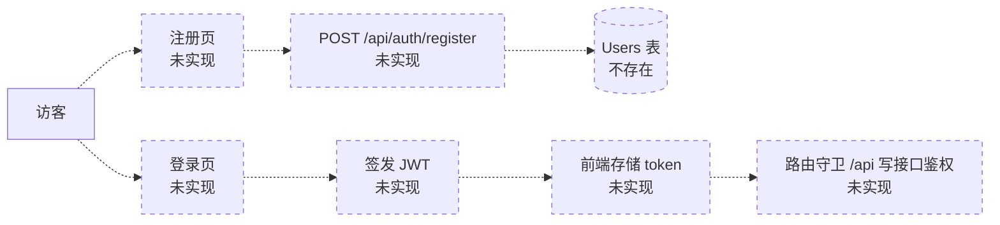
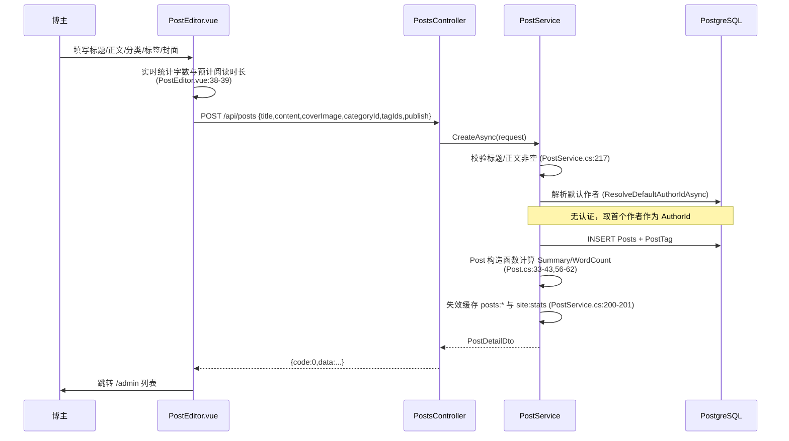
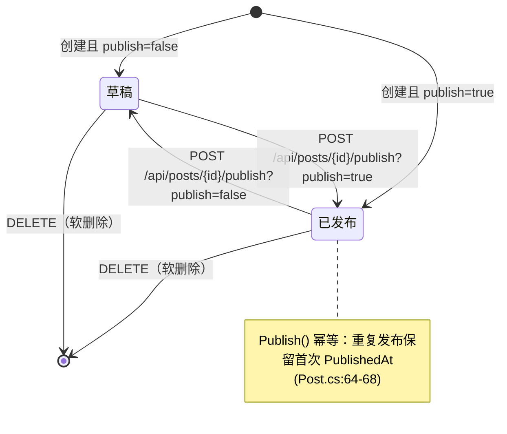
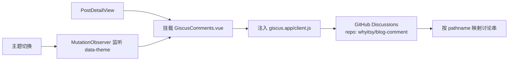
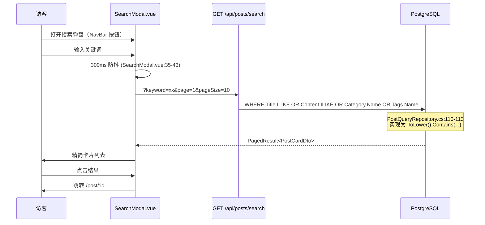
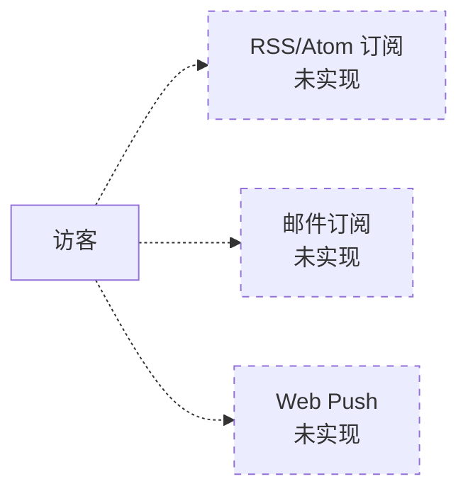
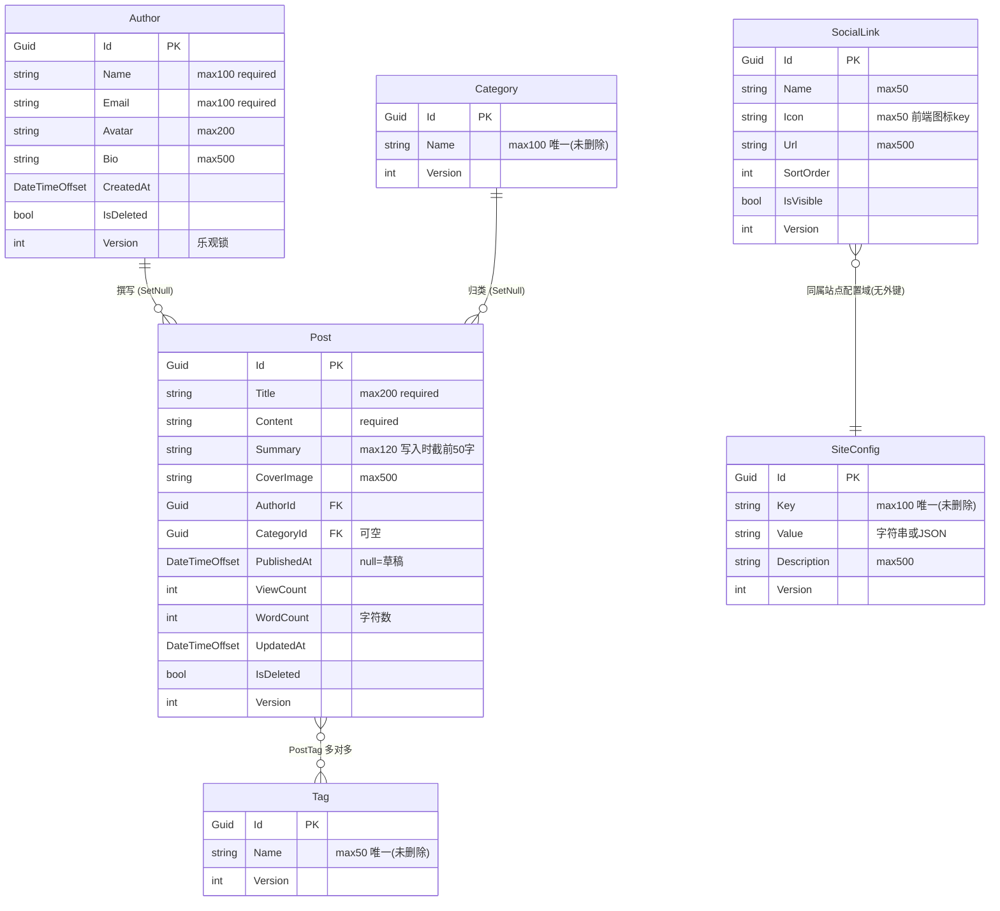
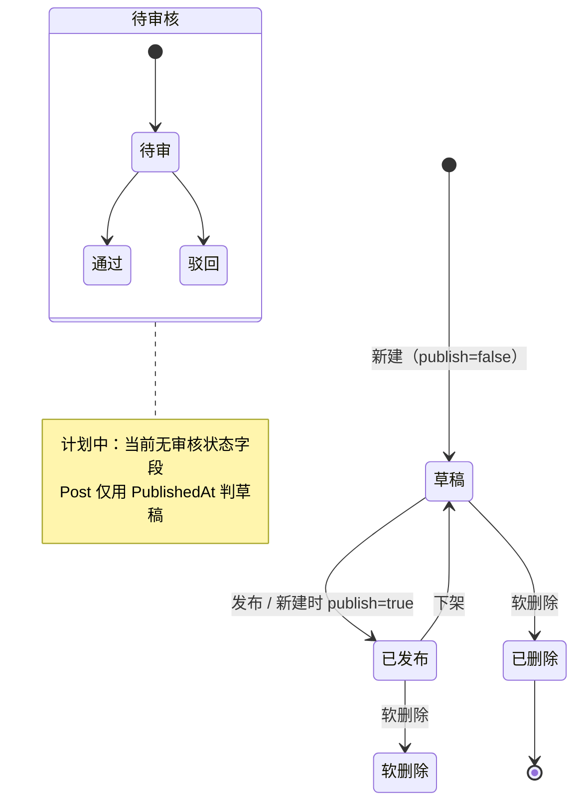

# 博客系统 业务文档

> 版本：v2.0 ｜ 编写日期：2026-09-10
> 依据：`docs/01-需求分析与实现方案.md`、`补充具体说明.md`、以及对当前仓库实际代码的核查
> 配套文档：[backend.md](./backend.md) ｜ [frontend.md](./frontend.md) ｜ [suggestion.md](./suggestion.md)
>
> **状态标记约定**：`[已实现]` 代码已在仓库中落地 ｜ `[计划中]` 有需求或设计但未实现 ｜ `[已废弃]` 曾有设计但已被替代
> **优先级约定**：P0 阻塞上线/正确性 ｜ P1 重要但不阻塞 ｜ P2 锦上添花
> **证据约定**：所有结论标注文件路径（必要时含行号）。无法从代码确认的一律标 `TODO`，不做推断。

---

## 1. 博客定位

个人技术博客，面向「一人写作、公开阅读」的单作者场景。

| 维度 | 内容 | 依据 |
|---|---|---|
| 形态 | 前后端分离 SPA + REST API | `docs/05-系统架构与设计文档.md:11-13` |
| 内容载体 | Markdown 文章（前端渲染） | `Blog.FrontEnd/src/views/PostDetailView.vue:4,26-27`（marked + DOMPurify） |
| 视觉风格 | 「Aurora（极光）」深色优先设计体系，支持明暗切换 | `Blog.FrontEnd/src/styles/tokens.css:4-84`、`Blog.FrontEnd/src/stores/app.ts:6-20` |
| 评论方案 | 外挂 giscus（GitHub Discussions），非自建 | `Blog.FrontEnd/src/components/common/GiscusComments.vue:12-31` |

**定位判断的依据**：种子数据只预置了 1 个作者（`Blog.Backend/Blog.Infrastructure/Persistence/BlogDbContext.cs:123-134`，`Name = "kky"`），
前端注释亦写明「当前无认证，单人博客」(`Blog.BackEnd` 见 `Blog.FrontEnd/src/router/index.ts:20-21`)。
因此系统当前是**单作者博客**，不是多用户内容平台。

---

## 2. 目标用户与用户角色

### 2.1 目标用户

| 用户群 | 诉求 | 当前满足度 |
|---|---|---|
| 站点访客（未登录读者） | 浏览文章、按分类/标签筛选、搜索、看归档、评论 | `[已实现]` 全部具备 |
| 博主（内容作者） | 写作、发布/下架、管理分类标签、改站点配置 | `[已实现]` 功能具备，但**无身份校验** |
| 博客访客中的评论者 | 发表评论 | `[已实现]` 但由 giscus/GitHub 承担，本站无评论数据 |

### 2.2 用户角色

| 角色 | 说明 | 实现状态 |
|---|---|---|
| 匿名访客 | 可读全部已发布内容；可发评论（经 giscus） | `[已实现]` |
| 博主/管理员 | 可调用全部写接口（发文、发布/下架、软删除、分类标签 CRUD、站点配置、文件上传） | `[已实现，但无鉴权]` |
| 注册用户 | — | `[计划中]` 见 `docs/01-需求分析与实现方案.md:168`「无认证模块：本期管理类接口（写操作）不做用户体系」 |
| 审核员 | — | `[计划中]` 需求中未出现，见 §7 风险 |

> **关键事实**：后端**不存在任何认证/授权机制**。检索 `Authorize|Authentication|Jwt|Bearer|Identity|AddAuthorization` 在 `Blog.Backend/**/*.cs` 中
> 无任何业务命中（仅 EF 迁移里出现无关的 `UseIdentityByDefaultColumns`，指自增列）。
> `Blog.Backend/Blog.WebApi/Program.cs:65` 调用了 `app.UseAuthorization()`，但**未注册任何认证方案，也未在任何控制器上标注 `[Authorize]`**。
> 即：**当前所有管理类写接口对匿名访客完全开放**。

---

## 3. 当前业务内容与边界

### 3.1 业务范围（In Scope）

- 文章：Markdown 正文、摘要、封面、分类、标签、发布状态、浏览量、字数
- 分类 / 标签：两级独立的扁平分类法（无层级）
- 站点展示配置：站点名、首屏打字机副标题、首屏背景图、建站日期
- 社交链接：首屏底部图标（可排序、可隐藏）
- 归档：按年月分组的发布时间轴
- 搜索：标题/正文/分类名/标签名模糊匹配
- 站点统计：建站天数、文章数、总字数、总浏览、标签数、分类数
- 图片等文件上传与读取
- 评论：委托给 giscus（站外）

### 3.2 明确不在范围内（Out of Scope）

| 项 | 说明 | 依据 |
|---|---|---|
| 用户注册 / 登录 | 无账号体系 | `docs/01-需求分析与实现方案.md:168` |
| 站内评论存储 | 用 giscus 替代 | `docs/04-前端页面路由规划.md:48-69` |
| 文章多级审核流 | 只有「草稿 ↔ 已发布」 | `Blog.Backend/Blog.Domain/Entities/Post.cs:64-73` |
| 多作者协作 | 单一作者 | `BlogDbContext.cs:123-134` |
| SEO 服务端渲染 | 纯 SPA | `Blog.FrontEnd/src/router/index.ts:3-4`（`createWebHistory`，无 SSR） |
| 国际化 | 全站硬编码中文 | 检索 `vue-i18n|i18n` 无命中 |
| 数据埋点 | 无任何统计 SDK | 检索 `gtag|analytics|umami` 无命中 |

---

## 4. 核心业务流程

> 图例：实线 = 已实现；`-.->` 虚线 = 未实现/计划中。

### 4.1 注册登录 `[计划中]`

**当前状态**：完全未实现。无用户表（`BlogDbContext.cs:14-19` 仅 6 个 DbSet，无 User/Account），
无密码字段（`Author.cs:7-10` 只有 Name/Email/Avatar/Bio），无 token 处理（前端检索 `token|login|logout` 无命中）。

### 4.2 发文（创建文章）`[已实现]`

入口：`Blog.FrontEnd/src/views/AdminPostNewView.vue:12-24` → `Blog.FrontEnd/src/api/posts.ts:39-48` → `POST /api/posts`
后端：`Blog.Backend/Blog.WebApi/Controllers/PostsController.cs:73-78` → `PostService.CreateAsync`（`Blog.Application/Services/Post/PostService.cs:85`）

**业务规则**（来自代码）：
- 摘要不是前端传入，而是**写入时按正文前 50 字截取**：`Post.SummaryLength = 50`（`Blog.Backend/Blog.Domain/Entities/Post.cs:8,56-62`）。注意：`PostDtos.cs:41` 的 `CreatePostRequest` 无 `Summary` 字段，前端 `PostEditor.vue` 的摘要输入框**不会提交**（`api/posts.ts:40-47` 只发 title/content/coverImage/categoryId/tagIds/publish）→ 这是一个前端表单与接口能力的落差，见 [suggestion.md](./suggestion.md)。
- 字数 = 正文字符数（`Post.cs:58`），非单词数。
- `IsPublished` 是**计算属性**（`Post.cs:16`），数据库中不存在该列，持久化的是 `PublishedAt`。

### 4.3 草稿 `[已实现]`

- 草稿 = `PublishedAt == null`（`Blog.Domain/Entities/Post.cs:16`）。
- 创建时通过 `publish=false` 产生草稿；`CreatePostRequest.Publish` 默认 `true`（`PostDtos.cs:44`）。
- 草稿仅对管理端列表可见：列表接口 `includeUnpublished=true`（`PostsController.cs:27`，前端 `api/posts.ts:20`）。
- 公开列表在 SQL 层过滤：`PostQueryRepository.cs:24`（`if (!query.IncludeUnpublished)`）。

### 4.4 发布 / 下架 `[已实现]`

- 前端入口：`AdminPostListView.vue` 的「发布/下架」按钮，先 `GET /api/posts/{id}` 取 `version` 再调发布接口（`withVersion` 辅助函数）。
- **副作用**：管理端取 version 会调详情接口，而详情接口**每次调用都会让浏览量 +1**（`PostService.cs:54-68`）。即**博主每次在后台点发布/删除，都会给自己的文章 +1 浏览量**。这是已知设计副作用，见 [suggestion.md](./suggestion.md)。

### 4.5 评论 `[已实现，委托外部]`

- 本站**不存储任何评论数据**，无 Comments 表（`BlogDbContext.cs:14-19`）。
- 评论串按 URL pathname 映射（`GiscusComments.vue:21` `data-mapping: 'pathname'`）→ **文章 URL 变更会导致评论失联**。
- 主题联动实现见 `GiscusComments.vue:11,35-40`。

### 4.6 搜索 `[已实现]`

- 限流：搜索规则 `Capacity=20, TokensPerSecond=2`（`Blog.WebApi/appsettings.Development.json:27-34`）。
- 注意：匹配用的是 `ToLower().Contains()`（`PostQueryRepository.cs:110-113`），**不是 PostgreSQL 全文检索**，大数据量下会全表扫描。见 §9 与 [backend.md](./backend.md) P1。

### 4.7 订阅 `[计划中]`

**当前状态**：无 RSS/Atom 输出、无邮件订阅、无推送。仅有一个 `rss` 社交图标作为**可点击外链**（`SocialIcon.vue:12,18` 是图标 path 定义，非订阅功能）。

### 4.8 后台管理 `[已实现]`

七大模块，路由见 `Blog.FrontEnd/src/router/index.ts:22-34`：

| 模块 | 路由 | 视图 | 后端接口 |
|---|---|---|---|
| 文章管理 | `/admin` | `AdminPostListView.vue` | `GET/POST/PUT/DELETE /api/posts*` |
| 新建文章 | `/admin/posts/new` | `AdminPostNewView.vue` | `POST /api/posts` |
| 编辑文章 | `/admin/posts/:id/edit` | `AdminPostEditView.vue` | `PUT /api/posts/{id}` |
| 分类管理 | `/admin/categories` | `AdminCategoryListView.vue` | `GET/POST/PUT/DELETE /api/categories*` |
| 标签管理 | `/admin/tags` | `AdminTagListView.vue` | `GET/POST/PUT/DELETE /api/tags*` |
| 用户资料 | `/admin/profile` | `AdminProfileView.vue` | `GET /api/authors`、`PUT /api/authors/{id}` |
| 网站配置 | `/admin/site` | `AdminSiteConfigView.vue` | `GET/PUT /api/site/config`、`GET/PUT/DELETE /api/site/social-links*` |

管理端布局为独立 `AdminLayout.vue`（侧边栏 + 顶栏），≤880px 折叠为横向 tab（`AdminLayout.vue` 的 `@media (max-width: 880px)`）。
顶栏固定提示「当前无认证，写操作按匿名放行（待后续补充）」。

**并发的写法约定**：所有管理端写操作需回传 `version`（乐观锁），冲突返回 `409` + `code=4090`。详见 [backend.md](./backend.md) §7.3。

---

## 5. 领域模型

### 5.1 实体关系

字段与约束来源：`Blog.Backend/Blog.Infrastructure/Persistence/BlogDbContext.cs:33-104`。
实体定义：`Blog.Domain/Entities/{Post,Author,Category,Tag,SiteConfig,SocialLink}.cs`、`Base/BaseEntity.cs`。

### 5.2 用户模型

`[已实现但名称易误解]` 系统里的「用户」实体叫 `Author`，**只有展示信息，没有任何凭据字段**：

- 字段：Name / Email / Avatar / Bio（`Blog.Domain/Entities/Author.cs:7-10`）
- 无 `PasswordHash`、无 `Username`、无 `Role`、无 `LastLoginAt`
- 无 `User` 表（`BlogDbContext.cs:14-19`）

因此 **「用户」在当前系统中等价于「博主个人资料」**，不是账号。前端 `/admin/profile` 页面即编辑这条记录（取列表首条，见 `AdminProfileView.vue` 的 `authors[0]`）。

### 5.3 权限模型 `[计划中]`

无 RBAC/ABAC，无权限表，无角色枚举。所有接口权限相同。

### 5.4 评论模型 `[计划中]`

无实体、无表。评论数据在 GitHub Discussions。

### 5.5 点赞 / 收藏 `[计划中]`

无任何相关字段或表。文章只有 `ViewCount`（`Post.cs:17`）。

---

## 6. 内容生命周期

> 需求原文（`docs/01-需求分析与实现方案.md:168` 及 `补充具体说明.md`）**未提出审核环节**。
> 因此下图中的「审核」为 `[计划中]`，不是已实现能力的缺失，而是需求外延。

| 阶段 | 实现方式 | 代码依据 |
|---|---|---|
| 草稿 | `PublishedAt IS NULL` | `Post.cs:16` |
| 发布 | `PublishedAt = DateTimeOffset.UtcNow`，幂等保留首次时间 | `Post.cs:64-68` |
| 下架 | `PublishedAt = NULL` | `Post.cs:70-73` |
| 归档 | **不是状态**，是查询视图：按年月分组已发布文章 | `PostQueryRepository.GetArchivesAsync`、`PostDtos.cs:57-59` |
| 修改 | 更新时刷新 `UpdatedAt`、`Summary`、`WordCount` | `Post.cs:45-53` |
| 删除 | 软删除：`IsDeleted=true` + `DeletedAt`，全局查询过滤器屏蔽 | `BaseEntity.cs:26-30`、`BlogDbContext.cs:57` |
| 审核 | 未实现 | 无相关字段 |

**归档与删除的语义澄清**：归档页 `/archive` 展示的是**全部已发布文章**按时间倒序分组，文章不会因「归档」而失去任何状态。

---

## 7. 当前功能清单

### 7.1 公开端 `[已实现]`

| 功能 | 路由 / 接口 | 前端文件 | 状态 |
|---|---|---|---|
| 首页 Hero（打字机、浮动动画、社交图标） | `/` | `components/hero/HeroSection.vue` | `[已实现]` |
| 首页文章卡片列表 + 分页 | `/` `?page=` | `views/HomeView.vue`、`components/post/PostCardList.vue` | `[已实现]` |
| 文章详情（Markdown、TOC、阅读进度、浏览量） | `/post/:id` | `views/PostDetailView.vue` | `[已实现]` |
| 评论 | 详情页内 | `components/common/GiscusComments.vue` | `[已实现]`（外挂） |
| 标签墙 | `/tags` | `views/TagsView.vue` | `[已实现]` |
| 分类墙 | `/categories` | `views/CategoriesView.vue` | `[已实现]` |
| 归档时间轴 | `/archive` | `views/ArchiveView.vue` | `[已实现]` |
| 通用筛选列表（tag/category/keyword + 分页） | `/posts` | `views/PostListView.vue` | `[已实现]` |
| 搜索弹窗（300ms 防抖） | 导航栏触发 | `components/search/SearchModal.vue` | `[已实现]` |
| 明暗主题切换（localStorage 持久化） | — | `stores/app.ts:6-20` | `[已实现]` |
| Footer 站点统计 | `GET /api/site/stats` | `components/common/SiteFooter.vue` | `[已实现]` |

### 7.2 管理端 `[已实现]`

| 功能 | 状态 | 备注 |
|---|---|---|
| 文章列表（含草稿、分页、骨架屏） | `[已实现]` | 窄屏退化为可折叠卡片 |
| 新建 / 编辑文章 | `[已实现]` | 编辑器内可内联新建分类/标签 |
| 发布 / 下架 | `[已实现]` | 走 `POST /api/posts/{id}/publish` |
| 软删除文章 | `[已实现]` | `DELETE /api/posts/{id}?version=` |
| 分类 CRUD | `[已实现]` | 行内改名 |
| 标签 CRUD | `[已实现]` | 行内改名 |
| 用户资料编辑（含头像上传） | `[已实现]` | `PUT /api/authors/{id}` |
| 站点配置编辑 | `[已实现]` | 4 个配置项逐项乐观锁 |
| 社交链接增删改（含显示/隐藏、排序） | `[已实现]` | `PUT` 批量 + `DELETE` 单条 |
| 文件上传 | `[已实现]` | `POST /api/files/upload` |

### 7.3 后端横切能力 `[已实现]`

| 能力 | 实现 | 依据 |
|---|---|---|
| 统一响应体 | `{code,message,data}` | `Blog.Application/Common/ApiResponse.cs:6-25` |
| 全局异常 → 状态码映射 | 业务异常 400/404、并发 409、其他 500 | `WebApi/Middleware/ExceptionHandlingMiddleware.cs:31-48` |
| 乐观锁 | int Version + SQL 条件更新 | `Domain/Entities/Base/BaseEntity.cs:14-20`、`Infrastructure/Persistence/Repositories/BaseRepository.cs:66-74` |
| 缓存（三防 + 降级） | Memory / Redis 可切换 | `Infrastructure/DependencyInjection.cs:41-55`、`Caching/RedisCacheService.cs` |
| 令牌桶限流 | Redis Lua + 内存降级 | `WebApi/Middleware/RateLimitingMiddleware.cs` |
| 日志 | Serilog 控制台 + 按天滚动文件 | `WebApi/Program.cs:17-27` |
| 慢查询拦截 | >500ms（见 [backend.md](./backend.md) §6） | `Infrastructure/Persistence/Interceptors/SlowQueryInterceptor.cs` |
| 文件存储 | 本地磁盘 + 扩展名白名单 + 体积上限 | `Infrastructure/Files/LocalFileStorageService.cs:13-17` |
| 软删除 | 全局查询过滤器 | `BlogDbContext.cs:57,67,76,84,93,103` |

---

## 8. 非功能需求

> 下表区分「当前实际水平」与「目标」。目标若原文档未给出数值，则标 `TODO` —— 原需求文档未定义量化 SLA。

### 8.1 性能

| 指标 | 当前实现 | 目标 | 状态 |
|---|---|---|---|
| 列表页响应 | 页级缓存 5 分钟（`PostService.cs:13`） | TODO（无量化基线） | `[已实现]` |
| 详情页响应 | 详情缓存 10 分钟（`PostService.cs:14`） | TODO | `[已实现]` |
| 归档页响应 | 缓存 30 分钟（`PostService.cs:15`） | TODO | `[已实现]` |
| 分类/标签列表 | 缓存 30 分钟（`CategoryService.cs:12`） | TODO | `[已实现]` |
| 站点配置 | 缓存 1 小时（`SiteService.cs:12`） | TODO | `[已实现]` |
| 站点统计 | 缓存 10 分钟（`SiteService.cs:13`） | TODO | `[已实现]` |
| 文章列表查询 | 走 `PublishedAt` / `IsDeleted+PublishedAt` 索引 | — | `[已实现]` `BlogDbContext.cs:40-42` |
| 搜索 | `ToLower().Contains()`，**无专用索引** | TODO | `[已实现但需优化]` |
| 慢查询可观测 | >500ms 记录 | — | `[已实现]` |

### 8.2 安全

| 项 | 状态 | 说明 |
|---|---|---|
| 身份认证 | `[计划中]` | **完全缺失**，见 §2.2 |
| 接口鉴权 | `[计划中]` | 写接口匿名可调 |
| 输入校验 | `[部分实现]` | 名称/标题/正文非空与长度校验（如 `PostService.cs:217`、`CategoryService.ValidateName`） |
| XSS 防护（前端） | `[已实现]` | `DOMPurify.sanitize`（`PostDetailView.vue:27`） |
| 文件上传白名单 | `[已实现]` | 11 种扩展名（`LocalFileStorageService.cs:13-17`） |
| 文件大小限制 | `[已实现]` | 应用层 10MB（`appsettings.Development.json` `FileStorage.MaxFileSize`）+ 请求体 50MB（`FilesController.cs:27`） |
| 目录穿越防护 | `[已实现]` | `TryResolveSafePath`（`LocalFileStorageService.cs:54`） |
| SQL 注入 | `[已实现]` | 全程 EF Core 参数化 |
| CSRF | `[不适用]` | 无 Cookie 会话；跨域仅放开配置的源（`Program.cs:33-40`） |
| 限流 | `[已实现]` | 令牌桶，规则见 `appsettings.Development.json:23-52` |
| 密钥管理 | `TODO` | 连接串明文在 `appsettings.Development.json:8-10`，生产方案未定义 |
| 权限越权测试 | `[计划中]` | 无鉴权故无从测试 |

### 8.3 SEO

| 项 | 状态 | 依据 |
|---|---|---|
| 服务端渲染 / 预渲染 | `[计划中]` | SPA，`createWebHistory`，无 SSR |
| 静态 `<title>` | `[已实现]` | `Blog.FrontEnd/index.html:13` = `kky's blog` |
| 详情页动态 title | `[已实现]` | `PostDetailView.vue:36` |
| `meta description` | `[计划中]` | 未设置 |
| Open Graph / Twitter Card | `[计划中]` | 未设置 |
| 结构化数据 JSON-LD | `[计划中]` | 未设置 |
| `sitemap.xml` / `robots.txt` | `[计划中]` | `Blog.FrontEnd/public/` 下只有 `favicon.svg`、`icons.svg` |
| 语义化标签 | `[部分实现]` | 使用了 `header/nav/main/footer/aside/article` 等 |
| 图片 `alt` | `[部分实现]` | 部分设置（如 `AdminProfileView` 头像），未全站核查 |

### 8.4 可用性

| 项 | 状态 | 依据 |
|---|---|---|
| 响应式 | `[已实现]` | 断点 640 / 767 / 880 / 1023 / 1199 px，见各组件 `@media` |
| 暗色 / 亮色 | `[已实现]` | 默认暗色，`tokens.css:4` 与 `@media (prefers-color-scheme: light)` |
| 骨架屏 | `[已实现]` | `PostCardList.vue`、`AdminPostListView.vue` |
| 空状态 / 错误提示 | `[已实现]` | 各列表页有 empty/err 分支 |
| 加载失败降级 | `[部分实现]` | store 层 `catch(() => null)` 兜底（`stores/site.ts:16-20`） |
| 动画降级 | `[已实现]` | `prefers-reduced-motion: reduce`（`styles/global.css:170-180`） |
| 键盘可达性 / 焦点管理 | `TODO` | 弹窗焦点陷阱、Esc 关闭等未系统实现 |
| ARIA | `[部分实现]` | 全站 8 处 `aria-*`/`role`，覆盖不全 |
| 后端健康检查 | `[部分实现]` | `GET /` 返回运行状态（`Program.cs:68`） |

---

## 9. 未来可拓展业务

> 成本为相对估算（以当前单人开发节奏为基准）；风险指对现有代码/数据的冲击面。

| # | 方向 | 优先级 | 理由 | 成本 | 风险 |
|---|---|---|---|---|---|
| 1 | **认证与授权** | **P0** | 写接口当前完全裸奔，任何访客可删文章、改站点配置。是唯一「不上线则不可公开部署」的问题 | 中（JWT + 用户表 + 前端守卫，约 3–5 天） | 中：需新增 Users 表与迁移；`Author` 概念要从「资料」升级为「账号」，会影响 `/api/authors` 语义与前端资料页 |
| 2 | 多作者 | P1 | 领域模型已天然支持（`Post.AuthorId`、`Author.Posts`），但缺少归属校验与作者页 | 低—中（接口按作者过滤 + `/author/:id` 页） | 低：表结构无需大改；但需与 P0 一起做，否则任何人都能冒名发文 |
| 3 | 专栏 / 系列 | P1 | 长文博客的常见组织诉求，可复用 Category 的成熟模式 | 低（新增 Collection 实体 + Post.CollectionId + 排序字段） | 低：纯增量 |
| 4 | 全文检索升级 | P1 | 当前 `ToLower().Contains()` 在数据量上千后会明显变慢且无法相关度排序 | 中（PostgreSQL `tsvector` + GIN 索引，或引入 Meilisearch） | 中：需数据回填与迁移；中文分词需 `zhparser` 或改用外部引擎 |
| 5 | RSS / Atom | P1 | 技术博客的标准订阅方式，实现成本极低、收益明显 | 低（1–2 个只读端点 + XML 序列化） | 低 |
| 6 | 评论自建 | P2 | 当前依赖 giscus，数据在站外、且受 pathname 变更影响 | 高（Comment 表 + 反垃圾 + 通知） | 高：引入 UGC 后需处理垃圾、审核、举报，运维成本显著上升 |
| 7 | 点赞 / 收藏 | P2 | 提升互动，但单人博客收益有限 | 低—中（需处理匿名去重） | 低：需 IP/指纹去重，注意隐私 |
| 8 | 邮件订阅 / 会员 / 付费 | P2 | 与「个人技术博客」定位偏离较大，且需要支付与合规 | 高（邮件服务、订单、退款、发票） | 高：涉及资金与合规 |
| 9 | 打赏 | P2 | 实现简单（静态收款码/外链） | 极低 | 低 |
| 10 | 多语言 i18n | P2 | 当前全站硬编码中文；若定位中文技术博客则无必要 | 中（提取文案 + vue-i18n + 内容多语言表） | 中：**文章内容**多语言是真正难点，需额外字段或翻译表 |
| 11 | 个性化推荐 | P2 | 单作者博客内容量有限，推荐收益低 | 高（需行为埋点 + 召回排序） | 高：需先补埋点，且小数据量下效果差 |
| 12 | SEO 增强（SSR/预渲染 + meta） | P1 | 搜索流量对技术博客是主要入口，当前 SPA 对爬虫不友好 | 中（Nuxt/SSG 迁移或 prerender 插件 + meta 管理） | 中：SSR 迁移会触及全部页面与 `localStorage` 用法（`stores/app.ts:8` 在模块初始化即读 localStorage，SSR 下会报错） |

---

## 10. 风险与未决问题

### 10.1 已确认风险（有代码依据）

| # | 风险 | 影响 | 依据 |
|---|---|---|---|
| R1 | **管理接口无鉴权** | 最高。任何人可删文、改配置、上传文件 | §2.2 检索结论 |
| R2 | 后台操作会污染浏览量 | 博主点发布/删除时调用详情接口，浏览量 +1 | `PostService.cs:54-68` 与 `AdminPostListView.vue` 的 `withVersion` |
| R3 | 搜索走全表 `ToLower().Contains` | 数据量增长后性能急剧下降 | `PostQueryRepository.cs:110-113` |
| R4 | 评论绑定 URL pathname | 文章 slug/URL 变更导致历史评论「消失」 | `GiscusComments.vue:21` |
| R5 | 种子作者头像是失效路径 | `/media/avatar-default.png` 不由后端提供（文件接口是 `/api/files/**`） | `BlogDbContext.cs:128` vs `FilesController.cs:9` |
| R6 | 数据库连接串明文入库 | 生产凭据泄露风险 | `appsettings.Development.json:8-10` |
| R7 | 无测试项目 | 回归全靠人工，重构风险高 | 全仓库检索无 `*Test*` 项目，`Blog.Backend.slnx` 仅 4 个工程 |
| R8 | 无 CI/CD | 构建/校验完全依赖本地手工 | 无 `.github/workflows`、无 `Jenkinsfile`、无 `Dockerfile` |
| R9 | 草稿经公开接口泄露 | `includeUnpublished=true` 是公开参数，无鉴权即可读到草稿 | `PostsController.cs:27`（无 `[Authorize]`） |
| R10 | 摘要字段前端不可用 | 编辑器有摘要输入框但不提交，实际摘要由后端截前 50 字 | `PostEditor.vue` 摘要输入 vs `api/posts.ts:40-47` |

> R9 与 R1 是同一根因的两面，应合并修复。

### 10.2 未决问题（需人工确认）

详见 [suggestion.md](./suggestion.md)。摘要如下：

| # | 问题 | 为何无法从代码确定 |
|---|---|---|
| Q1 | 上线目标环境与部署方式（IIS / Nginx / 容器） | 仓库无部署产物或编排文件 |
| Q2 | 认证方案选型（JWT / Cookie / OIDC 第三方） | 需求文档仅写「后续可加 JWT」（`docs/01:168`），未定稿 |
| Q3 | 是否需要审核流 | 需求文档完全未提，属功能外延 |
| Q4 | 生产环境的 Redis 是否强制 | 代码支持降级，但生产是否启用未定义 |
| Q5 | 图片存储是否迁移到 OSS/CDN | `docs/02-API接口清单.md:66` 称「便于后续替换为 OSS/CDN」，但无计划 |
| Q6 | 是否需要保留 `/media/...` 历史路径 | 影响 R5 的修法（改种子数据 vs 加兼容路由） |
| Q7 | 摘要应由作者手填还是自动截取 | 前端表单与后端行为不一致，需产品决策 |
