# 博客系统 业务文档

> 版本：v3.0 ｜ 编写日期：2026-09-10
> 本文基于**已拍板的决策**（见 [tech.md](./tech.md)）与对仓库实际代码的核查重新编写。
> 配套文档：[tech.md](./tech.md) ｜ [backend.md](./backend.md) ｜ [frontend.md](./frontend.md) ｜ [suggestion.md](./suggestion.md)
>
> **状态标记**：`[已实现]` 代码已落地 ｜ `[已决定]` 已拍板待实施 ｜ `[计划中]` 已规划未决策 ｜ `[已废弃]` 已弃用
> **优先级**：P0 阻塞上线 ｜ P1 重要不阻塞 ｜ P2 长期

---

## 1. 博客定位

**多作者技术博客平台**，前后端分离。访客可自由阅读，作者登录后撰写自己的文章，管理员登录后管理全站。

### 1.1 定位的关键变化

> **本项目已从「单作者博客」重新定位为「多作者博客」。**
> 依据：Q3 决策「本项目应该是多作者博客而不是单一作者」。
> 这推翻了早期需求文档中「单人博客」的隐含前提，因此下列设计随之调整：
> `Author` 可被管理员增删改、文章归属需要越权校验、草稿需要权限保护（Q7）、需要专栏组织内容。

| 维度 | 内容 | 状态 |
|---|---|---|
| 形态 | 前后端分离 SPA + REST API | `[已实现]` |
| 内容载体 | Markdown 文章（前端渲染 + DOMPurify 消毒） | `[已实现]` |
| 评论 | 外挂 giscus（GitHub Discussions），本站不存评论数据 | `[已实现]` |
| 作者规模 | **多作者**，每篇文章归属一个 `Author` | `[已决定]` |
| 内容组织 | 分类、标签、**专栏（Collection）** | 专栏 `[已决定]` |
| 账号体系 | `User`（后台账号）与 `Author`（内容署名）**分离** | `[已决定]` |
| 视觉风格 | Aurora 深色优先，支持明暗切换 | `[已实现]` |

---

## 2. 目标用户与用户角色

### 2.1 目标用户

| 用户群 | 核心诉求 | 状态 |
|---|---|---|
| 匿名访客 | 浏览、筛选、搜索、看归档、评论 | `[已实现]`（搜索待优化） |
| 作者（Author） | 撰写与管理自己的文章、维护个人资料 | `[已决定]` 需实现认证 |
| 管理员（Admin） | 管理账号、作者、全部内容与站点配置 | `[已决定]` 需实现认证 |
| 评论者 | 发表评论 | `[已实现]`（由 giscus/GitHub 承担） |

### 2.2 用户角色与职责边界

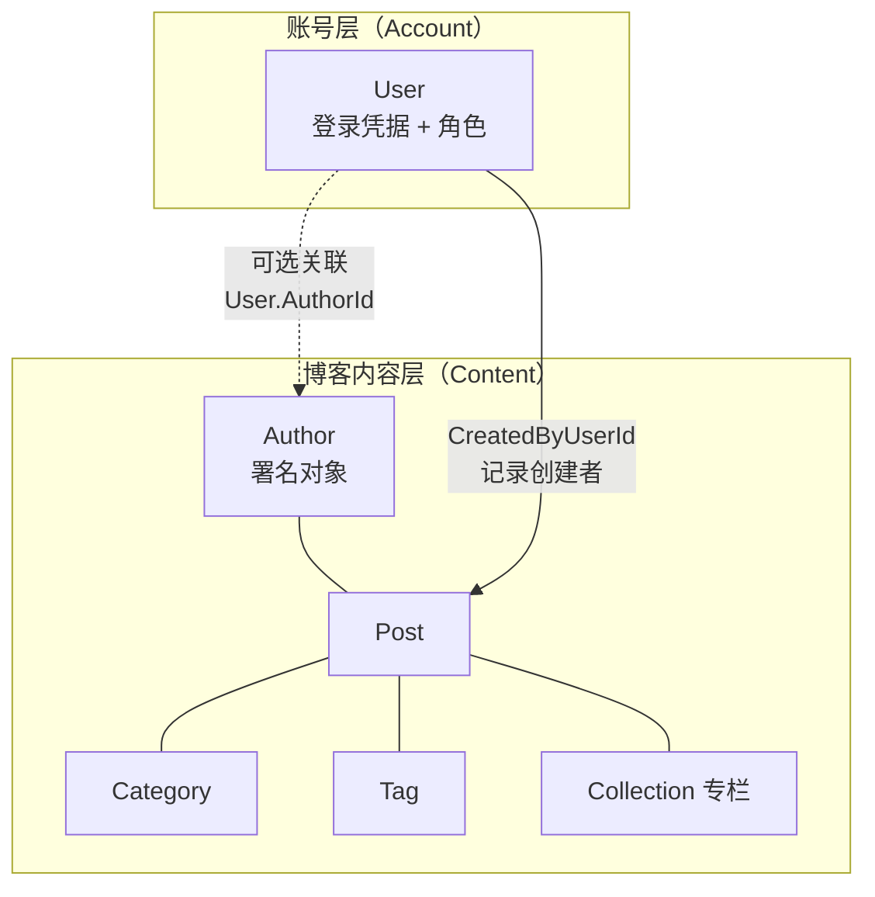

**核心澄清（Q3 决策的落地）**：

| 概念 | 定位 | 说明 |
|---|---|---|
| **`Author`** | **内容属性**，与 `Post`/`Tag`/`Category` 同层 | 只有展示字段（Name/Email/Avatar/Bio），**无任何凭据**。可被管理员直接创建 |
| **`User`** | **账号**，系统的操作者 | 含 `Email`/`PasswordHash`/`Role`/`IsActive`。用于登录 |
| 二者关系 | **可选的弱关联** | 一个 `User` 可关联到一个 `Author`（表示「我就是这个署名者」）；也允许存在没有 `User` 的 `Author`（历史作者、只署名不登录） |

> **推论**：`Author.Email` 与 `User.Email` 含义不同 —— 前者是展示用联系方式，后者是登录凭据。
> **不应**对二者建立唯一约束联动，也不应允许「改 `User.Email` 自动改 `Author.Email`」。

### 2.3 角色定义与权限矩阵

`[已决定]` 先做两档角色。不引入细粒度 RBAC（无第三角色需求，YAGNI）。

| 角色 | 说明 | 数量级 |
|---|---|---|
| **Admin** | 站点管理者 | 固定少数，**不开放创建入口**（仅由已有管理员创建） |
| **Author** | 内容作者 | `[已决定]` **不开放自助注册**，由管理员在后台创建账号（T1） |
| 匿名 | 未登录访客 | 无限 |

| 操作 | 匿名 | Author（本人） | Author（他人） | Admin |
|---|---|---|---|---|
| 读已发布文章 | ✅ | ✅ | ✅ | ✅ |
| **读草稿** | ❌ | ✅ | ❌ | ✅ |
| 创建文章 | ❌ | ✅ | ✅ | ✅ |
| 编辑 / 软删除文章 | ❌ | ✅ | ❌ | ✅ |
| 发布 / 下架 | ❌ | ✅ | ❌ | ✅ |
| 维护自己的 `Author` 资料 | ❌ | ✅ | ❌ | ✅ |
| 增删改 `Author`（内容） | ❌ | ❌ | ❌ | ✅ |
| 管理分类 / 标签 / 专栏 | ❌ | ❌ | ❌ | ✅ |
| 站点配置 / 社交链接 | ❌ | ❌ | ❌ | ✅ |
| 文件上传 | ❌ | ✅ | ✅ | ✅ |
| 账号管理（`User`） | ❌ | ❌ | ❌ | ✅ |

> `[待确认]` Author 能否创建分类/标签（[suggestion.md](./suggestion.md) T6）。
> 建议**仅 Admin** —— 否则分类体系会被多个作者随意扩张。作者在编辑器中选择已有项。

---

## 3. 当前业务内容与边界

### 3.1 业务范围（In Scope）

**内容管理**
- 文章：Markdown 正文、摘要（自动 + 可覆盖）、封面、分类、标签、发布状态、浏览量、字数
- 分类 / 标签：扁平结构，各自独立
- **专栏（Collection）**：把多篇文章组织成一个系列（新增能力）
- 作者：署名信息维护

**账号与权限**（新增）
- `User` 账号：JWT 登录、角色（Admin / Author）、启停用
- 草稿权限保护

**站点展示**
- 站点配置：站点名、首屏打字机副标题、背景图、建站日期
- 社交链接：可排序、可隐藏
- 归档：按年月分组时间轴
- 站点统计：建站天数、文章数、总字数、总浏览、标签数、分类数

**其他**
- 搜索：标题/正文/分类名/标签名匹配（**待优化为 GIN 索引**）
- 文件上传与读取
- 评论：委托 giscus（站外）

### 3.2 明确不在范围内（Out of Scope）

| 项 | 说明 | 依据 |
|---|---|---|
| 站内评论存储 | 用 giscus 替代 | 原始需求 |
| 文章审核流 | `[已决定]` 目前不需要，引入多作者后再评估 | Q6 |
| 国际化 / 多语言 | `[已决定]` 不需要 | Q10 |
| SEO 优化 | `[已决定]` 本期不做，路径已规划 | Q11 / [tech.md](./tech.md) §6 |
| 第三方 OAuth 登录 | `[已决定]` 后期再考虑 | Q2 |
| OSS / CDN 迁移 | `[已决定]` 未来做，本期只保留扩展点 | Q9 |
| 数据埋点 / 用户行为分析 | 未规划 | — |
| 点赞 / 收藏 / 打赏 / 会员 / 付费 | 未规划 | — |

---

## 4. 核心业务流程

> 图例：实线 = 已实现；虚线 = 已决定待实现。

### 4.1 登录体系（前台 Author / 后台 User）

`[已决定]` 两套登录入口，同构 JWT 机制，靠 `role` claim 区分。

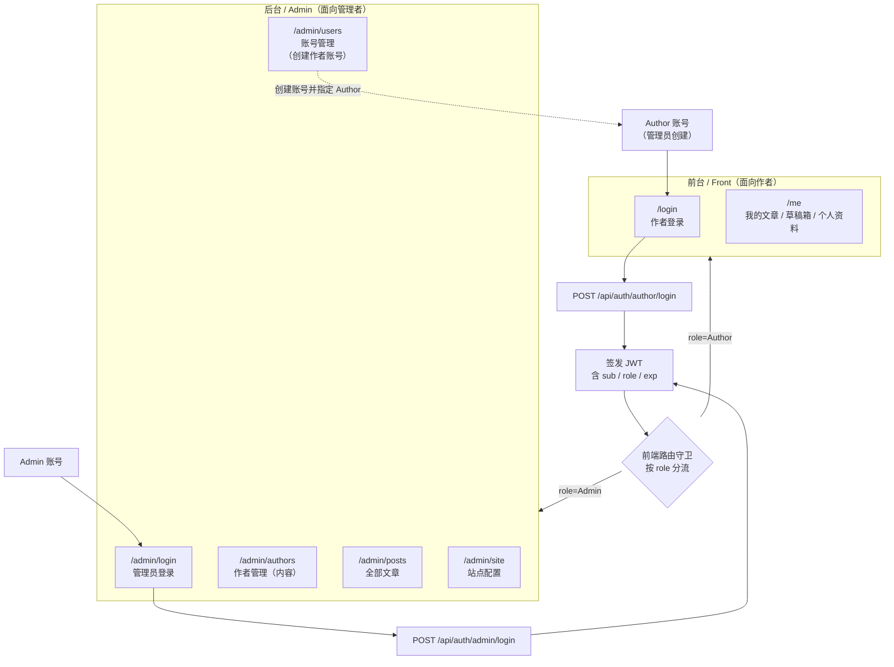

**为什么必须分成两套入口**：作者与管理员的生命周期与信任模型完全不同。
作者账号由管理员发放、数量可控；管理员是运维者、数量固定且**绝不对外开放创建**。
混在同一登录页会导致「注册即成为管理员」这类严重越权。

即便作者注册不开放（T1），两个入口仍需分开：它们的**登录后落地页与错误提示**都不同
（作者进 `/me`，管理员进 `/admin`），且未来若开放受控注册，也只会开放作者那一个入口。

**前端落地方式**：单一 SPA + 角色路由守卫（`[已决定]`，理由见 [tech.md](./tech.md) §2.3）。

#### 作者登录时序

> `[已决定]` **没有注册流程**（T1）。作者账号由管理员在 `/admin/users` 创建，
> 因此本节只有登录，没有注册。

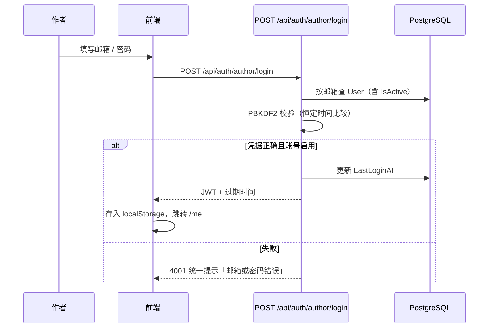

> **安全要点**：登录失败时**不要**区分「邮箱不存在」与「密码错误」，统一提示，避免账号枚举攻击。

#### 管理员登录

同构，但走独立端点 `/api/auth/admin/login`。

| 项 | 说明 |
|---|---|
| 注册端点 | **不存在**（作者与管理员的创建都只能由管理员在后台发起） |
| 账号来源 | 已有管理员创建，或部署时由初始化流程创建（**密码不可硬编码进迁移**） |
| 与作者登录的差异 | 独立端点便于分别做限流与审计；登录后落地 `/admin` |

> **为什么不让管理员用同一个 `/api/auth/login`**：分流端点可以在**限流规则**与
> **审计日志**上分别处理（管理员登录失败是更严重的信号），也避免「管理员误入作者入口」
> 造成的困惑与额外的前端判断。

#### 会话生命周期

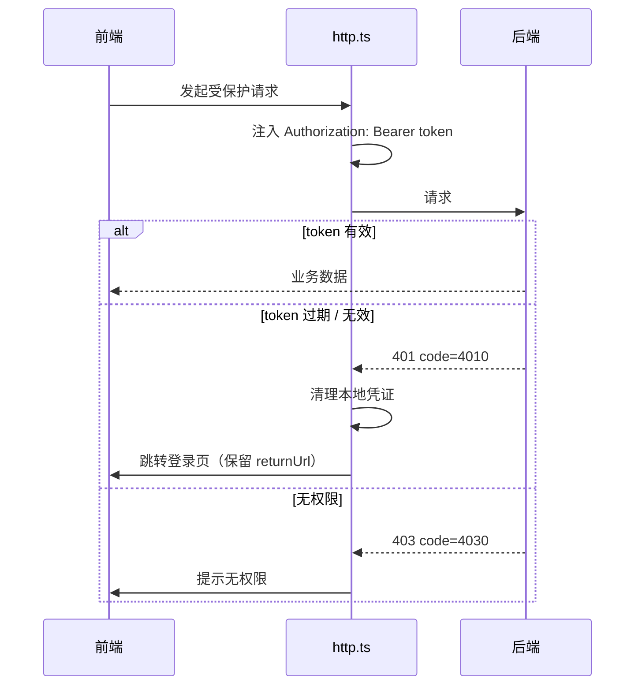

### 4.2 发文

作者本人或管理员创建文章。

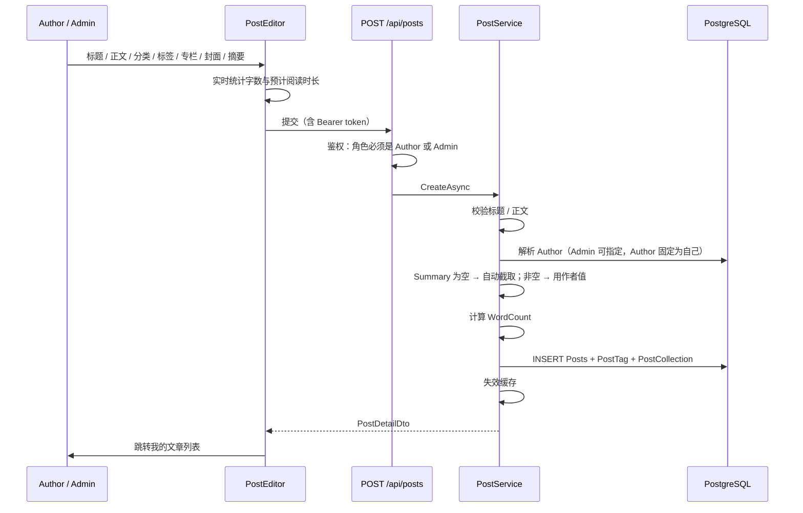

**业务规则**：

| 规则 | 说明 | 状态 |
|---|---|---|
| 摘要 | **空 → 自动取正文前 N 字；非空 → 用作者填写的值，且更新时不重算** | `[已决定]`（Q5） |
| 字数 | 正文字符数（非单词数） | `[已实现]` |
| 作者归属 | Author 只能创建自己的文章；Admin 可指定任意 Author | `[已决定]` |
| 专栏 | 可选，是否可多选待确认 | `[待确认]` T2 |
| 发布状态 | 创建时可选择立即发布或存为草稿 | `[已实现]` |

### 4.3 草稿与草稿权限保护

`[已决定]` 草稿需权限保护（Q7）。

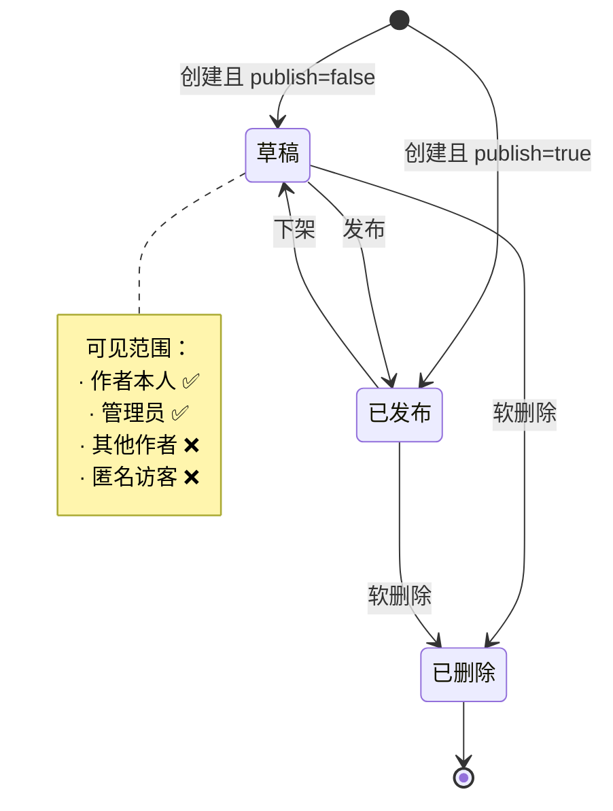

**当前的安全缺口（`[已实现]` 但需修复）**：
`GET /api/posts?includeUnpublished=true` 是**公开 query 参数**且无鉴权（`Blog.Backend/Blog.WebApi/Controllers/PostsController.cs:27`），
任何匿名访客都能读到全部草稿。必须随认证一起修复。

**保护方案**：

| 措施 | 说明 |
|---|---|
| 端点鉴权 | `includeUnpublished=true` 时要求已认证，且角色为 Author 或 Admin |
| **数据过滤** | Author 只能看到 `AuthorId == 自己` 的草稿；Admin 可见全部 |
| 详情端点 | 读取草稿详情同样需要鉴权 + 归属校验 |

### 4.4 发布 / 下架

- `Publish()` 幂等：重复发布保留首次 `PublishedAt`（`Blog.Domain/Entities/Post.cs:64-68`），避免影响归档排序
- 需携带 `version` 做乐观锁，冲突返回 409 / code 4090

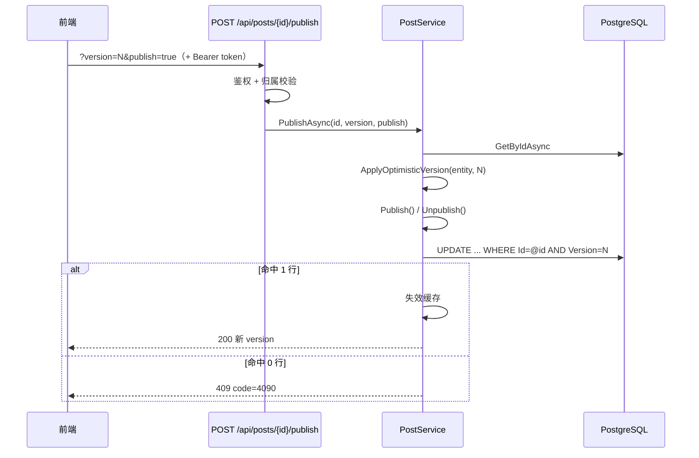

### 4.5 评论

`[已实现]` 由 giscus 承担，本站**不存评论数据**（无 Comment 表）。

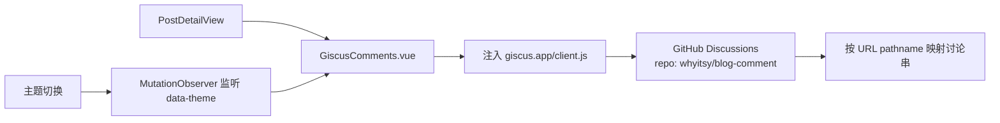

**风险**：评论串按 URL pathname 映射（`Blog.FrontEnd/src/components/common/GiscusComments.vue:21`），
**文章 URL 变更会导致历史评论失联**。
若将来需要站内评论（可关联 Author、支持权限），需新建 Comment 实体并重新设计。

### 4.6 搜索（待优化）

`[已实现]` 但性能与效果均不足；`[已决定]` 用 **PostgreSQL + GIN 索引**优化。

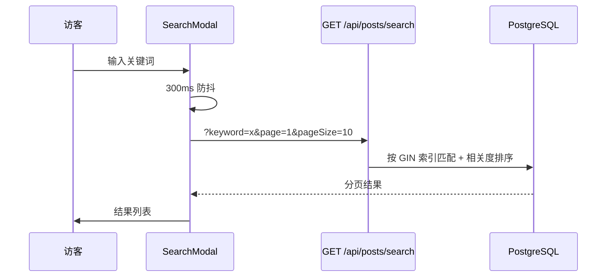

**现状问题**（详见 [tech.md](./tech.md) §5）：

| # | 问题 | 影响 |
|---|---|---|
| 1 | `ToLower().Contains()` 生成 `LIKE '%x%'` | 前导通配符使索引失效 → **全表扫描** |
| 2 | 无相关度排序 | 最相关的结果可能排在最后一页 |
| 3 | 中文不分词 | 词序不同就搜不到 |

**优化方案**（`[已决定]` T9）：**真全文检索（FTS）**

| 组件 | 选型 |
|---|---|
| 分词器 | **`zhparser`**（支持中文词级切分，中英混合正常） |
| 存储 | `Posts.SearchVector`（`tsvector` **生成列**，权重 标题A > 摘要B > 正文C） |
| 索引 | **GIN**（`USING gin ("SearchVector")`） |
| 查询 | `plainto_tsquery('chinese', kw)` 匹配 + `ts_rank` 相关度排序 |

> **为什么不用 `pg_trgm`**：trigram 只解决「模糊匹配走索引」，**不是分词检索**，
> 无法处理词序变化与相关度。你已明确选择真 FTS，因此以 `zhparser` 为准。
>
> **环境前置**：`zhparser` 不在官方 PostgreSQL 镜像中，需自行编译（SCWS + zhparser）。
> 已在开发环境编译验证通过，但**必须固化为自定义镜像**，否则容器重建即失效。
> 详见 [tech.md](./tech.md) §5.3 与 [suggestion.md](./suggestion.md) T11。

### 4.7 后台管理

`[已实现]` 现有模块 + `[已决定]` 新增模块。

| 模块 | 路由 | 状态 |
|---|---|---|
| 文章管理（全部） | `/admin` | `[已实现]` |
| 新建 / 编辑文章 | `/admin/posts/new`、`/admin/posts/:id/edit` | `[已实现]` |
| 分类管理 | `/admin/categories` | `[已实现]` |
| 标签管理 | `/admin/tags` | `[已实现]` |
| 网站配置 | `/admin/site` | `[已实现]` |
| 单作者资料（现有） | `/admin/profile` | `[需调整]` 按新模型并入作者管理 |
| **管理员登录** | `/admin/login` | `[已决定]` |
| **账号管理（`User`）** | `/admin/users` | `[已决定]` **含创建作者账号**（T1 的唯一入口） |
| **作者管理（`Author` 内容）** | `/admin/authors` | `[已决定]` |
| **专栏管理** | `/admin/collections` | `[已决定]` |

外加前台作者工作区：`/me`（我的文章、草稿箱、个人资料）与 `/login`。
**没有 `/register`**（T1 决定不开放自助注册）。

---

## 5. 领域模型

### 5.1 实体关系总览

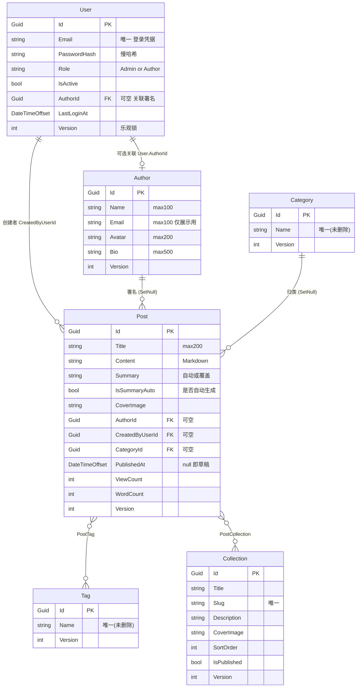

字段约束依据：现有实体见 `Blog.Backend/Blog.Domain/Entities/*.cs` 与 `Blog.Backend/Blog.Infrastructure/Persistence/BlogDbContext.cs:33-104`。

### 5.2 用户模型（`User` vs `Author`）

| 对比项 | `User` | `Author` |
|---|---|---|
| 层次 | 账号层 | 内容层（与 Post/Tag/Category 同层） |
| 用途 | 登录、鉴权、审计 | 文章署名展示 |
| 凭据字段 | ✅ `PasswordHash` | ❌ 无 |
| 可被匿名读取 | ❌ 绝不 | ✅ 可（文章详情需显示作者名与头像） |
| 是否可自助注册 | Author 角色**不可**（管理员创建）；Admin 不可 | 不是账号，不涉及注册 |
| 能否删除 | 建议禁用（`IsActive=false`），**不物理删除**（影响审计） | 可软删除 |
| 生命周期 | 随账号 | 随内容（可先建作者再建账号） |

> **为什么 `Author` 可被匿名读取而 `User` 不能**：`PostDetailDto` 需要返回 `AuthorName`/`AuthorAvatar`
> 用于文章详情页展示（`Blog.Application/Services/Post/PostDtos.cs:29-30`）。
> 而 `User` 含凭据相关信息，**任何 DTO 都不得直接暴露 `PasswordHash`**。

### 5.3 权限模型

`[已决定]` **两档角色 + 资源归属校验**，不引入 RBAC 权限表。

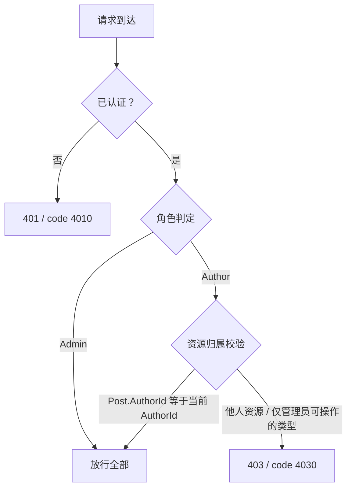

| 层 | 手段 |
|---|---|
| 认证 | JWT Bearer |
| 角色判定 | `role` claim（Admin / Author） |
| 资源归属 | 查询时按 `AuthorId` 过滤 + 写操作前校验 |
| 传输 | HTTPS（生产 Nginx 终结） |

### 5.4 评论模型

`[计划中]` 无实体、无表。评论数据在 GitHub Discussions。

### 5.5 互动模型

| 类型 | 状态 |
|---|---|
| 浏览量 `ViewCount` | `[已实现]`（但有「后台操作污染」问题，见 §10.1 R2） |
| 点赞 / 收藏 / 打赏 | `[计划中]` 未规划 |

---

## 6. 内容生命周期

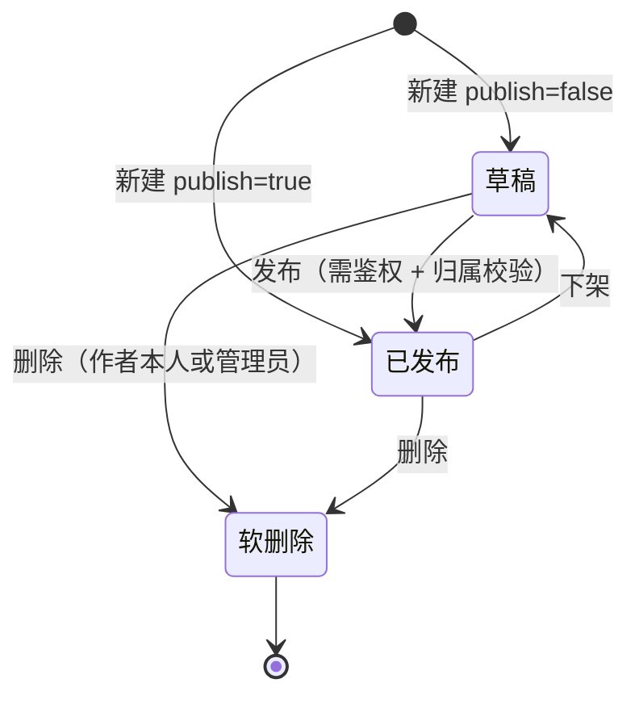

| 阶段 | 实现方式 | 依据 |
|---|---|---|
| 草稿 | `PublishedAt IS NULL`，**权限受限可见** | `Post.cs:16` + Q7 |
| 发布 | `PublishedAt = UtcNow`，幂等保留首次时间 | `Post.cs:64-68` |
| 下架 | `PublishedAt = NULL` | `Post.cs:70-73` |
| 归档 | **不是状态**，是查询视图：已发布文章按年月分组 | `PostQueryRepository.GetArchivesAsync` |
| 修改 | 刷新 `UpdatedAt`；`Summary` 仅在为空时重算 | `Post.cs:45-53` + Q5 |
| 删除 | 软删除：`IsDeleted=true` + `DeletedAt`，全局查询过滤器屏蔽 | `BaseEntity.cs:26-30`、`BlogDbContext.cs:57` |
| 审核 | `[已决定]` 本期不做（Q6） | — |

> **归档语义澄清**：归档页展示**全部已发布文章**，文章不会因「归档」失去任何状态。

---

## 7. 当前功能清单

### 7.1 公开端 `[已实现]`

| 功能 | 路由 | 说明 |
|---|---|---|
| 首页 Hero | `/` | 打字机副标题、浮动动画、社交图标 |
| 首页文章列表 | `/` `?page=` | 卡片 + 分页 + 骨架屏 |
| 文章详情 | `/post/:id` | Markdown、TOC、阅读进度、浏览量、giscus |
| 标签墙 | `/tags` | 按钮 + 文章数 |
| 分类墙 | `/categories` | 同上 |
| 归档时间轴 | `/archive` | 年/月分组 |
| 筛选列表 | `/posts` | `?tagId=&categoryId=&keyword=&page=` |
| 搜索弹窗 | 导航栏触发 | 300ms 防抖（**待优化**） |
| 明暗主题 | — | localStorage 持久化 |
| Footer 统计 | — | `GET /api/site/stats` |

`[已决定]` 新增：**专栏页** `/collections`、`/collections/:slug`。

### 7.2 作者工作区 `[已决定]`

| 功能 | 路由 |
|---|---|
| 作者登录 | `/login` |
| 我的文章（含草稿箱） | `/me` |
| 写文章 | `/me/posts/new` |
| 编辑我的文章 | `/me/posts/:id/edit` |
| 个人资料 | `/me/profile` |

> **没有注册页**（T1）。账号由管理员在 `/admin/users` 创建后，把邮箱与初始密码告知作者。

### 7.3 管理端

| 功能 | 路由 | 状态 |
|---|---|---|
| 文章管理（全部，含他人草稿） | `/admin` | `[已实现]` |
| 新建 / 编辑文章 | `/admin/posts/*` | `[已实现]` |
| 分类管理 | `/admin/categories` | `[已实现]` |
| 标签管理 | `/admin/tags` | `[已实现]` |
| 网站配置 | `/admin/site` | `[已实现]` |
| **管理员登录** | `/admin/login` | `[已决定]` |
| **账号管理** | `/admin/users` | `[已决定]` |
| **作者管理** | `/admin/authors` | `[已决定]` |
| **专栏管理** | `/admin/collections` | `[已决定]` |

### 7.4 后端横切能力 `[已实现]`

| 能力 | 说明 |
|---|---|
| 统一响应体 | `{code,message,data}` |
| 全局异常映射 | 业务 400/404、并发 409、限流 429、其他 500 |
| 乐观锁 | int Version + SQL 条件更新 |
| 缓存三档 | Redis / Memory / Null（`[已决定]` 保留并按性能对比测试） |
| 令牌桶限流 | Redis Lua + 内存降级 |
| 日志 | Serilog 控制台 + 按天滚动文件 |
| 慢查询拦截 | >500ms |
| 文件存储 | 本地磁盘 + 白名单 + 体积限制 + 防穿越 |
| 软删除 | 全局查询过滤器 |

---

## 8. 非功能需求

> 目标值若原需求未给出量化标准，标注 `TODO`（不编造数字）。

### 8.1 性能

| 指标 | 当前 | 目标 | 状态 |
|---|---|---|---|
| 列表页 | 缓存 5 分钟 | TODO | `[已实现]` |
| 详情页 | 缓存 10 分钟 | TODO | `[已实现]` |
| 归档页 | 缓存 30 分钟 | TODO | `[已实现]` |
| 分类/标签 | 缓存 30 分钟 | TODO | `[已实现]` |
| 站点配置 | 缓存 1 小时 | TODO | `[已实现]` |
| 站点统计 | 缓存 10 分钟 | TODO | `[已实现]` |
| 文章列表查询 | 走 `PublishedAt` / `IsDeleted+PublishedAt` 索引 | — | `[已实现]` |
| **搜索** | **全表扫描** | 走 GIN 索引 | `[已决定]` §4.6 |
| **三档缓存性能对比** | 未测 | 需产出基线数据 | `[已决定]` Q8 |
| 慢查询可观测 | >500ms 记录 | — | `[已实现]` |

### 8.2 安全

| 项 | 状态 | 说明 |
|---|---|---|
| **身份认证** | `[已决定]` **当前完全缺失** | 实施 JWT（Q2） |
| **接口鉴权** | `[已决定]` 当前完全缺失 | 写接口匿名可调，属 P0 |
| **草稿保护** | `[已决定]` 当前缺失 | §4.3 |
| 密码存储 | `[已决定]` | 需慢哈希（Argon2id / PBKDF2），**绝不用 MD5/SHA** |
| Token 防失效 | `[已决定]` | 短有效期 + 可选 Redis 黑名单 |
| 输入校验 | `[部分实现]` | Service 层手工校验 + EF 长度约束 |
| XSS（前端） | `[已实现]` | DOMPurify（`PostDetailView.vue:27`） |
| 文件白名单 | `[已实现]` | 11 种扩展名 |
| 文件大小限制 | `[已实现]` | 应用层 10MB + 请求体 50MB |
| 目录穿越防护 | `[已实现]` | `TryResolveSafePath` |
| SQL 注入 | `[已实现]` | EF Core 参数化 |
| CSRF | `[不适用]` | 无 Cookie 会话（token 存 localStorage 可保持此结论） |
| 限流 | `[已实现]` | 令牌桶；**注意 PUT/DELETE 仅受 default 规则约束** |
| 传输加密 | `[计划中]` | 生产需 HTTPS（Nginx 终结） |
| 密钥管理 | `[已决定]` | 需外置（环境变量 / 密钥库），连接串不可明文入库 |
| CSP（内容安全策略） | `[计划中]` | token 存 localStorage 时，CSP 是重要补偿控制 |
| 审计日志 | `[计划中]` | 依赖认证完成后才有「操作人」概念 |

### 8.3 SEO

`[已决定]` **本期不做**（Q11）。完整技术分析、问题清单、三条实现路径与重构步骤见 [tech.md](./tech.md) §6。

现状摘要：纯 SPA，首屏 HTML 无内容；无 `meta description` / OG / sitemap / robots；通配路由产生软 404。

### 8.4 可用性

| 项 | 状态 |
|---|---|
| 响应式（640/767/880/1023/1199 断点） | `[已实现]` |
| 暗色/亮色 + 系统偏好跟随 | `[已实现]` |
| 骨架屏 | `[部分实现]`，`[已决定]` 规划多套骨架（E11） |
| 空状态 / 错误提示 | `[已实现]` |
| 动画降级（prefers-reduced-motion） | `[已实现]` |
| 键盘可达 / 焦点管理 | `[计划中]` |
| ARIA 覆盖 | `[部分实现]` |
| i18n | `[已决定]` 不需要（Q10） |

---

## 9. 未来可拓展业务

| # | 方向 | 优先级 | 理由 | 成本 | 风险 |
|---|---|---|---|---|---|
| 1 | **认证 + 授权（JWT，双角色）** | **P0** | 写接口与草稿当前完全裸奔，是唯一「不修就不能公开部署」的问题 | 中 | 中：新增 `User`/`Collection` 表与迁移；`Author` 语义调整 |
| 2 | **草稿权限保护** | **P0** | 属 #1 子集，但即使认证延后也应先关闭 `includeUnpublished` 匿名访问 | 低 | 低 |
| 3 | **建立测试工程** | **P0** | 当前零测试零 CI，后续重构无安全网 | 中 | 低（纯增量） |
| 4 | **敏感配置外置** | **P0** | 连接串明文入库 | 低 | 低 |
| 5 | **中文全文检索（FTS）** | P1 | 当前全表扫描 + 无相关度排序（§4.6）；T9 已定为 `zhparser` + GIN | 中 | 中：需迁移建生成列与索引；**依赖自定义 PG 镜像**（T11） |
| 6 | **专栏功能** | P1 | T2 已定为多对多 | 中 | 低：纯增量（新增 2 张表） |
| 7 | **修复后台污染浏览量** | P1 | 后台取 version 即 +1，数据失真 | 低 | 低：新增不计数只读端点（Q12） |
| 8 | **缓存 key 规范落地 + 版本号失效** | P1 | 现规范缺版本号，schema 变更无法安全失效 | 低 | 低 |
| 9 | **多实例无 Redis 启动期校验** | P1 | 静默降级在多实例下使限流失效（T5） | 低 | 低 |
| 10 | **CI 流水线** | P1 | 构建/类型检查全靠手工 | 低 | 低 |
| 11 | **`.env` 分环境** | P1 | 当前无 `.env`，代理目标写死在 `vite.config.ts` | 极低 | 低 |
| 12 | **自定义 PostgreSQL 镜像（含 zhparser）** | **P0** | 否则容器重建后全文检索直接失效（T11） | 低—中 | 中：需重跑迁移验证 |
| 13 | **骨架屏组件化（多套）** | P2 | E11 决定 | 低 | 低 |
| 14 | **分类/标签样式补齐** | P2 | E13：分类样式缺失 | 极低 | 低 |
| 15 | **OSS / CDN 迁移** | P2 | Q9 已决定未来做；需先落地「只存 storage key」 | 中 | 中：需数据迁移策略 |
| 16 | **第三方 OAuth 登录** | P2 | Q2：后期考虑，可与 giscus 的 GitHub 身份统一 | 中 | 中 |
| 17 | **站内评论** | P2 | 现依赖 giscus，数据在站外且 URL 变更即失联 | 高 | 高：UGC 带来垃圾/审核/举报成本 |
| 18 | **点赞 / 收藏 / 打赏** | P2 | 互动增强，小规模博客收益有限 | 低—中 | 低 |
| 19 | **推荐 / 埋点** | P2 | 需先有行为数据；小数据量下效果差 | 高 | 高 |

### 9.1 明确不做的方向

以下方向**不列入规划**，不再作为待办项跟踪。如将来要重启，需重新立项评估。

| 方向 | 原因 |
|---|---|
| **订阅体系**（RSS / Atom、邮件订阅、Web Push） | 用户明确指示「不计划 4.7 订阅部分」。当前 `SocialIcon` 里的 `rss` 仅为可配置的外链图标，不代表订阅能力 |
| **会员 / 付费订阅** | 与「技术博客」定位偏离，且涉及支付、退款、合规 |
| **SEO / 预渲染 / SSR** | T10：纯 SPA，不做 SEO。技术路径已留档于 [tech.md](./tech.md) §6 |
| **国际化 / 多语言** | Q10：不做 |
| **文章审核流** | Q6：不做，引入多作者后再评估 |

---

## 10. 风险与未决问题

### 10.1 已确认风险（有代码或决策依据）

| # | 风险 | 影响 | 依据 |
|---|---|---|---|
| R1 | **管理接口完全无鉴权** | 最高。匿名可删文、改配置、上传文件 | `Program.cs:65` 有 `UseAuthorization` 但无 `UseAuthentication`；无 `[Authorize]` |
| R2 | **后台操作污染浏览量** | 每次点发布/删除都给自己文章 +1（管理端需调详情接口取 version） | `PostService.cs:54-68` |
| R3 | **草稿经公开参数泄露** | `includeUnpublished=true` 匿名可读全部草稿 | `PostsController.cs:27` |
| R4 | **搜索全表扫描** | 数据量增长后性能急剧下降，且无相关度排序 | `PostQueryRepository.cs:107-116` |
| R5 | **评论绑定 URL pathname** | 文章 URL 变更导致历史评论失联 | `GiscusComments.vue:21` |
| R6 | **种子作者头像失效** | `/media/avatar-default.png` 不由后端提供 | `BlogDbContext.cs:128` vs `FilesController.cs:9` |
| R7 | **连接串明文入库** | 生产凭据泄露风险 | `appsettings.Development.json:8-10` |
| R8 | **零测试 + 零 CI** | 回归全靠人工，重构风险高 | `Blog.Backend.slnx` 仅 4 工程；无 CI 配置 |
| R9 | **摘要前端不可用** | 编辑器有输入框但 `api/posts.ts` 不提交，后端也无字段 | `PostEditor.vue` vs `api/posts.ts:40-47` |
| R10 | **`Posts.AuthorId` 非空却配 `SetNull`** | 语义矛盾；硬删除会抛错 | `BlogDbContext.cs:44-47` |
| R11 | **缓存 key 无版本号** | schema 变更时旧缓存无法安全失效 | `CacheKeys.cs` |
| R12 | **多实例下静默降级 Redis** | 限流阈值变成「配置值 × 实例数」，形同虚设 | Redis 降级逻辑 |
| R13 | **`PUT`/`DELETE` 仅受 default 限流规则** | 写操作限流比 `POST` 宽松 | `appsettings.Development.json` 的 `write` 规则只匹配 POST |
| R14 | **数据库存完整 URL** | 迁 OSS 时历史数据 URL 全部失效 | 见 [tech.md](./tech.md) §3.5 |

> R1 与 R3 同源，应合并修复。R11/R14 属「现在不做，将来代价更高」，建议尽早调整。

### 10.2 未决问题

`[已决定]` **T1–T10 已全部确认**（决议记录见 [tech.md](./tech.md) §十），因此业务层面暂无阻塞性未决项。

当前**唯一**未决项是基础设施类的，不属业务范畴：

| # | 问题 | 为何重要 |
|---|---|---|
| **T11** | 如何把 `zhparser` 固化进部署环境（自定义 PG 镜像） | 全文检索依赖它；不固化则容器重建后搜索直接失效。详见 [tech.md](./tech.md) §九 与 [suggestion.md](./suggestion.md) |

其余零散的、代码中无法确定的项（量化性能目标、颜色对比度校验等）汇总在 [suggestion.md](./suggestion.md)。
