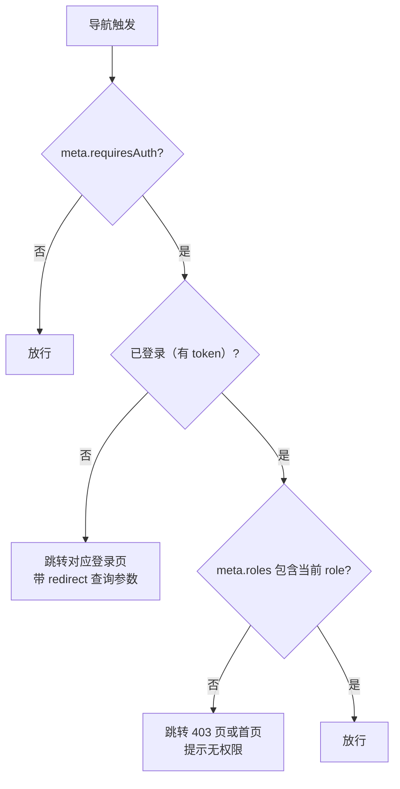
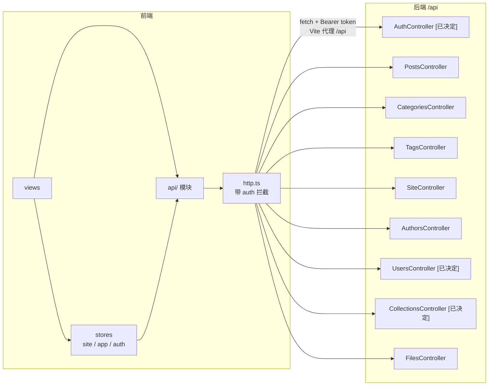
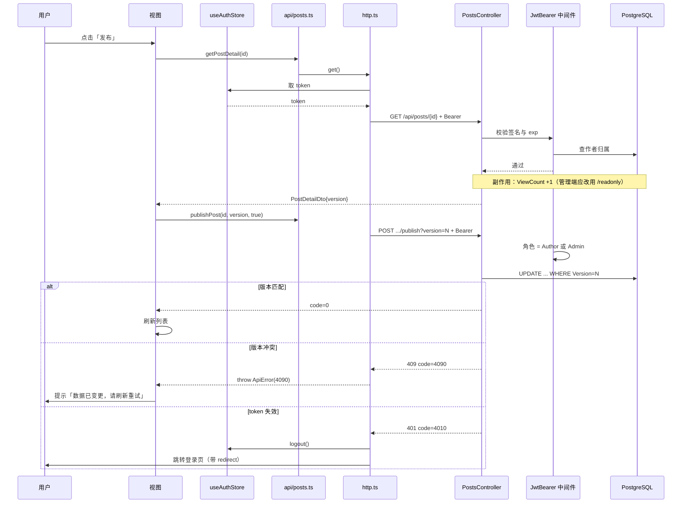

# 博客系统 前端技术文档

> 版本：v3.0 ｜ 编写日期：2026-09-10
> 依据：对 `Blog.FrontEnd/` 实际代码的核查 + 已拍板决策（见 [tech.md](./tech.md)）
> 配套文档：[business.md](./business.md) ｜ [backend.md](./backend.md) ｜ [tech.md](./tech.md) ｜ [suggestion.md](./suggestion.md)
>
> **状态标记**：`[已实现]` ｜ `[已决定]` 已拍板待实施 ｜ `[计划中]` ｜ `[已废弃]`

---

## 1. 技术栈与构建

### 1.1 依赖版本

来源：`Blog.FrontEnd/package.json`（`^`/`~` 为范围声明，精确版本见 `package-lock.json`）。

**运行时依赖**

| 包 | 声明版本 | 用途 |
|---|---|---|
| vue | ^3.5.41 | 框架 |
| vue-router | ^4.6.4 | 路由 |
| pinia | ^4.0.3 | 状态管理 |
| marked | ^18.0.11 | Markdown → HTML |
| dompurify | ^3.4.15 | HTML 消毒（XSS 防护） |
| @types/dompurify | ^3.0.5 | 类型（**位置不当**，见 §9.1 F8） |
| sass | ^1.104.0 | 样式预处理（当前源码用 `.css` + scoped style，未用 `.scss`） |

**开发依赖**

| 包 | 声明版本 | 用途 |
|---|---|---|
| vite | ^8.2.2 | 构建（实测 8.2.2） |
| @vitejs/plugin-vue | ^6.0.8 | SFC 支持 |
| typescript | ~6.0.2 | 类型系统 |
| vue-tsc | ^3.3.11 | 模板类型检查 |
| @vue/tsconfig | ^0.9.1 | 基础 tsconfig |
| @types/node | ^24.13.3 | Node 类型 |

> **不使用 Naive UI**（`[已决定]` E1/Q13）。早期文档声明使用 Naive UI，但 `package.json` 无该依赖、
> 源码无任何引用。实际为**自研 CSS 组件体系**（`styles/tokens.css` + 各组件 scoped style）。
> `[已决定]` 维持自研体系，**保留按需引入单个成熟组件的可能**（如仅引入日期选择器），
> 但不整体引入组件库（避免与 Aurora 设计体系大面积冲突）。
>
> **未创建的规划组件**：早期规划的 `PostSkeleton.vue`、`TagBadge.vue`、`EmptyState.vue`、
> `TimelineList.vue`、`TypewriterText.vue`、`ScrollDownButton.vue` **均不存在**，
> 对应能力已内联进 `PostCardList.vue`、`ArchiveView.vue`、`HeroSection.vue`。
> `[已决定]` 骨架屏将重新规划为**多套组件**（E11，见 §6.10）；标签/分类**不组件化**，保留全局样式（E13）。

### 1.2 构建与脚本

`package.json:6-10`：

| 脚本 | 命令 | 说明 |
|---|---|---|
| `dev` | `vite` | 开发服务器（mode = `development`） |
| `build` | `vue-tsc -b && vite build` | **先类型检查再构建**（mode = `production`） |
| `preview` | `vite preview` | 预览产物 |

### 1.3 环境变量（`[已决定]` E9）

**现状**：仓库**无任何 `.env` 文件**（`Blog.FrontEnd/.env*` 不存在），
API 基址依赖 `import.meta.env.VITE_API_BASE ?? ''`（`api/http.ts:14`）走空串 + Vite 代理，
而后端代理目标**硬编码**在 `vite.config.ts:18`（`http://localhost:5131`）。

**`[已决定]` 增加分环境配置**：

| 文件 | 用途 | 是否入库 |
|---|---|---|
| `.env` | 所有环境共享的默认值 | ✅ 入库 |
| `.env.development` | 开发环境（`vite dev` 时加载） | ✅ 入库（不含密钥） |
| `.env.production` | 生产环境（`vite build` 时加载） | ✅ 入库（不含密钥） |
| `.env.local` / `.env.*.local` | 本地覆盖与**敏感值** | ❌ **必须 gitignore** |

Vite 的加载规则：`vite dev` 用 `development` 模式、`vite build` 用 `production` 模式，
按 `.env` → `.env.[mode]` → `.env.[mode].local` 顺序覆盖。

**约定变量**：

```
# .env.development
VITE_API_BASE=            # 空串 → 走 Vite 代理（同源，无 CORS 问题）
VITE_PROXY_TARGET=http://localhost:5131

# .env.production
VITE_API_BASE=https://api.example.com   # 生产直连或走同域 /api
VITE_PROXY_TARGET=                       # 生产不使用代理
```

> **为什么开发期用空串 + 代理**：请求变成同源（`localhost:5173/api/...`），
> **完全避免 CORS 预检**，也使 `coverImage` 这类相对路径可直接使用。
>
> **`vite.config.ts` 需配套改造**：当前代理目标是硬编码常量，应改为读环境变量：

```ts
import { defineConfig, loadEnv } from 'vite'

export default defineConfig(({ mode }) => {
  const env = loadEnv(mode, process.cwd(), '')
  return {
    // ...
    server: {
      port: 5173,
      proxy: env.VITE_PROXY_TARGET
        ? { '/api': { target: env.VITE_PROXY_TARGET, changeOrigin: true } }
        : undefined,   // 生产不需要代理
    },
  }
})
```

> **安全约束**：`VITE_` 前缀的变量会被**打包进客户端产物，任何人可读**。
> 因此**绝不能**把密钥（JWT 签名密钥、数据库连接串）放进 `VITE_*`。这些只存在于后端。

### 1.4 其他配置

**`vite.config.ts`**：别名 `@` → `./src`（:8-12）、dev 端口 5173（:14）、代理 `/api`（:15-21）。

> 代理只覆盖 `/api`。文件接口已归入 `/api/files/**`，因此图片等资源同样走代理，无需额外配置。

**`tsconfig.app.json`**：继承 `@vue/tsconfig/tsconfig.dom.json`（:2）；
路径别名 `@/*` → `./src/*`（:11-13）；
`noUnusedLocals` / `noUnusedParameters` / `erasableSyntaxOnly` / `noFallthroughCasesInSwitch` 均为 `true`（:17-20）。

**`index.html`**：`lang="zh-CN"`（:2）、Google Fonts（Rubik / Noto Sans SC / Noto Sans Mono，:7-12）、静态 `<title>`（:13）。

> **首屏主题闪烁风险**：`stores/app.ts:16` 的 `apply()` 在 `main.ts:16`（挂载前）执行，
> 但它**不能阻止 HTML 首次渲染**。系统为亮色而用户选暗色时会有一次闪白。
> 修复方式：在 `<head>` 内联一段读取 `localStorage` 并设置 `data-theme` 的脚本（P1）。

---

## 2. 应用结构与启动

```
Blog.FrontEnd/src/
├── App.vue                  # 只有顶层 <RouterView />（7 行）
├── main.ts                  # createApp + Pinia + Router + v-typewriter 指令 + 主题应用
├── api/                     # http / posts / categories / tags / site / authors / files
│                            # [已决定] 新增 auth.ts / users.ts / collections.ts
├── components/
│   ├── admin/               # PostEditor、TaxonomyManager、[已决定] CollectionPicker
│   ├── common/              # NavBar、SiteFooter、PaginationBar、SocialIcon、GiscusComments
│   ├── hero/                # HeroSection
│   ├── post/                # PostCard、PostCardList
│   ├── search/              # SearchModal
│   └── skeleton/            # [已决定] 多套骨架屏组件（E11）
├── directives/              # typewriter.ts
├── layouts/                 # DefaultLayout、AdminLayout、[已决定] AuthorLayout
├── router/                  # index.ts
├── stores/                  # site.ts、app.ts（theme + search）、
│                            # [已决定] auth.ts（用户与 token）
├── styles/                  # tokens.css、global.css
├── types/                   # index.ts（与后端 DTO 对齐）
└── views/                   # 公开页 + 作者工作区 + 管理后台
```

**`main.ts` 启动序列**（`main.ts:10-17`）：

1. `createApp(App)`
2. `app.use(createPinia())`
3. `app.use(router)`
4. 注册全局指令 `v-typewriter`
5. `useThemeStore().apply()` —— **挂载前**把主题写入 `<html data-theme>`

**布局策略**：`App.vue` 只渲染顶层 `<RouterView />`，**不在全局套用任何布局**。
每个区域的布局在路由层声明，避免管理端被公开 NavBar（`position: fixed`）遮挡。

`[已决定]` 将有三个布局：

| 布局 | 适用 | 特征 |
|---|---|---|
| `DefaultLayout` | 公开页面 | NavBar + Footer + SearchModal |
| `AdminLayout` | 管理后台 `/admin/**` | 侧边栏 + 顶栏，无公开 NavBar |
| **`AuthorLayout`** | 作者工作区 `/me/**` | 轻量顶栏（我的文章 / 写文章 / 个人资料 / 退出登录） |

---

## 3. 路由与页面

### 3.1 路由总览

模式：`createWebHistory()`（`router/index.ts:3`）—— **生产部署必须配 history fallback**（见 [tech.md](./tech.md) §1.2）。
滚动行为：返回 `savedPosition ?? { top: 0 }`（:38-40）。

```mermaid
flowchart TB
  R["/"]

  R --> PUB["公开站点 → DefaultLayout"]
  R --> AUTH["认证页（无布局或极简布局）"]
  R --> ME["作者工作区 → AuthorLayout<br/>需 role=Author 或 Admin"]
  R --> ADM["管理后台 → AdminLayout<br/>需 role=Admin"]

  PUB --> P1["'' → HomeView"]
  PUB --> P2["post/:id → PostDetailView"]
  PUB --> P3["tags → TagsView"]
  PUB --> P4["categories → CategoriesView"]
  PUB --> P5["archive → ArchiveView"]
  PUB --> P6["posts → PostListView"]
  PUB --> P7["collections → CollectionListView<br/>[已决定]"]
  PUB --> P8["collections/:slug → CollectionDetailView<br/>[已决定]"]

  AUTH --> A1["login → AuthorLoginView<br/>[已决定]<br/>（无注册入口）"]
  AUTH --> A3["admin/login → AdminLoginView<br/>[已决定]"]

  ME --> M1["'' → MyPostsView 我的文章/草稿箱<br/>[已决定]"]
  ME --> M2["posts/new → MyPostNewView<br/>[已决定]"]
  ME --> M3["posts/:id/edit → MyPostEditView<br/>[已决定]"]
  ME --> M4["profile → MyProfileView<br/>[已决定]"]

  ADM --> D1["'' → AdminPostListView 全部文章"]
  ADM --> D2["posts/new → AdminPostNewView"]
  ADM --> D3["posts/:id/edit → AdminPostEditView"]
  ADM --> D4["categories → AdminCategoryListView"]
  ADM --> D5["tags → AdminTagListView"]
  ADM --> D6["site → AdminSiteConfigView"]
  ADM --> D7["users → AdminUserListView<br/>[已决定]"]
  ADM --> D8["authors → AdminAuthorListView<br/>[已决定]"]
  ADM --> D9["collections → AdminCollectionListView<br/>[已决定]"]

  R --> NF["/:pathMatch(.*)* → NotFoundView<br/>[已决定] 现为 redirect '/'"]
```



### 3.2 页面清单

**公开站点**

| # | 路由 | 视图 | 行数 | 状态 |
|---|---|---|---|---|
| 1 | `/` | `views/HomeView.vue` | 75 | `[已实现]` |
| 2 | `/post/:id` | `views/PostDetailView.vue` | 580 | `[已实现]` |
| 3 | `/tags` | `views/TagsView.vue` | 154 | `[已实现]` |
| 4 | `/categories` | `views/CategoriesView.vue` | 154 | `[已实现]` |
| 5 | `/archive` | `views/ArchiveView.vue` | 264 | `[已实现]`（时间轴**内联实现**） |
| 6 | `/posts` | `views/PostListView.vue` | 131 | `[已实现]` |
| 7 | `/collections` | `views/CollectionListView.vue` | — | `[已决定]` |
| 8 | `/collections/:slug` | `views/CollectionDetailView.vue` | — | `[已决定]` |
| — | 搜索 | `components/search/SearchModal.vue` | 227 | `[已实现]`（弹窗，非路由） |

**认证页** `[已决定]`

> `[已决定]` **没有注册页**（T1）：作者账号由管理员在 `/admin/users` 创建。
> 因此路由、视图、API 三处都不需要 register。

| # | 路由 | 说明 |
|---|---|---|
| 9 | `/login` | 作者登录 |
| 10 | `/admin/login` | 管理员登录（**无注册入口**） |

**作者工作区** `[已决定]`

| # | 路由 | 说明 |
|---|---|---|
| 12 | `/me` | 我的文章 + 草稿箱 |
| 13 | `/me/posts/new` | 写文章 |
| 14 | `/me/posts/:id/edit` | 编辑我的文章 |
| 15 | `/me/profile` | 个人资料（编辑自己的 `Author`） |

**管理后台**

| # | 路由 | 视图 | 行数 | 状态 |
|---|---|---|---|---|
| 16 | `/admin` | `AdminPostListView.vue` | 457 | `[已实现]` |
| 17 | `/admin/posts/new` | `AdminPostNewView.vue` | 49 | `[已实现]` |
| 18 | `/admin/posts/:id/edit` | `AdminPostEditView.vue` | 90 | `[已实现]` |
| 19 | `/admin/categories` | `AdminCategoryListView.vue` | 15 | `[已实现]` |
| 20 | `/admin/tags` | `AdminTagListView.vue` | 15 | `[已实现]` |
| 21 | `/admin/site` | `AdminSiteConfigView.vue` | 532 | `[已实现]` |
| 22 | `/admin/profile` | `AdminProfileView.vue` | 341 | `[需调整]` 按新模型并入作者管理 |
| 23 | `/admin/users` | — | — | `[已决定]` |
| 24 | `/admin/authors` | — | — | `[已决定]` |
| 25 | `/admin/collections` | — | — | `[已决定]` |

**错误页**

| # | 路由 | 状态 |
|---|---|---|
| 26 | `/:pathMatch(.*)*` → `NotFoundView` | `[已决定]` 当前为 `redirect: '/'`（软 404） |

> **当前问题**：未匹配路由静默重定向首页（`router/index.ts:36`）。
> 用户无法区分「页面不存在」与「正常打开首页」，且服务器始终返回 200 → 产生软 404，浪费爬虫抓取预算。

### 3.3 路由守卫（`[已决定]`）



**路由 meta 约定**：

| meta | 含义 |
|---|---|
| `requiresAuth` | 是否需要登录 |
| `roles` | 允许的角色数组（`['Admin']` / `['Author','Admin']`） |

**关键注意事项**：

1. `/admin/login` 与 `/login` 本身**不能**设 `requiresAuth`（否则死循环）
2. 守卫只做**前端体验**控制，**真正的安全边界在后端**。前端守卫可被绕过（改 JS 即可），
   因此所有受保护操作**必须**在后端再次校验
3. 登录成功后跳回 `redirect` 参数指定的原页面，提升体验

---

## 4. 状态管理（Pinia）

| Store | 文件 | State | Actions |
|---|---|---|---|
| `useThemeStore` | `stores/app.ts:6-20` | `theme: 'dark' \| 'light'`（初值读 `localStorage['blog-theme']`，默认 dark） | `apply()` 写 `<html data-theme>`；`toggle()` |
| `useSearchStore` | `stores/app.ts:23-33` | `open: boolean` | `show()` / `hide()` |
| `useSiteStore` | `stores/site.ts` | `config`、`socialLinks`、`stats`、`loaded` | `ensureLoaded()`（并发拉三接口，幂等）、`refreshStats()`、`refreshAll()` |
| **`useAuthStore`** | `[已决定]` `stores/auth.ts` | `token`、`role`、`user`、`expiresAt` | `login()`、`logout()`、`isAuthenticated`、`hasRole()`、`restore()` |

**设计选择**：

- 站点配置/社交链接/统计**缓存在 store**，避免全站重复请求（`stores/site.ts:5` 注释）
- 三个请求各自 `catch` 兜底，任一失败不阻塞其余（`:16-20`）
- **文章列表状态不使用 store**（`[已决定]` E12）：留在各视图的 `ref` + 路由 query。
  理由：列表状态生命周期短，放 store 反而需要手动清理，收益为负。
- `[已决定]` `useAuthStore` 负责 token 的读写与持久化；`http.ts` 从它取 token 注入请求头

> **SSR 隐患**：`stores/app.ts:8` 在 store 初始化时直接读 `localStorage`。
> 当前纯客户端渲染没问题，但若将来引入 SSR/预渲染会立即报错（见 [tech.md](./tech.md) §6.3）。

---

## 5. API 层

### 5.1 统一封装 `api/http.ts`

| 能力 | 实现 | 行号 |
|---|---|---|
| BASE 来源 | `import.meta.env.VITE_API_BASE ?? ''` | 14 |
| 请求 | `fetch` 包装 | 16-38 |
| Content-Type | 非 FormData 设 `application/json`；**FormData 不设**（浏览器生成 boundary） | 20-22 |
| 网络异常 | throw `ApiError(-1, '网络异常…')` | 25-27 |
| 响应解包 | 解析 `ApiResponse<T>`，`code !== 0` → throw `ApiError(code, message)` | 30-37 |
| 非 JSON 兜底 | 429 专门文案，其他 `HTTP {status}` | 31-33 |
| 便捷方法 | `get`（自动序列化 query）、`post`、`put`、`del`、`upload` | 40-71 |

`[已决定]` **需增加的认证相关能力**：

| 能力 | 实现要点 |
|---|---|
| 注入 token | 从 `useAuthStore` 取，加 `Authorization: Bearer <token>` **请求头** |
| 401 全局处理 | 捕获 `code === 4010` → 清空 auth store → 跳登录页（带 `redirect`） |
| 403 处理 | `code === 4030` → 提示「无权限」，**不**跳登录（已登录只是权限不足） |
| 4090 自动恢复 | 捕获 `code === 4090` → 重新拉取最新 `version` → 提示用户重试（P1） |
| 429 感知 | 读 `Retry-After` 响应头做倒计时（P1） |

> `ApiError.code` **目前已携带后端业务码，但没有任何调用方使用**（F3）。
> 认证上线后必须用起来，否则 401/403/4090 无法差异化处理。

### 5.2 模块划分

**现有**

| 模块 | 文件 | 行数 | 导出 |
|---|---|---|---|
| 文章 | `api/posts.ts` | 72 | `getPosts`、`getPostDetail`、`searchPosts`、`getArchives`、`createPost`、`updatePost`、`publishPost`、`deletePost` |
| 分类 | `api/categories.ts` | 17 | CRUD |
| 标签 | `api/tags.ts` | 17 | CRUD |
| 站点 | `api/site.ts` | 32 | `getSiteConfig`、`updateSiteConfig`、`getSocialLinks`、`saveSocialLinks`、`deleteSocialLink`、`getSiteStats` |
| 作者 | `api/authors.ts` | 22 | `getAuthors`、`getAuthor`、`updateAuthor` |
| 文件 | `api/files.ts` | 6 | `uploadFile(file) → Promise<string>` |

**`[已决定]` 新增**

| 模块 | 导出 |
|---|---|
| `api/auth.ts` | `authorLogin`、`authorRegister`、`adminLogin`、`logout`、`getMe` |
| `api/users.ts` | `getUsers`、`createUser`、`updateUser`、`disableUser` |
| `api/collections.ts` | `getCollections`、`getCollection(slug)`、CRUD |
| `api/posts.ts` 增补 | `getPostDetailReadonly(id)`（不计数，修 P1-2）、`getMyPosts()` |

> **乐观锁的前端约定**：`updatePost` 在 `payload.version == null` 时**主动抛错**（`api/posts.ts:52`），
> 把「必须带版本号」固化在 API 层，是良好实践，应推广到所有写接口。

### 5.3 类型定义 `types/index.ts`

与后端 DTO 一一对齐。要点：

| 类型 | 对应后端 | 注意 |
|---|---|---|
| `PagedResult<T>` | `Common/PagedResult.cs` | **字段是 `total`**，不是 `totalCount` |
| `PostListItemDto` | `PostDtos.cs` 的 `PostCardDto` | 无 `wordCount` |
| `PostDetailDto` | `PostDetailDto` | 含 `version`、`wordCount` |
| `SiteConfigDto` | `Site/SiteDtos.cs` | 含 `versions: Record<string, number>` |
| `AuthorDto` | `Author/AuthorDto.cs` | 含 `version` |
| **`UserDto`** | `[已决定]` | **绝不含 `passwordHash`** |
| **`LoginResponse`** | `[已决定]` | `{ token, expiresAt, role, user }` |
| **`CollectionDto`** | `[已决定]` | 专栏 |
| `SiteConfigKey`（常量） | `SiteConfigKeys` | 4 个 key 的前端镜像 |

> **类型同步风险（F2）**：`types/index.ts` 是**手写契约**，后端改字段前端不会报错。
> 本项目已因此出过一次缺陷（`totalCount` vs `total` 导致「共 N 篇」显示 `undefined`）。
> `[已决定]` 中长期应改为由后端 OpenAPI **生成类型**（P1）。

---

## 6. 组件体系

### 6.1 现有组件

| 组件 | 文件 | 行数 | 职责 |
|---|---|---|---|
| `NavBar` | `components/common/NavBar.vue` | 200 | 固定顶栏；滚动 >40px 加毛玻璃；5 个导航项；搜索；主题切换 |
| `SiteFooter` | `components/common/SiteFooter.vue` | 124 | 品牌 + 4 项统计 |
| `PaginationBar` | `components/common/PaginationBar.vue` | 109 | 分页器 + 智能省略号 |
| `SocialIcon` | `components/common/SocialIcon.vue` | 20 | 4 个内置图标；**未知 key 回退 rss** |
| `GiscusComments` | `components/common/GiscusComments.vue` | 54 | 动态注入 giscus + 主题联动 |
| `HeroSection` | `components/hero/HeroSection.vue` | 208 | 首屏；打字机；浮动动画；社交图标 |
| `PostCard` | `components/post/PostCard.vue` | 151 | 卡片 |
| `PostCardList` | `components/post/PostCardList.vue` | 127 | 响应式栅格 + 内联骨架 + 分页器 |
| `SearchModal` | `components/search/SearchModal.vue` | 227 | 弹窗；300ms 防抖 |
| `PostEditor` | `components/admin/PostEditor.vue` | 383 | 编辑器；内联新建分类/标签 |
| `TaxonomyManager` | `components/admin/TaxonomyManager.vue` | 337 | 分类/标签共用管理 UI（props 注入 CRUD） |
| `v-typewriter` | `directives/typewriter.ts` | 74 | 打字机指令 |

**复用设计亮点**：`TaxonomyManager` 通过 props 接收 `load/create/update/remove`，
使分类页与标签页各自只有 **15 行**，差异完全由 `kind` 与注入的函数决定。

### 6.2 `[已决定]` 新增组件

| 组件 | 用途 |
|---|---|
| `AuthorLayout` | 作者工作区布局 |
| `CollectionPicker` | 编辑器内选择专栏 |
| `CollectionCard` | 专栏卡片 |
| 骨架屏组件组 | E11，见 §6.10 |
| `AuthGuard` 相关 composable | 路由守卫逻辑（`useRequireAuth`） |

### 6.3 评论

- giscus 提供（`GiscusComments.vue:12-31`），配置：repo `whyitsy/blog-comment`、category `Announcements`、`data-mapping="pathname"`、`data-lang="zh-CN"`
- 主题联动：`MutationObserver` 监听 `data-theme` 并重载（`:35-40`）
- 挂在详情页尾部（`PostDetailView.vue:200`）
- **风险**：评论串按 pathname 映射，文章 URL 变更会导致评论失联

### 6.4 点赞 / 订阅

| 功能 | 状态 |
|---|---|
| 点赞 / 收藏 | `[计划中]` 无实现 |
| 订阅（RSS/邮件/推送） | `[计划中]` 无。`SocialIcon` 里的 `rss` 只是可配置外链图标 |

### 6.5 SEO / meta

`[已决定]` **本期不做**（Q11）。完整技术分析见 [tech.md](./tech.md) §6。

| 项 | 状态 |
|---|---|
| 静态 title | `[已实现]` `index.html:13` |
| 详情页动态 title | `[已实现]` `PostDetailView.vue:36` |
| 列表/分类/标签/专栏页 title | `[计划中]` |
| `meta description` / OG / Twitter Card | `[计划中]` |
| JSON-LD 结构化数据 | `[计划中]` |
| `sitemap.xml` / `robots.txt` | `[计划中]` |
| canonical URL | `[计划中]` |
| SSR / 预渲染 | `[计划中]` |

**待修的具体问题**：全站仅 1 处 `document.title` 赋值，且详情页 title 中的站点名是**硬编码** `kky's blog`，
未使用 `site.config.siteName`（与 NavBar/Footer 从 store 取值的做法不一致）。

### 6.6 暗黑模式

| 项 | 实现 | 依据 |
|---|---|---|
| 默认 | dark | `stores/app.ts:8` |
| 持久化 | `localStorage['blog-theme']` | `:3, 16` |
| 应用方式 | `<html data-theme="dark\|light">` | `:12` |
| 变量定义 | `:root` 为暗色默认 | `styles/tokens.css:4-84` |
| 亮色覆盖 | `[data-theme="light"], :root[data-theme="light"]` | `tokens.css:93-94` |
| 系统亮色跟随 | `@media (prefers-color-scheme: light) { :root:not([data-theme="dark"]) }` | `tokens.css:136-137` |
| giscus 联动 | `MutationObserver` 重载 | `GiscusComments.vue:35-40` |

> **主题优先级已验证正确**：系统亮色 + 用户手动选暗色时，
> `@media` 规则用了 `:root:not([data-theme="dark"])` 守卫，**不会**覆盖用户显式选择。无需修改。
>
> **待修**：首屏闪烁（无内联主题脚本，P1）。

### 6.7 响应式

| 断点 | 使用位置 | 效果 |
|---|---|---|
| `max-width: 640px` | `PostEditor`、`TaxonomyManager`、`NavBar` | 隐藏搜索文案、表单/表格单列化 |
| `max-width: 767px` | `PostCardList` | 卡片单列 |
| `max-width: 880px` | `AdminLayout`、`AdminPostListView` | 侧边栏折叠为横向 tab；表格退化为可折叠卡片 |
| `max-width: 1023px` | `PostDetailView` | 隐藏右侧 TOC |
| `max-width: 1199px` | `PostCardList` | 卡片两列 |

`≥1200px` 三列 / `768–1199px` 两列 / `<768px` 单列。布局主要用 CSS Grid + Flexbox。

### 6.8 可访问性

| 项 | 状态 | 依据 |
|---|---|---|
| `prefers-reduced-motion` 降级 | `[已实现]` | `styles/global.css:170-180` |
| ARIA / role | `[部分实现]` | 全站约 8 处 |
| 键盘可达 | `[部分实现]` | 原生元素可聚焦；`TaxonomyManager` 支持 Enter/Esc |
| 焦点管理 | `[计划中]` | `SearchModal` 无焦点陷阱；关闭后未归还焦点 |
| 跳转链接（skip link） | `[计划中]` | 无 |
| 颜色对比度 | `TODO` | 未做工具化校验 |
| 图片 alt | `[部分实现]` | 未全站核查 |
| 语义化标签 | `[已实现]` | `header/nav/main/footer/aside/article/section` |

### 6.9 国际化

`[已决定]` **不做**（Q10）。全站文案中文硬编码，`index.html:2` 为 `lang="zh-CN"`。

### 6.10 骨架屏规划（`[已决定]` E11）

现状只有 `PostCardList.vue` 内联的卡片骨架（12 个占位）与管理端列表的行骨架。

`[已决定]` 规划为**多套独立组件**，放在 `components/skeleton/`：

| 组件 | 适用页面 | 形态 |
|---|---|---|
| `PostCardSkeleton` | 首页 / 列表页 | 卡片栅格（复用现有实现） |
| `PostListRowSkeleton` | 管理端 / 我的文章表格 | 行占位 |
| `PostDetailSkeleton` | 文章详情 | 标题 + 正文段落 + 侧栏 TOC |
| `ArchiveSkeleton` | 归档 | 时间轴节点 |
| `TaxonomySkeleton` | 标签墙 / 分类墙 / 专栏墙 | 按钮/卡片网格 |
| `SiteConfigSkeleton` | 站点配置表单 | 表单域占位 |
| `ProfileSkeleton` | 个人资料 / 用户编辑 | 头像 + 表单 |

**收益**：统一视觉、消除各视图重复的 loading 分支（F4）、便于按页面调优感知性能。

### 6.11 标签 / 分类样式（`[已决定]` E13）

- **不组件化**：不规划 `TagBadge.vue` / `CategoryBadge.vue` 组件
- **保留全局样式**：沿用 `styles/global.css:111-122` 的 `.tag-badge` 全局类
- **待补齐**：**分类样式当前缺失**。需要为分类补一个与标签并列但可区分的全局类（如 `.category-badge`），
  视觉上应能一眼区分二者（建议用不同色调或加前缀图标）

---

## 7. 前后端接口交互

### 7.1 交互全景



### 7.2 页面 ↔ 接口映射

| 页面 | 接口 |
|---|---|
| `HomeView` | `GET /api/posts?page=&pageSize=12` |
| `PostDetailView` | `GET /api/posts/{id}`（**计数**）；管理端用 `/readonly`（不计数） |
| `TagsView` / `CategoriesView` | `GET /api/tags` / `GET /api/categories` |
| `ArchiveView` | `GET /api/posts/archives` |
| `PostListView` | `GET /api/posts`（tagId/categoryId）或 `GET /api/posts/search`（keyword） |
| `CollectionListView` | `[已决定]` `GET /api/collections` |
| `CollectionDetailView` | `[已决定]` `GET /api/collections/{slug}` |
| `SearchModal` | `GET /api/posts/search?keyword=&page=1&pageSize=10` |
| `SiteFooter` | `GET /api/site/stats`（经 store） |
| `HeroSection` | 读 store |
| `AuthorLoginView` | `[已决定]` `POST /api/auth/author/login` |
| `AdminLoginView` | `[已决定]` `POST /api/auth/admin/login` |
| `MyPostsView` | `[已决定]` `GET /api/posts?includeUnpublished=true&mine=true` |
| `MyProfileView` | `[已决定]` `GET /api/authors/{me}` + `PUT /api/authors/{id}` |
| `AdminPostListView` | `GET /api/posts?includeUnpublished=true`；操作前 `GET /api/posts/{id}` 取 version；`POST .../publish`；`DELETE ...?version=` |
| `AdminPostNewView` / `EditView` | `POST /api/posts` / `PUT /api/posts/{id}` |
| `AdminCategoryListView` / `TagListView` | 对应 CRUD（经 `TaxonomyManager` 注入） |
| `AdminProfileView` | `GET /api/authors`、`PUT /api/authors/{id}`、`POST /api/files/upload` |
| `AdminSiteConfigView` | `GET/PUT /api/site/config`、`GET/PUT/DELETE /api/site/social-links`、`POST /api/files/upload` |
| `AdminUserListView` | `[已决定]` `/api/users` CRUD |
| `AdminAuthorListView` | `[已决定]` `/api/authors` CRUD |
| `AdminCollectionListView` | `[已决定]` `/api/collections` CRUD |

### 7.3 一次受保护写操作的完整往返



### 7.4 接口约定的前端侧落实

| 后端约定 | 前端落实 | 状态 |
|---|---|---|
| 响应体 `{code,message,data}` | `http.ts:30-37` 统一解包 | `[已实现]` |
| `code!==0` 视为业务错误 | throw `ApiError` | `[已实现]` |
| 分页字段 `total` | `types/index.ts` | `[已实现]` |
| 写操作必须带 `version` | `api/posts.ts:52` 主动校验；其余页面从 GET 结果取 | `[已实现]` |
| `pageSize` 上限 | 前端未主动约束（公开页 12，管理页 20） | `[部分实现]` |
| **`401`/`4010` 未认证** | `[已决定]` 全局拦截 → 清凭证 + 跳登录 | 待实现 |
| **`403`/`4030` 无权限** | `[已决定]` 提示无权限，不跳登录 | 待实现 |
| `4090` 并发冲突 | 仅显示后端消息，**无自动刷新重试** | `[部分实现]` |
| `429` 限流 | 有专门文案，**无 `Retry-After` 感知** | `[部分实现]` |

---

## 8. 当前已实现功能清单

### 8.1 公开站点 `[已实现]`

- 首页：Hero（打字机、浮动动画、社交图标）+ 最新文章卡片 + 分页 + 锚点滚动
- 详情页：Markdown（marked）+ XSS 消毒（DOMPurify）+ 自动 TOC + 阅读进度 + 浏览量 + giscus
- 标签墙 / 分类墙：按钮式 + 文章数徽标
- 归档：年/月分组时间轴（内联实现）
- 通用列表：按标签/分类筛选、关键词搜索、分页
- 搜索弹窗：300ms 防抖
- 全站：明暗主题（持久化）、响应式（5 档断点）、动画降级、骨架屏、空状态/错误提示、Footer 统计

### 8.2 管理端 `[已实现]`

- 独立 `AdminLayout`（侧边栏 + 顶栏，窄屏折叠）
- 文章：列表（含草稿/分页/骨架/窄屏折叠卡片）、新建、编辑、发布、下架、软删除
- 编辑器：Markdown 文本区、封面 URL、分类下拉、标签多选、**内联新建分类/标签**、实时字数与阅读时长、发布开关
- 分类/标签：列表 + 新增 + 行内改名 + 删除（乐观锁）
- 用户资料：name/email/avatar/bio + 头像上传（含 `@error` 首字母兜底）
- 网站配置：站点名、首屏副标题、背景图（URL/上传 + 预览）、建站日期；社交链接增删改 + 显示隐藏

### 8.3 历次修复记录

| 问题 | 修复 |
|---|---|
| 文章管理页 h1 被固定 NavBar 遮挡 | 引入独立 `AdminLayout`，路由层拆分公开/管理布局 |
| `PagedResult.totalCount` 与后端 `total` 不一致 → 「共 N 篇」显示 `undefined` | 类型与 3 处调用点改名为 `total` |
| `PostListItemDto` 声明了后端不存在的 `wordCount` | 移除 |
| NavBar「管理」入口在 `/admin/*` 子页不高亮 | 改用前缀匹配 |
| `http.ts` 对 FormData 预设 JSON Content-Type 导致上传失败 | 按 body 类型决定是否设置 |
| 配置项写入非法 version 抛 5000 | 区分「新增（忽略 version）/ 更新（校验）」 |

---

## 9. 未来拓展与改善（分优先级）

### P0 — 阻塞公开上线

| # | 项 | 理由 | 成本 | 风险 |
|---|---|---|---|---|
| P0-1 | **登录页 ×3 + `useAuthStore` + 路由守卫 + token 注入** | `/admin` 与 `/me` 当前无任何访问控制，任何人输入 URL 即可删文改配置 | 中 | 中：`http.ts` 是单一出口，改造点集中但影响全部请求；需与后端 JWT 契约同步 |
| P0-2 | **`http.ts` 401/403 统一处理** | token 过期必须全局登出而非到处报错 | 低 | 低 |
| P0-3 | **移除本地凭证时的清理完整性** | 登出需清空 auth store + localStorage，避免残留 | 低 | 低 |

### P1 — 重要，不阻塞上线

| # | 项 | 理由 | 成本 | 风险 |
|---|---|---|---|---|
| P1-1 | `.env` 分环境 + `vite.config.ts` 读环境变量 | 当前代理目标硬编码，无法按环境切换 | 极低 | 低 |
| P1-2 | 4090 并发冲突自动恢复 | 当前只弹错误，用户需手动刷新；`ApiError.code` 已就绪未用 | 低 | 低 |
| P1-3 | 429 感知 `Retry-After` | 无倒计时/自动重试 | 低 | 低 |
| P1-4 | **多套骨架屏组件**（E11） | 当前各视图各写 loading 分支，重复且不一致 | 低 | 低 |
| P1-5 | **补齐分类全局样式**（E13） | 分类样式缺失，与标签无法区分 | 极低 | 低 |
| P1-6 | 独立 404 页 + `router.onError` | 当前静默重定向首页，产生软 404 | 低 | 低 |
| P1-7 | 详情页 title 改用 `siteStore.config.siteName` | 当前硬编码站名，改站名不生效 | 极低 | 低 |
| P1-8 | 首屏主题闪烁修复 | `<head>` 内联脚本读取 localStorage | 低 | 低 |
| P1-9 | 搜索弹窗可访问性（焦点陷阱 + Esc） | 无焦点管理 | 低 | 低 |
| P1-10 | 统一 loading/error 组件 | 13 个视图重复实现（F4） | 低—中 | 中：改动面广 |
| P1-11 | 前端测试（Vitest + Playwright） | 当前零测试 | 中—高 | 低（纯增量） |
| P1-12 | 类型由 OpenAPI 生成 | 手写契约无强制同步（F2），已出过缺陷 | 中 | 中：需后端接口先稳定 |

### P2 — 长期

| # | 项 | 理由 | 成本 | 风险 |
|---|---|---|---|---|
| P2-1 | SEO：预渲染 + meta 管理 + sitemap | 见 [tech.md](./tech.md) §6 | 中 | 中 |
| P2-2 | SSR / SSG 迁移 | 根治 SEO 与首屏；但 `stores/app.ts:8` 的 localStorage 会直接报错 | 高 | 高 |
| P2-3 | 按需引入单点成熟组件 | Q13 已保留该可能（如日期选择器、虚拟列表） | 低—中 | 中：需与 Aurora 设计体系调和 |
| P2-4 | PWA / 离线缓存 | 博客场景收益中等 | 中 | 低 |
| P2-5 | 富文本 / WYSIWYG 编辑器 | 当前纯 Markdown 文本区 | 中—高 | 中：Markdown 保真 |
| P2-6 | 图片懒加载 + 响应式图片 | 当前无 `loading="lazy"` / `srcset` | 低 | 低 |
| P2-7 | 打包体积优化 | 详情页 chunk 约 75KB（gzip 26KB，含 marked+DOMPurify） | 低—中 | 低 |
| P2-8 | 埋点（umami / Plausible） | 无任何行为数据 | 低—中 | 低 |

### 9.1 前端技术债

| # | 债务 | 位置 | 影响 |
|---|---|---|---|
| F1 | 零测试 | `package.json` 无测试依赖 | 重构无安全网（P1-11） |
| F2 | 手写 DTO 类型，无强制同步 | `types/index.ts` | 已因 `totalCount` 出过缺陷（P1-12） |
| F3 | `ApiError.code` 未被任何调用方使用 | `http.ts:4-12` | 401/403/4090 无法差异化处理（P0-1/P1-2） |
| F4 | loading/error 分支在各视图重复 | 13 个视图 | 维护成本（P1-10） |
| F5 | 无 404 页，通配路由静默重定向 | `router/index.ts:36` | 体验与 SEO（P1-6） |
| F6 | 详情页 title 中站点名硬编码 | `PostDetailView.vue:36` | 改站名不生效（P1-7） |
| F7 | 首屏主题闪烁 | `index.html` 无内联主题脚本 | 亮色系统下闪白（P1-8） |
| F8 | `@types/dompurify` 放在 `dependencies` | `package.json:12` | dompurify v3 已自带类型，该包可能无用 |
| F9 | Google Fonts 外部依赖无本地兜底 | `index.html:7-12` | 网络受限时字体降级与阻塞 |
| F10 | 代理目标硬编码 | `vite.config.ts:18` | 无法按环境切换（P1-1） |
| F11 | 分类样式缺失 | `styles/global.css` | 分类与标签无视觉区分（P1-5） |
| F12 | 早期规划组件未创建且文档未更新 | `docs/`（已清理） | 已通过本轮文档重写消除 |
