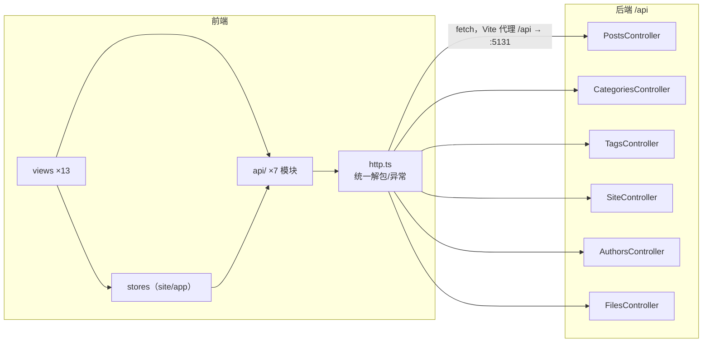
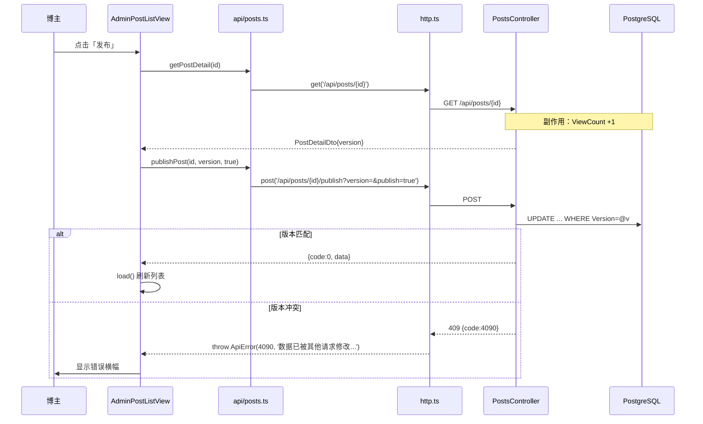

# 博客系统 前端技术文档

> 版本：v2.0 ｜ 编写日期：2026-09-10
> 依据：对 `Blog.FrontEnd/` 实际代码的核查；历史规划见 `docs/04-前端页面路由规划.md`
> 配套文档：[business.md](./business.md) ｜ [backend.md](./backend.md) ｜ [suggestion.md](./suggestion.md)
>
> **状态标记**：`[已实现]` ｜ `[计划中]` ｜ `[已废弃]`

---

## 1. 技术栈与构建

### 1.1 依赖版本

来源：`Blog.FrontEnd/package.json`（`^` 为允许次版本升级的范围声明，非锁定值；精确版本见 `package-lock.json`）。

**运行时依赖**

| 包 | 声明版本 | 用途 |
|---|---|---|
| vue | ^3.5.41 | 框架 |
| vue-router | ^4.6.4 | 路由 |
| pinia | ^4.0.3 | 状态管理 |
| marked | ^18.0.11 | Markdown → HTML |
| dompurify | ^3.4.15 | HTML 消毒（XSS 防护） |
| @types/dompurify | ^3.0.5 | 类型（放在 dependencies） |
| sass | ^1.104.0 | 样式预处理（当前源码为 `.css` + scoped style，未使用 `.scss`） |

**开发依赖**

| 包 | 声明版本 | 用途 |
|---|---|---|
| vite | ^8.2.2 | 构建 |
| @vitejs/plugin-vue | ^6.0.8 | SFC 支持 |
| typescript | ~6.0.2 | 类型系统（`~` 锁次版本） |
| vue-tsc | ^3.3.11 | 模板类型检查 |
| @vue/tsconfig | ^0.9.1 | 基础 tsconfig |
| @types/node | ^24.13.3 | Node 类型 |

> **无 Naive UI**：`docs/05-系统架构与设计文档.md:20` 与 `docs/04-前端页面路由规划.md:3` 均声明使用 Naive UI，
> 但 `package.json` 中**没有该依赖**，源码中也无任何 `n-xxx` 组件或 `naive-ui` 导入。
> 实际 UI 是**自研 CSS 组件体系**（`styles/tokens.css` + 各组件 scoped style）。这是文档与实现的不一致，见 [suggestion.md](./suggestion.md) Q8。
> 同理 `docs/04` 提到的 `PostSkeleton.vue`、`TagBadge.vue`、`EmptyState.vue`、`TimelineList.vue`、`TypewriterText.vue`、`ScrollDownButton.vue`
> **均未创建**，对应能力已内联进 `PostCardList.vue`、`ArchiveView.vue`、`HeroSection.vue`。

### 1.2 构建与脚本

`package.json:6-10`：

| 脚本 | 命令 | 说明 |
|---|---|---|
| `dev` | `vite` | 开发服务器 |
| `build` | `vue-tsc -b && vite build` | **先类型检查再构建** |
| `preview` | `vite preview` | 预览产物 |

### 1.3 关键配置

**`vite.config.ts`**

| 配置 | 值 | 行号 |
|---|---|---|
| 别名 | `@` → `./src` | 8-12 |
| dev 端口 | `5173` | 14 |
| 代理 | `/api` → `http://localhost:5131`，`changeOrigin: true` | 15-21 |

> 代理只覆盖 `/api`。后端文件接口也已归入 `/api/files/**`，因此图片等资源同样走代理，无需额外配置（`vite.config.ts:16` 注释）。
> **注意**：`docs/04-前端页面路由规划.md:90` 写 `VITE_API_BASE=http://localhost:5000`，与实际端口 5131 不符；
> 且仓库**不存在 `.env` 文件**，`BASE` 实际为空串（走同源 + Vite 代理）。

**`tsconfig.app.json`**

| 选项 | 值 | 行号 |
|---|---|---|
| 继承 | `@vue/tsconfig/tsconfig.dom.json` | 2 |
| 路径别名 | `@/*` → `./src/*` | 11-13 |
| `noUnusedLocals` / `noUnusedParameters` | `true` | 17-18 |
| `erasableSyntaxOnly` | `true` | 19 |
| `noFallthroughCasesInSwitch` | `true` | 20 |

**`index.html`**：`lang="zh-CN"`（:2）、Google Fonts（Rubik / Noto Sans SC / Noto Sans Mono，:7-12）、静态 `<title>`（:13）。

---

## 2. 应用结构与启动

```
Blog.FrontEnd/src/
├── App.vue                  # 只有顶层 <RouterView />（7 行）
├── main.ts                  # createApp + Pinia + Router + v-typewriter 指令 + 主题应用
├── api/                     # 7 个模块：http / posts / categories / tags / site / authors / files
├── components/
│   ├── admin/               # PostEditor、TaxonomyManager
│   ├── common/              # NavBar、SiteFooter、PaginationBar、SocialIcon、GiscusComments
│   ├── hero/                # HeroSection
│   ├── post/                # PostCard、PostCardList
│   └── search/              # SearchModal
├── directives/              # typewriter.ts
├── layouts/                 # DefaultLayout、AdminLayout
├── router/                  # index.ts（43 行）
├── stores/                  # site.ts、app.ts（theme + search）
├── styles/                  # tokens.css、global.css
├── types/                   # index.ts（与后端 DTO 对齐）
└── views/                   # 13 个页面视图
```

**`main.ts` 启动序列**（`main.ts:10-17`）：
1. `createApp(App)`
2. `app.use(createPinia())`
3. `app.use(router)`
4. 注册全局指令 `v-typewriter`
5. `useThemeStore().apply()` —— **在挂载前**把主题写入 `<html data-theme>`

**布局策略**：`App.vue` 只渲染顶层 `<RouterView />`，**不在全局套用任何布局**。
公开站点与管理端各自在路由层声明布局组件，避免管理端被公开 NavBar（`position: fixed`）遮挡。

---

## 3. 路由与页面

### 3.1 路由表

来源：`src/router/index.ts:5-37`。模式：`createWebHistory()`（:3，需服务器 history fallback）。
滚动行为：返回 `savedPosition ?? { top: 0 }`（:38-40）。

```mermaid
flowchart TB
  R["/ (根)"]
  R --> PUB["/ → DefaultLayout<br/>NavBar + Footer + SearchModal"]
  R --> ADM["/admin → AdminLayout<br/>侧边栏 + 顶栏，无公开 NavBar"]

  PUB --> P1["'' → HomeView<br/>name: home"]
  PUB --> P2["post/:id → PostDetailView<br/>name: post-detail"]
  PUB --> P3["tags → TagsView<br/>name: tags"]
  PUB --> P4["categories → CategoriesView<br/>name: categories"]
  PUB --> P5["archive → ArchiveView<br/>name: archive"]
  PUB --> P6["posts → PostListView<br/>name: post-list"]

  ADM --> A1["'' → AdminPostListView<br/>name: admin-posts"]
  ADM --> A2["posts/new → AdminPostNewView<br/>name: admin-post-new"]
  ADM --> A3["posts/:id/edit → AdminPostEditView<br/>name: admin-post-edit"]
  ADM --> A4["categories → AdminCategoryListView<br/>name: admin-categories"]
  ADM --> A5["tags → AdminTagListView<br/>name: admin-tags"]
  ADM --> A6["profile → AdminProfileView<br/>name: admin-profile"]
  ADM --> A7["site → AdminSiteConfigView<br/>name: admin-site"]

  R --> NF["/:pathMatch(.*)* → redirect '/'"]
```



> 全部路由组件使用**动态 import**（懒加载），Vite 会按路由拆分 chunk。

### 3.2 页面清单与实现状态

| # | 路由 | 视图文件 | 行数 | 状态 | 说明 |
|---|---|---|---|---|---|
| 1 | `/` | `views/HomeView.vue` | 75 | `[已实现]` | Hero + 最新文章；`?page=` 同步分页，切换时 `scrollIntoView('#post-list')` |
| 2 | `/post/:id` | `views/PostDetailView.vue` | 580 | `[已实现]` | Markdown、TOC、阅读进度、浏览量、giscus |
| 3 | `/tags` | `views/TagsView.vue` | 154 | `[已实现]` | 按钮墙 + 数量徽标 |
| 4 | `/categories` | `views/CategoriesView.vue` | 154 | `[已实现]` | 同上 |
| 5 | `/archive` | `views/ArchiveView.vue` | 264 | `[已实现]` | 年/月分组时间轴（**内联实现**，非独立组件） |
| 6 | `/posts` | `views/PostListView.vue` | 131 | `[已实现]` | 支持 `?tagId=&categoryId=&keyword=&page=` |
| 7 | `/admin` | `views/AdminPostListView.vue` | 457 | `[已实现]` | 含草稿、分页、骨架屏、窄屏折叠卡片 |
| 8 | `/admin/posts/new` | `views/AdminPostNewView.vue` | 49 | `[已实现]` | 薄壳，复用 `PostEditor` |
| 9 | `/admin/posts/:id/edit` | `views/AdminPostEditView.vue` | 90 | `[已实现]` | `watch(postId, {immediate:true})` 加载 |
| 10 | `/admin/categories` | `views/AdminCategoryListView.vue` | 15 | `[已实现]` | 薄壳，复用 `TaxonomyManager` |
| 11 | `/admin/tags` | `views/AdminTagListView.vue` | 15 | `[已实现]` | 同上 |
| 12 | `/admin/profile` | `views/AdminProfileView.vue` | 341 | `[已实现]` | 博主资料 + 头像上传 |
| 13 | `/admin/site` | `views/AdminSiteConfigView.vue` | 532 | `[已实现]` | 基本配置 + 社交链接 |
| — | 搜索 | `components/search/SearchModal.vue` | 227 | `[已实现]` | 弹窗，非独立路由 |
| — | 作者页 `/author/:id` | — | — | `[计划中]` | 单作者场景下未实现 |
| — | 用户中心 | — | — | `[计划中]` | 无用户体系（见 [business.md](./business.md) §2.2） |
| — | 登录 / 注册 | — | — | `[计划中]` | 同上 |
| — | 404 / 500 错误页 | — | — | `[已废弃为通配重定向]` | `router/index.ts:36` 直接 `redirect: '/'`，**无独立错误页** |

> **错误页说明**：未匹配路由静默重定向到首页。这会让用户无法区分「页面不存在」与「正常打开首页」，且对 SEO 不友好（见 §6 与 [suggestion.md](./suggestion.md) Q9）。

### 3.3 布局组件

| 布局 | 文件 | 行数 | 组成 |
|---|---|---|---|
| `DefaultLayout` | `layouts/DefaultLayout.vue` | 32 | `NavBar` + `<main>`（含路由过渡）+ `SiteFooter` + `SearchModal`；`onMounted` 触发 `site.ensureLoaded()` |
| `AdminLayout` | `layouts/AdminLayout.vue` | 277 | 侧边栏（5 个导航项 + 返回前台）+ 顶栏（当前模块名 + 无认证提示）+ 内容区 |

**`AdminLayout` 关键实现**：
- 导航项定义在 `AdminNavItem[]`，首页项 `/admin` 标 `prefix: true`
- **最长前缀匹配**决定高亮与标题（避免 `/admin/profile` 被 `/admin` 抢先命中）
- `@media (max-width: 880px)` 折叠为单行可横向滚动的 tab

---

## 4. 状态管理（Pinia）

3 个 store，共 2 个文件：

| Store | 文件 | 行数 | State | Actions |
|---|---|---|---|---|
| `useThemeStore` | `stores/app.ts:6-20` | — | `theme: 'dark' \| 'light'`（初值读 `localStorage['blog-theme']`，默认 dark） | `apply()` 写 `<html data-theme>`；`toggle()` 切换并持久化 |
| `useSearchStore` | `stores/app.ts:23-33` | — | `open: boolean` | `show()` / `hide()` |
| `useSiteStore` | `stores/site.ts` | 36 | `config`、`socialLinks`、`stats`、`loaded` | `ensureLoaded()`（并发拉三接口，`loaded` 幂等）、`refreshStats()`、`refreshAll()`（管理端保存后强制重拉） |

**设计选择**：
- 站点配置/社交链接/统计**缓存在 store**，避免全站重复请求（`stores/site.ts:5` 注释）
- 三个请求各自 `catch` 兜底，任一失败不阻塞其余（`:16-20`）
- 文章列表状态**没有**用 store，而是留在各视图的 `ref` + 路由 query（与 `docs/04:77-80` 规划的 `usePostStore`、`useSearchStore` 不完全一致：`usePostStore` 未实现）

> **SSR 隐患**：`stores/app.ts:8` 在 store 初始化时直接读 `localStorage`。当前纯客户端渲染没问题，
> 但若未来引入 SSR/预渲染会立即报错（见 §7 P1 与 [business.md](./business.md) §9 第 12 项）。

---

## 5. API 层

### 5.1 统一封装 `api/http.ts`（71 行）

| 能力 | 实现 | 行号 |
|---|---|---|
| BASE 来源 | `import.meta.env.VITE_API_BASE ?? ''`（默认空串走代理） | 14 |
| 请求 | `fetch` 包装 | 16-38 |
| Content-Type | 非 FormData 时设 `application/json`；**FormData 不设**以便浏览器生成 boundary | 20-22 |
| 网络异常 | throw `ApiError(-1, '网络异常，请检查后端服务是否启动')` | 25-27 |
| 响应解包 | 解析 `ApiResponse<T>`，`code !== 0` → throw `ApiError(code, message)` | 30-37 |
| 非 JSON 兜底 | 429 给专门文案，其他给 `HTTP {status}` | 31-33 |
| 便捷方法 | `get`（自动序列化 query，过滤 `undefined`/`''`）、`post`、`put`、`del`、`upload` | 40-71 |

`ApiError` 携带后端业务码 `code`（`http.ts:4-12`）——**这一能力目前未被上层使用**：
所有视图都只读 `e.message`，没有任何地方按 `code === 4090` 做差异化处理（如自动刷新版本号重试）。见 §7 P1。

### 5.2 模块划分

| 模块 | 文件 | 导出 |
|---|---|---|
| 文章 | `api/posts.ts`（72 行） | `getPosts`、`getPostDetail`、`searchPosts`、`getArchives`、`createPost`、`updatePost`、`publishPost`、`deletePost` |
| 分类 | `api/categories.ts`（17 行） | `getCategories`、`createCategory`、`updateCategory`、`deleteCategory` |
| 标签 | `api/tags.ts`（17 行） | 同构 CRUD |
| 站点 | `api/site.ts`（32 行） | `getSiteConfig`、`updateSiteConfig`、`getSocialLinks(includeHidden)`、`saveSocialLinks`、`deleteSocialLink`、`getSiteStats` |
| 作者 | `api/authors.ts`（22 行） | `getAuthors`、`getAuthor`、`updateAuthor` |
| 文件 | `api/files.ts`（6 行） | `uploadFile(file) → Promise<string>`（返回 url） |

**乐观锁的前端约定**：`updatePost` 在 `payload.version == null` 时**主动抛错**（`api/posts.ts:52`），
把「必须带版本号」这一契约固化在 API 层，属于良好实践。

### 5.3 类型定义 `types/index.ts`（165 行）

与后端 DTO 一一对齐，含注释标注映射关系。要点：

| 类型 | 与后端的对应 | 注意 |
|---|---|---|
| `ApiResponse<T>` | `Blog.Application/Common/ApiResponse.cs` | |
| `PagedResult<T>` | `Common/PagedResult.cs` | **字段是 `total`**，不是 `totalCount`（见 §8 已修 Bug） |
| `PostListItemDto` | `PostDtos.cs` 的 `PostCardDto` | 无 `wordCount`（与后端一致） |
| `PostDetailDto` | `PostDtos.cs` 的 `PostDetailDto` | 含 `version`、`wordCount` |
| `SiteConfigDto` | `Site/SiteDtos.cs` | 含 `versions: Record<string, number>` |
| `AuthorDto` | `Author/AuthorDto.cs` | 含 `version` |
| `SiteConfigKey`（常量） | `SiteConfigKeys` | 4 个 key 的前端镜像 |

---

## 6. 组件体系与展示内容

### 6.1 组件清单

| 组件 | 文件 | 行数 | 职责 |
|---|---|---|---|
| `NavBar` | `components/common/NavBar.vue` | 200 | 固定顶栏；滚动 >40px 加毛玻璃；5 个导航项（含前缀匹配的管理入口）；搜索按钮；主题切换 |
| `SiteFooter` | `components/common/SiteFooter.vue` | 124 | 品牌 + 4 项统计（建站天数/文章/总字数/总浏览），数据来自 `site.stats` |
| `PaginationBar` | `components/common/PaginationBar.vue` | 109 | 分页器；智能省略号算法 |
| `SocialIcon` | `components/common/SocialIcon.vue` | 20 | 4 个内置图标（github/bilibili/email/rss）；**未知 key 回退 rss** |
| `GiscusComments` | `components/common/GiscusComments.vue` | 54 | 动态注入 giscus；`MutationObserver` 监听主题切换重载 |
| `HeroSection` | `components/hero/HeroSection.vue` | 208 | 全屏首屏；打字机副标题；浮动动画；社交图标 |
| `PostCard` | `components/post/PostCard.vue` | 151 | 卡片（封面/标题/分类/标签/日期/摘要/浏览量） |
| `PostCardList` | `components/post/PostCardList.vue` | 127 | 响应式栅格 + 内联骨架屏 + 分页器 |
| `SearchModal` | `components/search/SearchModal.vue` | 227 | 搜索弹窗；300ms 防抖；结果精简卡片 |
| `PostEditor` | `components/admin/PostEditor.vue` | 383 | 编辑器；内联新建分类/标签；实时字数与阅读时长 |
| `TaxonomyManager` | `components/admin/TaxonomyManager.vue` | 337 | 分类/标签共用管理 UI（props 注入 CRUD 函数，`kind` 决定文案） |
| `v-typewriter` | `directives/typewriter.ts` | 74 | 打字机指令（循环打字/删除） |

**组件复用设计亮点**：`TaxonomyManager` 通过 props 接收 `load/create/update/remove` 四个函数，
使分类页与标签页各自只有 **15 行**（`AdminCategoryListView.vue:1-15`），差异完全由 `kind` 与注入的函数决定。

### 6.2 评论

- 由 giscus 提供（`GiscusComments.vue:12-31`），配置：repo `whyitsy/blog-comment`、category `Announcements`、`data-mapping="pathname"`、`data-lang="zh-CN"`
- 主题联动：`MutationObserver` 监听 `data-theme` 变化并重载 iframe（`:35-40`）
- 挂在文章详情页尾部（`PostDetailView.vue:200`）
- **风险**：评论串按 pathname 映射 → 文章 URL 变更会导致评论失联

### 6.3 点赞 / 订阅

| 功能 | 状态 |
|---|---|
| 点赞 | `[计划中]` 无任何实现 |
| 收藏 | `[计划中]` 无 |
| 订阅（RSS/邮件/推送） | `[计划中]` 无。`SocialIcon` 中的 `rss` 只是**可配置的外链图标**，不是订阅功能 |

### 6.4 SEO / meta

| 项 | 状态 | 依据 |
|---|---|---|
| 静态 title | `[已实现]` | `index.html:13` |
| 详情页动态 title | `[已实现]` | `PostDetailView.vue:36` `document.title = ...` |
| 列表/分类/标签页动态 title | `[计划中]` | 未设置 |
| `meta description` | `[计划中]` | 无 |
| Open Graph / Twitter Card | `[计划中]` | 无 |
| JSON-LD 结构化数据 | `[计划中]` | 无 |
| `sitemap.xml` / `robots.txt` | `[计划中]` | `public/` 仅有 `favicon.svg`、`icons.svg` |
| canonical URL | `[计划中]` | 无 |
| SSR / 预渲染 | `[计划中]` | 纯 SPA |

> 全站仅 1 处 `document.title` 赋值（`PostDetailView.vue:36`）。详情页 title 里的站点名是**硬编码** `kky's blog`，
> 未使用 `site.config.siteName`，与 NavBar/Footer 从 store 取值的做法不一致。

### 6.5 暗黑模式

| 项 | 实现 | 依据 |
|---|---|---|
| 默认 | dark | `stores/app.ts:8` |
| 持久化 | `localStorage['blog-theme']` | `:3, 16` |
| 应用方式 | `<html data-theme="dark\|light">` | `:12` |
| 变量定义 | `:root` 为暗色默认值 | `styles/tokens.css:4-84` |
| 亮色覆盖 | `[data-theme="light"], :root[data-theme="light"]` | `tokens.css:93-94` |
| 系统亮色跟随 | `@media (prefers-color-scheme: light) { :root:not([data-theme="dark"]) }` | `tokens.css:136-137` |
| 首屏闪烁 | 有风险：`apply()` 在 `main.ts:16` 挂载前执行，但不阻止 HTML 渲染；**无 inline script 预置** | `main.ts:16`、`index.html` 无内联主题脚本 |
| giscus 联动 | `MutationObserver` 重载 | `GiscusComments.vue:35-40` |

> **主题优先级已验证正确**：系统亮色 + 用户手动选暗色时，`@media (prefers-color-scheme: light)` 的规则用了
> `:root:not([data-theme="dark"])` 守卫（`tokens.css:136-137`），因此**不会**覆盖用户的显式暗色选择。
> 这是正确的实现方式，无需修改。

### 6.6 响应式

断点一览（`grep @media` 实测）：

| 断点 | 使用位置 | 效果 |
|---|---|---|
| `max-width: 640px` | `PostEditor`、`TaxonomyManager`、`NavBar` | 隐藏搜索文案、表单/表格单列化 |
| `max-width: 767px` | `PostCardList` | 卡片单列 |
| `max-width: 880px` | `AdminLayout`、`AdminPostListView` | 侧边栏折叠为横向 tab；表格退化为可折叠卡片 |
| `max-width: 1023px` | `PostDetailView` | 隐藏右侧 TOC 侧栏 |
| `max-width: 1199px` | `PostCardList` | 卡片两列 |

- `≥1200px` 三列 / `768–1199px` 两列 / `<768px` 单列，符合 `docs/04-前端页面路由规划.md:35` 的规划
- 布局主要用 CSS Grid + Flexbox，少量绝对定位（Hero）

### 6.7 可访问性

| 项 | 状态 | 依据 |
|---|---|---|
| `prefers-reduced-motion` 降级 | `[已实现]` | `styles/global.css:170-180`（全局禁用动画与平滑滚动） |
| ARIA / role | `[部分实现]` | 全站约 8 处（如 `aria-label`、`role="img"`） |
| 键盘可达 | `[部分实现]` | 原生 `button`/`a` 可聚焦；`TaxonomyManager` 支持 Enter 保存、Esc 取消 |
| 焦点管理 | `[计划中]` | `SearchModal` 无焦点陷阱；关闭后未归还焦点 |
| 跳转链接（skip link） | `[计划中]` | 无 |
| 颜色对比度 | `TODO` | 未做工具化校验 |
| 图片 alt | `[部分实现]` | 部分有（头像），未全站核查 |
| 语义化标签 | `[已实现]` | `header/nav/main/footer/aside/article/section` |

### 6.8 国际化

`[计划中]` **未实现**。检索 `vue-i18n` / `i18n` / `$t(` 在 `src/**` 无命中；全站文案为中文硬编码
（如 `HomeView.vue:45` `最新文章`、`AdminLayout` 的导航标签）。`index.html:2` 为 `lang="zh-CN"`。

### 6.9 埋点统计

`[计划中]` **未实现**。检索 `gtag|analytics|umami|baidu|plausible` 在 `src/**` 与 `index.html` 无命中。
仅有的「统计」是后端聚合的 `SiteStatsDto`（建站天数/文章数/字数/浏览量），展示在 Footer，
数据来自 `GET /api/site/stats`，**不含用户行为数据**。

---

## 7. 前后端接口交互

### 7.1 交互全景



### 7.2 页面 ↔ 接口映射

| 页面 | 接口调用 |
|---|---|
| `HomeView` | `GET /api/posts?page=&pageSize=12` |
| `PostDetailView` | `GET /api/posts/{id}`（触发浏览量 +1） |
| `TagsView` / `CategoriesView` | `GET /api/tags` / `GET /api/categories` |
| `ArchiveView` | `GET /api/posts/archives` |
| `PostListView` | `GET /api/posts`（tagId/categoryId）或 `GET /api/posts/search`（keyword）；另调 `getTags`/`getCategories` 解析筛选名 |
| `SearchModal` | `GET /api/posts/search?keyword=&page=1&pageSize=10`（300ms 防抖） |
| `SiteFooter` | `GET /api/site/stats`（经 store） |
| `HeroSection` | 读 store（`config` + `socialLinks`） |
| `AdminPostListView` | `GET /api/posts?includeUnpublished=true`；操作前 `GET /api/posts/{id}` 取 version；`POST .../publish`；`DELETE ...?version=` |
| `AdminPostNewView` | `POST /api/posts` |
| `AdminPostEditView` | `GET /api/posts/{id}` + `PUT /api/posts/{id}` |
| `AdminCategoryListView` / `AdminTagListView` | 对应 CRUD（经 `TaxonomyManager` 注入） |
| `AdminProfileView` | `GET /api/authors`、`PUT /api/authors/{id}`、`POST /api/files/upload`；保存后 `site.refreshAll()` |
| `AdminSiteConfigView` | `GET/PUT /api/site/config`、`GET/PUT/DELETE /api/site/social-links`、`POST /api/files/upload`；保存后 `site.refreshAll()` |

### 7.3 一次写操作的完整往返（以「发布文章」为例）



### 7.4 接口约定的前端侧落实

| 后端约定 | 前端落实位置 | 状态 |
|---|---|---|
| 响应体 `{code,message,data}` | `http.ts:30-37` 统一解包 | `[已实现]` |
| `code!==0` 视为业务错误 | `http.ts:34-36` throw `ApiError` | `[已实现]` |
| 分页字段 `total` | `types/index.ts` | `[已实现]` |
| 写操作必须带 `version` | `api/posts.ts:52` 主动校验；`TaxonomyManager`/`AdminSiteConfigView` 从 GET 结果取 | `[已实现]` |
| `pageSize` 上限 50 | 前端未主动约束（`AdminPostListView` 用 20，公开页用 12） | `[部分实现]` |
| 429 限流 | `http.ts:31-33` 有专门文案；**但无 `Retry-After` 感知与自动重试** | `[部分实现]` |
| 4090 并发冲突 | 仅显示后端消息，**无自动刷新重试** | `[部分实现]` |

---

## 8. 当前已实现功能清单

### 8.1 公开站点

- 首页：Hero（打字机、浮动动画、社交图标）+ 最新文章卡片 + 分页 + 锚点滚动
- 文章详情：Markdown 渲染（marked）+ XSS 消毒（DOMPurify）+ 自动 TOC + 阅读进度条 + 浏览量 + giscus 评论
- 标签墙 / 分类墙：按钮式 + 文章数徽标 + 点击跳筛选页
- 归档：年/月分组时间轴（内联实现）
- 通用列表：按标签/分类筛选、按关键词搜索、分页
- 搜索弹窗：300ms 防抖、结果精简卡片
- 全站：明暗主题切换（持久化）、响应式（5 档断点）、动画降级、骨架屏、空状态/错误提示、Footer 统计

### 8.2 管理端

- 独立 `AdminLayout`（侧边栏 + 顶栏，窄屏折叠）
- 文章：列表（含草稿/分页/骨架/窄屏折叠卡片）、新建、编辑、发布、下架、软删除
- 编辑器：Markdown 文本区、封面 URL、分类下拉、标签多选、**内联新建分类/标签**、实时字数与预计阅读时长、发布开关
- 分类/标签：列表 + 新增 + 行内改名 + 删除（乐观锁）
- 用户资料：name/email/avatar/bio + 头像上传（含 `@error` 首字母兜底）
- 网站配置：站点名、首屏副标题（多行）、背景图（URL 或上传，含预览）、建站日期；社交链接增删改 + 显示隐藏 + 图标预览

### 8.3 本轮（2026-09-10）修复的问题

| # | 问题 | 修复 |
|---|---|---|
| 1 | 文章管理页 h1 被固定 NavBar 遮挡 | 引入独立 `AdminLayout`，路由层拆分公开/管理布局 |
| 2 | `PagedResult.totalCount` 与后端 `total` 不一致 → 列表页与管理页「共 N 篇」显示 `undefined` | 类型与 3 处调用点改名为 `total` |
| 3 | `PostListItemDto` 声明了后端不存在的 `wordCount` | 移除 |
| 4 | NavBar「管理」入口在 `/admin/*` 子页不高亮 | 改用前缀匹配 |
| 5 | `http.ts` 对 FormData 预设 JSON Content-Type 导致上传失败 | 按 body 类型决定是否设置 |

---

## 9. 未来拓展与改善（分优先级）

> 成本以熟悉本仓库的 1 名开发者为基准。

### P0 — 阻塞公开上线

| # | 项 | 理由 | 成本 | 风险 |
|---|---|---|---|---|
| P0-1 | **登录页 + token 管理 + 路由守卫** | 管理端 `/admin` 当前无任何访问控制，任何人输入 URL 即可删文改配置（详见 [business.md](./business.md) §2.2） | 中：登录视图 + `api/auth.ts` + token 注入 `http.ts` + `router.beforeEach` | 中：需与后端认证方案同步选型；`http.ts` 是单一出口，改造点集中但影响全部请求 |
| P0-2 | **`http.ts` 增加 401 统一处理** | 认证上线后，token 过期必须能全局登出而非到处报错 | 低：在 `code===4010` 分支清理 token 并跳登录 | 低 |

### P1 — 重要，不阻塞上线

| # | 项 | 理由 | 成本 | 风险 |
|---|---|---|---|---|
| P1-1 | **4090 并发冲突自动恢复** | 当前只弹错误文案，用户需手动刷新；`ApiError.code` 已就绪但未使用 | 低：捕获 4090 → 重新 GET 最新 version → 提示重试 | 低 |
| P1-2 | **429 感知 `Retry-After`** | 当前只提示「请求过于频繁」，无倒计时/自动重试 | 低：`http.ts` 读响应头 | 低 |
| P1-3 | **SEO meta 管理** | 列表/分类/标签页无动态 title，全站无 description/OG，影响搜索与分享（见 §6.4） | 低—中：轻量 `useHead` 自研 composable，或引入 `@unhead/vue` | 低 |
| P1-4 | **独立 404 / 错误边界页** | 当前通配路由静默重定向首页，用户无法感知 404；无 `onErrorCaptured` | 低：新增 `NotFoundView` + `router.onError` | 低 |
| P1-5 | **搜索弹窗可访问性** | 无焦点陷阱、无 Esc 关闭、关闭后不归还焦点 | 低：实现 focus trap | 低 |
| P1-6 | **统一 loading/error 组件** | 当前每个视图各写一套 loading/err 分支，重复代码多 | 低—中：抽 `AsyncState` 组件或 composable | 中：改动面覆盖全部 13 个视图 |
| P1-7 | **首屏主题闪烁修复** | `index.html` 无内联主题脚本，暗色默认在亮色系统下会有闪白 | 低：`<head>` 内联读取 localStorage 并设置 `data-theme` | 低 |
| P1-8 | **类型与运行时不匹配防护** | `types/index.ts` 是手写契约，后端改字段前端不会报错（本轮 `totalCount` 问题即此类） | 中：由后端 OpenAPI 生成类型（`openapi-typescript`） | 中：需后端先稳定接口 + 引入生成流程 |
| P1-9 | **i18n 基础设施** | 当前全站中文硬编码，后续若要英文版改动面极大 | 中：`vue-i18n` + 文案抽取 | 中：**文章内容**多语言需后端配合，是真正难点 |
| P1-10 | **埋点基础设施** | 无任何用户行为数据，无法回答「哪些文章受欢迎」 | 低—中：接入 umami/Plausible（轻量、隐私友好） | 低 |

### P2 — 长期优化

| # | 项 | 理由 | 成本 | 风险 |
|---|---|---|---|---|
| P2-1 | SSR / SSG 迁移（Nuxt 或 `vite-plugin-ssr`） | 根治 SEO 与首屏性能问题 | 高：路由/数据获取/store 全需重构；`stores/app.ts:8` 的 `localStorage` 会直接报错 | 高 |
| P2-2 | 组件库引入（Naive UI / Element Plus） | 当前自研组件体系可用但缺少无障碍与复杂交互件（日期、富文本、虚拟列表） | 中 | 中：与现有 `tokens.css` 设计体系冲突（见 [suggestion.md](./suggestion.md) Q8） |
| P2-3 | PWA / 离线缓存 | 博客场景收益中等 | 中 | 低 |
| P2-4 | 富文本 / WYSIWYG 编辑器 | 当前为纯 Markdown 文本区，对非技术作者不友好 | 中—高 | 中：Markdown 保真与存储格式需谨慎 |
| P2-5 | 图片懒加载 + 响应式图片 | 当前 `` 无 `loading="lazy"` / `srcset` | 低 | 低 |
| P2-6 | 虚拟滚动 / 无限加载 | 当前为传统分页，数据量小无需 | 中 | 低 |
| P2-7 | 单元测试（Vitest）+ E2E（Playwright） | 当前**零前端测试** | 中—高 | 低（纯增量，但需建基础设施） |
| P2-8 | 打包体积优化 | 当前 `PostDetailView` chunk 约 75KB（gzip 26KB，含 marked+DOMPurify）；`index` 约 120KB（gzip 47KB） | 低—中 | 低 |
| P2-9 | 骨架屏组件化 | `PostCardList` 内联骨架，管理端另写一套 | 低 | 低 |

### 9.1 前端技术债

| # | 债务 | 位置 | 影响 |
|---|---|---|---|
| F1 | 零测试（无 Vitest/Playwright） | `package.json` 无测试依赖 | 重构无安全网（P2-7） |
| F2 | 手写 DTO 类型，与后端无强制同步机制 | `types/index.ts` | 本轮已因 `totalCount` 出过一次线上级 Bug（P1-8） |
| F3 | `ApiError.code` 未被任何调用方使用 | `http.ts:4-12` | 4090/429 无法差异化处理（P1-1、P1-2） |
| F4 | loading/error 分支在各视图重复实现 | 13 个视图 | 维护成本（P1-6） |
| F5 | 无 404 页，通配路由静默重定向 | `router/index.ts:36` | 体验与 SEO（P1-4） |
| F6 | 详情页 title 中站点名硬编码 | `PostDetailView.vue:36` | 与 store 取值方式不一致，改站名不生效 |
| F7 | `docs/04` 规划的多个组件未创建（`usePostStore`、`TimelineList` 等） | `docs/04:45,78` | 文档与实现不一致 |
| F8 | `@types/dompurify` 放在 `dependencies` 而非 `devDependencies` | `package.json:12` | 生产依赖冗余（dompurify v3 已自带类型，该包可能已无用） |
| F9 | Google Fonts 为外部依赖且无本地兜底 | `index.html:7-12` | 网络受限时字体降级，首屏字体加载阻塞 |
