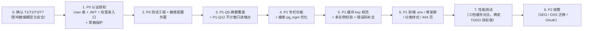

# 待确认问题清单

> 版本：v2.0 ｜ 编写日期：2026-09-10
> 配套文档：[business.md](./business.md) ｜ [backend.md](./backend.md) ｜ [frontend.md](./frontend.md) ｜ [tech.md](./tech.md)
>
> 本文只列**无法从代码单方面确定**的问题（需产品或环境决策）。
> 每条都给出「为什么无法自动判定」。已拍板的决策已移入 [tech.md](./tech.md)，不在本文重复。

---

## 1. 本轮新增待确认项（T1–T10）

来源：[tech.md](./tech.md) §9。按影响面排序。

### 优先确认（影响数据模型，越早越好）

| # | 问题 | 为什么无法自动判定 | 影响 | 建议默认 |
|---|---|---|---|---|
| **T1** | **作者注册是否开放？** | Q3 只确定了「多作者 + User/Author 分离」，但没说作者账号从哪来。需求文档也未提 | 决定是否需要 `/register` 页面与端点、是否需要邀请码/邮箱验证/管理员审批等防滥用措施 | **暂不开放自助注册**，先由管理员在 `/admin/users` 创建作者账号。理由：博客作者是稀缺角色，开放注册会立即带来垃圾内容与审核负担；等真的有外部作者投稿需求再开放 |
| **T2** | **一篇文章能否属于多个专栏？** | Q3 提出要做专栏，但未定义文章与专栏的基数关系 | 决定数据模型：多对多需 `PostCollection` 表 + 排序字段；一对多可简化为 `Post.CollectionId` | **多对多**。理由：「一篇文章同时属于『C# 系列』和『性能优化』」是真实且常见的情况，后期从一对多改多对多需要数据迁移 |
| **T7** | **Token 有效期？是否需要 Refresh Token？** | Q2 只定了「先支持 JWT」，未给参数 | 影响安全性（有效期越长风险越高）与体验（过期越频繁越需要刷新机制） | **Access Token 30 分钟，暂不做 Refresh Token**。理由：管理后台是低频操作，30 分钟内足够完成一次编辑；为「刷新」引入双 token 会显著增加前后端复杂度与安全面。若体验不佳再补 |
| **T3** | **密码哈希算法选 Argon2id 还是 PBKDF2？** | 属技术选型，无产品约束 | 决定是否引入三方 NuGet 包 | **PBKDF2**（框架内置 `Rfc2898DeriveBytes`）。理由：零新依赖，NIST 认可，安全强度足够；Argon2id 更强但需引入并审计三方包 |

### 次优先（影响权限与实现方式）

| # | 问题 | 为什么无法自动判定 | 影响 | 建议默认 |
|---|---|---|---|---|
| **T6** | **Author 能否创建分类/标签？** | 权限矩阵可由产品自由定义 | 决定 `TaxonomyManager` 是否对作者开放 | **不允许**。理由：分类/标签是**全站公共维度**，多作者各自扩张会迅速让分类体系失控。作者在编辑器里选择已有项；若确有需要，后续加「作者提交申请 + 管理员审批」 |
| **T5** | **多实例检测用启动期校验还是运行期探测？** | Q8 要求「多实例无 Redis 直接报错」，但未定检测手段 | 决定实现复杂度与失败时机 | **启动期显式配置校验**（读 `Deployment:InstanceCount`）。理由：简单可预测，错误信息清晰；把部署拓扑当作运维必须声明的输入，而非让代码去猜 |
| **T4** | **`Summary` 的「作者覆盖」逻辑放应用层还是实体层？** | 代码组织风格问题 | 决定 `Post` 实体是否新增 `IsSummaryAuto` 字段 | **实体层**（新增 `IsSummaryAuto`）。理由：与现有「实体自含领域行为」的风格一致（`Post.Publish/Unpublish/RefreshDerivedFields` 都在实体里），规则内聚更易测试 |
| **T8** | **缓存失效改用细粒度版本号，还是维持 `SCAN` 前缀删除？** | 取决于数据规模，当前无数据 | 决定是否重构失效机制 | **暂维持现状**，但先按 §4.2 的规范把 `v{版本}` 加进 key。理由：当前数据量小，`SCAN` 成本可忽略；等压测暴露问题再改，避免过早优化 |

### 后续确认（依赖内容规模）

| # | 问题 | 为什么无法自动判定 | 影响 | 建议默认 |
|---|---|---|---|---|
| **T9** | **正文（`Content`）是否需要可搜索？** | 取决于对检索效果的期望 | 决定是否建 `Content` 的 trgm 索引（会显著膨胀）或上真 FTS | **阶段一不索引正文**，只搜标题+摘要。理由：trigram 索引在长文本上膨胀严重，可能比数据本身还大；正文检索的真正解法是 FTS（阶段二） |
| **T10** | **预渲染的触发方式（CI 构建 / webhook / 定时）？** | Q11 已决定本期不做 SEO，触发方式属后续实现细节 | 影响发文到被搜索引擎收录的延迟 | **webhook 触发 CI 重建**。理由：发文后自动重建，延迟最短；定时重建会有最长一个周期的延迟 |

---

## 2. 上一轮问题的决议索引（已解决）

以下问题已由你拍板，**详细依据见 [tech.md](./tech.md)**，此处仅留索引备查。

### 2.1 第一部分：待人工确认问题（Q1–Q14）

| # | 问题 | 决议 | 详见 |
|---|---|---|---|
| Q1 | 目标部署形态 | **Linux + Nginx + 容器化**；三点「为什么重要」已详细解释（history fallback / `X-Forwarded-For` / 工作目录） | tech §1 |
| Q2 | 认证方案选型 | **JWT**，先实现；第三方 OAuth 后期考虑 | tech §2.1 |
| Q3 | `Author` 与账号是否合并 | **分离**：`Author` 是内容，`User` 是账号；项目定位为**多作者博客** | tech §2.2 |
| Q4 | `/media` 历史路径 | **视为已废弃**，统一 `/api/files/**`；保留云存储扩展点 | tech §3.5 |
| Q5 | 摘要手填还是自动 | **自动截取为默认，允许覆盖** | tech §3.4 |
| Q6 | 是否需要审核流 | **不需要**；引入多作者后再评估 | tech §8 |
| Q7 | 草稿是否需保护 | **需要权限保护** | tech §2.1 |
| Q8 | 生产 Redis 是否强制 | **不强制**，支持 Redis/Memory/Null 三档；**多实例无 Redis 直接报错**；三档性能作为测试指标 | tech §4 |
| Q9 | OSS/CDN 迁移 | **未来做，本期不做**，只保留扩展点（关键：数据库只存 storage key） | tech §3.5 |
| Q10 | 是否需要国际化 | **不需要** | tech §8 |
| Q11 | SEO 优先级与实现 | **本期不做**；已完成技术分析、三条路径对比与重构清单 | tech §6 |
| Q12 | 后台污染浏览量 | **需要修复**：新增不计数参数的只读详情端点 | tech §8 |
| Q13 | 是否维持自研 CSS | **维持**，保留按需引入单点组件的可能 | tech §8 |
| Q14 | 提交规范 | 定义 `type(scope): 描述`，固化为开发规范文档（含本项目的提交纪律） | tech §7 |

### 2.2 第二部分：文档与实现不一致（E1–E16）

| # | 问题 | 决议 | 处理状态 |
|---|---|---|---|
| E1 | 文档称使用 Naive UI | **不使用 Naive UI**（自研 CSS 体系） | ✅ 新文档已更正；旧文档已删除 |
| E2 | DI 方法名 `AddInfrastructureServices` | 实际为 **`AddInfrastructure`** | ✅ 已更正 |
| E3 | `/media` + `wwwroot/uploads/` | 采用实际实现（`/api/files/**`），**有利于迁移云存储** | ✅ 已更正 |
| E4 | 分页 `total` | 已修复 | ✅ |
| E5 | 错误码漏记 4002 | **补全错误码列表** | ✅ 见 backend §7.6 |
| E6 | 4010/4030 未定义 | **增加并完善**（含新增 4003/4130） | ✅ 见 backend §7.6 |
| E7 | 缓存命中率周期统计 | **不需要**记录命中率，**不需要**周期性统计 | ✅ 已从需求中移除；backend §10.5 标注为 `[已废弃]` |
| E8 | 缓存 key 规范 | **按你的提案评估后精简**：去掉「环境」「实体」两段，保留「版本」 | ✅ 见 backend §4.2 |
| E9 | `VITE_API_BASE` 端口错误 + 无 `.env` | **增加 `.env.development` / `.env.production`** 分离 | ✅ 见 frontend §1.3 |
| E10 | `TimelineList.vue` 不存在 | 使用实际的 `views/ArchiveView.vue` | ✅ |
| E11 | 骨架屏 | **规划多套骨架组件**（7 个），`PostSkeleton` 只是其一 | ✅ 见 frontend §6.10 |
| E12 | `usePostStore` | **不使用**，文章列表状态留在视图层 | ✅ |
| E13 | `TagBadge` 组件化 | **不组件化**，保留全局样式；**补齐分类样式** | ✅ 见 frontend §6.11 |
| E14 | 搜索接口路径 | 无问题 | ✅ |
| E15 | 新增能力未记载 | 迭代中完善（本轮已补充作者更新、`includeHidden`、社交链接删除、`versions`） | ✅ |
| E16 | 管理端路由未记载 | 迭代中完善（本轮已补充 7 个现有 + 4 个新增路由） | ✅ |

### 2.3 关于旧文档

本仓库曾有一批 **2026-09-06 的历史设计稿**（一份需求分析、一份 API 清单、一份后端任务拆分、
一份前端路由规划、一份架构设计文档，以及两张架构示意图 SVG）。
它们的内容已被 `business.md` / `backend.md` / `frontend.md` / `tech.md` 完整取代，
且经逐条核实存在 **16 处与实现不一致**（即上表 E1–E16）。

按指示，**这些历史设计稿已在本轮迭代中删除**，使 `docs/` 只保留单一事实来源，避免后来者读到过时信息。

原始需求文档 `补充具体说明.md`（仓库根目录）**已保留**，作为需求来源的存档。

> **如需回滚查阅**：被删除的文件都存在于 git 历史中。用 `git log --diff-filter=D --name-only` 找到
> 删除它们的那次提交，再用 `git show <commit>^:<path>` 查看内容，或
> `git checkout <commit>^ -- <path>` 取回。

---

## 3. TODO 汇总（代码中无法确定的项）

以下为技术文档中标注 `TODO` 的位置，均为**原需求未给出量化标准**、不编造数字的项。
建议在性能测试（Q8）时一并确定。

| 位置 | 项 | 说明 |
|---|---|---|
| business §8.1 | 各页面响应时间目标 | 原需求无 SLA。建议在完成三档缓存压测后，以 Memory/Redis 档的 P95 作为基线制定 |
| business §8.4 | 颜色对比度校验 | 未做工具化校验（需确认是否达到 WCAG AA） |
| backend §3.8 | 生产迁移流程 | 建议拆为独立发布步骤，流程待定 |
| frontend §6.8 | 键盘可达性覆盖度 | 未系统实现与验收 |

---

## 4. 建议的推进顺序

**为什么必须先确认 T1/T2/T3/T7**：这四项直接决定 `User` 表与关系表的结构、以及 JWT 的参数。
在它们确定之前动手做 P0-1 认证，一旦 T2 从一对多改成多对多、或 T7 决定要 Refresh Token，
会产生**数据库迁移 + 前后端接口双重复工**。
