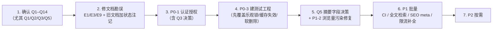

# 待人工确认问题与文档勘误

> 版本：v1.0 ｜ 编写日期：2026-09-10
> 配套文档：[business.md](./business.md) ｜ [backend.md](./backend.md) ｜ [frontend.md](./frontend.md)
>
> 本文只列**无法从代码单方面确定**的问题（需产品或环境决策），以及**已核实的文档与实现不一致**。
> 每条都给出了「为什么无法自动判定」的依据。

---

## 第一部分：待人工确认问题

### A. 上线与部署

#### Q1 目标部署形态是什么？

- **为何无法判定**：仓库内无 `Dockerfile`、无 `docker-compose.yml`、无 Nginx/IIS 配置、无 CI 配置（详见 [backend.md](./backend.md) §10.4）。
  现有信息只够得出「`Blog.WebApi.exe` 单进程 Kestrel 监听 5131」。
- **需要确认**：Windows/IIS 还是 Linux/Nginx？是否容器化？是否存在反向代理？
- **为什么重要**：
  - 直接决定限流对 `X-Forwarded-For` 的依赖是否正确（`RateLimitingMiddleware` 依赖该头取客户端 IP，若无反代则取 `RemoteIpAddress`）
  - 决定 `createWebHistory()` 的 history fallback 由谁提供（SPA 深链接如 `/post/xxx` 刷新会 404，必须有服务端回退配置）
  - 决定 `FileStorage:Root`（相对路径 `media`）的**工作目录**是否稳定
- **建议默认**：Linux + Nginx，容器化部署；Nginx 负责 history fallback 与 `X-Forwarded-For`。

#### Q2 认证方案选型？

- **为何无法判定**：需求文档只写了「后续可加 JWT（文档已预留扩展点）」（`docs/01-需求分析与实现方案.md:168`），未定稿；
  代码中无任何认证痕迹（[backend.md](./backend.md) §5.1）。
- **需要确认**：JWT（Access only / Access+Refresh）？Cookie Session？还是直接接 GitHub OAuth（考虑到评论已用 giscus + GitHub Discussions）？
- **为什么重要**：
  - 若用 Cookie，需重新评估 CSRF 防护（当前因无 Cookie 而「不适用」，见 [business.md](./business.md) §8.2）
  - 若接 GitHub OAuth，可与 giscus 的评论身份统一，但引入对外部身份的依赖
  - `Author` 表当前只有展示字段，无凭据字段，选型决定是「扩 `Author`」还是「新建 `Users` 表」（见 Q3）
- **建议默认**：JWT（单 access token，有效期短）起步。理由：`ErrorCodes` 已预留 4010/4030，前端 `http.ts` 是单一出口便于统一注入 token，改造成本最低。

#### Q3 `Author` 与「账号」是否合并？

- **为何无法判定**：`Author` 当前承担「文章作者展示信息」职责（`Author.cs:7-10`），
  而 `/admin/profile` 又把它当「用户资料」在编辑（`AdminProfileView.vue` 取 `authors[0]`）。
  这是产品语义问题，不是技术问题。
- **需要确认**：单作者博客是否需要一个独立账号体系，还是「博主资料 + 一个管理口令」就够？
- **为什么重要**：
  - 若合并：`Author` 加 `PasswordHash`，`/api/authors` 语义变化，需考虑列表接口是否应暴露凭据相关字段
  - 若分离：新建 `Users` 表，需建立 `User ↔ Author` 关联，`Post.AuthorId` 指向哪个表要重新定义
- **建议默认**：**分离**。`Author` 保持「展示信息」职责不变，新建 `Users` 专管凭据。理由：`Author` 会被文章详情/列表 DTO 引用（`PostDetailDto.AuthorName/AuthorAvatar`），把凭据混进去会让 DTO 边界变脏。

### B. 数据与内容

#### Q4 `/media/...` 历史路径是否需要兼容？

- **为何无法判定**：种子数据里作者头像是 `/media/avatar-default.png`（`BlogDbContext.cs:128`），
  但后端实际把文件路由改到了 `/api/files/**`（`FilesController.cs:9`）。旧文档也写的是 `/media`（`docs/02-API接口清单.md:66,70-71`）。
  这可能是「路由有意迁移」也可能是「改了一半」，代码无法自证。
- **需要确认**：`/media` 是「曾用名、已废弃」还是「另有静态托管」？
- **为什么重要**：决定修法是「只改种子数据」还是「同时加兼容路由」。
- **现状**：前端已在 `AdminProfileView.vue` 用 `@error` 回退到首字母占位，所以**当前不会显示裂图**，但种子头像永远加载不出来。
- **建议默认**：视 `/media` 为已废弃。修种子数据指向真实存在的文件或置空，不新增兼容路由（YAGNI）。

#### Q5 文章摘要由作者手填还是自动截取？

- **为何无法判定**：前端 `PostEditor.vue` **有摘要输入框**，但 `api/posts.ts:40-47` 的创建/更新请求体
  **不包含 summary**；后端 `CreatePostRequest`（`PostDtos.cs:38-45`）也没有该字段，
  摘要只在实体层按正文前 50 字自动截取（`Post.cs:8,56-62`）。
  两边行为矛盾，无法判断哪个才是设计意图。
- **需要确认**：摘要应该是作者可编辑的独立字段，还是纯自动派生？
- **为什么重要**：
  - 若手填：需后端加 `Summary` 字段 + 迁移 + DTO 改动；影响卡片与搜索结果展示质量
  - 若自动：前端应**移除**该输入框（当前是误导用户的死控件）
- **建议默认**：自动截取为默认值，但允许覆盖。理由：`Summary` 列已存在且 `HasMaxLength(120)`（`BlogDbContext.cs:38`），
  比正文截取的 50 字有更大空间，说明原设计可能本就打算手填。**此项优先级高**，因为当前是明显的功能缺口（见 [business.md](./business.md) R10）。

#### Q6 是否需要审核流？

- **为何无法判定**：需求文档（`docs/01`、`补充具体说明.md`）**完全未提审核**；内容生命周期只有草稿/发布两态（`Post.cs:16,64-73`）。
- **需要确认**：这是「不需要」还是「暂未规划」？
- **建议默认**：不需要。单人博客自己写自己发，审核环节没有意义。若未来做多作者再引入（见 [business.md](./business.md) §9 第 2 项）。

#### Q7 草稿泄露是否已知并接受？

- **为何无法判定**：`GET /api/posts?includeUnpublished=true` 是公开 query 参数，且无鉴权（[business.md](./business.md) R9）。
  从代码注释看，作者知道这是「管理后台使用」（`PostDtos.cs:69`），但**未加任何防护**。
- **需要确认**：当前阶段是否接受这一状态（毕竟未公开部署）？
- **建议默认**：与 P0-1（认证）一并解决，不单独修。但若近期要公开演示，应先临时禁用该参数。

### C. 环境与运维

#### Q8 生产环境 Redis 是否强制？

- **为何无法判定**：代码支持三档（Redis / Memory / Null，`Infrastructure/DependencyInjection.cs:46-55`），
  开发环境配的是 Redis（`appsettings.Development.json:13`），
  但 `appsettings.json` **没有 `Cache` 节**，即默认回落到 `CacheOptions` 的类默认值 `Provider=Memory`（`CacheOptions.cs:12`）。
  生产到底用哪档没有依据。
- **需要确认**：生产是否部署 Redis？
- **为什么重要**：
  - 若不部署且保持默认 Memory：多实例部署时缓存**不共享**，且限流会降级为进程内桶（单机语义），**多实例下限流形同虚设**
  - 若部署 Redis：需确认故障降级行为是否满足可用性要求
- **建议默认**：单实例阶段用 Memory 即可；一旦要多实例，**必须**上 Redis，且 `RateLimit.FallbackToMemory` 需重新评估。

#### Q9 是否需要文件存储迁移到 OSS/CDN？

- **为何无法判定**：`docs/02-API接口清单.md:66` 称独立路由「便于后续替换为 OSS/CDN」，但无时间表；
  当前实现是本地磁盘（`LocalFileStorageService.cs:8-9`）。
- **需要确认**：是否有此计划，以及是否接受本地磁盘随实例丢失的风险。
- **建议默认**：P2，暂不迁移。但需确保 `media/` 目录纳入备份策略（当前 `.gitignore` 忽略了运行期上传文件）。

#### Q10 是否需要国际化？

- **为何无法判定**：全站中文硬编码，无 i18n 依赖（[frontend.md](./frontend.md) §6.8）；需求文档未提多语言。
- **需要确认**：是否有英文版计划？
- **建议默认**：不需要。中文技术博客定位明确。若未来要做，**真正的难点在文章内容多语言**（需后端加翻译表），界面文案抽取只是小头。

#### Q11 SEO 的优先级与手段？

- **为何无法判定**：当前是纯 SPA，只有静态 title + 详情页动态 title（[frontend.md](./frontend.md) §6.4）；
  需求文档未定义 SEO 目标。
- **需要确认**：搜索流量是否为关键获客渠道？愿意为此付出 SSR 迁移成本吗？
- **为什么重要**：SSR 迁移会触及 `stores/app.ts:8`（模块初始化即读 `localStorage`，SSR 下直接报错）与全部数据获取逻辑，是**高风险重构**。
- **建议默认**：先用低成本手段（动态 title + meta description + OG + `sitemap.xml` + 预渲染），**不要**直接上 SSR。

### D. 产品与协作

#### Q12 是否能接受「后台操作会污染浏览量」？

- **为何无法判定**：这是 `AdminPostListView` 复用详情接口取 `version` 导致的副作用（`PostService.cs:54-68`），
  代码注释显示详情接口「每次调用浏览量原子 +1」是有意设计（`docs/01:137-139`），但管理端复用它可能是疏忽而非决策。
- **需要确认**：是否需要在管理端避免计数？
- **建议默认**：需要修复。方案是加一个不计数参数的只读详情端点（[backend.md](./backend.md) P1-2）。浏览量是博客的核心指标之一，被后台操作污染会失去参考价值。

#### Q13 是否维持「自研 CSS 组件体系」？

- **为何无法判定**：`package.json` 无 Naive UI，源码是自研 `tokens.css` + scoped style（[frontend.md](./frontend.md) §1.1），
  但两份旧文档都写的是用 Naive UI（`docs/05:20`、`docs/04:3`）。这是当初的偏差还是后续的有意决策，无法从代码判断。
- **需要确认**：正式确认技术选型。
- **为什么重要**：决定后续是继续投入自研组件（需自己解决无障碍、复杂交互件），还是引入组件库（需处理与现有设计体系的冲突）。
- **建议默认**：**维持自研**。理由：现有设计体系（Aurora）风格强烈，组件库默认样式会大面积冲突；且当前页面复杂度不高，自研成本可控。若将来需要富文本/虚拟列表等复杂件，再**按需**引入单点组件。

#### Q14 多人协作与提交规范？

- **为何无法判定**：`docs/03-后端任务拆分与开发顺序.md:102` 有「Git 提交规范」章节，但仓库实际提交信息格式不完全一致
  （既有 `feat(backend):` 也有 `chore:` 与中文无 scope 的形式）。
- **需要确认**：是否强制 Conventional Commits？是否需要 PR 流程？
- **建议默认**：沿用现有 `type(scope): 描述` 风格即可，不必引入工具链（提交者只有 1 人时收益低）。

---

## 第二部分：已核实的文档与实现不一致（勘误）

> 以下均为**已用代码验证**的不一致，建议修正旧文档或明确标注其为设计稿而非现状。

| # | 位置 | 文档写的 | 代码实际 | 验证方式 |
|---|---|---|---|---|
| E1 | `docs/05-系统架构与设计文档.md:20`、`docs/04-前端页面路由规划.md:3` | 前端使用 **Naive UI** | `package.json` 无该依赖，源码无任何引用；实际是自研 CSS 体系 | `cat Blog.FrontEnd/package.json`；`grep -r "naive" src/` 无命中 |
| E2 | `docs/05-系统架构与设计文档.md:44` | DI 方法名 `AddInfrastructureServices` | 实际是 **`AddInfrastructure`** | `Blog.Infrastructure/DependencyInjection.cs:17` |
| E3 | `docs/02-API接口清单.md:66,70-71` | 文件路由前缀为 `/media`，读 `wwwroot/uploads/` | 实际前缀 **`/api/files`**，读 `FileStorage:Root`（默认 `media`，非 `wwwroot`） | `FilesController.cs:9`；`LocalFileStorageService.cs:49-52` |
| E4 | `docs/02-API接口清单.md:9` | 分页响应体为 `{ items, page, pageSize, total, totalPages }` | **一致** ✅（但前端曾误用 `totalCount`，已修） | `Common/PagedResult.cs:6-10` |
| E5 | `docs/02-API接口清单.md:78` | 错误码表只列到 4001、无 **4002** | `ErrorCodes.BusinessRule = 4002` 确实在用（分类/标签重名） | `ErrorCodes.cs:39`；`CategoryService.cs:48` |
| E6 | `docs/02-API接口清单.md:79-80` | 预留 4010 未认证、4030 无权限 | `ErrorCodes.cs` 中**尚未定义**这两个常量 | `ErrorCodes.cs:30-52` |
| E7 | `docs/01-需求分析与实现方案.md:91` | 记录「缓存命中率——CacheService 内部计数日志（周期性输出）」 | 未实现周期性统计；仅有 `LogDebug("缓存命中 {Key}")`，且默认日志级别为 Information，**Debug 不输出** | `RedisCacheService.cs:121`、`MemoryCacheService.cs:68`；`appsettings.Development.json:3-6` |
| E8 | `docs/01-需求分析与实现方案.md:106` | 缓存 key 规范 `blog:{module}:{query-hash}`，示例 `blog:posts:list:p1s12c:{categoryId}` | 实际为 `blog:posts:list:p{page}s{size}c{categoryId}t{tagId}k{hash}u{0\|1}`；且 key 用**固定字段**而非整体 hash；另有文档未提及的 `blog:site:social:all` | `CacheKeys.cs:14-28` |
| E9 | `docs/04-前端页面路由规划.md:90` | `VITE_API_BASE=http://localhost:5000` | 实际后端是 **5131**；且仓库**无 `.env` 文件**，`BASE` 为空串走代理 | `launchSettings.json:8`；`vite.config.ts:15-21`；`http.ts:14` |
| E10 | `docs/04-前端页面路由规划.md:45` | 归档页组件 `components/archive/TimelineList.vue` | **该文件不存在**，时间轴内联在 `views/ArchiveView.vue` | `find src -name "TimelineList*"` 无结果 |
| E11 | `docs/04-前端页面路由规划.md:34-39` | 规划 `PostSkeleton`、两侧 `<aside>` 占位插槽 | `PostSkeleton.vue` 不存在（骨架内联在 `PostCardList.vue`）；`<aside>` 预留位未实现 | 同上 |
| E12 | `docs/04-前端页面路由规划.md:75-79` | 规划 `usePostStore` | **未实现**；文章列表状态留在各视图 `ref` + 路由 query | `stores/` 只有 `app.ts`、`site.ts` |
| E13 | `docs/04-前端页面路由规划.md:100-104` | 规划 `components/common/TagBadge.vue`、`EmptyState.vue` | 均不存在；`tag-badge` 只是 `global.css:111-122` 的全局样式类 |
| E14 | `docs/02-API接口清单.md:1.4` | 搜索接口为 `/api/posts/search` | **一致** ✅（仅路径项写法差异，无实质问题） | `PostsController.cs:61` |
| E15 | `docs/02-API接口清单.md`（全篇） | 未记载本轮新增的 4 个能力 | 缺 `PUT /api/authors/{id}`、`GET /api/authors/{id}`、社交链接 `includeHidden`、`DELETE /api/site/social-links/{id}`、`SiteConfigDto.versions` | `AuthorsController.cs`、`SiteController.cs`、`SiteDtos.cs` |
| E16 | `docs/04-前端页面路由规划.md`（全篇） | 无管理端路由规划 | 实际有 7 个管理端路由（`/admin/*`）与 2 个独立 Layout | `router/index.ts:20-34` |

### 勘误处理建议

| 优先级 | 处理方式 |
|---|---|
| 高 | **E1**（技术选型误导新人）、**E3**（接口路径写错会导致联调失败）、**E9**（端口错误） |
| 中 | E2、E5、E6、E7、E15、E16 |
| 低 | E8、E10–E14（均为「规划未落地」，属正常演进，建议在新文档中标注，旧文档保留为历史设计稿） |

> **建议**：不要直接改写 `docs/01`–`docs/05`（它们是历史设计稿，有追溯价值）。
> 建议在每份旧文档顶部加一行状态说明，例如：
> `> ⚠️ 本文为 2026-09-06 设计稿，部分内容已与实现不一致。现状请以 business.md / backend.md / frontend.md 为准。`

---

## 第三部分：建议的处理顺序

结合 [business.md](./business.md) §9 与 [backend.md](./backend.md) §11，建议按以下顺序推进：

**为什么必须先确认 Q1–Q3**：认证方案（Q2）与 `Author` 是否合并（Q3）会决定数据库迁移的形态，
在没定之前动手做 P0-1 有较高返工风险。而 Q5（摘要）是当前最明显的功能缺口，且改动小、收益直接。
