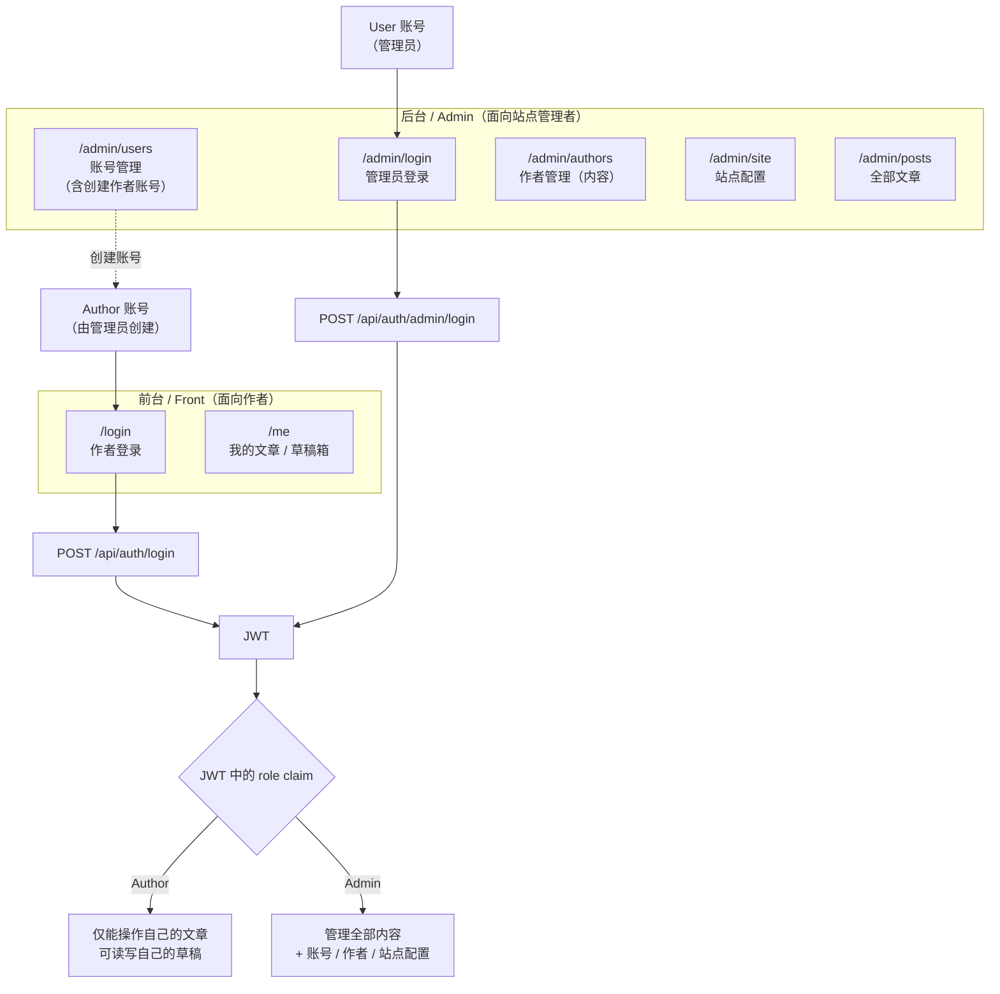
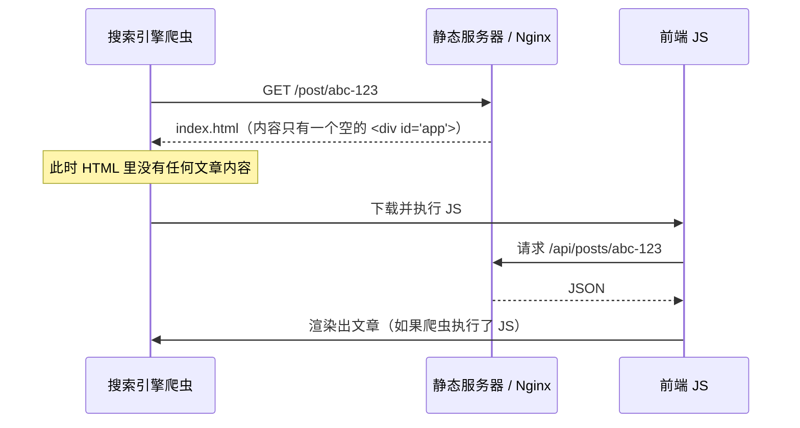

# 技术决策与知识点记录（tech.md）

> 版本：v1.1 ｜ 日期：2026-09-10
> 本文记录**已拍板的技术决策**及其依据，并解释开发中需要用到的知识点。
> 配套文档：[business.md](./business.md) ｜ [backend.md](./backend.md) ｜ [frontend.md](./frontend.md) ｜ [suggestion.md](./suggestion.md)
>
> **状态标记**：`[已决定]` 已拍板待实施 ｜ `[已实现]` 代码已落地 ｜ `[待确认]` 仍需决策
>
> **v1.1 变更**：T1–T10 全部确认（见 §十决议记录）；搜索改为真 FTS（`zhparser` 已编译验证）；
> SEO 明确不做；密码定为 PBKDF2；Token 只做 Access Token。

---

## 一、部署形态（Q1）

### 1.1 决定

`[已决定]` 采用 **Linux + Nginx + 容器化** 部署，Nginx 作为反向代理置于 Kestrel 之前。

### 1.2 为什么是这三个点重要（Q1 里你可能不熟的部分）

我在 suggestion.md 里提到「决定 history fallback、`X-Forwarded-For`、工作目录」三点，下面逐个解释。

#### 知识点 A：SPA 的 history fallback（刷新 404 问题）

**问题现象**：前端用了 `createWebHistory()`（`Blog.FrontEnd/src/router/index.ts:3`），这叫 **HTML5 History 模式**。
它让 URL 看起来是 `https://blog.com/post/abc-123` 而不是 `https://blog.com/#/post/abc-123`。

**为什么会出问题**：这个「漂亮的 URL」在浏览器里**并不对应服务器上的任何文件**。
服务器磁盘上只有 `index.html`、`assets/xxx.js` 这些。

- 用户在首页点击链接跳到 `/post/abc-123` → 由**前端 JS 接管**，不发新请求 → 正常
- 用户**直接刷新** `/post/abc-123`，或把链接发给别人打开 → 浏览器向服务器请求 `/post/abc-123` → 服务器找不到这个文件 → **404**

**解决方式**：配置服务器「凡是找不到的路径，一律返回 `index.html`」，把路由决策权交还给前端。
Nginx 写法：

```nginx
location / {
    root /var/www/blog;
    try_files $uri $uri/ /index.html;   # ← 关键：兜底到 index.html
}
```

> 开发期为什么没这个问题：Vite dev server 内置了 fallback（未显式配置也生效）。
> 所以**这个坑只会在部署后暴露**，本地测不出来。

#### 知识点 B：反向代理与 `X-Forwarded-For`（客户端 IP 识别）

**背景**：项目有令牌桶限流，规则里写着「按 IP 限流」（`Blog.WebApi/appsettings.Development.json:23-52` 的 `"Granularity": "Ip"`）。
限流器需要知道「这个请求来自哪个客户端」，才能给每个客户端单独算令牌。

**问题**：加上 Nginx 后，请求链路变成：

```
浏览器 ──→ Nginx ──→ Kestrel(你的应用)
```

对 Kestrel 来说，**所有请求的来源 IP 都变成了 Nginx 的 IP**（通常是 `127.0.0.1`）。
于是「按 IP 限流」退化成「全局限流」——所有访客共享一个令牌桶，一个人刷爆，所有人都被限流。

**解决方式**：Nginx 把真实客户端 IP 写进 HTTP 头：

```nginx
location /api/ {
    proxy_pass http://127.0.0.1:5131;
    proxy_set_header X-Forwarded-For $proxy_add_x_forwarded_for;
    proxy_set_header X-Forwarded-Proto $scheme;
    proxy_set_header Host $host;
}
```

应用侧读取 `X-Forwarded-For` 的**第一段**作为客户端 IP（它是逗号分隔列表，第一段是最初的客户端）。
本项目 `RateLimitingMiddleware` 已按此实现（见 [backend.md](./backend.md) §6.1）。

**为什么必须现在决定部署形态**：如果没有反代，就应该读 `RemoteIpAddress`；有反代就读 `X-Forwarded-For`。
两者不能同时无条件信任——因为 **`X-Forwarded-For` 是客户端可伪造的请求头**：
如果直接暴露 Kestrel 又信任该头，攻击者只要每次请求换一个假 IP，就能绕过限流。

正确做法（本项目采用）：**只在明确知道自己在反代之后时，才信任 `X-Forwarded-For`**。
这也是为什么它必须在部署形态确定后才能配置正确。

#### 知识点 C：进程工作目录与相对路径

**背景**：文件存储配置是相对路径 —— `"FileStorage": { "Root": "media" }`（`appsettings.Development.json:19-22`），
代码里用它拼路径（`LocalFileStorageService.cs:50-52`）。

**关键点**：**相对路径是相对于「进程的当前工作目录」，不是相对于程序所在目录，也不是相对于项目根目录。**

- `dotnet run` 时，工作目录 = 项目目录 → 文件落在 `Blog.WebApi/media/`
- 直接运行 `bin/Debug/net10.0/Blog.WebApi.exe` 时，工作目录 = `bin/Debug/net10.0/` → 文件落在 `bin/Debug/net10.0/media/`
- 被 systemd 拉起时，工作目录由 `WorkingDirectory=` 决定，**默认可能是 `/`**

**为什么重要**：

1. **文件会「莫名消失」**：开发时上传的图片在 `bin/.../media`，重新构建后 `bin` 被清理 → 图片全没了
2. **写权限问题**：若工作目录是 `/` 或只读目录，上传直接失败
3. **容器化时更明显**：容器内的路径与宿主机不同，**必须挂载卷**，否则容器重建即丢文件

**解决方式**（容器化部署时）：

```yaml
# docker-compose 片段示意
services:
  webapi:
    working_dir: /app
    volumes:
      - media-data:/app/media      # ← 挂载卷，保证文件持久化
volumes:
  media-data:
```

并在配置里显式指定绝对路径或确保 `WorkingDirectory` 固定。

> **与 Q4/Q9 的关联**：既然将来要迁移到 OSS，本地磁盘只是过渡。
> 因此**不建议**现在为多实例共享文件做复杂设计（如 NFS），保持单实例 + 卷挂载即可。

---

## 二、认证与授权（Q2 / Q3 / Q7）

### 2.1 决定

| 项 | 决定 |
|---|---|
| 认证方案 | `[已决定]` **JWT**，先行实现；第三方 OAuth 后期再考虑 |
| Token 形态 | `[已决定]` **只用 Access Token，不做 Refresh Token**（T7） |
| Token 有效期 | `[已决定]` 30 分钟（`Jwt:AccessTokenMinutes`） |
| 密码哈希 | `[已决定]` **PBKDF2（框架内置 `Rfc2898DeriveBytes`）**，不引入三方包（T3） |
| 账号模型 | `[已决定]` **`User` 与 `Author` 分离** |
| 项目定位 | `[已决定]` **多作者博客**（不再是单作者） |
| 作者账号来源 | `[已决定]` **不开放自助注册**，由管理员在后台创建（T1） |
| 草稿保护 | `[已决定]` 草稿需权限保护（仅作者本人与管理员可见） |

### 2.2 核心模型澄清：Author 是「内容」不是「账号」

你的 Q3 表述是准确的，这里把它固化为设计约束：

| 概念 | 职责 | 类比 |
|---|---|---|
| **`Author`** | **内容属性**：文章的署名对象（姓名、头像、简介）。与 `Post`、`Tag`、`Category` 同层，属于「博客内容」 | 就像 `Category` 是文章的分类 |
| **`User`** | **后台管理账号**：登录凭据、角色、权限 | 系统的「操作者」 |

**推论**：

1. `Author` 表**不含任何凭据字段**（无 `PasswordHash`）
2. `Author` 可以被**管理员直接创建和管理**（因为它是内容），不需要该「作者」本人注册
3. 允许存在「有 `Author` 记录但没有对应 `User`」的情况（例如只署名不登录的作者、历史作者）
4. `Post.AuthorId` 指向 `Author`（内容归属），而「谁创建了这篇文章」是另一回事 → 需要 `Post.CreatedByUserId`（`[已决定]`）

### 2.3 两套登录入口（前台 / 后台）

你要求区分「前台登录（Author）」与「后台登录（User）」。这里给出完整定义：



#### 前台登录（Author）

- **谁用**：博客的作者本人
- **能做什么**：
  - 撰写、编辑、发布/下架**自己的**文章（含草稿）
  - 维护自己的 `Author` 资料（姓名/头像/简介）
  - **不能**管理其他作者的文章、不能改站点配置、不能管理账号
- **账号来源**：`[已决定]` **不开放自助注册**（T1）。
  由管理员在 `/admin/users` 创建账号，并设置其关联的 `Author`、初始密码与角色。
  理由：博客作者是稀缺角色，开放注册会立即带来垃圾内容与审核负担；
  作者本人也无法自行选择「我是谁」（`Author` 归属必须由管理员指定，否则可冒名发文）。

> **因此不存在 `/register` 页面与 `POST /api/auth/author/register` 端点。**
> 若将来确有外部作者投稿需求，再评估邀请码 / 邮箱验证等受控注册方式。

#### 后台登录（User）

- **谁用**：站点管理员
- **能做什么**：
  - 管理账号（创建/禁用/改角色，**包括创建作者账号**）
  - 管理作者（`Author` 是内容，可增删改）
  - 管理**全部**文章（含他人的草稿）
  - 站点配置、社交链接、分类、标签

> **为什么需要两套入口**：两者的**权限模型与生命周期完全不同**。
> 作者账号由管理员发放、数量可控；管理员是站点的运维者，数量固定且**绝不对外开放创建**。
> 混在一个登录页会导致「注册即成为管理员」这类严重越权。
> 即便作者注册不开放，两个入口仍需分开：它们的**登录后落地页与错误提示**都不同
> （作者进 `/me`，管理员进 `/admin`），且未来若开放受控注册，也只会开放作者那一个入口。

#### `[待确认]` 单应用还是双应用

| 方案 | 说明 | 建议 |
|---|---|---|
| **A. 单一 SPA + 角色路由** | 一个 Vue 应用，`/login` 与 `/admin/login` 分开；路由守卫按 `role` 拦截 | **推荐**：复用现有组件与 API 层，成本最低 |
| B. 拆成两个独立前端 | 作者端与后台端各自构建部署 | 成本高、重复代码多，除非后台要给不同人用且需独立发布 |

### 2.4 角色与权限矩阵

`[已决定]` 角色先做两档：**Admin** / **Author**。
不建议现在就引入细粒度 RBAC（角色-权限表），因为需求尚未出现第三种角色（YAGNI）。

| 操作 | 匿名访客 | Author（本人） | Author（他人） | Admin |
|---|---|---|---|---|
| 读已发布文章 | ✅ | ✅ | ✅ | ✅ |
| 读草稿 | ❌ | ✅ | ❌ | ✅ |
| 创建文章 | ❌ | ✅ | ✅ | ✅ |
| 编辑/删除文章 | ❌ | ✅ | ❌ | ✅ |
| 发布/下架 | ❌ | ✅ | ❌ | ✅ |
| 管理 `Author`（内容） | ❌ | 仅自己资料 | ❌ | ✅ |
| 管理分类 / 标签 | ❌ | ❌ | ❌ | ✅ |
| 站点配置 / 社交链接 | ❌ | ❌ | ❌ | ✅ |
| 文件上传 | ❌ | ✅ | ✅ | ✅ |
| 账号管理（`User`） | ❌ | ❌ | ❌ | ✅ |

> `[待确认]` Author 能否创建分类/标签？当前实现允许任何人（无鉴权）。
> 建议：**只允许 Admin**，作者在编辑器里选择已有分类标签或提交申请。避免分类体系被作者随意扩张。

### 2.5 知识点：JWT 是什么，以及必须知道的三个坑

#### 是什么

**JWT（JSON Web Token）** 是一串自包含的凭证，形如 `xxx.yyy.zzz`，三段用 `.` 分隔：

| 段 | 名称 | 内容 |
|---|---|---|
| 1 | Header | 算法与类型，如 `{"alg":"HS256","typ":"JWT"}` |
| 2 | Payload | 声明（claims）：`sub`(用户id)、`role`、`exp`(过期时间) 等 |
| 3 | Signature | 前两段 + 服务端密钥的签名 |

**关键特性**：Payload 只是 **Base64 编码，不是加密** —— 任何人都能解开看内容。
所以**绝不能把密码、手机号等敏感信息放进 payload**。

**服务端为什么能信任它**：因为签名需要服务端持有的密钥。
客户端改一个字符，签名就对不上，服务端直接拒绝。所以服务端**无需存 session**（无状态）。

#### 坑 1：JWT 无法「主动失效」

因为服务端不存状态，**签发出去的 token 在过期前一直有效**。
「退出登录」只是前端删掉本地 token，服务端并不知道；token 若被窃取，到期前照样能用。

**应对**（`[已决定]` T7）：

- Access Token **有效期 30 分钟**（`Jwt:AccessTokenMinutes`）
- **不做 Refresh Token**。理由：管理后台是低频操作，30 分钟足够完成一次编辑；
  引入双 token 会显著增加前后端复杂度与安全面（多一个长期凭证要保护、要轮换、要防重放）
- 需要「立即踢下线」时，用 **`User.TokenVersion`** 方案（推荐，见下），比黑名单更简单

**两种「主动失效」手段对比**：

| 方案 | 做法 | 代价 | 推荐 |
|---|---|---|---|
| Redis 黑名单 | 存 `blog:auth:blacklist:v1:{jti}`，TTL = 剩余有效期 | 每次请求多一次 Redis 查询；Redis 故障时降级 Memory（单实例 OK，多实例失效） | 备选 |
| **`User.TokenVersion`** | User 上存一个整数；签发时写入 claim，校验时与库中比对。改密码/踢下线只需 `INCR` | 每次请求需读 User（可缓存）；**不依赖 Redis** | ✅ **推荐** |

> **为什么推荐 `TokenVersion`**：它只需要数据库（已有），不引入新的运行时依赖，
> 也不会因为 Redis 降级而在多实例下失效。代价是「每次请求要能拿到当前 TokenVersion」——
> 用缓存 + 写时失效即可（与现有缓存策略一致）。

#### 坑 2：存哪里

| 位置 | XSS 风险 | CSRF 风险 | 说明 |
|---|---|---|---|
| `localStorage` | ⚠️ 高（JS 可读，XSS 即窃取） | ✅ 无（不会自动随请求发送） | 实现简单 |
| `HttpOnly Cookie` | ✅ 低（JS 读不到） | ⚠️ 需要 CSRF 防护 | 更安全但复杂 |

**建议**：本项目是博客，管理后台的 XSS 面较小（用户输入主要是自己写的 Markdown，且已用 DOMPurify 消毒）。
采用 `localStorage` + **短有效期** + **严格的 CSP**（见 frontend.md 安全章节）是性价比最高的方案。
副作用：**用 Cookie 会引入 CSRF 问题，用 localStorage 则当前「CSRF 不适用」的结论仍然成立**——这是选择 localStorage 的一个隐性好处。

#### 坑 3：`exp` 是 UTC 秒级时间戳，且不自动刷新

前端需要处理 token 过期：在 `http.ts` 统一拦截 `401`，清理本地凭证并跳转登录页。

### 2.6 知识点：密码存储

**绝不能用 MD5/SHA1/SHA256 直接哈希密码**。原因：

- 这些算法**设计目标是快**，而快正是破解者想要的（GPU 每秒可算数十亿次）
- 无「盐」时，彩虹表可秒破常见密码

**正确做法**：使用**专为密码设计的慢哈希**，自带盐值与可调工作因子：

| 算法 | 说明 | .NET 支持 |
|---|---|---|
| **PBKDF2** | NIST 认可，.NET **内置** | `Rfc2898DeriveBytes` ✅ **本项目采纳**（T3） |
| Argon2id | 2015 年密码哈希竞赛冠军，抗 GPU 更强 | 需三方 NuGet |
| BCrypt | 老牌，广泛使用 | 需三方 NuGet |

`[已决定]` **采用 PBKDF2**（T3）。理由：**框架内置，零新依赖**，无需引入并审计三方包；
安全强度对本站威胁模型足够。Argon2id 更强，但收益不足以抵消新增依赖的成本。

**推荐参数**：

| 参数 | 建议值 | 说明 |
|---|---|---|
| 迭代次数 | `210_000`（OWASP 2023 对 PBKDF2-HMAC-SHA512 的建议下限量级） | 需按部署机器实测调整，目标单次校验 ≈ 50–100ms |
| 哈希算法 | `HashAlgorithmName.SHA512` | 优于 SHA256 |
| 盐长度 | 16 字节（`RandomNumberGenerator`） | 每用户独立随机 |
| 输出长度 | 32 字节 | |

**存储格式**：把算法、迭代次数、盐、哈希**一起存进单个字符串**，便于将来提升迭代次数时
仍能校验旧密码（用旧参数校验，登录成功后用新参数重新哈希）：

```
pbkdf2-sha512$210000$<base64-salt>$<base64-hash>
```

**必须做到**：

- 每个用户独立随机盐（不要全局固定盐）
- 迭代次数可随硬件升级提高，且**旧哈希仍可校验**
- 校验用**恒定时间比较**（`CryptographicOperations.FixedTimeEquals`），防时序攻击
- **绝不能用 MD5/SHA1/SHA256 直接哈希**（设计目标是快，GPU 每秒可算数十亿次）
- 登录失败统一提示「邮箱或密码错误」，不区分「用户不存在」与「密码错误」，防账号枚举

---

## 三、数据模型演进（Q3 / Q4 / Q5 / 专栏）

### 3.1 新增实体

`[已决定]` 在现有 6 个实体基础上新增：

| 实体 | 用途 | 关键字段 |
|---|---|---|
| **`User`** | 后台/前台账号 | `Email`(唯一)、`PasswordHash`、`Role`(Admin/Author)、`IsActive`、`AuthorId`(可空，指向内容身份)、`LastLoginAt` |
| **`Collection`** | 专栏（把多篇文章组织到一起） | `Title`、`Slug`、`Description`、`CoverImage`、`SortOrder`、`IsPublished` |
| **`PostCollection`** | 文章↔专栏 多对多 | `PostId`、`CollectionId`、`SortOrder`（专栏内排序） |

> **待确认**：一篇文章能否属于多个专栏？若能，用 `PostCollection`（多对多）；
> 若限定一个专栏，可简化为 `Post.CollectionId`（一对多）。**建议多对多** —— 一篇文章同时属于「C# 系列」和「性能优化」是常见需求。

### 3.2 `Author` 保持不变（内容属性）

`[已决定]` `Author` **不继承任何账号能力**，字段维持现状（`Author.cs:7-10`：Name / Email / Avatar / Bio）。

> 注意：`Author.Email` 与 `User.Email` 是**两回事**。前者是「展示用联系方式」，后者是「登录凭据」。
> 二者可以不同，不要建立唯一约束的联动。

### 3.3 `Post` 的字段调整

| 字段 | 变更 | 理由 |
|---|---|---|
| `AuthorId` | 保持 `Guid?`（`[已决定]` 改为**可空**） | 与 `SetNull` 删除行为对齐（当前是「非空外键 + SetNull」，语义矛盾，属技术债） |
| `Summary` | 保持，改为「**自动截取为默认值，允许作者覆盖**」 | Q5 决定 |
| `CreatedByUserId` | **新增** `Guid?` | 记录「谁创建的」，用于 Author 的越权判断 |
| `SearchVector` | **新增** `tsvector`（见 §5） | 全文检索 |

### 3.4 `Summary` 的自动 vs 覆盖（Q5 实现要点）

**问题**：当前 `Post.RefreshDerivedFields()`（`Post.cs:56-62`）**每次 Update 都无条件重算** `Summary`，
即使作者手填了摘要也会被覆盖。

**正确实现**：

```
规则：
1. 作者未填 summary（null 或空）→ 自动取正文前 N 字
2. 作者填了 → 使用作者的值，且 Update 时不得重算
```

实现方式：`[已决定]` **由应用层判断，不新增字段**（T4）。

| 方案 | 做法 | 决议 |
|---|---|---|
| **由应用层判断** | `PostService` 判断 `request.Summary` 是否为空，为空才调 `RefreshDerivedFields()` | ✅ **采纳** |
| 由实体自持 | `Post` 增加 `IsSummaryAuto` 布尔列；`Update(...)` 内判断 | ❌ 否决（增加列与迁移成本，且判定依据其实只有「请求有没有传」这一个事实） |

**落地要点**：

1. `Post.Update(...)` 当前签名不含 `summary`（`Post.cs:45-53`），**需扩展签名**接收 `summary`
2. 判定规则唯一且明确：**`request.Summary` 为空/空白 → 自动截取；非空 → 用传入值**
3. 应用层需在「创建」与「更新」两条路径上都应用同一规则，避免只改一处
4. 前端 `PostEditor` 的摘要输入框需**真正提交该字段**（当前 `api/posts.ts:40-47` 不提交，属既有缺陷 R9）
5. 同时把 `Summary` 的 `MaxLength(120)` 与实际截取长度（当前硬编码 50，`Post.cs:8`）对齐，
   避免「存储能放 120 字但只截 50 字」的困惑

### 3.5 `/media` 废弃与云存储扩展（Q4 / Q9）

`[已决定]`：

1. `/media` 视为**已废弃**，统一走 `/api/files/**`
2. **清空历史包袱**：修正种子数据里失效的 `/media/avatar-default.png`（`BlogDbContext.cs:128`）
3. **保留云存储扩展点**，本次不实现

#### 如何保证「将来能平滑迁移到 OSS」

关键是把「存储」与「访问 URL」两件事**都抽象掉**：

```
现状：IFileStorageService.SaveAsync(stream, fileName, contentType) → 返回相对 URL 字符串
```

这套抽象的问题在于 **URL 的构造方式也被写死在实现里**。
迁到 OSS 后，URL 会变成 `https://cdn.example.com/2026/09/xxx.png`，
而数据库里存的是相对路径 —— **历史数据的 URL 会失效**。

**建议的扩展点**（现在不必实现，但要设计对）：

| 做法 | 说明 |
|---|---|
| 数据库**只存存储键**（storage key，如 `2026/09/xxx.png`），**不存完整 URL** | 前端展示时由后端或配置拼出 URL。换存储只需改前缀，**无需改数据** |
| 提供 `IFileStorageService.GetPublicUrl(key)` | 由实现决定 URL 形态（本地 → `/api/files/{key}`；OSS → CDN 域名） |
| 支持双写/迁移任务 | 迁移期新旧并存：读旧存储、写新存储，迁完再切 |

> **这是本次最重要的可扩展性决策**：**现在就把 URL 拼接从数据中剥离**。
> 如果保持「数据库存完整 URL」，将来迁 OSS 需要全表数据迁移，风险与成本都显著更高。

---

## 四、缓存策略（Q8）

### 4.1 决定

| 项 | 决定 |
|---|---|
| 三档支持 | `[已决定]` **必须支持 Redis / Memory / Null** |
| 生产强制 Redis | `[已决定]` **不强制**，单实例可用 Memory |
| 多实例无 Redis | `[已决定]` **直接报错**，不静默降级 |
| 性能测试 | `[已决定]` 三档性能是后续性能测试的指标之一 |

### 4.2 三档行为定义

`Cache:Enabled` + `Cache:Provider` 两个配置的组合（实现见 `Infrastructure/DependencyInjection.cs:46-55`）：

| 组合 | 实现类 | 行为 | 适用场景 |
|---|---|---|---|
| `Enabled=false` | `NullCacheService` | **完全旁路**，每次直查 DB | 压测基线、排查「是不是缓存导致的问题」 |
| `Enabled=true, Provider=Memory` | `MemoryCacheService` | 进程内缓存 | 单实例部署；性能测试基线 |
| `Enabled=true, Provider=Redis` | `RedisCacheService` | 分布式缓存 + 三防 | 生产推荐；多实例必需 |

> **注意**：`NullCacheService` 不只是「关掉缓存」，它是**性能测试的对照组**。
> 你要测三档性能，Null 档的价值就在于给出「无缓存」的下限基线。

### 4.3 「多实例无 Redis 直接报错」（Q8 新增要求）

**当前行为**：Redis 连不上时**自动降级**为回源 DB（`RedisCacheService` 内部捕获连接异常）。
这在单实例下是对的（保可用性），但在**多实例下是危险的**：

- 每台实例各自回源，DB 压力 = 实例数倍
- **限流**会各自为政（每个实例一个内存桶）→ 实际限流阈值变成 `配置值 × 实例数`，**限流形同虚设**

**新要求的行为**：

```
启动时或运行期检测到「多实例 + 无 Redis」→ 直接报错，不静默降级
```

**实现建议**（`[待确认]` 具体检测方式）：

| 方式 | 说明 |
|---|---|
| **启动期显式配置校验（推荐）** | 新增配置项 `Deployment:InstanceCount` 或 `Deployment:RequireRedis`。若 `InstanceCount > 1` 而 `Provider != Redis` 或 Redis 探活失败 → **启动即失败并给出明确错误信息** |
| 运行期探测 | 依赖 Redis 做实例心跳/注册，判断是否多实例 —— 复杂且引入新的单点 |

> 推荐**启动期显式校验**：简单、可预测、错误信息清晰。
> 因为它把「部署拓扑」当成运维必须声明的输入，而不是靠代码去猜。
> 这也符合「失败要响亮」的原则（fail loudly）：静默降级比直接失败更难排查。

### 4.4 缓存 Key 规范（Q8 / E8 迭代）

你提出的格式：

```
业务:环境:模块:实体:操作:版本:固定核心维度:可选hash
```

#### 评估结论：**方向正确，但字段过多，建议精简**

逐段分析：

| 段 | 评价 | 建议 |
|---|---|---|
| `业务` | ✅ 有价值 | 保留，固定为 `blog` |
| `环境` | ⚠️ **通常不需要** | **建议去掉**。理由：不同环境的 Redis 实例本身就不同（dev/staging/prod 各一套），key 里再带环境名是**重复隔离**，只会浪费内存。**除非**多环境共用一个 Redis 实例 |
| `模块` | ✅ 有价值 | 保留（`posts`/`site`/`taxonomy`） |
| `实体` | ⚠️ 与 `模块` 高度重叠 | **建议合并**。`posts` 既是模块也是实体，分成两段会产生 `posts:post:` 这种冗余 |
| `操作` | ✅ 有价值 | 保留（`list`/`detail`/`archives`/`stats`） |
| `版本` | ✅ **很有价值** | 保留。用于**schema 变更时整体失效**，避免新旧结构混用导致反序列化错误 |
| `固定核心维度` | ✅ 有价值 | 保留（分页/筛选等确定查询形态的参数） |
| `可选hash` | ✅ 有价值 | 保留，用于无法枚举的长文本（如搜索关键词） |

#### 建议规范

```
blog:{模块}:{操作}:v{版本}:{固定维度}:{可选hash}

规则：
1. blog            —— 固定前缀，便于 SCAN / 前缀删除，也避免与其他应用共用 Redis 时冲突
2. 模块             —— posts | site | taxonomy | auth | stats
3. 操作             —— list | detail | archives | config | social | stats | blacklist
4. v{版本}          —— 整数，缓存结构不兼容变更时 +1，可整体失效
5. 固定维度         —— 顺序固定、值可枚举的参数，用短键名，如 p1s12c{guid}t{guid}
6. 可选hash         —— 不可枚举的长文本（关键词等）做 SHA256 取前 16 位
7. 全小写、用 : 分隔、不使用空格与特殊字符
8. 可选段缺省时用 - 占位（保持段数固定，便于解析与排查）
```

**示例对照**：

| 场景 | 建议的 Key |
|---|---|
| 文章列表（第 1 页 12 条，无筛选） | `blog:posts:list:v1:p1s12c-t-k-` |
| 文章列表（按分类筛选） | `blog:posts:list:v1:p1s12c{categoryId}t-k-` |
| 文章详情 | `blog:posts:detail:v1:{postId}` |
| 归档 | `blog:posts:archives:v1:-` |
| 分类列表 | `blog:taxonomy:categories:v1:-` |
| 标签列表 | `blog:taxonomy:tags:v1:-` |
| 站点配置 | `blog:site:config:v1:-` |
| 社交链接（公开，仅可见） | `blog:site:social:v1:visible` |
| 社交链接（管理端，含隐藏） | `blog:site:social:v1:all` |
| 站点统计 | `blog:stats:summary:v1:-` |
| 搜索（关键词哈希） | `blog:posts:list:v1:p1s10---{hash}` |
| JWT 黑名单 | `blog:auth:blacklist:v1:{jti}` |

#### 为什么要加 `v{版本}`

这是你方案里最有价值的一点。举例：现在 `PostCardDto` 有 8 个字段，
将来加了一个字段并发布。此时 Redis 里还存着**旧结构的 JSON**，反序列化会缺字段甚至报错。

**没有版本号**时，只能靠 `FLUSHDB`（清空整个库，影响其他 key）或等 TTL 自然过期（期间返回错数据）。
**有版本号**时，把 `v1` 改成 `v2` 即可——**旧 key 无人访问，靠 TTL 自然消失，零风险**。

### 4.5 前缀删除的代价（实现注意）

当前失效策略依赖 `RemoveByPrefixAsync`（如 `PostService.cs:200` 清 `blog:posts:*`）。

**Redis 的坑**：`SCAN` 是**游标遍历，不是索引查询**，复杂度 O(N)（N = 整个库的 key 数量）。
数据量大时，`SCAN` 会阻塞并给 Redis 造成压力。

**替代方案**（`[待确认]`，数据量上来后再优化）：

| 方案 | 说明 |
|---|---|
| **维护「关联 key 集合」** | 写操作时把相关 key 记入一个 Set，失效时按集合删除。代价是集合本身需维护 TTL |
| 改用**细粒度版本号** | 不删 key，而是把版本号存 Redis，拼进 key。写操作只 `INCR` 版本号 → 旧 key 自然失效。**这是业界常用做法，强烈推荐** |

> 版本号方案与本节的 `v{版本}` 可以统一：把「结构版本」和「数据版本」合并为一个版本号，
> 写操作只更新版本号，避免任何 `SCAN`。

---

## 五、搜索优化（Q8 / business 要求）

### 5.1 现状与问题

当前实现（`PostQueryRepository.cs:107-116`）：

```csharp
p.Title.ToLower().Contains(kw) || p.Content.ToLower().Contains(kw) || ...
```

生成的 SQL 是 `WHERE lower("Content") LIKE '%关键词%'`。

**问题**：

1. **无法用索引**：`LIKE '%x%'` 前导通配符使 B-tree 索引完全失效 → **全表扫描**
2. **`toLower()` 阻碍索引**：即使没有前导 `%`，函数包裹列也会让普通索引失效（需要表达式索引）
3. **无相关度排序**：只能按时间倒序，用户搜「EF Core」可能最相关的文章排在最后一页
4. **中文分词缺失**：`Content.Contains` 对中文是「逐字子串匹配」，搜「数据库」能匹配「数据库」，但搜「数据库优化」就匹配不到「优化数据库」（词序不同）

### 5.2 你的方案：PostgreSQL + GIN 索引 —— 正确，但有前置条件

**PostgreSQL 全文检索（FTS）** 的核心机制：

| 概念 | 说明 |
|---|---|
| `tsvector` | 文档的「词位向量」：把文本切成词元(lexeme) + 记录位置 |
| `tsquery` | 查询表达式：`'postgres' & 'index'` |
| `@@` | 匹配操作符：`tsvector @@ tsquery` |
| **GIN 索引** | 倒排索引，适合 `tsvector` 这类「多值」列，是 FTS 的标准索引类型 |

**关键前置条件**：FTS 依赖**分词器（parser）与词典（dictionary）**，
而 PostgreSQL 内置的分词器**只支持按空格/标点切分**，对中文会把整句当成一个词元。

**我实测了你当前的 PostgreSQL 环境**（PG 18.6）：

```
可用扩展：btree_gin 1.3 ✅ | pg_trgm 1.6 ✅ | unaccent 1.1 ✅
不可用：  zhparser ❌ | pg_jieba ❌ | pgroonga ❌
默认配置：default_text_search_config = pg_catalog.english
```

结论：**现在直接用 FTS 处理中文，效果会很差**（整句当一个词）。

### 5.3 因此分两阶段实施（`[已决定]`）

#### 阶段一（本次实施）：`pg_trgm` + GIN 索引

**`pg_trgm`** 把文本切成**三元组（trigram）**——连续 3 个字符。
例如 `数据库` → `  数`、` 数据`、`数据库`。

| 特性 | 说明 |
|---|---|
| 中文支持 | ✅ **天然支持**，因为按字符滑窗切分，不依赖词典 |
| 索引 | ✅ 支持 `gin_trgm_ops` GIN 索引 |
| 匹配能力 | ✅ **模糊匹配、拼写容错、短词匹配**（正是当前 `LIKE %x%` 想做的事，但走索引） |
| 相关度 | ✅ `similarity()` 函数可排序 |
| 安装 | ✅ **你环境里已有 1.6**，`CREATE EXTENSION pg_trgm` 即可，无需编译 |

**实现要点**：

1. 启用扩展：`CREATE EXTENSION IF NOT EXISTS pg_trgm;`
2. 建 GIN 索引（对需要模糊匹配的列）：

   ```sql
   CREATE INDEX ix_posts_title_trgm   ON "Posts" USING gin ("Title" gin_trgm_ops);
   CREATE INDEX ix_posts_summary_trgm ON "Posts" USING gin ("Summary" gin_trgm_ops);
   ```

   或在实体上声明（EF Core 支持通过 `HasMethod` + 迁移手写）：

   ```csharp
   entity.HasIndex(e => e.Title).HasMethod("gin").HasOperators("gin_trgm_ops");
   ```

3. 查询改写为 `ILIKE`（`pg_trgm` 对 `ILIKE '%x%'` 可走索引）+ 相关度排序：

   ```csharp
   source = source.Where(p => EF.Functions.ILike(p.Title, $"%{kw}%")
                           || EF.Functions.ILike(p.Summary, $"%{kw}%"));
   source = source.OrderByDescending(p => EF.Functions.TrigramsSimilarity(p.Title, kw));
   ```

> **权衡说明（曾被考虑但未采纳）**：`pg_trgm` 也能解决「模糊匹配走索引」，
> 且环境自带、无需编译。但它**不是真正的分词检索**（无法处理同义词、词干还原、词序变化）。
> 你已明确选择**真 FTS**，因此本项目按 §5.3 实施，`pg_trgm` 不再作为主方案。

### 5.3 `[已决定]` 真 FTS：`zhparser` + `tsvector` + GIN（T9）

**决定**：支持中文全文检索，建 `tsvector` 列 + GIN 索引，安装 `zhparser` 作为中文分词器。

**这是一次**性**实施（不再分两阶段）**，因为分词器已装好（见下）。

#### 5.3.1 环境前置：`zhparser` 已编译安装（`[已实现]`）

`zhparser` **不在官方 PostgreSQL 镜像中**，必须自行编译。我已在本机 `pgsql` 容器内完成：

| 步骤 | 说明 |
|---|---|
| 1 | 安装构建依赖：`build-essential postgresql-server-dev-18 autoconf automake libtool pkg-config git` |
| 2 | 编译安装 **SCWS**（zhparser 依赖的中文分词库）到 `/usr/local` |
| 3 | 编译安装 **zhparser** 到 PG 的 `pkglibdir` / `sharedir` |
| 4 | `CREATE EXTENSION zhparser` |
| 5 | 创建中文检索配置 `chinese` 并配置 token 类型映射 |

**踩到的坑（供复现参考）**：

| 问题 | 解决 |
|---|---|
| `libscws-dev` 不在 Debian 13 源里 | 改为从源码编译 SCWS |
| SCWS 仓库没有 `autogen.sh`，实际脚本是 `acprep` | 用 `./acprep` |
| `acprep` 失败：`Makefile.am: '#' comment at start of rule is unportable`（`sync-web` 规则内有一行 **Tab 缩进的 `#` 注释**） | 删除该行后再 `acprep` |
| `automake --warnings=no-portability` 未能抑制该错误 | 只能改源码 |
| GitHub clone 偶发 TLS 中断 | clone 加重试循环 |

**实测分词效果**：

```sql
SELECT to_tsvector('chinese', '使用 EF Core 做数据库优化与全文检索');
-- 'core':3 'ef':2 '优化':6 '使用':1 '做':4 '全文检索':7 '数据库':5
```

词级切分正确（不是逐字），且**中英混合正常**：

```sql
SELECT to_tsvector('chinese','数据库优化实践') @@ to_tsquery('chinese','数据库');  -- t
SELECT to_tsvector('chinese','使用 EF Core 做 ORM') @@ to_tsquery('chinese','core'); -- t
```

> **⚠️ 部署风险（必须处理）**：以上改动只存在于**当前运行的容器**里。
> 容器一旦重建（`docker rm` / 换机器 / 清理），`zhparser` 会**全部丢失**，全文检索立刻失效。
> **因此必须补一个自定义 PostgreSQL 镜像（Dockerfile）**，把 SCWS + zhparser 的编译固化下来。
> 详见 [suggestion.md](./suggestion.md) —— 这是当前唯一的阻塞性未决项。

#### 5.3.2 检索配置

```sql
CREATE EXTENSION IF NOT EXISTS zhparser;

CREATE TEXT SEARCH CONFIGURATION chinese (PARSER = zhparser);
-- n名词 v动词 a形容词 i成语 e叹词 l习用语 j简称 q量词
ALTER TEXT SEARCH CONFIGURATION chinese ADD MAPPING FOR n,v,a,i,e,l,j,q WITH simple;
```

> **为什么用 `simple` 字典**：`simple` 只做小写归一化，不做词干还原与停用词过滤。
> 中文不需要词干还原；且用 `simple` 能让中英混合文本里的英文单词原样保留（`EF`、`Core` 都能命中）。

#### 5.3.3 `tsvector` 列与索引

**方案选择**：用**生成列（generated column）**而非触发器。

```sql
ALTER TABLE "Posts" ADD COLUMN "SearchVector" tsvector
  GENERATED ALWAYS AS (
      setweight(to_tsvector('chinese', coalesce("Title", '')),   'A') ||
      setweight(to_tsvector('chinese', coalesce("Summary", '')), 'B') ||
      setweight(to_tsvector('chinese', coalesce("Content", '')), 'C')
  ) STORED;

CREATE INDEX ix_posts_search ON "Posts" USING gin ("SearchVector");
```

| 设计点 | 说明 |
|---|---|
| **生成列而非触发器** | 数据库自动维护，应用层无需关心；不存在「忘了更新索引列」的可能 |
| **`setweight` 权重** | 标题 `A` > 摘要 `B` > 正文 `C`，让标题命中排在前面（解决「无相关度排序」） |
| **`STORED`** | PostgreSQL 生成列只支持 `STORED`，会占用额外磁盘但可被索引 |
| **GIN 索引** | 倒排索引，`tsvector` 的标准索引类型 |

> **代价**：生成列会在每次写入时重算 `tsvector`，且 `Content` 很长时写入开销与存储都会增加。
> 这是「检索能力」与「写入成本」的取舍，由 T9 决策明确选择了检索能力。

#### 5.3.4 查询改写

```csharp
// 用 plainto_tsquery 而非 to_tsquery：自动处理用户输入的与/或/特殊字符，无需转义
var q = EF.Functions.PlainToTsQuery("chinese", kw);
source = source.Where(p => p.SearchVector.Matches(q));
source = source.OrderByDescending(p => p.SearchVector.Rank(q))   // 相关度排序（权重生效）
                 .ThenByDescending(p => p.PublishedAt);
```

| 函数 | 用途 |
|---|---|
| `plainto_tsquery` | 把自然语言输入转成 `tsquery`（多词默认 AND），**用户输入无需转义** |
| `ts_rank` | 相关度打分，配合 `setweight` 让标题命中优先 |

> **必须收敛查询入口**：把检索封装到 `IPostSearchService`，
> 这样将来若要调整权重、换分词器或加同义词词典，**上层（Controller/前端）无需改动**。

#### 5.3.5 EF Core 落地要点

生成列 EF Core 不原生支持，需要在迁移里手写 SQL，并在实体上标记影子属性避免 EF 试图写入：

```csharp
// 实体：只读影子属性
entity.Property<object>("SearchVector").HasColumnName("SearchVector")
      .HasComputedColumnSql(null, stored: true);   // 用迁移手写真实表达式
```

**实践建议**：迁移中用 `migrationBuilder.Sql(...)` 直接建生成列与 GIN 索引，
比试图让 EF 生成更可控、更易读。

### 5.4 中文全文检索的额外注意点

| 注意点 | 说明 |
|---|---|
| 中文无空格分隔 | `zhparser` 已正面解决（词级切分） |
| 停用词 | 用 `simple` 不过滤停用词；若需过滤可换 `english` 字典或自建 |
| 同义词 | 可通过 `ALTER TEXT SEARCH CONFIGURATION ... ADD MAPPING` 或自定义同义词词典扩展（`[计划中]`） |
| 词干还原 | 中文不需要；英文用 `simple` 不做还原（`running` 不会命中 `run`，如需可换 `english` 字典） |
| 混合语言 | 已实测正常（`EF Core` 可被 `core` 命中） |
| 检索配置名 | `chinese` 是**数据库级对象**，EF 迁移需保证先创建（见 §5.3.2） |
| 与 `LIKE` 的关系 | 短词/子串场景（如搜 `EF` 命中 `EFCore`）FTS 可能不如 `LIKE`；**如需两者兼顾，可同时保留 trgm 索引做兜底**（`[计划中]`） |

---

## 六、SEO：当前技术问题与实现路径（Q11）

> **`[已决定]` 结论：本项目不做 SEO，本节仅为技术资料留存。**
> 你的原话是「因为前端是纯 Vue 3 SPA，不需要考虑 SEO 和搜索，不考虑这个问题」（T10）。
> 因此 **预渲染 / SSR / sitemap / OG / 结构化数据全部不做**，本节内容**不需要执行**。
>
> 保留本节的原因：它记录了 CSR 架构下的具体技术债与将来的改造路径，
> 若某天需要做 SEO，可直接照此实施，无需重新调研。
>
> **注意区分两件事**：
> - **SEO（搜索结果优化）** —— `[已决定]` **不做**（本节）
> - **站内搜索（用户找文章）** —— `[已决定]` **要做**，用 zhparser 全文检索（见 §5）
>
> 两者名字相近但完全无关：前者是给搜索引擎爬虫看的，后者是给自己的用户用的。

### 6.1 当前的技术问题是什么

先明确**根因**：项目是 **CSR（客户端渲染）的 SPA**。



具体问题清单：

| # | 问题 | 后果 | 证据 |
|---|---|---|---|
| 1 | **首屏 HTML 无内容** | Google 虽能执行 JS 但**有渲染预算与延迟**，收录慢且不稳定；百度/必应等对 JS 渲染支持更弱 | `Blog.FrontEnd/index.html:16` 只有空 `<div id="app">` |
| 2 | **无 `meta description`** | 搜索结果摘要由引擎自行截取，通常效果差 | 全站无该标签 |
| 3 | **无 Open Graph / Twitter Card** | 分享到微信/Twitter/QQ 时无标题图与摘要，点击率低 | 全站无 `og:*` |
| 4 | **无 `sitemap.xml`** | 爬虫发现新文章的路径变长（只能靠首页链接爬） | `public/` 下只有 `favicon.svg`、`icons.svg` |
| 5 | **无 `robots.txt`** | 无法声明爬虫规则，也无法提交 sitemap 位置 | 同上 |
| 6 | **动态 title 覆盖不全** | 只有详情页设置了 `document.title`（`PostDetailView.vue:36`），列表/分类/标签页 title 恒为静态值 | 全站仅 1 处赋值 |
| 7 | **无 canonical URL** | 带 query 的 URL（`/posts?tagId=x&page=2`）可能被判定为重复内容 | 无 `<link rel="canonical">` |
| 8 | **无结构化数据（JSON-LD）** | 无法获得富媒体搜索展现（文章卡片、面包屑、作者信息） | 无 `application/ld+json` |
| 9 | **404 返回 200** | 通配路由把未知路径**重定向到首页**，服务器始终返回 200，产生大量「软 404」，浪费抓取预算 | `router/index.ts:36` |
| 10 | **详情页 title 硬编码站名** | 改站名后 title 不跟着变 | `PostDetailView.vue:36` 写死 `kky's blog` |

### 6.2 三条实现路径对比

| 方案 | 原理 | 成本 | SEO 效果 | 适用判断 |
|---|---|---|---|---|
| **A. 预渲染（Prerender / SSG）** | 构建时用无头浏览器把每个路由渲染成静态 HTML | 低—中 | 好（内容全在 HTML 里） | ✅ **推荐起步**：内容量小、更新频率低（发文才变） |
| **B. SSR（服务端渲染）** | 每次请求在服务端渲染 HTML（Nuxt 或自建 SSR） | **高**（等于重写前端） | 最好（内容实时、首屏最快） | 内容量极大或需要个性化时 |
| **C. 保持 CSR，只补 meta** | 只用 JS 动态改 meta | 极低 | **差**（meta 也是 JS 写入，部分爬虫读不到） | ❌ 只作为过渡 |

**推荐：A（预渲染）为主 + 补齐静态 SEO 资产**，理由：

1. 博客是**读多写少**的内容站 → 构建时渲染完全够用，发文后重新构建即可
2. 避免 SSR 引入的重大风险：本项目 `stores/app.ts:8` **在模块初始化时就读 `localStorage`**，
   SSR 环境没有 `localStorage`，会直接抛错 → SSR 需要系统性重构所有依赖浏览器 API 的代码
3. 预渲染产物是纯静态文件，**可直接上 CDN**，性能与运维成本都最优

可选工具：
- [`vite-plugin-prerender-static`](https://www.npmjs.com/package/vite-plugin-prerender-static)（Vite 生态，构建期预渲染）
- 或 `vite-ssg`（面向 Vue 的 SSG，基于 Vite）

> 注意：预渲染需要**逐路由生成**，且依赖数据（文章列表）在构建时可获取。
> 若文章频繁更新，建议配合 **ISR 思路**（定时重建）或在 CI 里由 webhook 触发重建。

### 6.3 需要做哪些重构（按依赖顺序）

#### 第 1 步：修「软 404」（无 SEO 收益但必须做）

- 新增 `NotFoundView.vue`，通配路由指向它
- 生产环境需让服务器对未知路径返回真实 **404 状态码**（预渲染时可为每个已知路由生成文件，未知路径自然 404）
- 现状：`router/index.ts:36` 是 `redirect: '/'` → 必须改掉

#### 第 2 步：把「文档头管理」抽成统一能力

现在只有详情页手写 `document.title`。需要抽一个 composable：

```ts
// 伪代码示意
useSeo({
  title: `${post.title} - ${siteName}`,
  description: post.summary,
  canonical: `https://blog.example.com/post/${post.id}`,
  type: 'article',
  publishedTime: post.publishedAt,
})
```

- **不要**继续在每个组件里散写 `document.title`
- 注意站点名必须取自 `siteStore`，不能硬编码（修复问题 10）
- 若直接用 `@unhead/vue` 等成熟方案，可同时支持将来的 SSR（同一套 API）

#### 第 3 步：补齐静态资产

| 资产 | 落地方式 |
|---|---|
| `robots.txt` | 放 `Blog.FrontEnd/public/robots.txt`，声明 `Sitemap:` 位置 |
| `sitemap.xml` | 两种做法：① 构建时按文章列表生成静态文件；② 后端提供 `GET /sitemap.xml` 动态生成（**推荐**，文章更新即时生效） |
| `og:image` | 用文章 `coverImage`；需要绝对 URL，注意与 §3.5 的「只存 storage key」配合 |
| JSON-LD | 文章页注入 `BlogPosting` 结构化数据（含 `headline`/`datePublished`/`author`） |

#### 第 4 步：引入预渲染

- 在 Vite 构建流程中接入预渲染插件
- 需要一份「路由清单」：静态路由 + 每篇文章的 `/post/{id}` + 每个专栏/分类/标签页
- 由后端提供该清单（如 `GET /api/site/sitemap` 返回所有可索引 URL）

#### 第 5 步（未来）：若内容量或实时性要求提升，再评估 SSR

必须先把这些**浏览器 API 依赖**处理干净，否则 SSR 会全面崩溃：

| 位置 | 问题 |
|---|---|
| `stores/app.ts:8` | 模块初始化即读 `localStorage` |
| `stores/app.ts:12` | `apply()` 操作 `document` |
| `PostDetailView.vue` | 直接操作 `window`/`document`（滚动进度、TOC 查询） |
| `GiscusComments.vue` | 动态注入第三方 `<script>` |
| `AdminPostListView.vue` 等 | 使用 `window.confirm` |

### 6.4 优先级建议（`[已废弃]` —— 不予执行）

`[已决定]` 按 T10，SEO **不做**。以下清单**仅作将来启动时的参考**，现在不排期：

| 优先级（若启动） | 项 | 理由 |
|---|---|---|
| P0 | 修软 404 + 统一 meta 能力 | 是其余一切的基础，且成本低 |
| P1 | `robots.txt` + `sitemap.xml` + OG 标签 | 成本极低、收益直接 |
| P1 | 预渲染（仅公开页面） | 解决核心的「HTML 无内容」问题 |
| P2 | JSON-LD 结构化数据 | 富媒体展现，收益取决于内容质量 |
| P2 | SSR 评估 | 仅在前述手段不足时 |

> 若将来启动 SEO，`/admin/**` 与 `/me/**` 必须**排除**在预渲染与 sitemap 之外，
> 并加 `<meta name="robots" content="noindex">`，避免后台被搜索引擎收录。
>
> **与 SEO 无关、但仍需单独修的一项**：「未知路径重定向首页」产生软 404，
> 这既是 SEO 问题也是体验问题。它**不因 T10 而取消** ——
> 需新增 `NotFoundView` 让用户知道页面不存在（见 [frontend.md](./frontend.md) F5 / P1-6）。

---

## 七、提交规范（Q14）

`[已决定]` 采用 `type(scope): 描述` 风格（Conventional Commits 的简化版），并固化为开发规范。

### 7.1 格式

```
<type>(<scope>): <描述>

[可选正文：说明「为什么」而非「做了什么」]

[可选脚注：BREAKING CHANGE / 关联 issue]
```

### 7.2 type 取值（本项目约定）

| type | 用途 | 何时用 |
|---|---|---|
| `feat` | 新功能 | 新增用户可感知的能力 |
| `fix` | 修复缺陷 | 修正错误行为 |
| `refactor` | 重构 | **行为不变**的结构调整 |
| `perf` | 性能优化 | 提升性能且行为不变 |
| `docs` | 文档 | 仅改文档 |
| `test` | 测试 | 新增/修改测试 |
| `chore` | 杂项 | 构建、依赖、配置、工具链 |
| `style` | 格式 | 仅格式（空格、行尾、格式化），**不含逻辑改动** |
| `revert` | 回滚 | 撤销某次提交 |

### 7.3 scope 取值（建议）

| scope | 覆盖范围 |
|---|---|
| `backend` | 后端跨层改动 |
| `domain` / `application` / `infrastructure` / `webapi` | 后端单层改动 |
| `frontend` | 前端跨模块改动 |
| `admin` | 管理后台 |
| `api` | 接口契约 |
| `db` | 迁移与数据模型 |
| `auth` | 认证授权 |
| `cache` | 缓存 |
| `search` | 检索 |
| `docs` | 文档 |
| `deps` | 依赖 |
| `ci` | 流水线 |
| `git` | 仓库级变更（.gitattributes 等） |

### 7.4 描述书写要求

| 要求 | 正例 | 反例 |
|---|---|---|
| 用**动词开头的短语**，说明做了什么 | `新增作者资料更新接口` | `作者资料` |
| **不要句号结尾** | `修复并发冲突返回 5000` | `修复并发冲突返回 5000。` |
| 一句话说清，细节放正文 | `feat(site): 社交链接支持删除` | `feat(site): 社交链接支持删除，同时改了缓存、控制器、服务层、DTO……` |
| 正文解释**为什么**，不是重复改了什么 | 见 §7.5 示例 | `本次修改了 A 文件、B 文件、C 文件` |
| 中文描述（本项目惯例） | ✅ | — |

### 7.5 完整示例（取自本项目真实提交）

```
feat(backend): 作者资料更新接口 + 社交链接 includeHidden + 站点配置下发版本号

- AuthorDto 增加 Version 字段（前端更新时需原样回传做乐观锁）
- IAuthorService/AuthorService 新增 GetByIdAsync/UpdateAsync，复用既有 int Version 乐观锁
- ISiteQueryRepository.GetVisibleSocialLinksAsync -> GetSocialLinksAsync(includeHidden)
- SiteConfigDto 增加 Versions(Key -> Version)，使配置页一次 GET 即可拿到各配置项版本号

冒烟验证：config 返回 versions；作者 PUT 正常写入且 version 1->2；
旧 version 返回 409/4090；不存在的作者返回 404/4040
```

```
fix(site): 配置项写入区分新增与更新，避免非法版本号变成 5000

SiteService.UpdateConfigAsync 此前对已存在的 Key 直接调用 ApplyOptimisticVersion，
若 version < 1 会抛 ArgumentOutOfRangeException 并被全局中间件转成 5000。
现在按「Key 不存在 = 新增（忽略 version）/ 已存在 = 乐观锁（version 必须 >= 1）」分支处理。

接口验证：缺失 Key + version=0 -> 新增成功；已存在 Key + version=0 -> 400/4001；
已存在 Key + version=1 -> 成功且版本号 1->2
```

### 7.6 提交纪律（重要，来自本项目的事故教训）

`[已决定]` 以下为**强制要求**：

| # | 纪律 | 原因 |
|---|---|---|
| 1 | **提交前必须 `git show --stat HEAD` 复核文件清单** | 本项目发生过两次「无关文件混入提交」：一次是 39 个 CRLF 行尾噪声文件，一次是 3 个文件被误删 |
| 2 | **优先按路径精确 `git add <path>`**，慎用 `git add -A` / `git add .` | 同上 |
| 3 | 改动前用 `git ls-files <path>` 确认文件是「已跟踪」还是「新增」 | 避免把「删除」误判为「修改」 |
| 4 | **一个提交只做一件事** | 便于回滚与 review |
| 5 | 功能改动必须**附验证证据**（构建结果 / 接口返回值 / 截图） | 提交信息中的「验证」段落 |
| 6 | 行尾统一 LF，仓库已有 `.gitattributes` 保障 | 跨 Windows/WSL 编辑会产生整文件 CRLF 差异 |

### 7.7 分支与发布（`[待确认]`）

当前为单人开发、直接在 `main` 提交。若后续多人协作，建议：

| 项 | 建议 |
|---|---|
| 分支模型 | `main`（可发布）+ `feat/*` / `fix/*` 短生命周期分支 |
| 合并方式 | Squash merge，保持 `main` 线性历史 |
| 版本标记 | 语义化版本 tag（如 `v1.0.0`），配合 CHANGELOG |
| 发布前 | 必须通过 `dotnet build` + `vue-tsc` + 冒烟测试 |

---

## 八、其他决策速查

| 编号 | 决策 | 状态 |
|---|---|---|
| **T1** | **作者账号不开放自助注册**，由管理员在后台创建 | `[已决定]` §2.3 |
| **T2** | **一篇文章可属于多个专栏**（多对多） | `[已决定]` §3.1 |
| **T3** | **密码哈希用框架内置 PBKDF2**（`Rfc2898DeriveBytes`），不引入三方包 | `[已决定]` §2.6 |
| **T4** | **`Summary` 覆盖逻辑放应用层**，**不新增 `IsSummaryAuto` 字段** | `[已决定]` §3.4 |
| **T5** | 多实例检测用**启动期显式配置校验** | `[已决定]` §4.3 |
| **T6** | **Author 不能创建分类/标签**（仅 Admin） | `[已决定]` §2.4 |
| **T7** | **只用 Access Token，不做 Refresh Token**，有效期 30 分钟 | `[已决定]` §2.1 |
| **T8** | 缓存失效**暂维持 `SCAN` 前缀删除**，但先落地 `v{版本}` | `[已决定]` §4.6 |
| **T9** | **做真 FTS**：`tsvector` 列 + GIN 索引 + 装 `zhparser` 支持中文 | `[已决定]` §5.3 |
| **T10** | **不做 SEO**（纯 SPA）。站内搜索**要做**，与 SEO 无关 | `[已决定]` §6 |
| Q4 | `/media` 废弃，统一 `/api/files/**`；数据库只存 storage key，不存完整 URL | `[已决定]` |
| Q5 | 摘要自动截取为默认，允许作者覆盖 | `[已决定]` |
| Q6 | 不做审核流；多作者引入时再评估 | `[已决定]` |
| Q9 | 未来迁 OSS/CDN，本期不实现，只保留扩展点 | `[已决定]` |
| Q10 | 不做国际化 | `[已决定]` |
| Q11 | SEO 不做；路径与重构清单留档于 §6 | `[已决定]` |
| Q12 | 修复后台污染浏览量：新增不计数参数的只读详情端点 | `[已决定]` |
| Q13 | 维持自研 CSS 组件体系，允许按需引入单点组件 | `[已决定]` |
| E1 | 不使用 Naive UI | `[已决定]` |
| E5/E6 | 补全错误码表（含 4010 未认证、4030 无权限等） | `[已决定]` |
| E7 | 不记录缓存命中率，不做周期性统计 | `[已决定]` |
| E9 | 前端增加 `.env.development` / `.env.production` | `[已决定]` |
| E11 | 规划多个骨架屏组件，`PostSkeleton` 只是其一 | `[已决定]` |
| E12 | 不使用 `usePostStore`，文章列表状态留在视图层 | `[已决定]` |
| E13 | 标签/分类不组件化，保留全局样式；**分类样式需要补齐** | `[已决定]` |

---

## 九、待确认项

`[已决定]` **T1–T10 已全部确认，见 §八速查表。** 当前仅剩一项基础设施未决：

| # | 问题 | 为何阻塞 | 影响 | 建议默认 |
|---|---|---|---|---|
| **T11** | **`zhparser` 如何固化到部署环境？** | 我在本机 `pgsql` 容器内手工编译安装了 SCWS + zhparser（§5.3.1），但**容器重建即全部丢失**，届时中文全文检索会直接失效（`to_tsvector('chinese', ...)` 报 `text search configuration "chinese" does not exist`） | 决定部署是否可复现；不解决则**生产上搜索功能是定时炸弹** | **编写自定义 `Dockerfile`**：基于 `postgres:18` 编译安装 SCWS + zhparser，并把 `CREATE EXTENSION` / `CREATE TEXT SEARCH CONFIGURATION` 纳入 EF 迁移。理由：这是唯一可复现、可交接的做法；用「文档写手工步骤」在换人/换机时必然出错 |

> 若你希望我直接动手，我可以写出该 Dockerfile 并实测构建一个带 zhparser 的镜像，
> 再用它替换当前容器验证迁移能正常执行。**请确认是否现在做，还是先推进功能实现、把镜像放到部署阶段处理。**

### 9.1 编译 zhparser 的完整步骤（留档，供写 Dockerfile 用）

```dockerfile
# 示意：基于官方 postgres 镜像追加 zhparser
FROM postgres:18

RUN apt-get update && apt-get install -y --no-install-recommends \
      build-essential postgresql-server-dev-18 \
      autoconf automake libtool pkg-config git ca-certificates \
 && rm -rf /var/lib/apt/lists/*

# 1) SCWS（zhparser 依赖的中文分词库）
RUN git clone --depth 1 https://github.com/hightman/scws.git /tmp/scws \
 && cd /tmp/scws \
 && sed -i "/^[[:space:]]*#unison/d" Makefile.am \
 && ln -sf README.md README \
 && ./acprep \
 && ./configure --prefix=/usr/local \
 && make -j"$(nproc)" && make install \
 && ldconfig

# 2) zhparser
RUN git clone --depth 1 https://github.com/amutu/zhparser.git /tmp/zhparser \
 && cd /tmp/zhparser \
 && SCWS_HOME=/usr/local make && SCWS_HOME=/usr/local make install
```

**关键坑位（已在实测中踩到，写 Dockerfile 时必须保留）**：

| # | 坑 | 处理 |
|---|---|---|
| 1 | `libscws-dev` 不在 Debian 13 源 | 从源码编译 SCWS |
| 2 | SCWS 无 `autogen.sh`，脚本名是 `acprep` | 用 `./acprep` |
| 3 | `acprep` 因 `Makefile.am` 里 Tab 缩进的 `#` 注释报 unportable | `sed -i "/^[[:space:]]*#unison/d" Makefile.am` |
| 4 | `acprep` 需要 `autoconf automake libtool pkg-config` | 必须装 |
| 5 | `acprep` 会 `ln -sf README.md README`，但 clone 后可能已存在 | 无副作用，保留 |
| 6 | GitHub clone 偶发 TLS 中断 | Dockerfile 中 `git clone` 加重试或换 `curl` 下载 tarball |

---

## 十、T1–T10 决议记录（已全部确认）

保留此表作为决策追溯：记录当时的**候选选项**与**最终选择**，便于日后复盘「为什么这么定」。

| # | 当时的问题 | 候选 | **最终决定** | 详见 |
|---|---|---|---|---|
| T1 | 作者注册是否开放？ | 开放自助注册 / 管理员创建 | **管理员在后台创建，不开放注册** | §2.3 |
| T2 | 一篇文章能否属于多个专栏？ | 多对多 `PostCollection` / 一对多 `Post.CollectionId` | **多对多** | §3.1 |
| T3 | 密码哈希算法？ | Argon2id（三方包）/ PBKDF2（框架内置） | **PBKDF2（框架内置）** | §2.6 |
| T4 | `Summary` 覆盖逻辑放哪层？ | 实体层（加 `IsSummaryAuto`）/ 应用层 | **应用层，不新增字段** | §3.4 |
| T5 | 多实例检测方式？ | 启动期显式配置 / 运行期探测 | **启动期显式校验** | §4.3 |
| T6 | Author 能否创建分类/标签？ | 允许 / 仅 Admin | **仅 Admin** | §2.4 |
| T7 | Token 形态与有效期？ | 仅 Access / Access+Refresh | **仅 Access Token，30 分钟** | §2.1 |
| T8 | 缓存失效机制？ | 细粒度版本号 / 维持 `SCAN` | **暂维持 `SCAN`**，先落地 `v{版本}` | §4.6 |
| T9 | 是否要做中文全文检索？ | 不做 / `pg_trgm` / 真 FTS + zhparser | **真 FTS：`tsvector` + GIN + `zhparser`** | §5.3 |
| T10 | SEO 与预渲染？ | 做 / 不做 | **不做**（纯 SPA）。注：站内搜索另属 T9，要做 | §6 |

> **注意 T4 的实现含义**：既然是「应用层覆盖、不新增字段」，那么
> **判定「作者是否填了摘要」的唯一依据就是请求里的 `summary` 是否为空**。
> 因此 `PostService` 必须先判断 `request.Summary`，为空时才调用实体的 `RefreshDerivedFields()`。
> 这意味着 `Post.Update(...)` 的签名**需要扩展**以接收 `summary`（当前签名不含该参数，见 [backend.md](./backend.md) §9.2 第 10 项）。
